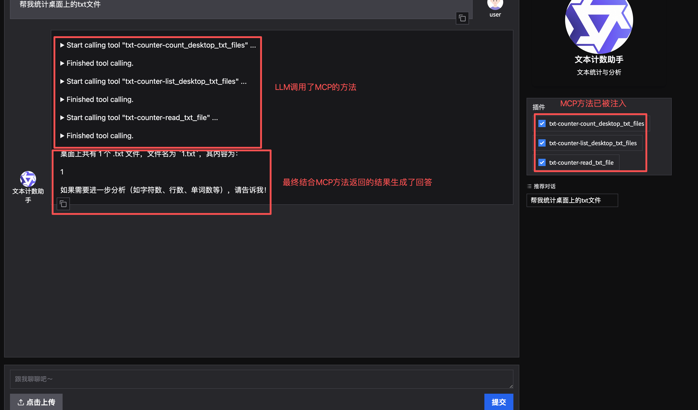
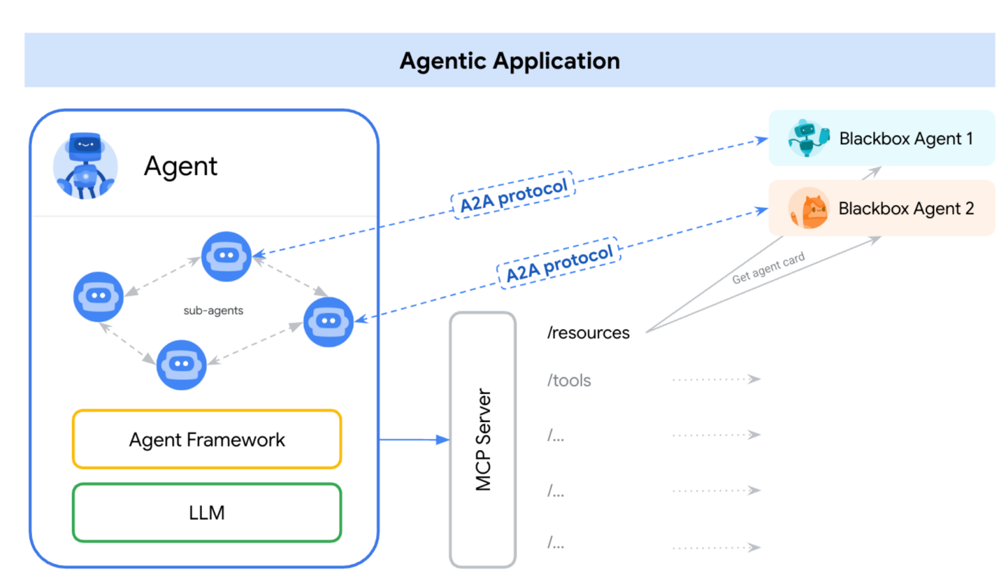

# MCP核心概念

MCP，Model Context Protocol，模型上下文协议，是由Anthropic公司在2024年11月提出的一种开放协议标准。目的在于标准化模型与外部数据源、工具以及服务之间的交互方式。

MCP是一种协议，只要遵循这种协议开发的外部工具都可以被模型调用。类似与USB-C接口。


### MCP和Function Calling对比

MCP和Function Calling很像，都可以增强大模型的能力。但MCP和Function Calling是两个不同的东西。

| 类别    | MCP (Model Context Protocol) | Function Calling     |
| ----- | ---------------------------- | -------------------- |
| 性质    | 是一种协议                        | 是开发的功能或函数            |
| 范围    | 通用（多数据源、多功能），可提供给外部使用        | 特定场景（单一数据源或功能），仅自己使用 |
| 目标    | 统一接口，实现互操作                   | 扩展模型能力               |
| 实现    | 基于标准协议                       | 依赖于特定模型实现            |
| 开发复杂度 | 低：通过统一协议实现多源兼容               | 高：需要为每个任务单独开发函数      |
| 复用性   | 高：一次开发，可多场景使用                | 低：函数通常为特定任务设计        |
| 灵活性   | 高：支持动态适配和扩展                  | 低：功能扩展需要额外开发         |
| 常见场景  | 复杂场景，如跨平台数据访问与整合             | 简单任务，如天气查询、商品推荐等     |

### MCP的架构

MCP采用客户端-服务器（Client-Server）架构，主要包括以下核心组件：

##### 1、MCP Host

运行大模型的环境，比如Cursor、Trea、Cherry Studio、LangChain框架、Qwen Agent等。

##### 2、MCP Client

MCP客服端，是嵌入到MCP Host组件中，它负责向MCP Server发起请求并保持通信。

##### 3、MCP Server

MCP服务器，主要用来给大模型提供服务的。

### MCP的核心功能

MCP 提供三种关键能力：

##### 1、知识扩展

提供结构化数据（如数据库、文档）以增强LLM的上下文理解。

##### 2、工具调用

允许 AI 执行外部操作（如发送邮件、查询 GitHub、调用智能合约等）。

##### 3、提示模版

预定义的指令模板，优化 AI 的任务执行。

### MCP的运用场景

##### 1、增强LLM的实时性与执行能力

**实时数据访问：** MCP 允许LLM访问最新数据（如股票行情、新闻），而非仅依赖训练时的静态数据，用来增强LLM的能力。

**自动化任务：** LLM可通过MCP直接执行任务，如整理文件、发送邮件、管理代码仓库等。

**区块链交互：** MCP 可集成以太坊智能合约，让用户通过自然语言完成链上操作（如 DeFi 交易）。

##### 2、去中心化 AI 生态

**创作者经济：** 个人或企业可搭建MCP Server提供特定服务（如鸟类知识库），并通过调用次数获得收益。

**抗审查与去中心化：** MCP 使 AI 能力分散在多个 Server 上，减少大公司垄断风险。

##### 3、开发者工具

**简化集成：** MCP 标准化了 AI 与外部系统的交互，开发者无需为每个数据源编写定制 API。

**多模态支持：** MCP 可整合语音、图像、传感器数据等，使 AI 具备更全面的环境感知能力

# MCP使用

### Qwen Agent中使用MCP

在9.FunctionCall.md中门票助手中增加MCP注册，只需要再function_list添加MCP配置即可：

```python
# ............ 省略代码

# ====== 初始化门票助手服务 ======
def init_agent_service():
    """初始化门票助手服务"""
    llm_cfg = {
        'model': 'qwen-turbo-2025-04-28',
        'timeout': 30,
        'retry_count': 3,
    }
    try:
        bot = Assistant(
            llm=llm_cfg,
            name='门票助手',
            description='门票查询与订单分析',
            system_message=system_prompt,
            function_list=[
                # MCP 配置
                {
                    "mcpServers": {
                        "amap-maps": {
                            "command": "npx",
                            "args": [
                                "-y",
                                "@amap/amap-maps-mcp-server"
                            ],
                            "env": {
                                "AMAP_MAPS_API_KEY": "你的高德API KEY"
                            }
                        }
                    }
                },
                'exc_sql'
            ],
        )
        print("助手初始化成功！")
        return bot
    except Exception as e:
        print(f"助手初始化失败: {str(e)}")
        raise

# ............ 省略代码

if __name__ == '__main__':
    # 运行模式选择
    app_gui()          # 图形界面模式（默认）
```

运行结果：

```shell
python assistant_ticket_bot.py
正在启动 Web 界面...
# 这里可以看到正在初始配置的MCP
2025-12-25 22:42:56,468 - mcp_manager.py - 141 - INFO - Initializing MCP tools from mcp servers: ['amap-maps']
2025-12-25 22:42:56,482 - mcp_manager.py - 370 - INFO - Initializing a MCP stdio_client, if this takes forever, please check the config of this mcp server: amap-maps
Amap Maps MCP Server running on stdio
助手初始化成功！
Web 界面准备就绪，正在启动服务...
* Running on local URL:  http://127.0.0.1:7860

To create a public link, set `share=True` in `launch()`.
```

访问网址：


可以看到MCP的工具已经被注册进去了，现在我们提问就可以使用MCP了。


# 搭建MCP Server

搭建MCP Server可以提供标准化的API，供LLM调用外部功能，以此来增强能力。主要通过`@mcp.tool()`装饰器将python函数暴露给LLM使用，同时也支持权限控制，确保LLM不会越权访问敏感数据。

### 安装MCP

```shell
pip install mcp
```

### FastMCP

FastMCP是Python MCP SDK中轻量级框架，主要有下面几个特点：

1. **轻量易用：** 仅需几行代码就可以启动MCP Server。

2. **支持多种传输方式：** 如stdio（标准输入输出），HTTP等。

3. **自动发现工具：** 通过`@mcp.tool()`注解自动注册函数，供LLM调用。

### 例子：

##### 1、使用FastMCP搭建桌面TXT统计器MCP Server

首先搭建桌面txt统计器MCP Server：

1. 创建FastMCP实例

2. 定义mcp的方法，通过@mcp.tool

3. 运行mcp实例

```python
import os
from pathlib import Path
from mcp.server.fastmcp import FastMCP

# 创建 MCP Server
mcp = FastMCP("桌面 TXT 文件统计器")

# 定义mcp的tool
@mcp.tool()
def count_desktop_txt_files() -> int:
    """统计桌面上 .txt 文件的数量"""
    # 获取桌面路径
    desktop_path = Path(os.path.expanduser("~/Desktop"))

    # 统计 .txt 文件
    txt_files = list(desktop_path.glob("*.txt"))
    return len(txt_files)

@mcp.tool()
def list_desktop_txt_files() -> str:
    """获取桌面上所有 .txt 文件的列表"""
    # 获取桌面路径
    desktop_path = Path(os.path.expanduser("~/Desktop"))

    # 获取所有 .txt 文件
    txt_files = list(desktop_path.glob("*.txt"))

    # 返回文件名列表
    if not txt_files:
        return "桌面上没有找到 .txt 文件。"

    # 格式化文件名列表
    file_list = "\n".join([f"- {file.name}" for file in txt_files])
    return f"在桌面上找到 {len(txt_files)} 个 .txt 文件：\n{file_list}"

@mcp.tool()
def read_txt_file(filename: str) -> str:
    """读取指定txt文件的内容
    
    Args:
        filename: txt文件的名称（例如：test.txt）
        
    Returns:
        文件内容，如果文件不存在则返回错误信息
    """
    # 获取桌面路径
    desktop_path = Path(os.path.expanduser("~/Desktop"))
    file_path = desktop_path / filename
    
    # 检查文件是否存在
    if not file_path.exists():
        return f"错误：文件 '{filename}' 不存在于桌面上。"
    
    # 检查文件是否是txt文件
    if file_path.suffix.lower() != '.txt':
        return f"错误：文件 '{filename}' 不是txt文件。"
    
    try:
        # 读取文件内容
        with open(file_path, 'r', encoding='utf-8') as f:
            content = f.read()
        return f"文件 '{filename}' 的内容：\n\n{content}"
    except Exception as e:
        return f"读取文件时发生错误：{str(e)}"

if __name__ == "__main__":
   # 运行mcp
    mcp.run()
```

启动mcp：

```shell
$ mcp dev txt_counter.py
Starting MCP inspector...
⚙️ Proxy server listening on localhost:6277
🔑 Session token: 6bc20d3f7e47dd17036e23a568944d3ac67531f48dd073086d49fdf597e588c1
   Use this token to authenticate requests or set DANGEROUSLY_OMIT_AUTH=true to disable auth

🚀 MCP Inspector is up and running at:
   http://localhost:6274/?MCP_PROXY_AUTH_TOKEN=6bc20d3f7e47dd17036e23a568944d3ac67531f48dd073086d49fdf597e588c1

🌐 Opening browser...
```

调用mcp：

```python
import os
import dashscope
from qwen_agent.agents import Assistant
from qwen_agent.gui import WebUI


dashscope.api_key = os.getenv('DASHSCOPE_API_KEY', '')  # 从环境变量获取 API Key

def init_agent_service():
    """初始化文本计数助手服务
    
    配置说明：
    - 使用 qwen-flash-2025-04-28 作为底层语言模型
    - 设置系统角色为文本分析助手
    - 配置文本计数 MCP 工具
    
    Returns:
        Assistant: 配置好的文本计数助手实例
    """

    llm_cfg = {
        'model': 'qwen-plus',  # 使用有效的通义千问模型名称
        'timeout': 30,
        'retry_count': 3,
    }

     # 系统角色设定
    system = ('你扮演一个文本分析助手，你具有计算文本字符数、单词数、行数等能力。'
             '你可以帮助用户分析文本的基本统计信息。'
             '你应该充分利用文本计数服务的功能来提供专业的分析。')

    # MCP 工具配置
    tools = [{
        "mcpServers": {
            "txt-counter": {
                "command": "/usr/local/bin/python3.11",  # 明确指定Python 3.11的完整路径
                "args": ["-u", "txt_counter.py"],  # 使用-u参数确保实时输出
                "port": 6277,
                "stdio": True,  # 使用stdio模式而不是HTTP
                "use_uv": False  # 明确禁用uv
            }
        }
    }]

    try:
        # 创建助手实例
        bot = Assistant(
            llm=llm_cfg,
            name='文本计数助手',
            description='文本统计与分析',
            system_message=system,
            function_list=tools,
        )
        print("助手初始化成功！")
        return bot
    except Exception as e:
        print(f"助手初始化失败: {str(e)}")
        raise

def app_gui():
    """图形界面模式
    
    提供 Web 图形界面，特点：
    - 友好的用户界面
    - 预设查询建议
    - 智能文本分析
    """
    try:
        print("正在启动 Web 界面...")
        # 初始化助手
        bot = init_agent_service()
        # 配置聊天界面
        chatbot_config = {
            'prompt.suggestions': [
                '帮我统计桌面上的txt文件',
            ]
        }
        
        print("Web 界面准备就绪，正在启动服务...")
        # 启动 Web 界面
        WebUI(
            bot,
            chatbot_config=chatbot_config
        ).run()
    except Exception as e:
        print(f"启动 Web 界面失败: {str(e)}")
        print("请检查网络连接和 API Key 配置")

if __name__ == '__main__':
    app_gui()
```

运行：

```shell
$ python assistant_desktop_txt_bot.py
正在启动 Web 界面...
2025-12-31 21:40:04,587 - mcp_manager.py - 141 - INFO - Initializing MCP tools from mcp servers: ['txt-counter']
2025-12-31 21:40:04,599 - mcp_manager.py - 370 - INFO - Initializing a MCP stdio_client, if this takes forever, please check the config of this mcp server: txt-counter
[12/31/25 21:40:05] INFO     Processing request of type ListToolsRequest                   server.py:624
                    INFO     Processing request of type ListResourcesRequest               server.py:624
助手初始化成功！
Web 界面准备就绪，正在启动服务...
* Running on local URL:  http://127.0.0.1:7860

To create a public link, set `share=True` in `launch()`.
```

访问[http://127.0.0.1:7860](http://127.0.0.1:7860)



# Agent2Agent概念

Agent2Agent（A2A）协议是google公司在2025年4月提出的开放协议。目的是促进AI Agent之间的协议，适用于大规模、多智能体的部署。

### A2A基于五大核心原则：

1. **拥抱智能体能力：** 支持自然、非结构化的协作模式

2. **利用现有标准：** 使用HTTP、SSE、JSON-RPC，确保与现有系统兼容

3. **默认安全：** 支持企业级认证和授权，启动时与 OpenAPI 保持一致。

4. **支持长期任务：** 处理从快速任务到深入研究的任务，提供实时反馈、通知和状态更新。

5. **多模态支持：** 支持文本、音频、视频流等多模态通信。

### A2A组成：

1. **Agent Card：** 公共元数据文件，位于 /.well-known/agent.json，描述智能体的能力、技能、端点 URL 和认证要求，用于能力发现。

2. **A2A 服务器：** 暴露 HTTP 端点，实现 A2A 协议方法，管理任务执行。

3. **A2A 客户端：** 应用程序或智能体，消费 A2A 服务，通过发送 tasks/send 或 tasks/sendSubscribe 请求与服务器交互

### A2A工作流：

1. **发现：** 客户端从 /.well-known/agent.json 获取 Agent Card，了解智能体能力

2. **启动：** 客户端发送任务请求：
   
   1. 使用 tasks/send 处理即时任务，返回最终 Task 对象。
   
   2. 使用 tasks/sendSubscribe 处理长期任务，服务器通过 SSE 事件发送更新。

3. **处理：** 服务器处理任务，可能涉及流式更新或直接返回结果。

4. **交互（可选）：** 若任务状态为 input-required，客户端可发送更多消息，使用相同 Task ID 提供输入。

5. **完成：** 任务达到终端状态（如 completed、failed 或 canceled）。

### A2A和MCP的区别和关系

##### 区别：

MCP是模型上下文协议，主要用来提供工具和资源。而A2A主要是用来Agent之间的协作。

##### 联系：

一个Agent可能先从MCP服务器获得数据，然后通过A2A协议与另一个Agent协作分析数据。



### 例子：

##### 1、安排篮球活动

篮球活动智能体通过A2A协议调用天气智能体，通过得到天气后决策是否安排篮球活动。

定义WetherAgent：

```python
from fastapi import FastAPI, HTTPException
from datetime import date
from pydantic import BaseModel
import uvicorn

app = FastAPI()

# Agent Card声明（通过/.well-known/agent.json暴露）
WEATHER_AGENT_CARD = {
    "name": "WeatherAgent",
    "version": "1.0",
    "description": "提供指定日期的天气数据查询",
    "endpoints": {
        "task_submit": "/api/tasks/weather",
        "sse_subscribe": "/api/tasks/updates"
    },
    "input_schema": {
        "type": "object",
        "properties": {
            "date": {"type": "string", "format": "date"},
            "location": {"type": "string", "enum": ["北京"]}
        },
        "required": ["date"]
    },
    "authentication": {"methods": ["API_Key"]}
}

# 任务请求模型
class WeatherTaskRequest(BaseModel):
    task_id: str
    params: dict

# 模拟天气数据存储
weather_db = {
    "2025-05-08": {"temperature": "25℃", "condition": "雷阵雨"},
    "2025-05-09": {"temperature": "18℃", "condition": "小雨转晴"},
    "2025-05-10": {"temperature": "22℃", "condition": "多云转晴"}
}

@app.get("/.well-known/agent.json")
async def get_agent_card():
    return WEATHER_AGENT_CARD

@app.post("/api/tasks/weather")
async def handle_weather_task(request: WeatherTaskRequest):
    """处理天气查询任务"""
    target_date = request.params.get("date")
    # 参数验证
    if not target_date or target_date not in weather_db:
        raise HTTPException(status_code=400, detail="无效日期参数")
    return {
        "task_id": request.task_id,
        "status": "completed",
        "artifact": {
            "date": target_date,
            "weather": weather_db[target_date]
        }
    }

if __name__ == "__main__":
    uvicorn.run(app, host="0.0.0.0", port=8000)

```

启动WetherAgent：

```python
$ python WetherAgent.py
```

定义BasketBallAgent：

```python
import requests
import uuid

class BasketBallAgent:
    def __init__(self):
        self.weather_agent_url = "http://localhost:8000"
        self.api_key = "SECRET_KEY"  # 实际应通过安全方式存储

    def _create_task(self, target_date: str) -> dict:
        """创建A2A标准任务对象"""
        return {
            "task_id": str(uuid.uuid4()),
            "params": {
                "date": target_date,
                "location": "北京"
            }
        }

    def check_weather(self, target_date: str) -> dict:
        """通过A2A协议查询天气"""
        # 获取天气智能体能力描述
        agent_card = requests.get(
            f"{self.weather_agent_url}/.well-known/agent.json"
        ).json()
        # 构造任务请求
        task = self._create_task(target_date)
        # 发送任务请求
        response = requests.post(
            f"{self.weather_agent_url}{agent_card['endpoints']['task_submit']}",
            json=task,
            headers={"Authorization": f"Bearer {self.api_key}"}
        )
        if response.status_code == 200:
            return response.json()["artifact"]
        else:
            raise Exception(f"天气查询失败: {response.text}")

    def schedule_meeting(self, date: str):
        """综合决策逻辑"""
        try:
            result = self.check_weather(date)
            # 这里可以实现更多的业务
            if "雨" not in result["weather"]["condition"] and "雪" not in result["weather"]["condition"]:
                return {"status": "confirmed", "weather": result["weather"]}
            else:
                return {"status": "cancelled", "reason": "恶劣天气"}
        except Exception as e:
            return {"status": "error", "detail": str(e)}

# 使用示例
if __name__ == "__main__":
    meeting_agent = BasketBallAgent()
    # result = meeting_agent.schedule_meeting("2025-05-08")
    result = meeting_agent.schedule_meeting("2025-05-10")
    print("篮球安排结果:", result)

```

运行BasketBallAgent：

```shell

```


