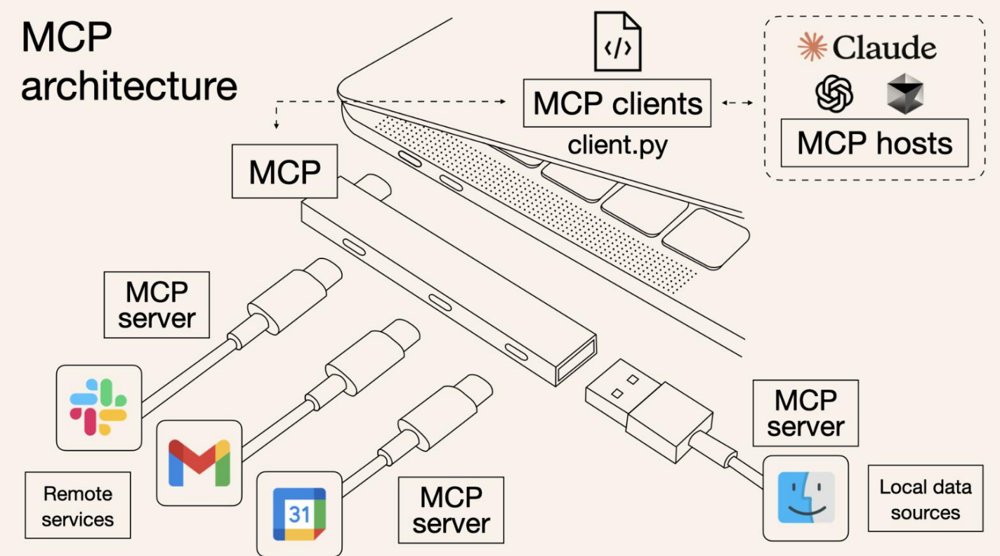
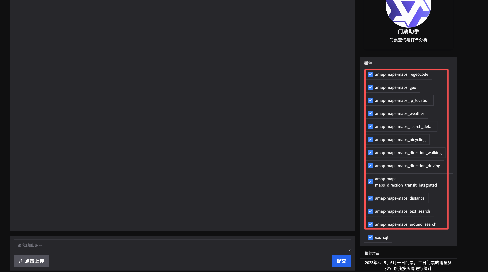
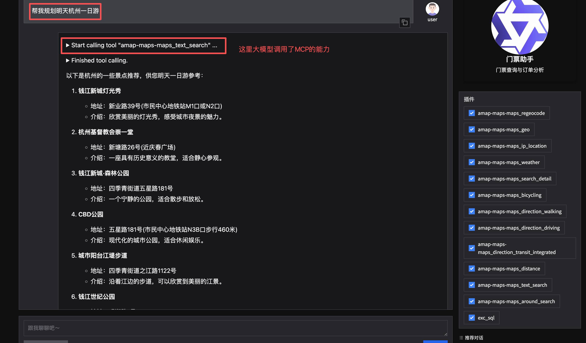

# MCP核心概念

MCP，Model Context Protocol，模型上下文协议，是由Anthropic公司在2024年11月提出的一种开放协议标准。目的在于标准化模型与外部数据源、工具以及服务之间的交互方式。

MCP是一种协议，只要遵循这种协议开发的外部工具都可以被模型调用。类似与USB-C接口。



### MCP和Function Calling对比

MCP和Function Calling很像，都可以增强大模型的能力。但MCP和Function Calling是两个不同的东西。

| 类别    | MCP (Model Context Protocol) | Function Calling     |
| ----- | ---------------------------- | -------------------- |
| 性质    | 是一种协议                        | 是开发的功能或函数            |
| 范围    | 通用（多数据源、多功能），可提供给外部使用        | 特定场景（单一数据源或功能），仅自己使用 |
| 目标    | 统一接口，实现互操作                   | 扩展模型能力               |
| 实现    | 基于标准协议                       | 依赖于特定模型实现            |
| 开发复杂度 | 低：通过统一协议实现多源兼容               | 高：需要为每个任务单独开发函数      |
| 复用性   | 高：一次开发，可多场景使用                | 低：函数通常为特定任务设计        |
| 灵活性   | 高：支持动态适配和扩展                  | 低：功能扩展需要额外开发         |
| 常见场景  | 复杂场景，如跨平台数据访问与整合             | 简单任务，如天气查询、商品推荐等     |

### MCP的架构

MCP采用客户端-服务器（Client-Server）架构，主要包括以下核心组件：

##### 1、MCP Host

运行大模型的环境，比如Cursor、Trea、Cherry Studio、LangChain框架、Qwen Agent等。

##### 2、MCP Client

MCP客服端，是嵌入到MCP Host组件中，它负责向MCP Server发起请求并保持通信。

##### 3、MCP Server

MCP服务器，主要用来给大模型提供服务的。

### MCP的核心功能

MCP 提供三种关键能力：

##### 1、知识扩展

提供结构化数据（如数据库、文档）以增强LLM的上下文理解。

##### 2、工具调用

允许 AI 执行外部操作（如发送邮件、查询 GitHub、调用智能合约等）。

##### 3、提示模版

预定义的指令模板，优化 AI 的任务执行。

### MCP的运用场景

##### 1、增强LLM的实时性与执行能力

**实时数据访问：** MCP 允许LLM访问最新数据（如股票行情、新闻），而非仅依赖训练时的静态数据，用来增强LLM的能力。

**自动化任务：** LLM可通过MCP直接执行任务，如整理文件、发送邮件、管理代码仓库等。

**区块链交互：** MCP 可集成以太坊智能合约，让用户通过自然语言完成链上操作（如 DeFi 交易）。

##### 2、去中心化 AI 生态

**创作者经济：** 个人或企业可搭建MCP Server提供特定服务（如鸟类知识库），并通过调用次数获得收益。

**抗审查与去中心化：** MCP 使 AI 能力分散在多个 Server 上，减少大公司垄断风险。

##### 3、开发者工具

**简化集成：** MCP 标准化了 AI 与外部系统的交互，开发者无需为每个数据源编写定制 API。

**多模态支持：** MCP 可整合语音、图像、传感器数据等，使 AI 具备更全面的环境感知能力

# MCP使用

### Qwen Agent中使用MCP

在9.FunctionCall.md中门票助手中增加MCP注册，只需要再function_list添加MCP配置即可：

```python
# ............ 省略代码

# ====== 初始化门票助手服务 ======
def init_agent_service():
    """初始化门票助手服务"""
    llm_cfg = {
        'model': 'qwen-turbo-2025-04-28',
        'timeout': 30,
        'retry_count': 3,
    }
    try:
        bot = Assistant(
            llm=llm_cfg,
            name='门票助手',
            description='门票查询与订单分析',
            system_message=system_prompt,
            function_list=[
                # MCP 配置
                {
                    "mcpServers": {
                        "amap-maps": {
                            "command": "npx",
                            "args": [
                                "-y",
                                "@amap/amap-maps-mcp-server"
                            ],
                            "env": {
                                "AMAP_MAPS_API_KEY": "你的高德API KEY"
                            }
                        }
                    }
                },
                'exc_sql'
            ],
        )
        print("助手初始化成功！")
        return bot
    except Exception as e:
        print(f"助手初始化失败: {str(e)}")
        raise

# ............ 省略代码

if __name__ == '__main__':
    # 运行模式选择
    app_gui()          # 图形界面模式（默认）
```

运行结果：

```shell
python assistant_ticket_bot.py
正在启动 Web 界面...
# 这里可以看到正在初始配置的MCP
2025-12-25 22:42:56,468 - mcp_manager.py - 141 - INFO - Initializing MCP tools from mcp servers: ['amap-maps']
2025-12-25 22:42:56,482 - mcp_manager.py - 370 - INFO - Initializing a MCP stdio_client, if this takes forever, please check the config of this mcp server: amap-maps
Amap Maps MCP Server running on stdio
助手初始化成功！
Web 界面准备就绪，正在启动服务...
* Running on local URL:  http://127.0.0.1:7860

To create a public link, set `share=True` in `launch()`.
```

访问网址：



可以看到MCP的工具已经被注册进去了，现在我们提问就可以使用MCP了。


