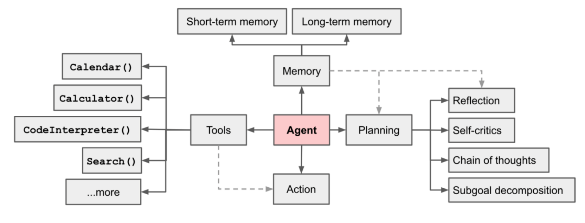
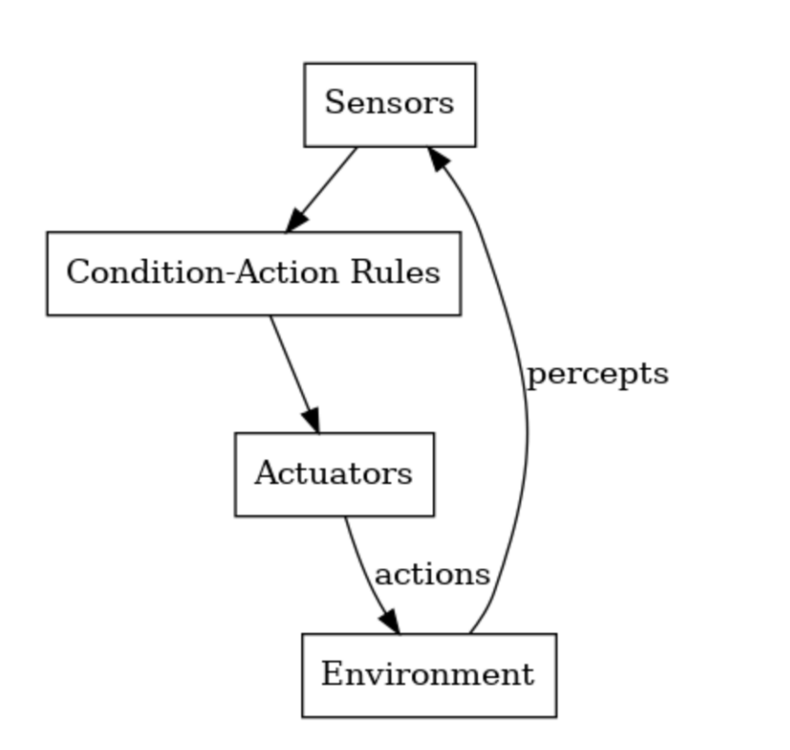
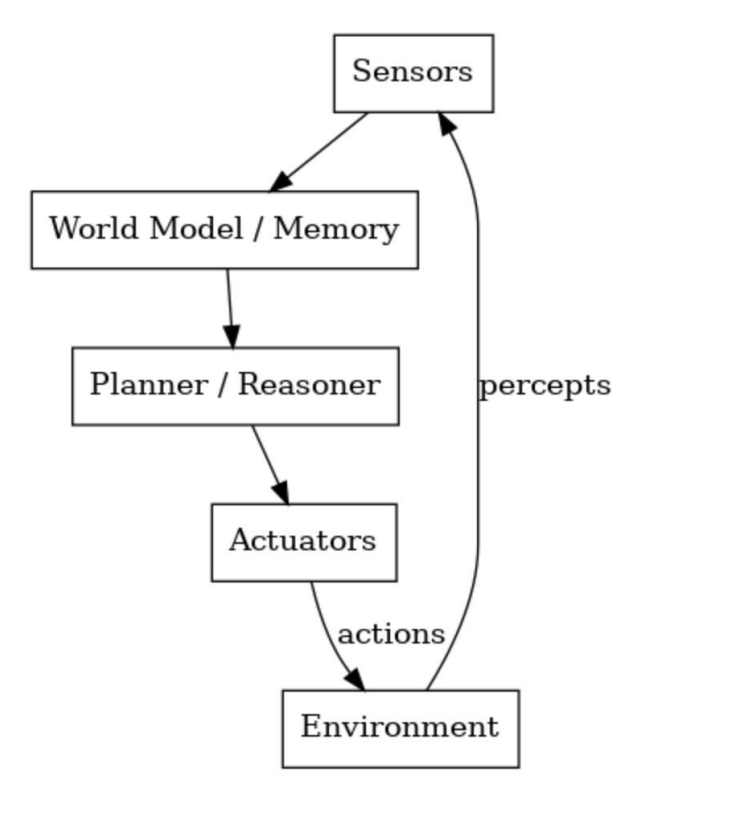
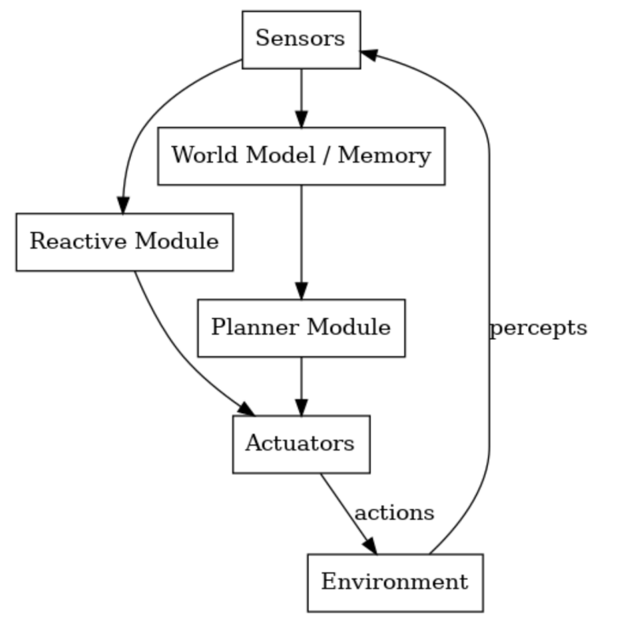

# AI Agent

通过LLM能够自主理解、规划、执行复杂任务的系统。给它一个目标，AI Agent就能完成剩下的全部工作。

**规划：** 将任务分解为较小的、可管理的子目标。

**记忆：** 短期记忆，进行上下文学习；长期记忆，一般通过外部载体储存和快速检索来实现。

**工具使用：** 调用外部API，获取额外信息。

### 使用Agent的场景

Agent通常适用于那些开放性问题，这些问题很难或无法预测所需的步骤数量，并且无法硬编码固定路径。LLM可能会运行多个回合，因此你需要对其决策能力有一定的信任。

Agent的自主性使其非常适合在受信任的环境中拓展任务。然而，自主性也意味着更高的成本和可能出现错误累计。

### 工作流

工作流是一个固定的流程执行，是人为设定好的，先做哪一步再做哪一步。

### Agent和工作流

Agent是自主性的，工作流是固定的。看上去两者是冲突的，但Agent和工作流是可以互补的，可以集成在一起实现最佳效果，尤其是在复杂的应用中。

##### 1、增强自动化

Agent可以自主处理特定任务，而工作流则将这些任务协调成一个连贯、高效的过程。

##### 2、可扩展性

在结构化工作流中结合多个Agent，可以使组织高效扩展运营，减少人工工作量，提高生产力。

##### 3、弹性与适应性

虽然单个Agent可以应对局部变化，但工作流可以动态调整整体流程，用来与战略目标保持一致。

比如在智能制造系统中：

1. AI智能体可以监控设备性能、预测维护需求并优化生产计划。

2. 工作流则负责原材料采购、生产排序、质量保证和物流，确保从原材料到产品交付的无缝过渡。

# 构造智能体

Agent打造不是要多么复杂，而是要打造最适合业务的Agent。在实现智能体时，有三个核心原则：

1. **保持智能体设计的简洁性：** 避免不必要的复杂性，专注于核心功能。

2. **优先考虑透明性：** 明确展示智能体的规划步骤，让用户清楚了解其决策过程。

3. **打造Function/MCP：** 打造工具，以及说明文档和测试，确保Agent与外部环境的交互。

### 构造智能体的核心思想

##### 1、不要为所有任务构建Agent

Agent适合处理复杂、模糊且高价值的任务。

1. 决策树如果可以明确规划，直接放到工作流中更高效

2. 高成本（如大量Token消耗）需由高回报任务承担

3. 确保Agent能处理核心子任务（如代码生成、调试）。

4. 高风险的错误需通过限制权限或人工介入来缓解。

##### 2、保持简洁

Agent的核心组件：环境、工具集、系统提示。刚开始时不要过度设计。

##### 3、像Agent一样思考

需要理解Agent的局限性，Agent仅基于有限上下文（10-20k Token）做决策。我们需要站在Agent的角度去思考，

# 智能体分类

### 1、反应式（Reactive）：快速决策的“直觉型”智能体

反应式架构是智能体中最简单直接的模式。在这种架构中，一个LLM首先分析当前情况，确定下一步要采取的行动。然后在环境中执行该行动，产生观察结果并作为反馈。LLM处理这些观察结果，重新评估下一步行动，选择另一个行动，并继续这个循环，直到任务完成。

##### 特点：

基于当前环境即时决策，无长期规划，依赖预设规则快速响应。适用于任务规则明确，响应需实时，且无需长时间决策的简单环境。

##### 工作原理：

**感知：** 获取环境输入（如传感器数据）

**决策：** LLM或规则系统立即生成响应动作

**执行：** 执行动作并观察结果，循环往复直至任务完成

##### 优势：

**速度快：** 无复杂推理，适合毫秒级响应的场景（如机器人避障、高频交易）

**简单可靠：** 行为由明确规则驱动，易于设计和验证

##### 局限：

**缺乏适应性：** 无法处理未预见的场景或需多步规划的任务。

**短视性：** 仅优化当前动作，可能陷入局部循环（如机器人绕圈）

**典型应用：**

**机器人：** 扫地机器人避障、无人机紧急悬停。

**游戏NPC：** 敌人对玩家攻击的即时反应。

**工业控制：** 传感器超限时触发警报或停机。

### 2、深思熟虑式（Deliberative）：深思熟虑的“思考型”智能体

基于内部模型进行规划，先通过推理并模拟结果，再选择最优行动方案，具有长期目标导向性。

##### 工作原理：

**感知：** 获取环境信息

**建模：** 更新内部世界状态表示

**推理：** 生成候选计划并模拟结果

**决策：** 选择最优方案

**执行：** 通过最优方案执行

##### 优势：

能处理多步复杂任务；优化长期目标而非即时反馈；适应动态变化环境。

##### 适用场景：

需战略规划的任务（如物流调度、投资决策等）

### 3、混合式（Hybrid）

结合反应式的"快速本能"和深思熟虑的"战略规划"，实现智能与效率的平衡。

##### 设计：

**底层（反应式）：** 即时处理紧急任务（如避障）

**中层（协调）：** 管理任务优先级（可选）

**顶层（深思熟虑）：** 进行长期目标规划（如路径优化）

##### 工作原理：

通过仲裁系统（监督器）来动态切换模式：

**紧急情况：** 启用反应式快速响应

**常规情况：** 启用深思熟虑规划

##### 优势：

兼具实时响应能力（毫秒级）；保留战略规划优势（长期目标）

##### 典型案例：

**自动驾驶：** 突发障碍 → 立即刹车（反应式），正常行驶 → 规划最优路线（深思熟虑）
