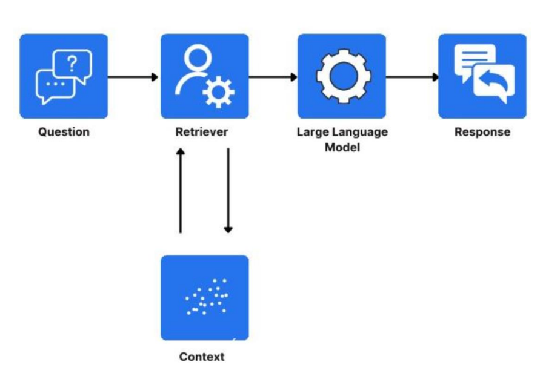
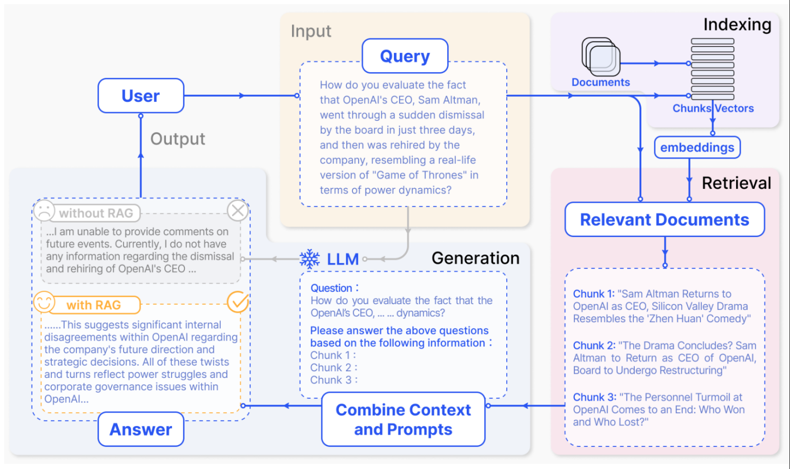

# RAG

### 概念

`Retrieval Augmented Generation`，检索增强生成，是一种结合信息检索和文本生成的技术。RAG通过实时检索相关文档或信息，并将其作为上下文输入到生成模型中，从而提高生成结果的时效性和准确性。



### RAG的核心用途

**1、解决知识时效性问题**

LLM的训练数据通常是静态的，无法涵盖最新的信息，而RAG可以检索外部知识库实时更新信息。

**2、解决幻觉问题**

通过引入外部知识库，RAG能够减少模型生成虚假或不准确的胡编乱造。

**3、提升专业领域回答质量**

RAG能够结合垂直领域的专业知识库，生成更专业更有深度的回答。

### RAG的核心原理和流程

这里说的是NativeRAG，即推理中使用RAG。

##### 1、数据预处理

- **知识库构建：** 收集并整理文档、网页、数据库等多源数据，构建知识库，一般由数据治理团队去做。

- **文档分块：** 将文档切分为合适大小的块（chunk），以便后续检索。分块策略需要在语义完整性与检索效率之间取得平衡。

- **向量化存储：** 使用嵌入模型（如BGE、M3E等Embedding模型）将chunk转换为统一维度的向量，并存储到向量数据库中

##### 2、检索阶段

- **查询处理：** 将用户的问题（query）转换成向量，并在向量数据库中进行相似度检索，并返回最相似的（最相关的）chunk。

- **重排序：** 对检索返回的数据进行相关性排序，选择最相关的片段作为生成阶段的输入和上下文。

##### 3、生成阶段

- **上下文组装：** 将用户的问题（query）和检索到的chunk结合，形成增强的上下文输入。

- **生成回答：** LLM基于增强的上下文生成最终回答。



### Embedding模型的分类和选择

Embedding模型排名在huggingface网站中实时更新，可根据实际情况选择：[Embedding排名网站]([MTEB Leaderboard - a Hugging Face Space by mteb](https://huggingface.co/spaces/mteb/leaderboard))

##### 1、通用文本嵌入模型

- **BGE-M3**（智源研究院）：支持100+语言，融合密集、稀疏、多向量混合检索，适合跨语言长文档检索。适合跨语言长文档检索、高精度RAG应用。

- text-embedding-3-large（OpenAI）：向量维度3072，长文本语义捕捉能力强，英文表现优秀。英文内容优先的全球化应用。

##### 2、中文嵌入模型

##### 3、指令驱动和复杂任务模型

##### 4、企业级与复杂系统

### CASE1：BGE-M3使用

针对于BGE-M3模型的使用，需要运行在GPU上，可以在AutoDL上租用GPU服务器试用，modescope也提供了免费的GPU可以使用。

##### 1、先下载必要的包

```shell
pip install modelscope
pip install -U FlagEmbedding
```

##### 2、下载bge-m3模型

```python
#通过modelscope下载BGE-M3模型
from modelscope import snapshot_download
model_dir = snapshot_download('BAAI/bge-m3', cache_dir='/root/autodl-tmp/models')
print(model_dir)
```

运行结果：

```shell
/root/autodl-tmp/models/BAAI/bge-m3
```

##### 3、使用bge-m3计算相似度

```python
from FlagEmbedding import BGEM3FlagModel

# 声明Embedding模型
model = BGEM3FlagModel('/root/autodl-tmp/models/BAAI/bge-m3',  
                       use_fp16=True) # Setting use_fp16 to True speeds up computation with a slight performance degradation
#
sentences_1 = ["What is BGE M3?", "Defination of BM25"]
sentences_2 = ["BGE M3 is an embedding model supporting dense retrieval, lexical matching and multi-vector interaction.", 
               "BM25 is a bag-of-words retrieval function that ranks a set of documents based on the query terms appearing in each document"]

# 将文本转换为向量
embeddings_1 = model.encode(sentences_1, 
                            batch_size=12, 
                            max_length=8192, # If you don't need such a long length, you can set a smaller value to speed up the encoding process.
                            )['dense_vecs']
# 将文本转化为向量
embeddings_2 = model.encode(sentences_2)['dense_vecs']
# 计算两组Embedding的相似度矩阵，@ 符号在Python中表示矩阵乘法运算
similarity = embeddings_1 @ embeddings_2.T
print(similarity)
```

运行结果：

```shell
[[0.6259036 0.3474958]
 [0.3498678 0.6782462]]
```

从输入结果可以看出sentences_1中的第一个元素和sentences_2中的第一个元素更相似，sentences_1中的第二个元素和sentences_2中的第二个元素更相似。

### CASE2：gte-qwen2使用

此例子在modelscope提供的免费GPU服务器上运行

##### 1、下载必要的包

```shell
pip install modelscope
pip install -U FlagEmbedding
```

##### 2、下载gte-qwen2模型

get-qwen2-7B模型太大，这里测试使用1.5B

```python
#SDK模型下载
from modelscope import snapshot_download
model_dir = snapshot_download('iic/gte_Qwen2-1.5B-instruct', cache_dir='/mnt/workspace/.cache/modelscope/models')
print(model_dir)
```

运行结果：

```shell
/mnt/workspace/.cache/modelscope/models/iic/gte_Qwen2-1___5B-instruct
```

**3、使用gte-qwen2计算相似度**

```python
from sentence_transformers import SentenceTransformer

model_dir = "/root/autodl-tmp/models/iic/gte_Qwen2-1___5B-instruct"
model = SentenceTransformer(model_dir, trust_remote_code=True)
# 设置向量维度
model.max_seq_length = 8192

queries = [
    "how much protein should a female eat",
    "summit define",
]
documents = [
    "As a general guideline, the CDC's average requirement of protein for women ages 19 to 70 is 46 grams per day. But, as you can see from this chart, you'll need to increase that if you're expecting or training for a marathon. Check out the chart below to see how much protein you should be eating each day.",
    "Definition of summit for English Language Learners. : 1  the highest point of a mountain : the top of a mountain. : 2  the highest level. : 3  a meeting or series of meetings between the leaders of two or more governments.",
]

# 将文本转化为向量
query_embeddings = model.encode(queries, prompt_name="query")
document_embeddings = model.encode(documents)

# 计算相似度矩阵
scores = (query_embeddings @ document_embeddings.T) * 100
print(scores.tolist())
```

运行结果：

```shell
[[70.00668334960938, 8.184843063354492], [14.62419319152832, 77.71407318115234]]
```

和BGE-M3效果差不多，总体是可以看出谁和谁更相似。

### CASE3：Deepseek+Faiss搭建本地知识库检索

提供了一份名为`浦发上海浦东发展银行西安分行个金客户经理考核办法.pdf`的文件，要求通过搭建本地知识库，结合LLM实现内部知识点问答。

##### 1、PDF文本提取与处理

使用`PyPDF2`库的`PdfReader`从PDF文件中提取文本，在提取过程中记录每行文本对应的页码，便于后续溯源使用`RecursiveCharacterTextSplitter`将长文本分割成小块，便于向量化处理。

**1.1、安装PyPDF2：**

```shell
pip install PyPDF2
```

**1.2、提取PDF文本和页码信息：**

```python
from PyPDF2 import PdfReader
from typing import List, Tuple
def extract_text_with_page_numbers(pdf) -> Tuple[str, List[Tuple[str, int]]]:
    """
    从PDF中提取文本并记录每个字符对应的页码

    参数:
        pdf: PDF文件对象

    返回:
        text: 提取的文本内容
        char_page_mapping: 每个字符对应的页码列表
    """
    text = ""
    char_page_mapping = []

    for page_number, page in enumerate(pdf.pages, start=1):
        extracted_text = page.extract_text()
        if extracted_text:
            text += extracted_text
            # 为当前页面的每个字符记录页码
            char_page_mapping.extend([page_number] * len(extracted_text))
        else:
            print(f"No text found on page {page_number}.")

    return text, char_page_mapping
# 读取PDF文件
pdf_reader = PdfReader('./浦发上海浦东发展银行西安分行个金客户经理考核办法.pdf')
# 提取文本和页码信息
text, char_page_mapping = extract_text_with_page_numbers(pdf_reader)
print('text=',text,'char_page_mapping=',char_page_mapping)
```

执行结果：

```shell
text= 百度文库  - 好好学习，天天向上  
-1 上海浦东发展银行西安分行  
个金客户经理管理考核暂行办法  


第一章  总   则 
第一条   为保证我分行个金客户经理制的顺利实施，有效调动个
金客户经理的积极性，促进个金业务快速、稳定地发展，根据总行《上
海浦东发展银行个人金融营销体系建设方案（试行）》要求，特制定
《上海浦东发展银行西安分行个金客户经理管理考核暂行办法（试
行）》（以下简称本办法）。  
第二条   个金客户经理系指各支行（营业部）从事个人金融产品
营销与市场开拓，为我行个人客户提供综合银行服务的我行市场人
员。 
第三条   考核内容分为二大类， 即个人业绩考核、 工作质量考核。
个人业绩包括个人资产业务、负债业务、卡业务。工作质量指个人业
务的资产质量。  
第四条   为规范激励规则，客户经理的技术职务和薪资实行每年
考核浮动。客户经理的奖金实行每季度考核浮动，即客户经理按其考
核内容得分与行员等级结合，享受对应的行员等级待遇。  
 百度文库  - 好好学习，天天向上  
-2 第二章  职位设置与职责  
第五条   个金客户经理职位设置为：客户经理助理、客户经理、
高级客户经理、资深客户经理。  
第六条   个金客户经理的基本职责：  
（一）   客户开发。研究客户信息、联系与选择客户、与客户建
立相互依存、相互支持的业务往来关系，扩大业务资源，创造良好业
绩； 
（二）业务创新与产品营销。把握市场竞争变化方向，开展市场
与客户需 求的调研，对业务产品及服务进行创新；设计客户需求的产
品组合、制订和实施市场营销方案；  
（三）客户服务。负责我行各类表内外授信业务及中间业务的受
理和运作，进行综合性、整体性的客户服务；  
（四）防范风险，提高收益。提升风险防范意识及能力，提高经
营产品质量；  
（五）培养人材。在提高自身综合素质的同时，发扬团队精神，
培养后备业务骨干。  
 百度文库  - 好好学习，天天向上  
-3 第三章  基础素质要求  
第七条   个金客户经理准入条件：  
（一）工作经历：须具备大专以上学历，至少二年以上银行工作
经验。  
（二）工作能力：熟悉我行的各项业务，了解市场情况，熟悉各
类客户的金融需求，熟悉个人理财工具，有一定的业务管理和客户管
理能力。  
（三）工作业绩：个金客户经理均应达到相应等级的准入标准。
该标准可根据全行整体情况由考核部门进行调整。  
（四）专业培训：个金客户经理应参加有关部门组织的专业培训
并通过业务考试。  
（五）符合分行人事管理和专业管理的要求。  
第四章  个人业绩考核标准  
第八条   个金客户经理个人业绩以储蓄季日均、季有效净增发卡
量、季净增个贷余额 三项业务为主要考核指标，实行季度考核。具体
标准如下：  


类别 行员级别 考核分值 准入标准  
储蓄业务 个贷业务 卡业务 
客户经理助理  5 90 300万  500张 
4 95  百度文库  - 好好学习，天天向上  
-4 3 100  
2 105  
1 110  
客户经理 5 115 300万  500张 
4 120  
3 125  
2 130  
1 135  
高级客户经理  5 140 500万 800万  
4 145  
3 150  
2 155  
1 160  
资深客户经理  5 165 500万 800万  
4 170  
3 175  
2 180  
1 185  
说明： 1.储蓄业务（季日均余额）为各类个金客户经理考核进入的最低标准。   
2.卡业务（季新增发有效卡量）为见习、 D类、初级客户经理进入的最低标准。  
3.有效卡的概念：每张卡月均余额为 100元以上。  
4.个贷业务（季新增发放个贷）为中级以上客户经理考核进入的最低标准。  
5.超出最低考核标准可相互折算，折算标准： 50万储蓄 =50万个贷 =50张有效卡 =5分（折算以 5分为单位）  

 百度文库  - 好好学习，天天向上  
-5 第五章  工作质量考核标准  
第九条   工作质量考核实行扣分制。工作质量指个金客户经理在
从事所有个人业务时出现投诉、差错及风险。该项考核最多扣 50分，
如发生重大差错事故，按分行有关制度处理。  
（一）服务质量考核：   
1、工作责任心不强，缺乏配合协作精神；扣 5分 
2、客户服务效率低，态度生硬或不及时为客户提供维护服务，
有客户投诉的 ,每投诉一次扣 2分 
3、不服从支行工作安排，不认真参加分（支）行宣传活动的，
每次扣 2分； 
4、未能及时参加分行（支行）组织的各种业务培训、考试和专
题活动的每次扣 2分； 
5、未按规定要求进行贷前调查、贷后检查工作的，每笔扣 5分； 
6、未建立信贷台帐资料及档案的每笔扣 5分； 
7、在工作中有不廉洁自律情况的每发现一次扣 50分。 
（二）个人资产质量考核：  
当季考核收息率 97%以上为合格，每降 1个百分点扣 2分；不
良资产零为合格，每超一个个百分点扣 1分。 
A.发生跨月逾期，单笔不超过 10万元，当季收回者，扣 1分。 
B.发生跨月逾期， 2笔以上累计金额不超过 20万元，当季收回
者，扣 2分；累计超过 20万元以上的，扣 4分。 百度文库  - 好好学习，天天向上  
-6 C.发生逾期超过 3个月，无论金额大小和笔数，扣 10分。 

第六章  聘任考核程序  
第十条   凡达到本办法第三章规定的该技术职务所要求的行内职
工，都可向分行人力资源部申报个金客户经理评聘。  
第十一条   每年一月份为客户经理评聘的申报时间，由分行人力
资源部、个人业务部每年二月份组织统一的资格考试。考试合格者由
分行颁发个金客户经理资格证书，其有效期为一年。  
第十二条   客户经理聘任实行开放式、浮动制，即：本人申报  —
— 所在部门推荐  —— 分行考核  —— 行长聘任  —— 每年考评
调整浮动。   
第十三条   特别聘任：  
（一）经分行同意录用从其他单位调入的个金客户经理，由用人
单位按 D类人员进行考核， 薪资待遇按其业绩享受行内正式行员工同
等待遇。待正式转正后按第十一条规定申报技术职务。  
（二）对为我行业务创新、工作业绩等方面做出重大贡献的市场
人员经支行推荐、分行行长 批准可越级聘任。  
第十四条   对于创利业绩较高，而暂未入围技术职务系列，或所
评聘技术职务较低的市场人员，各级领导要加大培养力度，使其尽快百度文库  - 好好学习，天天向上  
-7 入围，并由所在行制定临时奖励办法。  

第七章   考核待遇  
第十五条   个人金融业务客户经理的收入基本由三部分组成： 客
户经理等级基本收入、业绩奖励收入和日常工作绩效收入。  
客户经理等级基本收入是指客户经理的每月基本收入， 基本分为
助理客户经理、客户经理、高级客户经理和资深客户经理四大层面，
在每一层面分为若干等级。  
客户经理的等级标准由客户经理在上年的业绩为核定标准， 如果
客户经理在我行第一次进行客户经理评级， 以客户经理自我评价为主
要依据，结合客户经理以往工作经验，由个人金融部、人事部门共同
最终决定客户经理的等级。  
助理客户经理待遇按照人事部门对主办科员以下人员的待遇标
准；客户经理待遇按照人事部门对主办科员的待遇标准；高级客户经
理待遇按照人事部门对付科级的待遇标准； 资深客户经理待遇 按照人
事部门对正科级的待遇标准。  
业绩奖励收入是指客户经理每个业绩考核期间的实际业绩所给
与兑现的奖金部分。  
日常工作绩效收入是按照个金客户经理所从事的事务性工作进
行定量化考核，经过工作的完成情况进行奖金分配。该项奖金主要由
个人金融部总经理和各支行的行长其从事个人金融业务的人员进行
分配，主要侧重分配于从事个金业务的基础工作和创新工作。  百度文库  - 好好学习，天天向上  
-8 第十五条   各项考核分值总计达到某一档行员级别考核分值标
准，个金客户经理即可在下一季度享受该级行员的薪资标准。下一季
度考核时，按照已享受行员级别考核折算比值进行考核，以次类推。  
第十六条   对已聘为各级客户经理的人员，当工作业绩考核达不
到相应技术职务要求下限时，下一年技术职务相应下调 。 
第十七条   为保护个人业务客户经理创业的积极性，暂定其收入
构成中基础薪点不低于 40%。 

第八章  管理与奖惩  
第十八条   个金客户经理管理机构为分行客户经理管理委员会。
管理委员会组成人员：行长或主管业务副行长，个人业务部、人力资
源部、风险管理部负责人。  
第十九条   客户经理申报的各种信息必须真实。分行个人业务部
需对其工作业绩数据进行核实，并对其真实性负责；分行人事部门需
对其学历、工作阅历等基本信息进行核实，并对其真实性负责。  
第二十条   对因工作不负责任使资产质量产生严重风险或造成损
失的给予降级直至开 除处分，构成渎职罪的提请司法部门追究刑事责
任。 
 百度文库  - 好好学习，天天向上  
-9 第九章  附    则 
第二十一条   本办法自发布之日起执行。  
第二十二条   本办法由上海浦东发展银行西安分行行负责解释和
修改。  
  char_page_mapping= [1, 1, 1, 1, 1, 1, 1, 1, 1, 1, 1, 1, 1, 1, 1, 1, 1, 1, 1, 1, 1, 1, 1, 1, 1, 1, 1, 1, 1, 1, 1, 1, 1, 1, 1, 1, 1, 1, 1, 1, 1, 1, 1, 1, 1, 1, 1, 1, 1, 1, 1, 1, 1, 1, 1, 1, 1, 1, 1, 1, 1, 1, 1, 1, 1, 1, 1, 1, 1, 1, 1, 1, 1, 1, 1, 1, 1, 1, 1, 1, 1, 1, 1, 1, 1, 1, 1, 1, 1, 1, 1, 1, 1, 1, 1, 1, 1, 1, 1, 1, 1, 1, 1, 1, 1, 1, 1, 1, 1, 1, 1, 1, 1, 1, 1, 1, 1, 1, 1, 1, 1, 1, 1, 1, 1, 1, 1, 1, 1, 1, 1, 1, 1, 1, 1, 1, 1, 1, 1, 1, 1, 1, 1, 1, 1, 1, 1, 1, 1, 1, 1, 1, 1, 1, 1, 1, 1, 1, 1, 1, 1, 1, 1, 1, 1, 1, 1, 1, 1, 1, 1, 1, 1, 1, 1, 1, 1, 1, 1, 1, 1, 1, 1, 1, 1, 1, 1, 1, 1, 1, 1, 1, 1, 1, 1, 1, 1, 1, 1, 1, 1, 1, 1, 1, 1, 1, 1, 1, 1, 1, 1, 1, 1, 1, 1, 1, 1, 1, 1, 1, 1, 1, 1, 1, 1, 1, 1, 1, 1, 1, 1, 1, 1, 1, 1, 1, 1, 1, 1, 1, 1, 1, 1, 1, 1, 1, 1, 1, 1, 1, 1, 1, 1, 1, 1, 1, 1, 1, 1, 1, 1, 1, 1, 1, 1, 1, 1, 1, 1, 1, 1, 1, 1, 1, 1, 1, 1, 1, 1, 1, 1, 1, 1, 1, 1, 1, 1, 1, 1, 1, 1, 1, 1, 1, 1, 1, 1, 1, 1, 1, 1, 1, 1, 1, 1, 1, 1, 1, 1, 1, 1, 1, 1, 1, 1, 1, 1, 1, 1, 1, 1, 1, 1, 1, 1, 1, 1, 1, 1, 1, 1, 1, 1, 1, 1, 1, 1, 1, 1, 1, 1, 1, 1, 1, 1, 1, 1, 1, 1, 1, 1, 1, 1, 1, 1, 1, 1, 1, 1, 1, 1, 1, 1, 1, 1, 1, 1, 1, 1, 1, 1, 1, 1, 1, 1, 1, 1, 1, 1, 1, 1, 1, 1, 1, 1, 1, 1, 1, 1, 1, 1, 1, 1, 1, 1, 1, 1, 1, 1, 1, 1, 1, 1, 1, 1, 1, 1, 1, 1, 1, 1, 1, 1, 1, 1, 1, 1, 1, 1, 1, 1, 1, 1, 1, 1, 1, 1, 1, 1, 1, 1, 1, 1, 1, 1, 1, 1, 1, 1, 1, 1, 1, 2, 2, 2, 2, 2, 2, 2, 2, 2, 2, 2, 2, 2, 2, 2, 2, 2, 2, 2, 2, 2, 2, 2, 2, 2, 2, 2, 2, 2, 2, 2, 2, 2, 2, 2, 2, 2, 2, 2, 2, 2, 2, 2, 2, 2, 2, 2, 2, 2, 2, 2, 2, 2, 2, 2, 2, 2, 2, 2, 2, 2, 2, 2, 2, 2, 2, 2, 2, 2, 2, 2, 2, 2, 2, 2, 2, 2, 2, 2, 2, 2, 2, 2, 2, 2, 2, 2, 2, 2, 2, 2, 2, 2, 2, 2, 2, 2, 2, 2, 2, 2, 2, 2, 2, 2, 2, 2, 2, 2, 2, 2, 2, 2, 2, 2, 2, 2, 2, 2, 2, 2, 2, 2, 2, 2, 2, 2, 2, 2, 2, 2, 2, 2, 2, 2, 2, 2, 2, 2, 2, 2, 2, 2, 2, 2, 2, 2, 2, 2, 2, 2, 2, 2, 2, 2, 2, 2, 2, 2, 2, 2, 2, 2, 2, 2, 2, 2, 2, 2, 2, 2, 2, 2, 2, 2, 2, 2, 2, 2, 2, 2, 2, 2, 2, 2, 2, 2, 2, 2, 2, 2, 2, 2, 2, 2, 2, 2, 2, 2, 2, 2, 2, 2, 2, 2, 2, 2, 2, 2, 2, 2, 2, 2, 2, 2, 2, 2, 2, 2, 2, 2, 2, 2, 2, 2, 2, 2, 2, 2, 2, 2, 2, 2, 2, 2, 2, 2, 2, 2, 2, 2, 2, 2, 2, 2, 2, 2, 2, 2, 2, 2, 2, 2, 2, 2, 2, 2, 2, 2, 2, 2, 2, 2, 2, 2, 2, 2, 2, 2, 2, 2, 2, 2, 2, 2, 2, 2, 2, 2, 2, 2, 2, 2, 2, 2, 2, 2, 2, 2, 2, 2, 2, 2, 2, 2, 2, 2, 2, 2, 2, 2, 2, 2, 2, 2, 2, 2, 2, 2, 2, 2, 2, 2, 2, 2, 2, 2, 2, 2, 2, 2, 2, 2, 2, 2, 2, 2, 2, 2, 2, 2, 2, 2, 2, 2, 2, 2, 2, 2, 2, 2, 2, 2, 2, 2, 2, 2, 2, 2, 2, 2, 2, 2, 2, 2, 2, 2, 2, 2, 2, 2, 2, 2, 2, 2, 2, 2, 2, 2, 2, 2, 2, 2, 2, 2, 2, 2, 2, 2, 2, 2, 2, 2, 2, 2, 3, 3, 3, 3, 3, 3, 3, 3, 3, 3, 3, 3, 3, 3, 3, 3, 3, 3, 3, 3, 3, 3, 3, 3, 3, 3, 3, 3, 3, 3, 3, 3, 3, 3, 3, 3, 3, 3, 3, 3, 3, 3, 3, 3, 3, 3, 3, 3, 3, 3, 3, 3, 3, 3, 3, 3, 3, 3, 3, 3, 3, 3, 3, 3, 3, 3, 3, 3, 3, 3, 3, 3, 3, 3, 3, 3, 3, 3, 3, 3, 3, 3, 3, 3, 3, 3, 3, 3, 3, 3, 3, 3, 3, 3, 3, 3, 3, 3, 3, 3, 3, 3, 3, 3, 3, 3, 3, 3, 3, 3, 3, 3, 3, 3, 3, 3, 3, 3, 3, 3, 3, 3, 3, 3, 3, 3, 3, 3, 3, 3, 3, 3, 3, 3, 3, 3, 3, 3, 3, 3, 3, 3, 3, 3, 3, 3, 3, 3, 3, 3, 3, 3, 3, 3, 3, 3, 3, 3, 3, 3, 3, 3, 3, 3, 3, 3, 3, 3, 3, 3, 3, 3, 3, 3, 3, 3, 3, 3, 3, 3, 3, 3, 3, 3, 3, 3, 3, 3, 3, 3, 3, 3, 3, 3, 3, 3, 3, 3, 3, 3, 3, 3, 3, 3, 3, 3, 3, 3, 3, 3, 3, 3, 3, 3, 3, 3, 3, 3, 3, 3, 3, 3, 3, 3, 3, 3, 3, 3, 3, 3, 3, 3, 3, 3, 3, 3, 3, 3, 3, 3, 3, 3, 3, 3, 3, 3, 3, 3, 3, 3, 3, 3, 3, 3, 3, 3, 3, 3, 3, 3, 3, 3, 3, 3, 3, 3, 3, 3, 3, 3, 3, 3, 3, 3, 3, 3, 3, 3, 3, 3, 3, 3, 3, 3, 3, 3, 3, 3, 3, 3, 3, 3, 3, 3, 3, 3, 3, 3, 3, 3, 3, 3, 3, 3, 3, 3, 3, 3, 3, 3, 3, 3, 3, 3, 3, 3, 3, 3, 3, 3, 3, 3, 3, 3, 3, 3, 3, 3, 3, 3, 3, 3, 3, 3, 3, 3, 3, 3, 3, 3, 3, 3, 3, 3, 3, 3, 3, 3, 3, 3, 3, 3, 3, 3, 3, 3, 3, 3, 3, 3, 3, 3, 3, 3, 3, 3, 3, 3, 3, 3, 3, 3, 3, 3, 3, 3, 3, 3, 3, 3, 3, 3, 3, 3, 3, 3, 3, 3, 3, 3, 3, 3, 3, 3, 3, 3, 3, 3, 3, 3, 3, 3, 3, 3, 3, 3, 3, 3, 3, 3, 3, 3, 3, 3, 3, 3, 3, 3, 3, 3, 3, 3, 3, 3, 3, 3, 3, 3, 3, 3, 3, 3, 3, 3, 3, 3, 4, 4, 4, 4, 4, 4, 4, 4, 4, 4, 4, 4, 4, 4, 4, 4, 4, 4, 4, 4, 4, 4, 4, 4, 4, 4, 4, 4, 4, 4, 4, 4, 4, 4, 4, 4, 4, 4, 4, 4, 4, 4, 4, 4, 4, 4, 4, 4, 4, 4, 4, 4, 4, 4, 4, 4, 4, 4, 4, 4, 4, 4, 4, 4, 4, 4, 4, 4, 4, 4, 4, 4, 4, 4, 4, 4, 4, 4, 4, 4, 4, 4, 4, 4, 4, 4, 4, 4, 4, 4, 4, 4, 4, 4, 4, 4, 4, 4, 4, 4, 4, 4, 4, 4, 4, 4, 4, 4, 4, 4, 4, 4, 4, 4, 4, 4, 4, 4, 4, 4, 4, 4, 4, 4, 4, 4, 4, 4, 4, 4, 4, 4, 4, 4, 4, 4, 4, 4, 4, 4, 4, 4, 4, 4, 4, 4, 4, 4, 4, 4, 4, 4, 4, 4, 4, 4, 4, 4, 4, 4, 4, 4, 4, 4, 4, 4, 4, 4, 4, 4, 4, 4, 4, 4, 4, 4, 4, 4, 4, 4, 4, 4, 4, 4, 4, 4, 4, 4, 4, 4, 4, 4, 4, 4, 4, 4, 4, 4, 4, 4, 4, 4, 4, 4, 4, 4, 4, 4, 4, 4, 4, 4, 4, 4, 4, 4, 4, 4, 4, 4, 4, 4, 4, 4, 4, 4, 4, 4, 4, 4, 4, 4, 4, 4, 4, 4, 4, 4, 4, 4, 4, 4, 4, 4, 4, 4, 4, 4, 4, 4, 4, 4, 4, 4, 4, 4, 4, 4, 4, 4, 4, 4, 4, 4, 4, 4, 4, 4, 4, 4, 4, 4, 4, 4, 4, 4, 4, 4, 4, 4, 4, 4, 4, 4, 4, 4, 4, 4, 4, 4, 4, 4, 4, 4, 4, 4, 4, 4, 4, 4, 4, 4, 4, 4, 4, 4, 4, 4, 4, 4, 4, 4, 4, 4, 4, 4, 4, 4, 4, 4, 4, 4, 4, 4, 4, 4, 4, 4, 4, 4, 4, 4, 4, 4, 4, 4, 4, 4, 4, 4, 4, 4, 4, 4, 4, 4, 4, 4, 4, 4, 4, 4, 4, 4, 4, 4, 4, 4, 4, 4, 4, 4, 4, 4, 4, 4, 4, 4, 4, 4, 4, 4, 4, 4, 4, 4, 4, 4, 4, 4, 4, 4, 4, 4, 4, 4, 4, 4, 4, 4, 4, 4, 4, 4, 4, 4, 4, 4, 4, 4, 4, 4, 4, 4, 4, 4, 4, 4, 4, 4, 4, 4, 4, 4, 4, 4, 4, 4, 4, 4, 4, 4, 4, 4, 4, 4, 5, 5, 5, 5, 5, 5, 5, 5, 5, 5, 5, 5, 5, 5, 5, 5, 5, 5, 5, 5, 5, 5, 5, 5, 5, 5, 5, 5, 5, 5, 5, 5, 5, 5, 5, 5, 5, 5, 5, 5, 5, 5, 5, 5, 5, 5, 5, 5, 5, 5, 5, 5, 5, 5, 5, 5, 5, 5, 5, 5, 5, 5, 5, 5, 5, 5, 5, 5, 5, 5, 5, 5, 5, 5, 5, 5, 5, 5, 5, 5, 5, 5, 5, 5, 5, 5, 5, 5, 5, 5, 5, 5, 5, 5, 5, 5, 5, 5, 5, 5, 5, 5, 5, 5, 5, 5, 5, 5, 5, 5, 5, 5, 5, 5, 5, 5, 5, 5, 5, 5, 5, 5, 5, 5, 5, 5, 5, 5, 5, 5, 5, 5, 5, 5, 5, 5, 5, 5, 5, 5, 5, 5, 5, 5, 5, 5, 5, 5, 5, 5, 5, 5, 5, 5, 5, 5, 5, 5, 5, 5, 5, 5, 5, 5, 5, 5, 5, 5, 5, 5, 5, 5, 5, 5, 5, 5, 5, 5, 5, 5, 5, 5, 5, 5, 5, 5, 5, 5, 5, 5, 5, 5, 5, 5, 5, 5, 5, 5, 5, 5, 5, 5, 5, 5, 5, 5, 5, 5, 5, 5, 5, 5, 5, 5, 5, 5, 5, 5, 5, 5, 5, 5, 5, 5, 5, 5, 5, 5, 5, 5, 5, 5, 5, 5, 5, 5, 5, 5, 5, 5, 5, 5, 5, 5, 5, 5, 5, 5, 5, 5, 5, 5, 5, 5, 5, 5, 5, 5, 5, 5, 5, 5, 5, 5, 5, 5, 5, 5, 5, 5, 5, 5, 5, 5, 5, 5, 5, 5, 5, 5, 5, 5, 5, 5, 5, 5, 5, 5, 5, 5, 5, 5, 5, 5, 5, 5, 5, 5, 5, 5, 5, 5, 5, 5, 5, 5, 5, 5, 5, 5, 5, 5, 5, 5, 5, 5, 5, 5, 5, 5, 5, 5, 5, 5, 5, 5, 5, 5, 5, 5, 5, 5, 5, 5, 5, 5, 5, 5, 5, 5, 5, 5, 5, 5, 5, 5, 5, 5, 5, 5, 5, 5, 5, 5, 5, 5, 5, 5, 5, 5, 5, 5, 5, 5, 5, 5, 5, 5, 5, 5, 5, 5, 5, 5, 5, 5, 5, 5, 5, 5, 5, 5, 5, 5, 5, 5, 5, 5, 5, 5, 5, 5, 5, 5, 5, 5, 5, 5, 5, 5, 5, 5, 5, 5, 5, 5, 5, 5, 5, 5, 5, 5, 5, 5, 5, 5, 5, 5, 5, 5, 5, 5, 5, 5, 5, 5, 5, 5, 5, 5, 5, 5, 5, 5, 5, 5, 5, 5, 5, 5, 5, 5, 5, 5, 5, 5, 5, 5, 5, 5, 5, 5, 5, 5, 5, 5, 5, 5, 5, 5, 5, 5, 5, 5, 5, 5, 5, 5, 5, 5, 5, 5, 5, 5, 5, 5, 5, 5, 5, 5, 5, 5, 5, 5, 5, 5, 5, 5, 5, 5, 5, 5, 5, 5, 5, 5, 5, 5, 5, 5, 5, 5, 5, 5, 5, 5, 5, 5, 5, 5, 5, 5, 5, 5, 5, 5, 5, 5, 5, 5, 5, 5, 5, 5, 5, 5, 5, 5, 5, 5, 5, 5, 5, 5, 5, 5, 5, 5, 6, 6, 6, 6, 6, 6, 6, 6, 6, 6, 6, 6, 6, 6, 6, 6, 6, 6, 6, 6, 6, 6, 6, 6, 6, 6, 6, 6, 6, 6, 6, 6, 6, 6, 6, 6, 6, 6, 6, 6, 6, 6, 6, 6, 6, 6, 6, 6, 6, 6, 6, 6, 6, 6, 6, 6, 6, 6, 6, 6, 6, 6, 6, 6, 6, 6, 6, 6, 6, 6, 6, 6, 6, 6, 6, 6, 6, 6, 6, 6, 6, 6, 6, 6, 6, 6, 6, 6, 6, 6, 6, 6, 6, 6, 6, 6, 6, 6, 6, 6, 6, 6, 6, 6, 6, 6, 6, 6, 6, 6, 6, 6, 6, 6, 6, 6, 6, 6, 6, 6, 6, 6, 6, 6, 6, 6, 6, 6, 6, 6, 6, 6, 6, 6, 6, 6, 6, 6, 6, 6, 6, 6, 6, 6, 6, 6, 6, 6, 6, 6, 6, 6, 6, 6, 6, 6, 6, 6, 6, 6, 6, 6, 6, 6, 6, 6, 6, 6, 6, 6, 6, 6, 6, 6, 6, 6, 6, 6, 6, 6, 6, 6, 6, 6, 6, 6, 6, 6, 6, 6, 6, 6, 6, 6, 6, 6, 6, 6, 6, 6, 6, 6, 6, 6, 6, 6, 6, 6, 6, 6, 6, 6, 6, 6, 6, 6, 6, 6, 6, 6, 6, 6, 6, 6, 6, 6, 6, 6, 6, 6, 6, 6, 6, 6, 6, 6, 6, 6, 6, 6, 6, 6, 6, 6, 6, 6, 6, 6, 6, 6, 6, 6, 6, 6, 6, 6, 6, 6, 6, 6, 6, 6, 6, 6, 6, 6, 6, 6, 6, 6, 6, 6, 6, 6, 6, 6, 6, 6, 6, 6, 6, 6, 6, 6, 6, 6, 6, 6, 6, 6, 6, 6, 6, 6, 6, 6, 6, 6, 6, 6, 6, 6, 6, 6, 6, 6, 6, 6, 6, 6, 6, 6, 6, 6, 6, 6, 6, 6, 6, 6, 6, 6, 6, 6, 6, 6, 6, 6, 6, 6, 6, 6, 6, 6, 6, 6, 6, 6, 6, 6, 6, 6, 6, 6, 6, 6, 6, 6, 6, 6, 6, 6, 6, 6, 6, 6, 6, 6, 6, 6, 6, 6, 6, 6, 6, 6, 6, 6, 6, 6, 6, 6, 6, 6, 6, 6, 6, 6, 6, 6, 6, 6, 6, 6, 6, 6, 6, 6, 6, 6, 6, 6, 6, 6, 6, 6, 6, 6, 6, 6, 6, 6, 6, 6, 6, 6, 6, 6, 6, 6, 6, 6, 6, 6, 6, 6, 6, 6, 6, 6, 6, 6, 6, 6, 6, 6, 6, 6, 6, 6, 6, 6, 6, 6, 6, 6, 6, 6, 6, 6, 6, 6, 6, 6, 6, 6, 6, 6, 6, 6, 6, 6, 6, 6, 6, 6, 6, 6, 6, 6, 6, 6, 6, 6, 6, 6, 6, 6, 6, 6, 6, 6, 6, 6, 6, 6, 6, 6, 6, 6, 6, 6, 6, 6, 6, 6, 6, 6, 6, 6, 6, 6, 6, 6, 6, 6, 6, 6, 6, 6, 6, 6, 6, 6, 6, 6, 6, 6, 6, 6, 6, 7, 7, 7, 7, 7, 7, 7, 7, 7, 7, 7, 7, 7, 7, 7, 7, 7, 7, 7, 7, 7, 7, 7, 7, 7, 7, 7, 7, 7, 7, 7, 7, 7, 7, 7, 7, 7, 7, 7, 7, 7, 7, 7, 7, 7, 7, 7, 7, 7, 7, 7, 7, 7, 7, 7, 7, 7, 7, 7, 7, 7, 7, 7, 7, 7, 7, 7, 7, 7, 7, 7, 7, 7, 7, 7, 7, 7, 7, 7, 7, 7, 7, 7, 7, 7, 7, 7, 7, 7, 7, 7, 7, 7, 7, 7, 7, 7, 7, 7, 7, 7, 7, 7, 7, 7, 7, 7, 7, 7, 7, 7, 7, 7, 7, 7, 7, 7, 7, 7, 7, 7, 7, 7, 7, 7, 7, 7, 7, 7, 7, 7, 7, 7, 7, 7, 7, 7, 7, 7, 7, 7, 7, 7, 7, 7, 7, 7, 7, 7, 7, 7, 7, 7, 7, 7, 7, 7, 7, 7, 7, 7, 7, 7, 7, 7, 7, 7, 7, 7, 7, 7, 7, 7, 7, 7, 7, 7, 7, 7, 7, 7, 7, 7, 7, 7, 7, 7, 7, 7, 7, 7, 7, 7, 7, 7, 7, 7, 7, 7, 7, 7, 7, 7, 7, 7, 7, 7, 7, 7, 7, 7, 7, 7, 7, 7, 7, 7, 7, 7, 7, 7, 7, 7, 7, 7, 7, 7, 7, 7, 7, 7, 7, 7, 7, 7, 7, 7, 7, 7, 7, 7, 7, 7, 7, 7, 7, 7, 7, 7, 7, 7, 7, 7, 7, 7, 7, 7, 7, 7, 7, 7, 7, 7, 7, 7, 7, 7, 7, 7, 7, 7, 7, 7, 7, 7, 7, 7, 7, 7, 7, 7, 7, 7, 7, 7, 7, 7, 7, 7, 7, 7, 7, 7, 7, 7, 7, 7, 7, 7, 7, 7, 7, 7, 7, 7, 7, 7, 7, 7, 7, 7, 7, 7, 7, 7, 7, 7, 7, 7, 7, 7, 7, 7, 7, 7, 7, 7, 7, 7, 7, 7, 7, 7, 7, 7, 7, 7, 7, 7, 7, 7, 7, 7, 7, 7, 7, 7, 7, 7, 7, 7, 7, 7, 7, 7, 7, 7, 7, 7, 7, 7, 7, 7, 7, 7, 7, 7, 7, 7, 7, 7, 7, 7, 7, 7, 7, 7, 7, 7, 7, 7, 7, 7, 7, 7, 7, 7, 7, 7, 7, 7, 7, 7, 7, 7, 7, 7, 7, 7, 7, 7, 7, 7, 7, 7, 7, 7, 7, 7, 7, 7, 7, 7, 7, 7, 7, 7, 7, 7, 7, 7, 7, 7, 7, 7, 7, 7, 7, 7, 7, 7, 7, 7, 7, 7, 7, 7, 7, 7, 7, 7, 7, 7, 7, 7, 7, 7, 7, 7, 7, 7, 7, 7, 7, 7, 7, 7, 7, 7, 7, 7, 7, 7, 7, 7, 7, 7, 7, 7, 7, 7, 7, 7, 7, 7, 7, 7, 7, 7, 7, 7, 7, 7, 7, 7, 7, 7, 7, 7, 7, 7, 7, 7, 7, 7, 7, 7, 7, 7, 7, 7, 7, 7, 7, 7, 7, 7, 7, 7, 7, 7, 7, 7, 7, 7, 7, 7, 7, 7, 7, 7, 7, 7, 7, 7, 7, 7, 7, 7, 7, 7, 7, 7, 7, 7, 7, 7, 7, 7, 7, 7, 7, 7, 7, 7, 7, 7, 7, 7, 7, 7, 7, 7, 7, 7, 7, 7, 7, 7, 7, 7, 7, 7, 7, 7, 7, 7, 7, 7, 8, 8, 8, 8, 8, 8, 8, 8, 8, 8, 8, 8, 8, 8, 8, 8, 8, 8, 8, 8, 8, 8, 8, 8, 8, 8, 8, 8, 8, 8, 8, 8, 8, 8, 8, 8, 8, 8, 8, 8, 8, 8, 8, 8, 8, 8, 8, 8, 8, 8, 8, 8, 8, 8, 8, 8, 8, 8, 8, 8, 8, 8, 8, 8, 8, 8, 8, 8, 8, 8, 8, 8, 8, 8, 8, 8, 8, 8, 8, 8, 8, 8, 8, 8, 8, 8, 8, 8, 8, 8, 8, 8, 8, 8, 8, 8, 8, 8, 8, 8, 8, 8, 8, 8, 8, 8, 8, 8, 8, 8, 8, 8, 8, 8, 8, 8, 8, 8, 8, 8, 8, 8, 8, 8, 8, 8, 8, 8, 8, 8, 8, 8, 8, 8, 8, 8, 8, 8, 8, 8, 8, 8, 8, 8, 8, 8, 8, 8, 8, 8, 8, 8, 8, 8, 8, 8, 8, 8, 8, 8, 8, 8, 8, 8, 8, 8, 8, 8, 8, 8, 8, 8, 8, 8, 8, 8, 8, 8, 8, 8, 8, 8, 8, 8, 8, 8, 8, 8, 8, 8, 8, 8, 8, 8, 8, 8, 8, 8, 8, 8, 8, 8, 8, 8, 8, 8, 8, 8, 8, 8, 8, 8, 8, 8, 8, 8, 8, 8, 8, 8, 8, 8, 8, 8, 8, 8, 8, 8, 8, 8, 8, 8, 8, 8, 8, 8, 8, 8, 8, 8, 8, 8, 8, 8, 8, 8, 8, 8, 8, 8, 8, 8, 8, 8, 8, 8, 8, 8, 8, 8, 8, 8, 8, 8, 8, 8, 8, 8, 8, 8, 8, 8, 8, 8, 8, 8, 8, 8, 8, 8, 8, 8, 8, 8, 8, 8, 8, 8, 8, 8, 8, 8, 8, 8, 8, 8, 8, 8, 8, 8, 8, 8, 8, 8, 8, 8, 8, 8, 8, 8, 8, 8, 8, 8, 8, 8, 8, 8, 8, 8, 8, 8, 8, 8, 8, 8, 8, 8, 8, 8, 8, 8, 8, 8, 8, 8, 8, 8, 8, 8, 8, 8, 8, 8, 8, 8, 8, 8, 8, 8, 8, 8, 8, 8, 8, 8, 8, 8, 8, 8, 8, 8, 8, 8, 8, 8, 8, 8, 8, 8, 8, 8, 8, 8, 8, 8, 8, 8, 8, 8, 8, 8, 8, 8, 8, 8, 8, 8, 8, 8, 8, 8, 8, 8, 8, 8, 8, 8, 8, 8, 8, 8, 8, 8, 8, 8, 8, 8, 8, 8, 8, 8, 8, 8, 8, 8, 8, 8, 8, 8, 8, 8, 8, 8, 8, 8, 8, 8, 8, 8, 8, 8, 8, 8, 8, 8, 8, 8, 8, 8, 8, 8, 8, 8, 8, 8, 8, 8, 8, 8, 8, 8, 8, 8, 8, 8, 8, 8, 8, 8, 8, 8, 8, 8, 8, 8, 8, 8, 8, 8, 8, 8, 8, 8, 8, 8, 8, 9, 9, 9, 9, 9, 9, 9, 9, 9, 9, 9, 9, 9, 9, 9, 9, 9, 9, 9, 9, 9, 9, 9, 9, 9, 9, 9, 9, 9, 9, 9, 9, 9, 9, 9, 9, 9, 9, 9, 9, 9, 9, 9, 9, 9, 9, 9, 9, 9, 9, 9, 9, 9, 9, 9, 9, 9, 9, 9, 9, 9, 9, 9, 9, 9, 9, 9, 9, 9, 9, 9, 9, 9, 9, 9, 9, 9, 9, 9, 9, 9, 9, 9, 9, 9, 9, 9, 9, 9, 9, 9, 9, 9, 9, 9, 9, 9]
```

##### 2、向量数据库构建

使用`DashScopeEmbeddings`将文本块转换为向量表示，然后使用FAISS向量数据库存储文本向量，支持高效的相似度搜索。为每个文本块保存对应的页码信息，实现查询结果溯源。

**2.1、下载需要的包：**

```shell
pip install langchain_community
pip install langchain-text-splitters
pip install dashscope
pip install faiss-cpu
# pip install faiss-gpu
```

**2.2、处理文本并存储向量数据库：**

```python
# ...
from langchain_text_splitters import RecursiveCharacterTextSplitter
from langchain_community.vectorstores import FAISS
from langchain_community.embeddings import DashScopeEmbeddings
import os
import pickle

# ...

# 设置AK
DASHSCOPE_API_KEY = "sk-xxxxxxxxxxxxxxxxxxxxxxxxx"

def process_text_with_splitter(text: str, char_page_mapping: List[int], save_path: str = None) -> FAISS:
    """
    处理文本并创建向量存储

    参数:
        text: 提取的文本内容
        char_page_mapping: 每个字符对应的页码列表
        save_path: 可选，保存向量数据库的路径

    返回:
        knowledgeBase: 基于FAISS的向量存储对象
    """
    # 创建文本分割器，用于将长文本分割成小块
    text_splitter = RecursiveCharacterTextSplitter(
        separators=["\n\n", "\n", ".", " ", ""],
        chunk_size=1000,
        chunk_overlap=200,
        length_function=len,
    )

    # 分割文本
    chunks = text_splitter.split_text(text)
    print(f"文本被分割成 {len(chunks)} 个块。")

    # 创建嵌入模型
    embeddings = DashScopeEmbeddings(
        model="text-embedding-v1",
        dashscope_api_key=DASHSCOPE_API_KEY,
    )

    # 从文本块创建知识库
    knowledgeBase = FAISS.from_texts(chunks, embeddings)
    print("已从文本块创建知识库。")

    # 为每个文本块找到对应的页码信息
    page_info = {}
    current_pos = 0

    for chunk in chunks:
        chunk_start = current_pos
        chunk_end = current_pos + len(chunk)

        # 找到这个文本块中字符对应的页码
        chunk_pages = char_page_mapping[chunk_start:chunk_end]

        # 取页码的众数（出现最多的页码）作为该块的页码
        if chunk_pages:
            # 统计每个页码出现的次数
            page_counts = {}
            for page in chunk_pages:
                page_counts[page] = page_counts.get(page, 0) + 1

            # 找到出现次数最多的页码
            most_common_page = max(page_counts, key=page_counts.get)
            page_info[chunk] = most_common_page
        else:
            page_info[chunk] = 1  # 默认页码

        current_pos = chunk_end

    knowledgeBase.page_info = page_info
    print(f'页码映射完成，共 {len(page_info)} 个文本块')

    # 如果提供了保存路径，则保存向量数据库和页码信息
    if save_path:
        # 确保目录存在
        os.makedirs(save_path, exist_ok=True)

        # 保存FAISS向量数据库
        knowledgeBase.save_local(save_path)
        print(f"向量数据库已保存到: {save_path}")

        # 保存页码信息到同一目录
        with open(os.path.join(save_path, "page_info.pkl"), "wb") as f:
            pickle.dump(page_info, f)
        print(f"页码信息已保存到: {os.path.join(save_path, 'page_info.pkl')}")

    return knowledgeBase

# 读取PDF文件
pdf_reader = PdfReader('./浦发上海浦东发展银行西安分行个金客户经理考核办法.pdf')
# 提取文本和页码信息
text, char_page_mapping = extract_text_with_page_numbers(pdf_reader)
# print('text=',text,'char_page_mapping=',char_page_mapping)

print(f"提取的文本长度: {len(text)} 个字符。")

# 处理文本并创建知识库，同时保存到磁盘
save_dir = "./vector_db"
knowledgeBase = process_text_with_splitter(text, char_page_mapping, save_path=save_dir)
```

运行结果：

```shell
提取的文本长度: 3881 个字符。
文本被分割成 5 个块。
已从文本块创建知识库。
页码映射完成，共 5 个文本块
向量数据库已保存到: ./vector_db
页码信息已保存到: ./vector_db/page_info.pkl
```

##### 3、语义搜索和问答链

基于用户查询，使用`as_retriever`在向量数据库召回相关文档，可使用`k`参数设置召回chunk数量，并创建问答链。

```python
# ...
def create_rag_qa_chain(knowledge_base, llm):
    """
    基于已有的向量知识库和LLM，创建一个RAG（检索增强生成）问答链。
    参数:
        knowledge_base: 你通过 process_text_with_splitter 创建的 FAISS 向量库
        llm: 已实例化的大语言模型对象，例如 ChatOpenAI()
    返回:
        一个配置好的 LCEL 问答链 (RAG chain)
    """

    # 1. 将向量库转换为检索器，可设置返回的相关文档数量 (k)
    retriever = knowledge_base.as_retriever(search_kwargs={"k": 3})

    # 2. 定义格式化文档的函数（对应旧版的 “stuff” 逻辑）
    def format_docs(docs):
        """将检索到的文档列表合并为单一的上下文字符串。"""
        return "\n\n".join(doc.page_content for doc in docs)

    # 3. 定义提示词模板（这是你可以高度自定义的部分）
    # 这里模拟了Stuff模式，将检索到的所有上下文和问题一起交给模型
    prompt_template = ChatPromptTemplate.from_template(
        """你是一个专业的银行文档分析助手。请严格根据以下提供的上下文信息来回答问题。
        如果上下文中没有明确答案，请直接说“根据提供的资料，无法回答该问题。”，不要编造信息。

        上下文信息：
        {context}

        用户问题：{question}

        请根据上下文给出答案："""
    )

    # 4. 使用 LCEL 组合成链
    # 数据流：问题 -> 检索器 -> 格式化文档 -> 提示词 -> LLM -> 输出解析
    rag_chain = (
        {"context": retriever | format_docs, "question": RunnablePassthrough()}
        | prompt_template
        | llm
        | StrOutputParser()
    )

    return rag_chain, retriever
```

##### 4、生成回答

将query和召回文档合并生成回答：

```python
# ...
llm = Tongyi(model_name="deepseek-v3", dashscope_api_key=DASHSCOPE_API_KEY) # qwen-turbo
# 创建链
qa_chain, retriever = create_rag_qa_chain(knowledgeBase, llm)

# 进行问答
question = "个金客户经理的考核指标有哪些？"
answer = qa_chain.invoke(question)
print(f"问题：{question}")
print(f"答案：{answer}")

# 查看检索到的原文片段（用于调试）
print("\n检索到的相关原文：")
docs = retriever.invoke(question)
for i, doc in enumerate(docs):
    print(f"[片段{i+1}]: {doc.page_content[:200]}...")  # 打印前200字符
```

执行结果：

```shell
提取的文本长度: 3881 个字符。
文本被分割成 5 个块。
已从文本块创建知识库。
页码映射完成，共 5 个文本块
向量数据库已保存到: ./vector_db
页码信息已保存到: ./vector_db/page_info.pkl
问题：个金客户经理的考核指标有哪些？
答案：个金客户经理的考核指标分为两大类：个人业绩考核和工作质量考核。

1. **个人业绩考核**：以储蓄季日均余额、季有效净增发卡量、季净增个贷余额三项业务为主要考核指标，实行季度考核。
   - 储蓄业务（季日均余额）
   - 卡业务（季新增发有效卡量），其中有效卡指每张卡月均余额为100元以上
   - 个贷业务（季新增发放个贷）

   超出最低考核标准的部分可相互折算，折算标准为：50万储蓄 = 50万个贷 = 50张有效卡 = 5分（折算以5分为单位）。

2. **工作质量考核**：实行扣分制，主要包括服务质量和服务资产质量两方面：
   - **服务质量考核**包括：
     - 工作责任心不强、缺乏协作精神（扣5分）
     - 客户投诉（每次扣2分）
     - 不服从工作安排或不参加宣传活动（每次扣2分）
     - 未参加培训、考试或专题活动（每次扣2分）
     - 未按规定进行贷前调查、贷后检查（每笔扣5分）
     - 未建立信贷台账及档案（每笔扣5分）
     - 不廉洁自律行为（每次扣50分）
   - **个人资产质量考核**：
     - 收息率低于97%，每降1个百分点扣2分
     - 不良资产超过零，每超一个百分点扣1分
     - 发生跨月逾期等情况也按具体规定扣分（如逾期超过3个月扣10分等）

综上，考核内容涵盖业绩与质量两个维度，且实行季度和年度相结合的动态管理机制。

检索到的相关原文：
[片段1]: 百度文库  - 好好学习，天天向上  
-1 上海浦东发展银行西安分行  
个金客户经理管理考核暂行办法  


第一章  总   则 
第一条   为保证我分行个金客户经理制的顺利实施，有效调动个
金客户经理的积极性，促进个金业务快速、稳定地发展，根据总行《上
海浦东发展银行个人金融营销体系建设方案（试行）》要求，特制定
《上海浦东发展银行西安分行个金客户经理管理考核暂行办法（试
行）》（以...
[片段2]: 培养后备业务骨干。  
 百度文库  - 好好学习，天天向上  
-3 第三章  基础素质要求  
第七条   个金客户经理准入条件：  
（一）工作经历：须具备大专以上学历，至少二年以上银行工作
经验。  
（二）工作能力：熟悉我行的各项业务，了解市场情况，熟悉各
类客户的金融需求，熟悉个人理财工具，有一定的业务管理和客户管
理能力。  
（三）工作业绩：个金客户经理均应达到相应等级的准入标准。...
[片段3]: 5.超出最低考核标准可相互折算，折算标准： 50万储蓄 =50万个贷 =50张有效卡 =5分（折算以 5分为单位）  

 百度文库  - 好好学习，天天向上  
-5 第五章  工作质量考核标准  
第九条   工作质量考核实行扣分制。工作质量指个金客户经理在
从事所有个人业务时出现投诉、差错及风险。该项考核最多扣 50分，
如发生重大差错事故，按分行有关制度处理。  
（一）服务质量考核： ...
```

##### 完整代码：

```python
from PyPDF2 import PdfReader
from langchain_core.prompts import ChatPromptTemplate
from langchain_core.runnables import RunnablePassthrough
from langchain_core.output_parsers import StrOutputParser
from langchain_text_splitters import RecursiveCharacterTextSplitter
from langchain_community.vectorstores import FAISS
from langchain_community.embeddings import DashScopeEmbeddings
from typing import List, Tuple
import os
import pickle
from langchain_community.llms import Tongyi

DASHSCOPE_API_KEY = "sk-3ab46b36969a49a996d403ed6a8f9d47"

def extract_text_with_page_numbers(pdf) -> Tuple[str, List[Tuple[str, int]]]:
    """
    从PDF中提取文本并记录每个字符对应的页码

    参数:
        pdf: PDF文件对象

    返回:
        text: 提取的文本内容
        char_page_mapping: 每个字符对应的页码列表
    """
    text = ""
    char_page_mapping = []

    for page_number, page in enumerate(pdf.pages, start=1):
        extracted_text = page.extract_text()
        if extracted_text:
            text += extracted_text
            # 为当前页面的每个字符记录页码
            char_page_mapping.extend([page_number] * len(extracted_text))
        else:
            print(f"No text found on page {page_number}.")

    return text, char_page_mapping

def process_text_with_splitter(text: str, char_page_mapping: List[int], save_path: str = None) -> FAISS:
    """
    处理文本并创建向量存储

    参数:
        text: 提取的文本内容
        char_page_mapping: 每个字符对应的页码列表
        save_path: 可选，保存向量数据库的路径

    返回:
        knowledgeBase: 基于FAISS的向量存储对象
    """
    # 创建文本分割器，用于将长文本分割成小块
    text_splitter = RecursiveCharacterTextSplitter(
        separators=["\n\n", "\n", ".", " ", ""],
        chunk_size=1000,
        chunk_overlap=200,
        length_function=len,
    )

    # 分割文本
    chunks = text_splitter.split_text(text)
    print(f"文本被分割成 {len(chunks)} 个块。")

    # 创建嵌入模型
    embeddings = DashScopeEmbeddings(
        model="text-embedding-v1",
        dashscope_api_key=DASHSCOPE_API_KEY,
    )

    # 从文本块创建知识库
    knowledgeBase = FAISS.from_texts(chunks, embeddings)
    print("已从文本块创建知识库。")

    # 为每个文本块找到对应的页码信息
    page_info = {}
    current_pos = 0

    for chunk in chunks:
        chunk_start = current_pos
        chunk_end = current_pos + len(chunk)

        # 找到这个文本块中字符对应的页码
        chunk_pages = char_page_mapping[chunk_start:chunk_end]

        # 取页码的众数（出现最多的页码）作为该块的页码
        if chunk_pages:
            # 统计每个页码出现的次数
            page_counts = {}
            for page in chunk_pages:
                page_counts[page] = page_counts.get(page, 0) + 1

            # 找到出现次数最多的页码
            most_common_page = max(page_counts, key=page_counts.get)
            page_info[chunk] = most_common_page
        else:
            page_info[chunk] = 1  # 默认页码

        current_pos = chunk_end

    knowledgeBase.page_info = page_info
    print(f'页码映射完成，共 {len(page_info)} 个文本块')

    # 如果提供了保存路径，则保存向量数据库和页码信息
    if save_path:
        # 确保目录存在
        os.makedirs(save_path, exist_ok=True)

        # 保存FAISS向量数据库
        knowledgeBase.save_local(save_path)
        print(f"向量数据库已保存到: {save_path}")

        # 保存页码信息到同一目录
        with open(os.path.join(save_path, "page_info.pkl"), "wb") as f:
            pickle.dump(page_info, f)
        print(f"页码信息已保存到: {os.path.join(save_path, 'page_info.pkl')}")

    return knowledgeBase

def load_knowledge_base(load_path: str, embeddings = None) -> FAISS:
    """
    从磁盘加载向量数据库和页码信息

    参数:
        load_path: 向量数据库的保存路径
        embeddings: 可选，嵌入模型。如果为None，将创建一个新的DashScopeEmbeddings实例

    返回:
        knowledgeBase: 加载的FAISS向量数据库对象
    """
    # 如果没有提供嵌入模型，则创建一个新的
    if embeddings is None:
        embeddings = DashScopeEmbeddings(
            model="text-embedding-v1",
            dashscope_api_key=DASHSCOPE_API_KEY,
        )

    # 加载FAISS向量数据库，添加allow_dangerous_deserialization=True参数以允许反序列化
    knowledgeBase = FAISS.load_local(load_path, embeddings, allow_dangerous_deserialization=True)
    print(f"向量数据库已从 {load_path} 加载。")

    # 加载页码信息
    page_info_path = os.path.join(load_path, "page_info.pkl")
    if os.path.exists(page_info_path):
        with open(page_info_path, "rb") as f:
            page_info = pickle.load(f)
        knowledgeBase.page_info = page_info
        print("页码信息已加载。")
    else:
        print("警告: 未找到页码信息文件。")

    return knowledgeBase

# 读取PDF文件
pdf_reader = PdfReader('./浦发上海浦东发展银行西安分行个金客户经理考核办法.pdf')
# 提取文本和页码信息
text, char_page_mapping = extract_text_with_page_numbers(pdf_reader)
# print('text=',text,'char_page_mapping=',char_page_mapping)

print(f"提取的文本长度: {len(text)} 个字符。")

# 处理文本并创建知识库，同时保存到磁盘
save_dir = "./vector_db"
knowledgeBase = process_text_with_splitter(text, char_page_mapping, save_path=save_dir)

llm = Tongyi(model_name="deepseek-v3", dashscope_api_key=DASHSCOPE_API_KEY) # qwen-turbo

def create_rag_qa_chain(knowledge_base, llm):
    """
    基于已有的向量知识库和LLM，创建一个RAG（检索增强生成）问答链。
    参数:
        knowledge_base: 你通过 process_text_with_splitter 创建的 FAISS 向量库
        llm: 已实例化的大语言模型对象，例如 ChatOpenAI()
    返回:
        一个配置好的 LCEL 问答链 (RAG chain)
    """

    # 1. 将向量库转换为检索器，可设置返回的相关文档数量 (k)
    retriever = knowledge_base.as_retriever(search_kwargs={"k": 3})

    # 2. 定义格式化文档的函数（对应旧版的 “stuff” 逻辑）
    def format_docs(docs):
        """将检索到的文档列表合并为单一的上下文字符串。"""
        return "\n\n".join(doc.page_content for doc in docs)

    # 3. 定义提示词模板（这是你可以高度自定义的部分）
    # 这里模拟了Stuff模式，将检索到的所有上下文和问题一起交给模型
    prompt_template = ChatPromptTemplate.from_template(
        """你是一个专业的银行文档分析助手。请严格根据以下提供的上下文信息来回答问题。
        如果上下文中没有明确答案，请直接说“根据提供的资料，无法回答该问题。”，不要编造信息。

        上下文信息：
        {context}

        用户问题：{question}

        请根据上下文给出答案："""
    )

    # 4. 使用 LCEL 组合成链
    # 数据流：问题 -> 检索器 -> 格式化文档 -> 提示词 -> LLM -> 输出解析
    rag_chain = (
        {"context": retriever | format_docs, "question": RunnablePassthrough()}
        | prompt_template
        | llm
        | StrOutputParser()
    )

    return rag_chain, retriever

# 创建链
qa_chain, retriever = create_rag_qa_chain(knowledgeBase, llm)

# 进行问答
question = "个金客户经理的考核指标有哪些？"
answer = qa_chain.invoke(question)
print(f"问题：{question}")
print(f"答案：{answer}")

# 可选：查看检索到的原文片段（用于调试）
print("\n检索到的相关原文：")
docs = retriever.invoke(question)
for i, doc in enumerate(docs):
    print(f"[片段{i+1}]: {doc.page_content[:200]}...")  # 打印前200字符
```

### LangChain问答链

LangChain是一个专门为构建基于大语言模型（LLM）的应用而设计的框架，由python语言开发。可以理解成大语言模型应用开发工具箱，里面集成了很多的工具。

LangChain问答链（Question-Answering Chain）是LangChain工具箱中的工具。它是一个预定义的流程：

> 输入用户问题 → (可选)查找相关文本 → 利用LLM生成回答

LangChain问答链有很多的模式，如下：

##### 1、stuff

直接把文档作为prompt输入给OpenAI。

##### 2、map_reduce

对于每个chunk做一个prompt（回答或者摘要），然后再做合并。

##### 3、refine

在第一个chunk上做prompt得到结果，然后合并下一个文件再输出结果。

##### 4、map_rerank

对每个chunk做prompt，然后打个分，然后根据分数返回最好的文档中的结果。

### RAG在LLM各个阶段的应用

##### 1、NativeRAG

原生RAG，不依赖LangChain框架，以更加底层的方式实现检索增强回答。

> 用户提问 → 检索向量数据库 → 将用户提问和检索到的chunks拼装成prompt → 发送给LLM → 输出回答。

**依赖的技术栈：**

- 文本提取工具：将数据提取出来，如PyPDF2。

- 数据切分并转成向量：Embedding模型。

- 存入本地向量数据库：Faiss等。

- 调用LLM。

上面讲解的RAG就是NativeRAG。

##### 2、RAFT

`Retrieval-Augmented Fine-Tuning`，即检索增强微调。它是RAG的进阶版本，让模型在微调过程中学习知识库的表达和提问方式。

相比RAG来说，RAG是将检索到的知识当做prompt给LLM，相当于外挂数据库。

而RAFT是在模型训练阶段中实现的，构建带检索上下文的训练样本，然后进行微调得到更强的LLM模型。

> 构建带检索上下文的训练样本 → 微调LLM（SFT-监督学习）→ 得到更强的LLM → 仍然可以外挂RAG

RAFT 是将检索增强的能力通过微调“融入模型本身”的技术，是RAG的高阶形态。

**RAG和RAFT对比：**

| 特性       | RAG   | RAFT    | RAG + RAFT |
| -------- | ----- | ------- | ---------- |
| 是否需要微调模型 | ❌ 不需要 | ✅ 需要    | 可选         |
| 知识更新速度   | 快     | 慢（重新训练） | 快          |
| 表达一致性    | 一般    | 强       | 很强         |
| 领域专业性    | 中     | 强       | 最强         |

# RAG高效召回方法

前面我们知道了RAG的召回是根据向量相似度进行召回，但是有时候向量相似度召回的并不一定最好的。

比如说提问：张三的女儿年龄是多少？现在有两个chunk，分别是：

```css
# chunk1
张三的女儿叫AAA
# chunk2
AAA今年14岁
```

这样通过相似度召回可能会找回chunk1，就可能导致回答效果不好了。所以我们需要采取一些方法提高RAG的召回效率。

### 1、改进检索算法

##### 1.1、知识图谱

 利用知识图谱中的语义信息和实体关系，增强对查询和文档的理解，提升召回的相关性。比如GraphRAG。

**CASE1：GraphRAG使用**

GraphRAG是一种结构化、分层的检索生成（RAG）方法，而不是使用纯文本片段的语义检索方法。即基于图谱结构进行推理，从而实现更聪明的检索。

> 原始文档中提取知识图谱 → 构建社区层级（个体之间的关系社区）→ 为这些层级生成摘要

### 2、引入重排序（Reranking）

##### 2.1、重排序模型

对召回的chunk进行重新排序，提升问题和文档的相关性。常见的重排序模型有`BGE-Rerank`和`Cohere Rerank`。

重排序Rerank主要用于初步检索结果的排序，提高最终输出的相关性和准确性。

重排序和Embedding是有区别的，Embedding是通过计算向量相似度，而重排序可以理解成监督学习（通过大量样本进行监督学习生成的模型）

比如先从100万chunk中召回100个chunk，然后通过Rerank模型让提问和这100个chunk进行语义重排序，取出重排序后的Top5再对LLM进行提问。

**CASE1：BGE-Rerank使用：**

先下载BGE-Rerank模型：

```python
from modelscope import snapshot_download
model_dir = snapshot_download('BAAI/bge-reranker-large', cache_dir='/root/autodl-tmp/models')
```

再使用BGE-Rerank：

```python
import torch
from transformers import AutoModelForSequenceClassification, AutoTokenizer

tokenizer = AutoTokenizer.from_pretrained('BAAI/bge-reranker-large')
model = AutoModelForSequenceClassification.from_pretrained('BAAI/bge-reranker-large')
model.eval()

pairs = [['what is panda?', 'The giant panda is a bear species endemic to China.']]
inputs = tokenizer(pairs, padding=True, truncation=True, return_tensors='pt')
scores = model(**inputs).logits.view(-1).float()
print(scores)
```

执行结果：

```shell
4.9538
# 在BGE-Rerank模型中，相关性分数scores是一个未归一化的对数几率（logits）值，范围没有固定的上
# 限或下限（不像某些模型限制在0-1）。不过BGE-Rerank的分数通常落在以下范围：
# 高相关性： 3.0~10.0
# 中等相关性：0.0~3.0
# 低相关性/不相关：负数（如-5.0以下）

# 可以看出两者的相关性属于高相关性
```

##### 2.2、混合检索

结合向量检索和关键词检索的优势，通过重排序模型对结果进行归一化处理，提升召回质量。

### 3、优化查询拓展

##### 3.1、相似语义改写

使用大模型将用户的query改写成多个语义相近的查询，从而提升召回多样性。通过LangChain的`multiQueryRetriever`可以实现Query的改写。

##### 3.2、双向改写

将查询改写成文档（Query2Doc）或为文档生成查询（Doc2Query），缓解短文本向量化效果差的问题。

**Query2Doc：** 通过先对Query进行回答，然后通过预先的回答去chunks中召回

**Doc2Query：** 对Doc预先设定有可能出现的Query，从而提高召回效果。

原理就是增加更多可能的抓手，提高召回正确率

### 4、索引拓展

##### 4.1、离散索引拓展

使用关键词抽取、实体识别等技术生成离散索引，与向量检索互补，提升召回准确性。

比如一段chunk如下：

```css
本文介绍了深度学习模型训练中的优化技巧，包括：
1. 使用 AdamW 优化器替代传统的 SGD。
2. 采用混合精度训练，减少显存占用。
3. 使用分布式训练技术加速大规模模型的训练。
```

通过关键词提取技术可以提取如下的关键词：

```css
["深度学习", "模型训练", "优化技巧", "AdamW", "混合精度训练", "分布式训练"]
```

当用户查询“如何优化深度学习模型训练？”时，离散索引中的关键词能够快速匹配到相关文档。

##### 4.2、连续索引扩展

结合多种向量模型（如OpenAI的Ada、智源的BGE）进行多路召回，取长补短。

##### 4.3、混合索引召回

将BM25等离散索引与向量索引结合，通过Ensemble Retriever实现混合召回，提升召回多样性。

### 5、Small-to-Big索引策略

Small-to-Big是一种高效的检索方法，特别适用于处理长文档或多文档场景。核心思想是通过小规模内容（如摘要、关键句或段落）建立索引，并链接到大规模内容主体中。这种策略的优势在于能够快速定位相关的小规模内容，并通过链接获取更详细的上下文信息，从而提高检索效率和答案的逻辑连贯性。

比如一篇很长的文档，可以对其进行提取摘要，当用户输入Query后，先在摘要中检索，摘要又映射到长doc，召回长文档作为上下文对LLM进行提问。

# Query改写

RAG的核心在于”检索-生成“，如果在第一步”检索“就走偏了，那么后续的”生成“质量会降低。用户提供的问题往往是口语化的、承接上下文的、模糊的、甚至是带有情绪的。

而知识库中的文本（chunks）通常是陈述性的、客观的。

所以需要一个翻译官将用户“口语化查询”转换为“书面化、精确的检索语句”。

### 1、上下文依赖型改写

对于用户提问需要依赖上下文的，需要结合上下文进行重新修改形成新的提示词

```css
# 对话历史:
用户: "我想了解一下上海迪士尼乐园的最新项目。"
AI: "上海迪士尼乐园最新推出了'疯狂动物城'主题园区，这里有朱迪警官和尼克狐的互动体验。"
用户: "这个园区有什么游乐设施？"
AI: "'疯狂动物城'园区目前有疯狂动物城警察局、朱迪警官训练营和尼克狐的冰淇淋店等设施。"

# 当前查询：
用户：还有其他设施吗？
```

代码：

```python
import dashscope
dashscope.api_key = "xxxxxxxxxxxxxxxxxxxxxxxxxxxx"

# 基于 prompt 生成文本
def get_completion(prompt, model="qwen-turbo-latest"):
    messages = [{"role": "user", "content": prompt}]
    response = dashscope.Generation.call(
        model=model,
        messages=messages,
        result_format="message",
        temperature=0,#温度设置为0
    )
    return response.output.choices[0].message.content

# Query改写功能
class QueryRewriter:
    def __init__(self, model="qwen-turbo-latest"):
        self.model = model

    # 实现上下文相关的查询改写逻辑
    def rewrite_context_dependent_query(self, current_query, conversation_history):
        """上下文依赖型Query改写"""
        instruction = """
你是一个智能的查询优化助手。请分析用户的当前问题以及前序对话历史，判断当前问题是否依赖于上下文。
如果依赖，请将当前问题改写成一个独立的、包含所有必要上下文信息的完整问题。
如果不依赖，直接返回原问题。
        """

        prompt = f"""
### 指令 ###
{instruction}

### 对话历史 ###
{conversation_history}

### 当前问题 ###
{current_query}

### 改写后的问题 ###
"""
        return get_completion(prompt, self.model)

def main():
    # 初始化Query改写器
    rewriter = QueryRewriter()

    # 示例1: 上下文依赖型Query
    print("示例1: 上下文依赖型Query")
    conversation_history = """
用户: "我想了解一下上海迪士尼乐园的最新项目。"
AI: "上海迪士尼乐园最新推出了'疯狂动物城'主题园区，这里有朱迪警官和尼克狐的互动体验。"
用户: "这个园区有什么游乐设施？"
AI: "'疯狂动物城'园区目前有疯狂动物城警察局、朱迪警官训练营和尼克狐的冰淇淋店等设施。"
"""
    current_query = "还有其他设施吗？"
    
    print(f"对话历史: {conversation_history}")
    print(f"当前查询: {current_query}")

    result = rewriter.rewrite_context_dependent_query(current_query, conversation_history)
    print(f"改写结果: {result}\n")

if __name__ == '__main__':
    main()
```

执行结果：

```shell
示例1: 上下文依赖型Query
对话历史: 
用户: "我想了解一下上海迪士尼乐园的最新项目。"
AI: "上海迪士尼乐园最新推出了'疯狂动物城'主题园区，这里有朱迪警官和尼克狐的互动体验。"
用户: "这个园区有什么游乐设施？"
AI: "'疯狂动物城'园区目前有疯狂动物城警察局、朱迪警官训练营和尼克狐的冰淇淋店等设施。"

当前查询: 还有其他设施吗？
# 改写之后的新提示词结合了上下文并给出了新的提示词
改写结果: 除了疯狂动物城警察局、朱迪警官训练营和尼克狐的冰淇淋店之外，'疯狂动物城'园区还有其他游乐设施吗？
```

### 对比型改写

对于用户提问的是比较的意思，需要结合上下文将具体的对比对象找到，并形成新的提示词

```css
# 历史对话：

用户: "我想了解一下上海迪士尼乐园的最新项目。"
AI: "上海迪士尼乐园最新推出了疯狂动物城主题园区，还有蜘蛛侠主题园区"

# 当前查询：
用户：哪个游玩的时间比较长，比较有趣？
```

代码：

```python
# ...
# Query改写功能
class QueryRewriter:
    # ...
    # 实现对比型查询改写逻辑
    def rewrite_comparative_query(self, query, context_info):
        """对比型Query改写"""
        instruction = """
你是一个查询分析专家。请分析用户的输入和相关的对话上下文，识别出问题中需要进行比较的多个对象。
然后，将原始问题改写成一个更明确、更适合在知识库中检索的对比性查询。
        """

        prompt = f"""
### 指令 ###
{instruction}

### 对话历史/上下文信息 ###
{context_info}

### 原始问题 ###
{query}

### 改写后的查询 ###
"""
        return get_completion(prompt, self.model)

def main():
    # 初始化Query改写器
    rewriter = QueryRewriter()
    # 示例2: 对比型Query
    print("示例2: 对比型Query")
    query = "哪个游玩的时间比较长，比较有趣"
    context_info = """
用户: "我想了解一下上海迪士尼乐园的最新项目。"
AI: "上海迪士尼乐园最新推出了疯狂动物城主题园区，还有蜘蛛侠主题园区"
"""
    print(f"历史对话: {conversation_history}")
    print(f"当前查询: {query}")
    result = rewriter.rewrite_comparative_query(query, context_info)
    print(f"改写结果: {result}\n")
```

执行结果：

```shell
示例2: 对比型Query
历史对话: 
用户: "我想了解一下上海迪士尼乐园的最新项目。"
AI: "上海迪士尼乐园最新推出了'疯狂动物城'主题园区，这里有朱迪警官和尼克狐的互动体验。"
用户: "这个园区有什么游乐设施？"
AI: "'疯狂动物城'园区目前有疯狂动物城警察局、朱迪警官训练营和尼克狐的冰淇淋店等设施。"

当前查询: 哪个游玩的时间比较长，比较有趣
改写结果: 改写后的查询：  
“上海迪士尼乐园的疯狂动物城主题园区和蜘蛛侠主题园区，哪个游玩时间更长、体验更有趣？”
```

### 模糊指代型改写

当用户提问出现模糊指代的字眼，比如”他“、”它“....，需要结合上下文将模糊代指的具体对象找到。

```css
# 历史会话：
用户: "我想了解一下上海迪士尼乐园和香港迪士尼乐园的烟花表演。"
AI: "好的，上海迪士尼乐园和香港迪士尼乐园都有精彩的烟花表演。"

# 当前查询：
用户：都什么时候开始？
```

代码：

```python
# ...
# Query改写功能
class QueryRewriter:
    # ...
    # 模糊指代型Query改写
    def rewrite_ambiguous_reference_query(self, current_query, conversation_history):
        """不明确引用型Query改写"""
        instruction = """
你是一个消除语言歧义的专家。请分析用户的当前问题和对话历史，找出问题中 "都"、"它"、"这个" 等模糊指代词具体指向的对象。
然后，将这些指代词替换为明确的对象名称，生成一个清晰、无歧义的新问题。
        """

        prompt = f"""
### 指令 ###
{instruction}

### 对话历史 ###
{conversation_history}

### 当前问题 ###
{current_query}

### 改写后的问题 ###
"""
        return get_completion(prompt, self.model)

def main():
    # 初始化Query改写器
    rewriter = QueryRewriter()
    # 示例3: 模糊指代型Query
    print("示例3: 模糊指代型Query")
    current_query = "都什么时候开始？"
    conversation_history = """
用户: "我想了解一下上海迪士尼乐园和香港迪士尼乐园的烟花表演。"
AI: "好的，上海迪士尼乐园和香港迪士尼乐园都有精彩的烟花表演。"
"""
    print(f"对话历史: {conversation_history}")
    print(f"当前查询: {current_query}")
    result = rewriter.rewrite_ambiguous_reference_query(current_query, conversation_history)
    print(f"改写结果: {result}\n")
```

运行结果：

```shell
示例3: 模糊指代型Query
对话历史: 
用户: "我想了解一下上海迪士尼乐园和香港迪士尼乐园的烟花表演。"
AI: "好的，上海迪士尼乐园和香港迪士尼乐园都有精彩的烟花表演。"

当前查询: 都什么时候开始？
改写结果: 上海迪士尼乐园和香港迪士尼乐园的烟花表演都什么时候开始？
```

### 多意图型改写

对于用户提问中有多个问题时，需要将多个问题拆分成多个问题。

```css
# 当前查询：
用户：门票多少钱？需要提前预约吗？停车费怎么收？
```

代码：

```python
# ...
# Query改写功能
class QueryRewriter:
    # ...
    # 多意图型Query改写 - 分解查询
    def rewrite_multi_intent_query(self, query):
        """多意图型Query改写 - 分解查询"""
        instruction = """
你是一个任务分解机器人。请将用户的复杂问题分解成多个独立的、可以单独回答的简单问题。以JSON数组格式输出。
        """

        prompt = f"""
### 指令 ###
{instruction}

### 原始问题 ###
{query}

### 分解后的问题列表 ###
请以JSON数组格式输出，例如：["问题1", "问题2", "问题3"]
"""
        return get_completion(prompt, self.model)

def main():
    # 初始化Query改写器
    rewriter = QueryRewriter()
    # 示例4: 多意图型Query - 分解查询
    print("示例4: 多意图型Query")
    query = "门票多少钱？需要提前预约吗？停车费怎么收？"
    print(f"当前查询: {query}")
    result = rewriter.rewrite_multi_intent_query(query)
    print(f"分解后的当前查询列表: {result}\n")
```

执行结果：

```shell
示例4: 多意图型Query
当前查询: 门票多少钱？需要提前预约吗？停车费怎么收？
分解后的当前查询列表: [
  "门票多少钱？",
  "需要提前预约吗？",
  "停车费怎么收？"
]
```

### 反问型改写

用户提问可能会带有情绪，可能会有反话，所以需要将其改写成一个中立、客观的问题。

```css
# 历史会话：
用户: "你好，我想预订下周六上海迪士尼乐园的门票。"
AI: "正在为您查询... 查询到下周六的门票已经售罄。"
用户: "售罄是什么意思？我朋友上周去还能买到当天的票。"

# 当前查询：
用户：这不会也要提前一个月预订吧？
```

代码：

```python
# ...
# Query改写功能
class QueryRewriter:
    # ...
    # 反问型Query改写
    def rewrite_negative_query(self, current_query, conversation_history):
        """反问型Query改写"""
        instruction = """
你是一个沟通理解大师。请分析用户的反问或带有情绪的陈述，识别其背后真实的意图和问题。
然后，将这个反问改写成一个中立、客观、可以直接用于知识库检索的问题。
        """

        prompt = f"""
### 指令 ###
{instruction}

### 对话历史 ###
{conversation_history}

### 当前问题 ###
{current_query}

### 改写后的问题 ###
"""
        return get_completion(prompt, self.model)

def main():
    # 初始化Query改写器
    rewriter = QueryRewriter()
    # 示例5: 反问型Query
    print("示例5: 反问型Query")
    current_query = "这不会也要提前一个月预订吧？"
    conversation_history = """
用户: "你好，我想预订下周六上海迪士尼乐园的门票。"
AI: "正在为您查询... 查询到下周六的门票已经售罄。"
用户: "售罄是什么意思？我朋友上周去还能买到当天的票。"
"""
    print(f"对话历史: {conversation_history}")
    print(f"当前查询: {current_query}")
    result = rewriter.rewrite_negative_query(current_query, conversation_history)
    print(f"改写结果: {result}\n")
```

运行结果：

```shell
示例5: 反问型Query
对话历史: 
用户: "你好，我想预订下周六上海迪士尼乐园的门票。"
AI: "正在为您查询... 查询到下周六的门票已经售罄。"
用户: "售罄是什么意思？我朋友上周去还能买到当天的票。"

当前查询: 这不会也要提前一个月预订吧？
改写结果: 迪士尼乐园门票是否需要提前一个月预订？示例5: 反问型Query
对话历史: 
用户: "你好，我想预订下周六上海迪士尼乐园的门票。"
AI: "正在为您查询... 查询到下周六的门票已经售罄。"
用户: "售罄是什么意思？我朋友上周去还能买到当天的票。"

当前查询: 这不会也要提前一个月预订吧？
改写结果: 迪士尼乐园门票是否需要提前一个月预订？
```

### 自动识别类型

基于用户提问自动识别类型，然后区分类型对提问进行改写。

代码：

```python
# ...
# Query改写功能
class QueryRewriter:
    # ...
    # 自动识别类型并query改写
    def auto_rewrite_query(self, query, conversation_history = "", context_info = ""):
        """自动识别类型并query改写"""
        instruction = instruction = """
你是一个智能的查询分析专家。请分析用户的查询，识别其属于以下哪种类型：
1. 上下文依赖型 - 包含"还有"、"其他"等需要上下文理解的词汇
2. 对比型 - 包含"哪个"、"比较"、"更"、"哪个更好"、"哪个更"等比较词汇
3. 模糊指代型 - 包含"它"、"他们"、"都"、"这个"等指代词
4. 多意图型 - 包含多个独立问题，用"、"或"？"分隔
5. 反问型 - 包含"不会"、"难道"等反问语气
说明：如果同时存在多意图型、模糊指代型，优先级为多意图型>模糊指代型

请返回JSON格式的结果：
{
    "query_type": "查询类型",
    "rewritten_query": "改写后的查询",
    "confidence": "置信度(0-1)"
}
"""

        prompt = f"""
### 指令 ###
{instruction}

### 对话历史 ###
{conversation_history}

### 上下文信息 ###
{context_info}

### 原始查询 ###
{query}

### 分析结果 ###
"""
        response = get_completion(prompt, self.model)
        try:
            return json.loads(response)
        except:
            return {
                "query_type": "未知类型",
                "rewritten_query": query,
                "confidence": 0.5
            }

def main():
    # 初始化Query改写器
    rewriter = QueryRewriter()
    # 示例6: 自动识别Query类型
    print("示例6: 自动识别Query类型")
    test_queries = [
        "还有其他游乐项目吗？",
        "哪个园区更好玩？",
        "都适合小朋友吗？",
        "有什么餐厅？价格怎么样？",
        "这不会也要排队两小时吧？"
    ]
    
    for i, query in enumerate(test_queries, 1):
        print(f"测试查询 {i}: {query}")
        result = rewriter.auto_rewrite_query(query)
        print(f"  识别类型: {result['query_type']}")
        print(f"  改写结果: {result['rewritten_query']}")
        print(f"  置信度: {result['confidence']}\n")
```

执行结果：

```shell
示例6: 自动识别Query类型
测试查询 1: 还有其他游乐项目吗？
  识别类型: 上下文依赖型
  改写结果: 除了已知的游乐项目外，还有哪些其他游乐项目？
  置信度: 0.95

测试查询 2: 哪个园区更好玩？
  识别类型: 对比型
  改写结果: 请比较各个园区的趣味性，指出哪个更好玩。
  置信度: 0.95

测试查询 3: 都适合小朋友吗？
  识别类型: 模糊指代型
  改写结果: 哪些产品或活动适合小朋友？
  置信度: 0.95

测试查询 4: 有什么餐厅？价格怎么样？
  识别类型: 多意图型
  改写结果: 有哪些餐厅？这些餐厅的价格怎么样？
  置信度: 0.95

测试查询 5: 这不会也要排队两小时吧？
  识别类型: 反问型
  改写结果: 这需要排队两小时吗？
  置信度: 0.95
```
