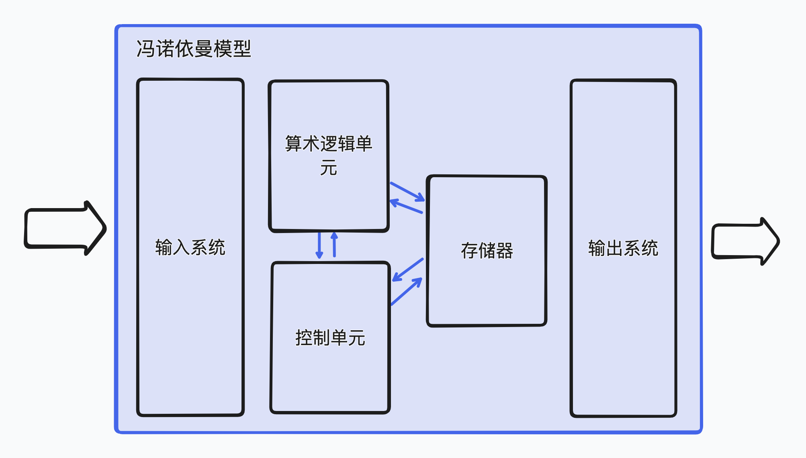

# 图灵模型

### 什么是图灵机？

图灵机是阿兰图灵在1937年提出的通用计算机的设想，所有计算都可以在特殊机器上执行。

图灵机是一种数学上的描述，并不是一台真实的机器。

### 数据处理器

数据处理器是通过输入数据 --> 计算器处理 --> 输出数据的单任务计算器。

### 可编程数据处理器

可编程数据处理器是通过输入数据和程序 --> 计算器处理 --> 输出数据的可编程数据处理模型，符合图灵机的描述，所以就是图灵机。

**规则**

- 程序相同，输入数据不同，输出数据不同；
- 输入数据相同，程序不同，输出数据不同；
- 程序相同，输入数据相同，输出数据相同；

### 通用图灵机

通用图灵机是对现代计算机的首次描述，只要提供合适的程序就能做任何事。

# 冯诺依曼模型

### 什么是冯诺依曼模型？

冯诺依曼模型是由冯诺依曼提出的模型理论。

基于通用图灵机建造的计算机，数据和程序都是存储在存储器中。鉴于程序和数据的逻辑都是相同的，因此程序也能存储到计算机的存储器上。

### 冯诺依曼模型和图灵模型的区别？

冯诺依曼模型必须将数据和程序存储到存储器中，而图灵机是是依赖数据和程序输入。

### 冯诺依曼模型组成

冯诺依曼模型由4个子系统组成：存储器、控制单元、算术逻辑单元、输入/输出单元。

**存储器：** 用来存储数据和程序的单元

**控制单元：** 对存储器、算术逻辑单元、输入/输出子系统进行控制的单元

**算术逻辑单元：** 用来计算和逻辑运算的单元

**输入/输出单元：** 输入子系统负责接收外部输入数据、输出子系统负责结果输出到外部

### 位模式

现代计算机要求数据和程序都存储到存储单元，这就要求程序和数据要有相同的格式，实际上它们都是以位模式（0/1）存储起来的。

# 练习题
