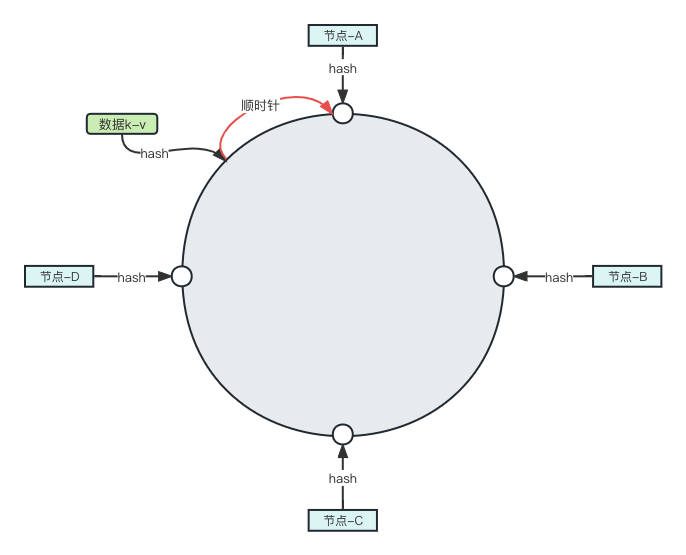
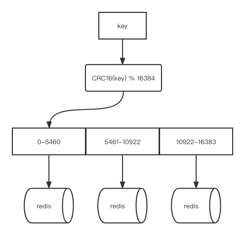

# 3主3从Redis集群搭建

**痛点**

1-2亿条数据需要存储，不可能存储在单机上，就必须采用分布式存储。

**理论**

- 哈希取余分区
  
  - 算法：`hash(key)%N`，根据机器的台数N，均分到节点上。
  
  - 优点：算法简单，只要预估好数据的节点，能保证一定时间的数据支撑。使用Hash算法让固定的一部分请求落到同一台服务器上，这样每台服务器固定处理一部分请求（并维护这些请求的信息），起到负载均衡+分而治之的作用。
  
  - 缺点：对扩缩容不友好，一旦遇到扩缩容就要重新计算，如果遇到节点宕机会出现问题。

- 一致性哈希算法分区
  
  - 算法：主要为了结算哈希取余中出现的服务器个数变化的问题。主要思路是将所有可能的哈希值构成一个全量集，这个集合可以成为一个hash空间[0,2^32-1]，通过逻辑控制将它形成一个首尾相连的哈希环。再将服务器节点落到哈希环的不同位置，key则通过固定哈希算法落到哈希环上，然后通过顺时针方向找到最近的服务器节点进行存储。
  
  
  
  - 优点：解决了哈希取余分区的错误，即使一台机器宕机依然可以找到服务器。对扩缩容更加友好，增加或减少服务器，只需要将其中的数据进行重新计算。
  
  - 缺点：存在数据倾斜的问题，如果服务器节点太少又均匀，会导致数据倾斜问题。

- 哈希槽分区
  
  - 算法：主要为了解决均匀分配问题，在数据和节点之间又加入了一层，把这层称为哈希槽（slot），用于管理数据和节点之间的关系。
    
    - 槽解决的是粒度问题，相当于把粒度变大了，这样便于数据移动。
    
    - 哈希解决的是映射问题，使用key的哈希值来计算所在的槽，便于数据分配。
    
    - 一个集群只能有16384个槽，编号0-16383（0-2^14-1），将这些槽分配给所有的主节点，然后对key进行hash然后对于16384取余，余数是几key就落入对应的槽里。slot = CRC16(key) % 16384。
    
    - 对于移动数据也是固定的，知道从A节点移动到B节点
  
  

**新建6个Redis容器实例**

```shell
# --net host 使用宿主机的IP和端口，端口对应容器内的端口
# --privileged=true 获取宿主机root用户权限
# --cluster-enabled yes 开启redis集群
# --appendonly yes 开启持久化
# --port  redis端口号
docker run -d --name redis-node-1 \
--net host \
--privileged=true \
-v /Users/kx/workspace/docker/redis-node-1:/data \
redis:6.0.8 \
--cluster-enabled yes \
--appendonly yes \
--port 6381

docker run -d --name redis-node-2 --net host --privileged=true -v /Users/kx/workspace/docker/redis-node-2:/data redis:6.0.8 --cluster-enabled yes --appendonly yes --port 6382

docker run -d --name redis-node-3 --net host --privileged=true -v /Users/kx/workspace/docker/redis-node-3:/data redis:6.0.8 --cluster-enabled yes --appendonly yes --port 6383

docker run -d --name redis-node-4 --net host --privileged=true -v /Users/kx/workspace/docker/redis-node-4:/data redis:6.0.8 --cluster-enabled yes --appendonly yes --port 6384

docker run -d --name redis-node-5 --net host --privileged=true -v /Users/kx/workspace/docker/redis-node-5:/data redis:6.0.8 --cluster-enabled yes --appendonly yes --port 6385

docker run -d --name redis-node-6 --net host --privileged=true -v /Users/kx/workspace/docker/redis-node-6:/data redis:6.0.8 --cluster-enabled yes --appendonly yes --port 6386


# 查看结果
docker ps
CONTAINER ID   IMAGE         COMMAND                  CREATED          STATUS          PORTS                               NAMES
247d4ed2c980   redis:6.0.8   "docker-entrypoint.s…"   3 seconds ago    Up 2 seconds                                        redis-node-6
832aa8ec8477   redis:6.0.8   "docker-entrypoint.s…"   4 seconds ago    Up 2 seconds                                        redis-node-5
e1b682c50c63   redis:6.0.8   "docker-entrypoint.s…"   4 seconds ago    Up 3 seconds                                        redis-node-4
5d385d8361e6   redis:6.0.8   "docker-entrypoint.s…"   5 seconds ago    Up 3 seconds                                        redis-node-3
4d432ad569b0   redis:6.0.8   "docker-entrypoint.s…"   5 seconds ago    Up 4 seconds                                        redis-node-2
22eaf1978bcf   redis:6.0.8   "docker-entrypoint.s…"   24 seconds ago   Up 22 seconds                                       redis-node-1
```

**进入其中一台Redis构建集群关系**

```shell
# 进入redis-node-1容器
docker exec -it redis-node-1 /bin/bash

# 创建主从关系
# --cluster create 创建集群
# --cluster-replicas 1 表示为每个master创建一个slave节点
# IP为宿主机的IP
# redis-cli --cluster create 192.168.6.14:6381 192.168.6.14:6382 192.168.6.14:6383 192.168.6.14:6384 192.168.6.14:6385 192.168.6.14:6386 --cluster-replicas 1
redis-cli --cluster create 127.0.0.1:6381 127.0.0.1:6382 127.0.0.1:6383 127.0.0.1:6384 127.0.0.1:6385 127.0.0.1:6386 --cluster-replicas 1
>>> Performing hash slots allocation on 6 nodes...
Master[0] -> Slots 0 - 5460
Master[1] -> Slots 5461 - 10922
Master[2] -> Slots 10923 - 16383
Adding replica 127.0.0.1:6385 to 127.0.0.1:6381
Adding replica 127.0.0.1:6386 to 127.0.0.1:6382
Adding replica 127.0.0.1:6384 to 127.0.0.1:6383
>>> Trying to optimize slaves allocation for anti-affinity
[WARNING] Some slaves are in the same host as their master
M: e9f6799de802f01ef0a001e02f7fc63b76ec003b 127.0.0.1:6381
   slots:[0-5460] (5461 slots) master
M: d38ee9755d159524733c8cdadf142ef641deb1c5 127.0.0.1:6382
   slots:[5461-10922] (5462 slots) master
M: 587a8c64afbe43f080aa2ae7cd293c07fb08713b 127.0.0.1:6383
   slots:[10923-16383] (5461 slots) master
S: 0a70839c1edb064753f820623e7ab17e9fd19992 127.0.0.1:6384
   replicates d38ee9755d159524733c8cdadf142ef641deb1c5
S: 7dc5673f6f5cdd652395f1dfa7c399c6366ac88e 127.0.0.1:6385
   replicates 587a8c64afbe43f080aa2ae7cd293c07fb08713b
S: 0ee0471c589de48408ff0d3eb897b0daa04b1f77 127.0.0.1:6386
   replicates e9f6799de802f01ef0a001e02f7fc63b76ec003b
Can I set the above configuration? (type 'yes' to accept):yes
>>> Nodes configuration updated
>>> Assign a different config epoch to each node
>>> Sending CLUSTER MEET messages to join the cluster
Waiting for the cluster to join

>>> Performing Cluster Check (using node 127.0.0.1:6381)
M: e9f6799de802f01ef0a001e02f7fc63b76ec003b 127.0.0.1:6381
   slots:[0-5460] (5461 slots) master
   1 additional replica(s)
S: 0a70839c1edb064753f820623e7ab17e9fd19992 127.0.0.1:6384
   slots: (0 slots) slave
   replicates d38ee9755d159524733c8cdadf142ef641deb1c5
M: d38ee9755d159524733c8cdadf142ef641deb1c5 127.0.0.1:6382
   slots:[5461-10922] (5462 slots) master
   1 additional replica(s)
M: 587a8c64afbe43f080aa2ae7cd293c07fb08713b 127.0.0.1:6383
   slots:[10923-16383] (5461 slots) master
   1 additional replica(s)
S: 0ee0471c589de48408ff0d3eb897b0daa04b1f77 127.0.0.1:6386
   slots: (0 slots) slave
   replicates e9f6799de802f01ef0a001e02f7fc63b76ec003b
S: 7dc5673f6f5cdd652395f1dfa7c399c6366ac88e 127.0.0.1:6385
   slots: (0 slots) slave
   replicates 587a8c64afbe43f080aa2ae7cd293c07fb08713b
[OK] All nodes agree about slots configuration.
>>> Check for open slots...
>>> Check slots coverage...
[OK] All 16384 slots covered.
```

**查看集群状态**

```shell
# 进入任意一个redis
redis-cli -p 6381
127.0.0.1:6381> keys *
(empty array)
# cluster info 查看集群信息
127.0.0.1:6381> cluster info
cluster_state:ok # 集群状态
cluster_slots_assigned:16384
cluster_slots_ok:16384 # 已启动哈希槽位数量
cluster_slots_pfail:0
cluster_slots_fail:0
cluster_known_nodes:6 # 已知的多少个节点
cluster_size:3
cluster_current_epoch:6
cluster_my_epoch:1
cluster_stats_messages_ping_sent:99
cluster_stats_messages_pong_sent:100
cluster_stats_messages_sent:199
cluster_stats_messages_ping_received:95
cluster_stats_messages_pong_received:99
cluster_stats_messages_meet_received:5
cluster_stats_messages_received:199

# 查看集群节点，可以看出 6381(master)-6386(slave)、6382(master)-6384(slave)、6383(master)-6385(slave)
127.0.0.1:6381> cluster nodes
e9f6799de802f01ef0a001e02f7fc63b76ec003b 127.0.0.1:6381@16381 myself,master - 0 1683553391000 1 connected 0-5460
0a70839c1edb064753f820623e7ab17e9fd19992 127.0.0.1:6384@16384 slave d38ee9755d159524733c8cdadf142ef641deb1c5 0 1683553393000 2 connected
d38ee9755d159524733c8cdadf142ef641deb1c5 127.0.0.1:6382@16382 master - 0 1683553392000 2 connected 5461-10922
587a8c64afbe43f080aa2ae7cd293c07fb08713b 127.0.0.1:6383@16383 master - 0 1683553393121 3 connected 10923-16383
0ee0471c589de48408ff0d3eb897b0daa04b1f77 127.0.0.1:6386@16386 slave e9f6799de802f01ef0a001e02f7fc63b76ec003b 0 1683553394125 1 connected
7dc5673f6f5cdd652395f1dfa7c399c6366ac88e 127.0.0.1:6385@16385 slave 587a8c64afbe43f080aa2ae7cd293c07fb08713b 0 1683553389087 3 connected
```

**测试集群**

```shell
# 进入第一台Redis容器
docker exec -it redis-node-1 /bin/bash

# 连接Redis
redis-cli -p 6381
127.0.0.1:6381> SET k1 v1
# 落点在12706在第三个节点，但现在连接的是第一台redis，所以需要通过集群的方式连接
(error) MOVED 12706 127.0.0.1:6383
# 通过集群方式连接
redis-cli -p 6381 -c
127.0.0.1:6381> set k1 v1
# 会自动跳转到6383这一个节点然后写入数据
-> Redirected to slot [12706] located at 127.0.0.1:6383
OK
```

**查看集群信息**

```shell
redis-cli --cluster check 127.0.0.1:6381
# 结果
127.0.0.1:6381 (e9f6799d...) -> 0 keys | 5461 slots | 1 slaves.
127.0.0.1:6382 (d38ee975...) -> 0 keys | 5462 slots | 1 slaves.
# 在6383节点上，有1个key，5461个槽位，1个slave
127.0.0.1:6383 (587a8c64...) -> 1 keys | 5461 slots | 1 slaves.
[OK] 1 keys in 3 masters.
0.00 keys per slot on average.
>>> Performing Cluster Check (using node 127.0.0.1:6381)
M: e9f6799de802f01ef0a001e02f7fc63b76ec003b 127.0.0.1:6381
   slots:[0-5460] (5461 slots) master
   1 additional replica(s)
S: 0a70839c1edb064753f820623e7ab17e9fd19992 127.0.0.1:6384
   slots: (0 slots) slave
   replicates d38ee9755d159524733c8cdadf142ef641deb1c5
M: d38ee9755d159524733c8cdadf142ef641deb1c5 127.0.0.1:6382
   slots:[5461-10922] (5462 slots) master
   1 additional replica(s)
M: 587a8c64afbe43f080aa2ae7cd293c07fb08713b 127.0.0.1:6383
   slots:[10923-16383] (5461 slots) master
   1 additional replica(s)
S: 0ee0471c589de48408ff0d3eb897b0daa04b1f77 127.0.0.1:6386
   slots: (0 slots) slave
   replicates e9f6799de802f01ef0a001e02f7fc63b76ec003b
S: 7dc5673f6f5cdd652395f1dfa7c399c6366ac88e 127.0.0.1:6385
   slots: (0 slots) slave
   replicates 587a8c64afbe43f080aa2ae7cd293c07fb08713b
[OK] All nodes agree about slots configuration.
>>> Check for open slots...
>>> Check slots coverage...
[OK] All 16384 slots covered.
```

# 容错切换

**停止一台master**

```shell
# 将第一台节点停止（模拟宕机），正常情况下它的slave会上位
docker stop redis-node-1
```

**测试上位情况**

```shell
# 进入一台节点
docker exec -it redis-node-2 /bin/bash
# 查看节点信息
redis-cli -p 6382 -c
127.0.0.1:6382> cluster nodes
0a70839c1edb064753f820623e7ab17e9fd19992 127.0.0.1:6384@16384 slave d38ee9755d159524733c8cdadf142ef641deb1c5 0 1683595722985 2 connected
# 6381 master,fail 6381死了，它的slave6386变成了master
e9f6799de802f01ef0a001e02f7fc63b76ec003b 127.0.0.1:6381@16381 master,fail - 1683595566707 1683595563000 1 disconnected
587a8c64afbe43f080aa2ae7cd293c07fb08713b 127.0.0.1:6383@16383 master - 0 1683595721967 3 connected 10923-16383
7dc5673f6f5cdd652395f1dfa7c399c6366ac88e 127.0.0.1:6385@16385 slave 587a8c64afbe43f080aa2ae7cd293c07fb08713b 0 1683595723000 3 connected
d38ee9755d159524733c8cdadf142ef641deb1c5 127.0.0.1:6382@16382 myself,master - 0 1683595722000 2 connected 5461-10922
0ee0471c589de48408ff0d3eb897b0daa04b1f77 127.0.0.1:6386@16386 master - 0 1683595723991 7 connected 0-5460

# 数据操作看是否正常
127.0.0.1:6383> set k2 v2
# 此时6386已经成为了master
-> Redirected to slot [449] located at 127.0.0.1:6386
OK
```

**还原成之前的状态**

```shell
# 将第一个节点启动起来
docker start redis-node-1

# 查看节点信息
127.0.0.1:6382> cluster nodes
0a70839c1edb064753f820623e7ab17e9fd19992 127.0.0.1:6384@16384 slave d38ee9755d159524733c8cdadf142ef641deb1c5 0 1683596113000 2 connected
# 此时发现6381变成了slave，并没有恢复成6381为master、6386为slave
e9f6799de802f01ef0a001e02f7fc63b76ec003b 127.0.0.1:6381@16381 slave 0ee0471c589de48408ff0d3eb897b0daa04b1f77 0 1683596113817 7 connected
587a8c64afbe43f080aa2ae7cd293c07fb08713b 127.0.0.1:6383@16383 master - 0 1683596112000 3 connected 10923-16383
7dc5673f6f5cdd652395f1dfa7c399c6366ac88e 127.0.0.1:6385@16385 slave 587a8c64afbe43f080aa2ae7cd293c07fb08713b 0 1683596112767 3 connected
d38ee9755d159524733c8cdadf142ef641deb1c5 127.0.0.1:6382@16382 myself,master - 0 1683596111000 2 connected 5461-10922
0ee0471c589de48408ff0d3eb897b0daa04b1f77 127.0.0.1:6386@16386 master - 0 1683596112000 7 connected 0-5460

# 关闭6386再开启
docker stop redis-node-6
docker start redis-node-6

# 再次查看节点信息（需要等待一小段时间，需要等待心跳检测结束）
127.0.0.1:6382> cluster nodes
0a70839c1edb064753f820623e7ab17e9fd19992 127.0.0.1:6384@16384 slave d38ee9755d159524733c8cdadf142ef641deb1c5 0 1683596377000 2 connected
# 发现此时已经还原了
e9f6799de802f01ef0a001e02f7fc63b76ec003b 127.0.0.1:6381@16381 master - 0 1683596378384 8 connected 0-5460
587a8c64afbe43f080aa2ae7cd293c07fb08713b 127.0.0.1:6383@16383 master - 0 1683596378000 3 connected 10923-16383
7dc5673f6f5cdd652395f1dfa7c399c6366ac88e 127.0.0.1:6385@16385 slave 587a8c64afbe43f080aa2ae7cd293c07fb08713b 0 1683596375000 3 connected
d38ee9755d159524733c8cdadf142ef641deb1c5 127.0.0.1:6382@16382 myself,master - 0 1683596375000 2 connected 5461-10922
0ee0471c589de48408ff0d3eb897b0daa04b1f77 127.0.0.1:6386@16386 slave e9f6799de802f01ef0a001e02f7fc63b76ec003b 0 1683596376372 8 connected
```

# 主从扩容

当遇到高并发时，原来的3主3从已经抗不住了，需要扩成4主4从。

**步骤**

1. 将新的主和从启动起来

2. 然后主机加入到集群

3. 重新分配槽位

4. 再将从机加入集群成为新的主机的从节点

**问题**

原本的哈希槽位已经分配好了（之前3主3从哈希槽被分成了3段），此时再扩需要重新分配哈希槽位，如何重新分配？

**启动2台新节点**

```shell
docker run -d --name redis-node-7 --net host --privileged=true -v /Users/kx/workspace/docker/redis-node-7:/data redis:6.0.8 --cluster-enabled yes --appendonly yes --port 6387
docker run -d --name redis-node-8 --net host --privileged=true -v /Users/kx/workspace/docker/redis-node-8:/data redis:6.0.8 --cluster-enabled yes --appendonly yes --port 6388

docker ps
CONTAINER ID   IMAGE         COMMAND                  CREATED         STATUS          PORTS     NAMES
541d8cee10e4   redis:6.0.8   "docker-entrypoint.s…"   3 seconds ago   Up 2 seconds              redis-node-8
0f32f0f50f54   redis:6.0.8   "docker-entrypoint.s…"   3 seconds ago   Up 2 seconds              redis-node-7
c6dfa2ad1302   redis:6.0.8   "docker-entrypoint.s…"   13 hours ago    Up 32 minutes             redis-node-6
c152935d5714   redis:6.0.8   "docker-entrypoint.s…"   13 hours ago    Up 13 hours               redis-node-5
6d58f9cffcb3   redis:6.0.8   "docker-entrypoint.s…"   13 hours ago    Up 13 hours               redis-node-4
df82077db68f   redis:6.0.8   "docker-entrypoint.s…"   13 hours ago    Up 13 hours               redis-node-3
85c5788b4d19   redis:6.0.8   "docker-entrypoint.s…"   13 hours ago    Up 13 hours               redis-node-2
55feef5b54d2   redis:6.0.8   "docker-entrypoint.s…"   13 hours ago    Up 37 minutes             redis-node-1
```

**将新的master节点加入到集群**

```shell
# 进入新的master节点容器
docker exec -it redis-node-7 /bin/bash
# 将新增的6387作为master节点加入集群
redis-cli --cluster add-node 127.0.0.1:6387 127.0.0.1:6381
# 6387 就是将要作为master新增节点
# 6381 就是原来集群节点里面的领路人，相当于6387拜拜6381的码头从而找到组织加入集群
>>> Adding node 127.0.0.1:6387 to cluster 127.0.0.1:6381
>>> Performing Cluster Check (using node 127.0.0.1:6381)
M: e9f6799de802f01ef0a001e02f7fc63b76ec003b 127.0.0.1:6381
   slots:[0-5460] (5461 slots) master
   1 additional replica(s)
S: 7dc5673f6f5cdd652395f1dfa7c399c6366ac88e 127.0.0.1:6385
   slots: (0 slots) slave
   replicates 587a8c64afbe43f080aa2ae7cd293c07fb08713b
M: d38ee9755d159524733c8cdadf142ef641deb1c5 127.0.0.1:6382
   slots:[5461-10922] (5462 slots) master
   1 additional replica(s)
S: 0a70839c1edb064753f820623e7ab17e9fd19992 127.0.0.1:6384
   slots: (0 slots) slave
   replicates d38ee9755d159524733c8cdadf142ef641deb1c5
S: 0ee0471c589de48408ff0d3eb897b0daa04b1f77 127.0.0.1:6386
   slots: (0 slots) slave
   replicates e9f6799de802f01ef0a001e02f7fc63b76ec003b
M: 587a8c64afbe43f080aa2ae7cd293c07fb08713b 127.0.0.1:6383
   slots:[10923-16383] (5461 slots) master
   1 additional replica(s)
[OK] All nodes agree about slots configuration.
>>> Check for open slots...
>>> Check slots coverage...
[OK] All 16384 slots covered.
>>> Send CLUSTER MEET to node 127.0.0.1:6387 to make it join the cluster.
[OK] New node added correctly.
```

**检查集群状态**

```shell
redis-cli --cluster check 127.0.0.1:6381

# 结果
127.0.0.1:6381 (e9f6799d...) -> 1 keys | 5461 slots | 1 slaves.
127.0.0.1:6382 (d38ee975...) -> 0 keys | 5462 slots | 1 slaves.
# 新的6387还没有分配槽位
127.0.0.1:6387 (bded87e6...) -> 0 keys | 0 slots | 0 slaves.
127.0.0.1:6383 (587a8c64...) -> 1 keys | 5461 slots | 1 slaves.
[OK] 2 keys in 4 masters.
0.00 keys per slot on average.
>>> Performing Cluster Check (using node 127.0.0.1:6381)
M: e9f6799de802f01ef0a001e02f7fc63b76ec003b 127.0.0.1:6381
   slots:[0-5460] (5461 slots) master
   1 additional replica(s)
S: 7dc5673f6f5cdd652395f1dfa7c399c6366ac88e 127.0.0.1:6385
   slots: (0 slots) slave
   replicates 587a8c64afbe43f080aa2ae7cd293c07fb08713b
M: d38ee9755d159524733c8cdadf142ef641deb1c5 127.0.0.1:6382
   slots:[5461-10922] (5462 slots) master
   1 additional replica(s)
M: bded87e6083159198b9159c40a9c8804e744df13 127.0.0.1:6387
   slots: (0 slots) master
S: 0a70839c1edb064753f820623e7ab17e9fd19992 127.0.0.1:6384
   slots: (0 slots) slave
   replicates d38ee9755d159524733c8cdadf142ef641deb1c5
S: 0ee0471c589de48408ff0d3eb897b0daa04b1f77 127.0.0.1:6386
   slots: (0 slots) slave
   replicates e9f6799de802f01ef0a001e02f7fc63b76ec003b
M: 587a8c64afbe43f080aa2ae7cd293c07fb08713b 127.0.0.1:6383
   slots:[10923-16383] (5461 slots) master
   1 additional replica(s)
[OK] All nodes agree about slots configuration.
>>> Check for open slots...
>>> Check slots coverage...
[OK] All 16384 slots covered.
```

**重新分配槽位**

```shell
redis-cli --cluster reshard 127.0.0.1:6381

...
# 如何分配操作，16384/master数量
how many slots do you want to move (from 1 to 16384)? 4096
# 分配给哪个节点，分配给新的master节点
what is the receiving node ID? bded87e6083159198b9159c40a9c8804e744df13
```

**重新检查集群状态**

```shell
redis-cli --cluster check 127.0.0.1:6381
# 结果
127.0.0.1:6381 (e9f6799d...) -> 0 keys | 4096 slots | 1 slaves.
127.0.0.1:6382 (d38ee975...) -> 0 keys | 4096 slots | 1 slaves.
# 从这里可以看出新的节点已经得到4096个槽位，数据也重新进行了分配
127.0.0.1:6387 (bded87e6...) -> 1 keys | 4096 slots | 0 slaves.
127.0.0.1:6383 (587a8c64...) -> 1 keys | 4096 slots | 1 slaves.
[OK] 2 keys in 4 masters.
0.00 keys per slot on average.
>>> Performing Cluster Check (using node 127.0.0.1:6381)
# 根据新的槽位分配可以得知槽位分配的算法是将老的3个节点分别匀1364个槽位给新的节点
# 这样效率会更高，不然重新分配成本也太高
M: e9f6799de802f01ef0a001e02f7fc63b76ec003b 127.0.0.1:6381
   slots:[1365-5460] (4096 slots) master
   1 additional replica(s)
S: 7dc5673f6f5cdd652395f1dfa7c399c6366ac88e 127.0.0.1:6385
   slots: (0 slots) slave
   replicates 587a8c64afbe43f080aa2ae7cd293c07fb08713b
M: d38ee9755d159524733c8cdadf142ef641deb1c5 127.0.0.1:6382
   slots:[6827-10922] (4096 slots) master
   1 additional replica(s)
M: bded87e6083159198b9159c40a9c8804e744df13 127.0.0.1:6387
   slots:[0-1364],[5461-6826],[10923-12287] (4096 slots) master
S: 0a70839c1edb064753f820623e7ab17e9fd19992 127.0.0.1:6384
   slots: (0 slots) slave
   replicates d38ee9755d159524733c8cdadf142ef641deb1c5
S: 0ee0471c589de48408ff0d3eb897b0daa04b1f77 127.0.0.1:6386
   slots: (0 slots) slave
   replicates e9f6799de802f01ef0a001e02f7fc63b76ec003b
M: 587a8c64afbe43f080aa2ae7cd293c07fb08713b 127.0.0.1:6383
   slots:[12288-16383] (4096 slots) master
   1 additional replica(s)
[OK] All nodes agree about slots configuration.
>>> Check for open slots...
>>> Check slots coverage...
[OK] All 16384 slots covered.
```

**为新的master节点分配一个slave节点**

```shell
# redis-cli --cluster add-node ip:新slave端口 ip:新master端口 --cluster-slave --cluster-master-id 新主机节点ID
redis-cli --cluster add-node 127.0.0.1:6388 127.0.0.1:6387 --cluster-slave --cluster-master-id bded87e6083159198b9159c40a9c8804e744df13redis-cli --cluster add-node 127.0.0.1:6388 127.0.0.1:6387 --cluster-slave --cluster-master-id bded87e6083159198b9159c40a9c8804e744df13

# 结果
>>> Adding node 127.0.0.1:6388 to cluster 127.0.0.1:6387
>>> Performing Cluster Check (using node 127.0.0.1:6387)
M: bded87e6083159198b9159c40a9c8804e744df13 127.0.0.1:6387
   slots:[0-1364],[5461-6826],[10923-12287] (4096 slots) master
S: 0ee0471c589de48408ff0d3eb897b0daa04b1f77 127.0.0.1:6386
   slots: (0 slots) slave
   replicates e9f6799de802f01ef0a001e02f7fc63b76ec003b
M: e9f6799de802f01ef0a001e02f7fc63b76ec003b 127.0.0.1:6381
   slots:[1365-5460] (4096 slots) master
   1 additional replica(s)
M: d38ee9755d159524733c8cdadf142ef641deb1c5 127.0.0.1:6382
   slots:[6827-10922] (4096 slots) master
   1 additional replica(s)
M: 587a8c64afbe43f080aa2ae7cd293c07fb08713b 127.0.0.1:6383
   slots:[12288-16383] (4096 slots) master
   1 additional replica(s)
S: 7dc5673f6f5cdd652395f1dfa7c399c6366ac88e 127.0.0.1:6385
   slots: (0 slots) slave
   replicates 587a8c64afbe43f080aa2ae7cd293c07fb08713b
S: 0a70839c1edb064753f820623e7ab17e9fd19992 127.0.0.1:6384
   slots: (0 slots) slave
   replicates d38ee9755d159524733c8cdadf142ef641deb1c5
[OK] All nodes agree about slots configuration.
>>> Check for open slots...
>>> Check slots coverage...
[OK] All 16384 slots covered.
>>> Send CLUSTER MEET to node 127.0.0.1:6388 to make it join the cluster.
Waiting for the cluster to join

>>> Configure node as replica of 127.0.0.1:6387.
[OK] New node added correctly.
```

**最后检查集群状态**

```shell
redis-cli --cluster check 127.0.0.1:6381
# 结果
127.0.0.1:6382 (d38ee975...) -> 0 keys | 4096 slots | 1 slaves.
127.0.0.1:6381 (e9f6799d...) -> 0 keys | 4096 slots | 1 slaves.
127.0.0.1:6383 (587a8c64...) -> 1 keys | 4096 slots | 1 slaves.
# 可以看到6387多了一个slave
127.0.0.1:6387 (bded87e6...) -> 1 keys | 4096 slots | 1 slaves.
[OK] 2 keys in 4 masters.
0.00 keys per slot on average.
>>> Performing Cluster Check (using node 127.0.0.1:6382)
M: d38ee9755d159524733c8cdadf142ef641deb1c5 127.0.0.1:6382
   slots:[6827-10922] (4096 slots) master
   1 additional replica(s)
S: 0a70839c1edb064753f820623e7ab17e9fd19992 127.0.0.1:6384
   slots: (0 slots) slave
   replicates d38ee9755d159524733c8cdadf142ef641deb1c5
# 从这里看出来6388是6387的从节点
S: 2a51190a607881a423c0220d23db3f41e7fd0e65 127.0.0.1:6388
   slots: (0 slots) slave
   replicates bded87e6083159198b9159c40a9c8804e744df13
M: e9f6799de802f01ef0a001e02f7fc63b76ec003b 127.0.0.1:6381
   slots:[1365-5460] (4096 slots) master
   1 additional replica(s)
M: 587a8c64afbe43f080aa2ae7cd293c07fb08713b 127.0.0.1:6383
   slots:[12288-16383] (4096 slots) master
   1 additional replica(s)
S: 7dc5673f6f5cdd652395f1dfa7c399c6366ac88e 127.0.0.1:6385
   slots: (0 slots) slave
   replicates 587a8c64afbe43f080aa2ae7cd293c07fb08713b
M: bded87e6083159198b9159c40a9c8804e744df13 127.0.0.1:6387
   slots:[0-1364],[5461-6826],[10923-12287] (4096 slots) master
   1 additional replica(s)
S: 0ee0471c589de48408ff0d3eb897b0daa04b1f77 127.0.0.1:6386
   slots: (0 slots) slave
   replicates e9f6799de802f01ef0a001e02f7fc63b76ec003b
[OK] All nodes agree about slots configuration.
>>> Check for open slots...
>>> Check slots coverage...
[OK] All 16384 slots covered.
```

# 主从缩容

**步骤**

1. 先清除slave节点6388

2. 清出来的槽位重新分配

3. 再删除master节点6387

4. 恢复成3主3从

**删除slave节点6388**

```shell
# 先查看6388的节点ID
redis-cli --cluster check 127.0.0.1:6382
127.0.0.1:6382 (d38ee975...) -> 0 keys | 4096 slots | 1 slaves.
127.0.0.1:6381 (e9f6799d...) -> 0 keys | 4096 slots | 1 slaves.
127.0.0.1:6383 (587a8c64...) -> 1 keys | 4096 slots | 1 slaves.
127.0.0.1:6387 (bded87e6...) -> 1 keys | 4096 slots | 1 slaves.
[OK] 2 keys in 4 masters.
0.00 keys per slot on average.
>>> Performing Cluster Check (using node 127.0.0.1:6382)
M: d38ee9755d159524733c8cdadf142ef641deb1c5 127.0.0.1:6382
   slots:[6827-10922] (4096 slots) master
   1 additional replica(s)
S: 0a70839c1edb064753f820623e7ab17e9fd19992 127.0.0.1:6384
   slots: (0 slots) slave
   replicates d38ee9755d159524733c8cdadf142ef641deb1c5
# 从此处得知6388的节点ID
S: 2a51190a607881a423c0220d23db3f41e7fd0e65 127.0.0.1:6388
   slots: (0 slots) slave
   replicates bded87e6083159198b9159c40a9c8804e744df13
M: e9f6799de802f01ef0a001e02f7fc63b76ec003b 127.0.0.1:6381
   slots:[1365-5460] (4096 slots) master
   1 additional replica(s)
M: 587a8c64afbe43f080aa2ae7cd293c07fb08713b 127.0.0.1:6383
   slots:[12288-16383] (4096 slots) master
   1 additional replica(s)
S: 7dc5673f6f5cdd652395f1dfa7c399c6366ac88e 127.0.0.1:6385
   slots: (0 slots) slave
   replicates 587a8c64afbe43f080aa2ae7cd293c07fb08713b
M: bded87e6083159198b9159c40a9c8804e744df13 127.0.0.1:6387
   slots:[0-1364],[5461-6826],[10923-12287] (4096 slots) master
   1 additional replica(s)
S: 0ee0471c589de48408ff0d3eb897b0daa04b1f77 127.0.0.1:6386
   slots: (0 slots) slave
   replicates e9f6799de802f01ef0a001e02f7fc63b76ec003b
[OK] All nodes agree about slots configuration.
>>> Check for open slots...
>>> Check slots coverage...
[OK] All 16384 slots covered.

# 删除slave节点
# redis-cli --cluster del-node ip:从机端口 从机6388节点ID
redis-cli --cluster del-node 127.0.0.1:6388 2a51190a607881a423c0220d23db3f41e7fd0e65
>>> Removing node 2a51190a607881a423c0220d23db3f41e7fd0e65 from cluster 127.0.0.1:6388
>>> Sending CLUSTER FORGET messages to the cluster...
>>> Sending CLUSTER RESET SOFT to the deleted node.
```

**将6387的槽位清空并重新分配**

```shell
# 此例子将6387的槽位全部分配给6381
redis-cli --cluster reshard 127.0.0.1:6381
>>> Performing Cluster Check (using node 127.0.0.1:6381)
M: e9f6799de802f01ef0a001e02f7fc63b76ec003b 127.0.0.1:6381
   slots:[1365-5460] (4096 slots) master
   1 additional replica(s)
S: 7dc5673f6f5cdd652395f1dfa7c399c6366ac88e 127.0.0.1:6385
   slots: (0 slots) slave
   replicates 587a8c64afbe43f080aa2ae7cd293c07fb08713b
M: d38ee9755d159524733c8cdadf142ef641deb1c5 127.0.0.1:6382
   slots:[6827-10922] (4096 slots) master
   1 additional replica(s)
M: bded87e6083159198b9159c40a9c8804e744df13 127.0.0.1:6387
   slots:[0-1364],[5461-6826],[10923-12287] (4096 slots) master
S: 0a70839c1edb064753f820623e7ab17e9fd19992 127.0.0.1:6384
   slots: (0 slots) slave
   replicates d38ee9755d159524733c8cdadf142ef641deb1c5
S: 0ee0471c589de48408ff0d3eb897b0daa04b1f77 127.0.0.1:6386
   slots: (0 slots) slave
   replicates e9f6799de802f01ef0a001e02f7fc63b76ec003b
M: 587a8c64afbe43f080aa2ae7cd293c07fb08713b 127.0.0.1:6383
   slots:[12288-16383] (4096 slots) master
   1 additional replica(s)
[OK] All nodes agree about slots configuration.
>>> Check for open slots...
>>> Check slots coverage...
[OK] All 16384 slots covered.
# 要移动的槽位个数
How many slots do you want to move (from 1 to 16384)? 4096
# 接收的节点ID
What is the receiving node ID? e9f6799de802f01ef0a001e02f7fc63b76ec003b
Please enter all the source node IDs.
  Type 'all' to use all the nodes as source nodes for the hash slots.
  Type 'done' once you entered all the source nodes IDs.
# 从哪里分配，这里从6387节点分配
Source node #1: bded87e6083159198b9159c40a9c8804e744df13
Source node #2: done
do you want to proceed with the proposed reshard plan (yes/no)? yes

# 查看集群信息
redis-cli --cluster check 127.0.0.1:6381
127.0.0.1:6381 (e9f6799d...) -> 1 keys | 8192 slots | 1 slaves.
127.0.0.1:6382 (d38ee975...) -> 0 keys | 4096 slots | 1 slaves.
# 从这里看出6387没有槽位了
127.0.0.1:6387 (bded87e6...) -> 0 keys | 0 slots | 0 slaves.
127.0.0.1:6383 (587a8c64...) -> 1 keys | 4096 slots | 1 slaves.
```

**删除master节点**

```shell
redis-cli --cluster del-node 127.0.0.1:6387 bded87e6083159198b9159c40a9c8804e744df13
>>> Removing node bded87e6083159198b9159c40a9c8804e744df13 from cluster 127.0.0.1:6387
>>> Sending CLUSTER FORGET messages to the cluster...
>>> Sending CLUSTER RESET SOFT to the deleted node.

# 最后查看集群信息
redis-cli --cluster check 127.0.0.1:6381
# 6381得到了6387分配的4096个槽位
127.0.0.1:6381 (e9f6799d...) -> 1 keys | 8192 slots | 1 slaves.
127.0.0.1:6382 (d38ee975...) -> 0 keys | 4096 slots | 1 slaves.
127.0.0.1:6383 (587a8c64...) -> 1 keys | 4096 slots | 1 slaves.
```
