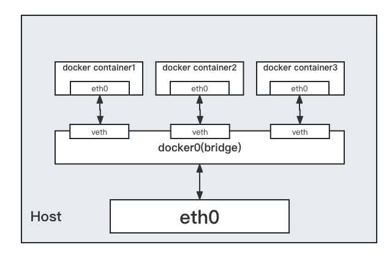
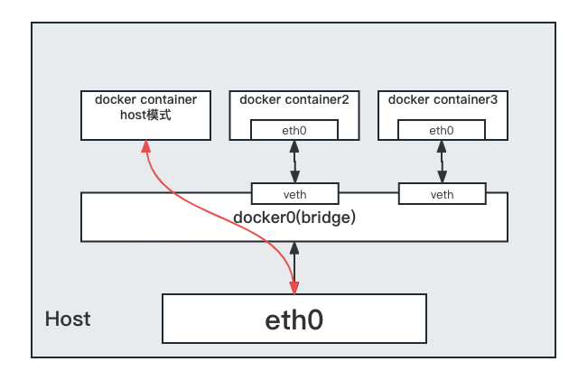
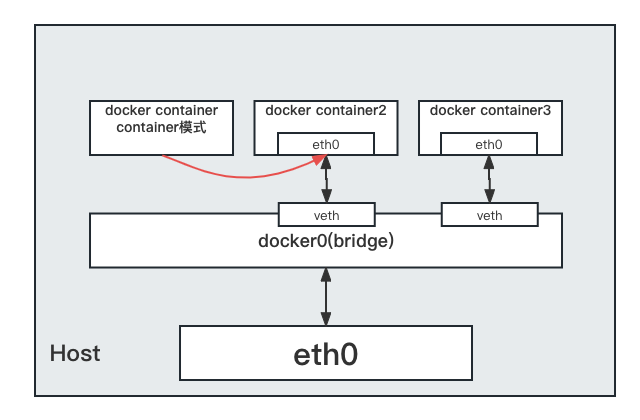

# Docker网络是什么

**启动Docker前后的区别**

- 没启动Docker前

```shell
ifconfig

# 结果
eth0: flags=4163<UP,BROADCAST,RUNNING,MULTICAST>  mtu 1500
        inet 10.0.2.15  netmask 255.255.255.0  broadcast 10.0.2.255
        inet6 fe80::a00:27ff:fe6c:3e95  prefixlen 64  scopeid 0x20<link>
        ether 08:00:27:6c:3e:95  txqueuelen 1000  (Ethernet)
        RX packets 13172  bytes 4806548 (4.5 MiB)
        RX errors 0  dropped 0  overruns 0  frame 0
        TX packets 8426  bytes 1322776 (1.2 MiB)
        TX errors 0  dropped 0 overruns 0  carrier 0  collisions 0

eth1: flags=4163<UP,BROADCAST,RUNNING,MULTICAST>  mtu 1500
        inet 192.168.33.10  netmask 255.255.255.0  broadcast 192.168.33.255
        inet6 fe80::a00:27ff:fe61:d24d  prefixlen 64  scopeid 0x20<link>
        ether 08:00:27:61:d2:4d  txqueuelen 1000  (Ethernet)
        RX packets 3914  bytes 291398 (284.5 KiB)
        RX errors 0  dropped 0  overruns 0  frame 0
        TX packets 3100  bytes 558096 (545.0 KiB)
        TX errors 0  dropped 0 overruns 0  carrier 0  collisions 0
# lo 本地网络回环
lo: flags=73<UP,LOOPBACK,RUNNING>  mtu 65536
        inet 127.0.0.1  netmask 255.0.0.0
        inet6 ::1  prefixlen 128  scopeid 0x10<host>
        loop  txqueuelen 0  (Local Loopback)
        RX packets 2  bytes 100 (100.0 B)
        RX errors 0  dropped 0  overruns 0  frame 0
        TX packets 2  bytes 100 (100.0 B)
        TX errors 0  dropped 0 overruns 0  carrier 0  collisions 0
```

- 启动Docker后

```shell
systemctl start docker
# 查看ip
ifconfig

# 结果
# 启动之后多了一个名为docker0的虚拟网桥
docker0: flags=4163<UP,BROADCAST,RUNNING,MULTICAST>  mtu 1500
        inet 172.17.0.1  netmask 255.255.0.0  broadcast 172.17.255.255
        inet6 fe80::42:d2ff:fe42:f16e  prefixlen 64  scopeid 0x20<link>
        ether 02:42:d2:42:f1:6e  txqueuelen 0  (Ethernet)
        RX packets 0  bytes 0 (0.0 B)
        RX errors 0  dropped 0  overruns 0  frame 0
        TX packets 9  bytes 606 (606.0 B)
        TX errors 0  dropped 0 overruns 0  carrier 0  collisions 0

eth0: flags=4163<UP,BROADCAST,RUNNING,MULTICAST>  mtu 1500
        inet 10.0.2.15  netmask 255.255.255.0  broadcast 10.0.2.255
        inet6 fe80::a00:27ff:fe6c:3e95  prefixlen 64  scopeid 0x20<link>
        ether 08:00:27:6c:3e:95  txqueuelen 1000  (Ethernet)
        RX packets 13172  bytes 4806548 (4.5 MiB)
        RX errors 0  dropped 0  overruns 0  frame 0
        TX packets 8426  bytes 1322776 (1.2 MiB)
        TX errors 0  dropped 0 overruns 0  carrier 0  collisions 0

eth1: flags=4163<UP,BROADCAST,RUNNING,MULTICAST>  mtu 1500
        inet 192.168.33.10  netmask 255.255.255.0  broadcast 192.168.33.255
        inet6 fe80::a00:27ff:fe61:d24d  prefixlen 64  scopeid 0x20<link>
        ether 08:00:27:61:d2:4d  txqueuelen 1000  (Ethernet)
        RX packets 3914  bytes 291398 (284.5 KiB)
        RX errors 0  dropped 0  overruns 0  frame 0
        TX packets 3100  bytes 558096 (545.0 KiB)
        TX errors 0  dropped 0 overruns 0  carrier 0  collisions 0

lo: flags=73<UP,LOOPBACK,RUNNING>  mtu 65536
        inet 127.0.0.1  netmask 255.0.0.0
        inet6 ::1  prefixlen 128  scopeid 0x10<host>
        loop  txqueuelen 0  (Local Loopback)
        RX packets 2  bytes 100 (100.0 B)
        RX errors 0  dropped 0  overruns 0  frame 0
        TX packets 2  bytes 100 (100.0 B)
        TX errors 0  dropped 0 overruns 0  carrier 0  collisions 0
```

**解决了什么问题**

- 容器间互联、通信以及端口映射

- 容器IP变动的时候可以通过服务名直接网络通信而不受影响
  
  - 因为容器重新启动IP会发生变化

# Docker网络命令

- 列出Docker网络列表

```shell
docker network ls

# 结果，docker启动后会默认创建这3个网络，
NETWORK ID     NAME      DRIVER    SCOPE
237aa603274f   bridge    bridge    local
19d4028146a3   host      host      local
d4f95f3800cc   none      null      local
```

- 添加网络

```shell
docker network create a_network

docker network ls
NETWORK ID     NAME        DRIVER    SCOPE
9602668f823d   a_network   bridge    local
237aa603274f   bridge      bridge    local
19d4028146a3   host        host      local
d4f95f3800cc   none        null      local
```

- 删除网络

```shell
docker network rm a_network
```

- 查看网络信息

```shell
docker network inspect bridge

# 结果
[
    {
        "Name": "bridge",
        "Id": "237aa603274fae72a68c8ebe81d795dcbd1cf2828642482c4d4aace94e4f0846",
        "Created": "2023-05-08T12:59:50.585449027Z",
        "Scope": "local",
        "Driver": "bridge",
        "EnableIPv6": false,
        "IPAM": {
            "Driver": "default",
            "Options": null,
            "Config": [
                {
                    "Subnet": "172.17.0.0/16",
                    "Gateway": "172.17.0.1"
                }
            ]
        },
        "Internal": false,
        "Attachable": false,
        "Ingress": false,
        "ConfigFrom": {
            "Network": ""
        },
        "ConfigOnly": false,
        "Containers": {},
        "Options": {
            "com.docker.network.bridge.default_bridge": "true",
            "com.docker.network.bridge.enable_icc": "true",
            "com.docker.network.bridge.enable_ip_masquerade": "true",
            "com.docker.network.bridge.host_binding_ipv4": "0.0.0.0",
            "com.docker.network.bridge.name": "docker0", # 默认名字叫docker0
            "com.docker.network.driver.mtu": "1500"
        },
        "Labels": {}
    }
]
```

# docker网络模式

| 网络模式        | 命令                            | 说明                                             |
| ----------- | ----------------------------- | ---------------------------------------------- |
| bridge模式    | --network bridge              | 为每一个容器分配、设置IP等，并将容器连接到docker0，不加network则默认为该模式 |
| host模式      | --network host                | 容器将不虚拟出自己的网卡、IP等，而是使用宿主机的IP和端口                 |
| none模式      | --network none                | 容器有独立的network namespace，但没有进行设置网络，就是没有网络的意思。   |
| container模式 | --network container:容器名称/容器ID | 容器不会创建自己的网卡以及IP，而是和另外一个容器共用IP、端口等。             |

**验证容器IP会发生变化**

```shell
# 两个窗口分别run两个ubuntu容器
docker run -it --name=u1 ubuntu-upstart /bin/bash
docker run -it --name=u2 ubuntu-upstart /bin/bash

# 分别查看ip
root@71ac9efc44a8:/# ip addr
1: lo: <LOOPBACK,UP,LOWER_UP> mtu 65536 qdisc noqueue state UNKNOWN group default qlen 1000
    link/loopback 00:00:00:00:00:00 brd 00:00:00:00:00:00
    inet 127.0.0.1/8 scope host lo
       valid_lft forever preferred_lft forever
2: tunl0@NONE: <NOARP> mtu 1480 qdisc noop state DOWN group default qlen 1000
    link/ipip 0.0.0.0 brd 0.0.0.0
3: ip6tnl0@NONE: <NOARP> mtu 1452 qdisc noop state DOWN group default qlen 1000
    link/tunnel6 :: brd ::
28: eth0@if29: <BROADCAST,MULTICAST,UP,LOWER_UP> mtu 1500 qdisc noqueue state UP group default
    link/ether 02:42:ac:11:00:02 brd ff:ff:ff:ff:ff:ff
# 可以看到第二台容器ip是172.17.0.2
    inet 172.17.0.2/16 brd 172.17.255.255 scope global eth0
       valid_lft forever preferred_lft forever

root@fcb39b4138ff:/# ip addr
1: lo: <LOOPBACK,UP,LOWER_UP> mtu 65536 qdisc noqueue state UNKNOWN group default qlen 1000
    link/loopback 00:00:00:00:00:00 brd 00:00:00:00:00:00
    inet 127.0.0.1/8 scope host lo
       valid_lft forever preferred_lft forever
2: tunl0@NONE: <NOARP> mtu 1480 qdisc noop state DOWN group default qlen 1000
    link/ipip 0.0.0.0 brd 0.0.0.0
3: ip6tnl0@NONE: <NOARP> mtu 1452 qdisc noop state DOWN group default qlen 1000
    link/tunnel6 :: brd ::
30: eth0@if31: <BROADCAST,MULTICAST,UP,LOWER_UP> mtu 1500 qdisc noqueue state UP group default
    link/ether 02:42:ac:11:00:03 brd ff:ff:ff:ff:ff:ff
# 可以看到第二台容器ip是172.17.0.3
    inet 172.17.0.3/16 brd 172.17.255.255 scope global eth0
       valid_lft forever preferred_lft forever

# 退出第二台容器，重新启动u3容器
exit
docker run -it --name=u3 ubuntu-upstart /bin/bash
root@71ac9efc44a8:/# ip addr
1: lo: <LOOPBACK,UP,LOWER_UP> mtu 65536 qdisc noqueue state UNKNOWN group default qlen 1000
    link/loopback 00:00:00:00:00:00 brd 00:00:00:00:00:00
    inet 127.0.0.1/8 scope host lo
       valid_lft forever preferred_lft forever
2: tunl0@NONE: <NOARP> mtu 1480 qdisc noop state DOWN group default qlen 1000
    link/ipip 0.0.0.0 brd 0.0.0.0
3: ip6tnl0@NONE: <NOARP> mtu 1452 qdisc noop state DOWN group default qlen 1000
    link/tunnel6 :: brd ::
32: eth0@if33: <BROADCAST,MULTICAST,UP,LOWER_UP> mtu 1500 qdisc noqueue state UP group default
    link/ether 02:42:ac:11:00:03 brd ff:ff:ff:ff:ff:ff
# 发现172.17.0.3成为了u3的ip了
    inet 172.17.0.3/16 brd 172.17.255.255 scope global eth0
       valid_lft forever preferred_lft forever
```

经过上面的例子可以看出来容器的IP是有可能发生变化的。

**bridge**

- docker启动后会虚拟出一个Docker容器网桥（docker0），docker容器启动后（如果没有指定network的话）默认会根据docker0的网段分配给容器一个IP地址，同时Docker网桥是每个容器的默认网关。因为在同一宿主机内的容器都接入同一个网桥，这样容器之间就能通过容器的IP直接通信。

- `docker run`网桥docker0会创建一对对等的虚拟设备接口，一个叫evth（docker0端）、一个叫eth0（docker 容器端）。



**host**

- 直接使用宿主机的IP地址直接和外界通信，容器不会虚拟出自己的网卡。



通过host模式run一个容器

```shell
# 通过host模式不用指定-p，因为直接用了宿主机的端口3306
# 如果宿主机端口3306则会自增
docker run --network host -e MYSQL_ROOT_PASSWORD=123456 -d --privileged=true mysql:5.7

# 查看网络信息
docker inspect 296b039684b9 | tail -n 20
# 结果
"Networks": {
    "host": {
        "IPAMConfig": null,
        "Links": null,
        "Aliases": null,
        "NetworkID": "19d4028146a35ad4357c01b38cb05b94d75979775d3415d26d69b985fa345933",
        "EndpointID": "fe440ae71473d1b439031d18f8ecd223055ecfdcbfac4bf98c4a434c61aa89d1",
        "Gateway": "",
        "IPAddress": "",
        "IPPrefixLen": 0,
        "IPv6Gateway": "",
        "GlobalIPv6Address": "",
        "GlobalIPv6PrefixLen": 0,
        "MacAddress": "",
        "DriverOpts": null
    }
}
```

**none**

- 意思就是没有网络功能，只有lo标识（也就是127.0.0.1本地回环）

```shell
docker run --network none -e MYSQL_ROOT_PASSWORD=123456 -d --privileged=true mysql:5.7

# 查看容器网络信息
docker inspect f7a428665b38 | tail -n 20

# 结果
"Networks": {
    "none": {
        "IPAMConfig": null,
        "Links": null,
        "Aliases": null,
        "NetworkID": "d4f95f3800cc6e263fc5ba6f667e088b796a12bfbc8029bd3635d53e185456a1",
        "EndpointID": "dbb2fb0e01aadd48acfcbeb5635483448d6212a35f152d57376e446d723a7ce6",
        "Gateway": "",
        "IPAddress": "",
        "IPPrefixLen": 0,
        "IPv6Gateway": "",
        "GlobalIPv6Address": "",
        "GlobalIPv6PrefixLen": 0,
        "MacAddress": "",
        "DriverOpts": null
    }
}
```

**container**

- 新建容器和一个已经存在的容器进行网络共享，不会创建自己的网卡等。



案例：

```shell
# run一个Alpine容器
# Alpine操作系统是一个面向安全的轻型Linux发行版，很小

docker run -it --name alpine1  alpine /bin/sh

# 再run一个Alpine容器使用container模式使用alpine1的网络
docker run -it --network container:alpine1 --name alpine2  alpine /bin/sh

# 查看alpine1的ip
ip addr
...
34: eth0@if35: <BROADCAST,MULTICAST,UP,LOWER_UP,M-DOWN> mtu 1500 qdisc noqueue state UP
    link/ether 02:42:ac:11:00:02 brd ff:ff:ff:ff:ff:ff
    inet 172.17.0.2/16 brd 172.17.255.255 scope global eth0
       valid_lft forever preferred_lft forever

# 查看alpine2的ip
ip addr
...
34: eth0@if35: <BROADCAST,MULTICAST,UP,LOWER_UP,M-DOWN> mtu 1500 qdisc noqueue state UP
    link/ether 02:42:ac:11:00:02 brd ff:ff:ff:ff:ff:ff
    inet 172.17.0.2/16 brd 172.17.255.255 scope global eth0
       valid_lft forever preferred_lft forever

# 关闭alpine1再查看alpine2的ip
exit
ip addr
...
# 发现eth0不在了
```

# 自定义网络

**什么要自定义网络**

默认的docker0启动的容器IP可能会变，为了解决这个问题，我们用容器名采用容器名进行通信。自定义网络就是为了维护主机名和IP的对应关系，让IP和域名都能ping通。

**例子**

```shell
# 添加新网络
docker network create shanla_network

# 查看docker网络
docker network ls
237aa603274f   bridge           bridge    local
19d4028146a3   host             host      local
d4f95f3800cc   none             null      local
e33da5954a98   shanla_network   bridge    local

# 使用新的网络创建容器
docker run -it --network shanla_network  --name alpine3 alpine /bin/sh
docker run -it --network shanla_network  --name alpine4 alpine /bin/sh

# 在alpine3中ping alpine4
ping alpine4
PING alpine4 (172.20.0.3): 56 data bytes
64 bytes from 172.20.0.3: seq=0 ttl=64 time=0.142 ms
64 bytes from 172.20.0.3: seq=1 ttl=64 time=0.159 ms

# 在 alpine4 中 ping alpine3
ping alpine3
PING alpine3 (172.20.0.2): 56 data bytes
64 bytes from 172.20.0.2: seq=0 ttl=64 time=2.299 ms
64 bytes from 172.20.0.2: seq=1 ttl=64 time=0.143 ms
```
