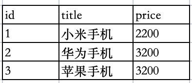
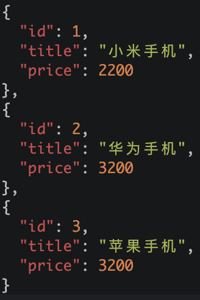

# 概念

### 什么是ElasticSearch？

一个开源的分布式搜索引擎，可以用来实现搜索、日志统计、分析、系统监控等功能。

### 什么是Elastic stack（ELK）？

是以ElasticSearch为核心的技术栈，包括beats、Logstach、Kibana、elasticSearch。

### 什么是Lucene？

是Apache的开源搜索引擎类库，提供了搜索引擎的核心API，ElasticSearch基于它来开发的。

# 正向索引和倒排索引

### 什么是文档和词条？

每一条数据就是一个文档，对文档中的内容进行分词，得到的词语就是词条。

### 什么是正向索引？

基于文档id创建索引，查询词条时需要逐条扫描，先找到文档，再判断文档内容是否包含词条。

### 什么是倒排索引？

先对文档进行分词，对词条创建索引并记录词条所在文档的位置，搜索时先根据词条查询得到文档的id，而后通过id得到文档。

# ES和Mysql

elasticSearch是面向文档存储的，可以是数据库中的一条商品数据，一个订单信息等，文档数据会被序列化成json格式后存储到elasticSearch中。

**数据库中存储**



**转换成ES中存储**



### ES和Mysql概念对比

| Mysql  | ES       | 说明                                            |
| ------ | -------- | --------------------------------------------- |
| Table  | Index    | 索引（Index），就是文档的集合，类似数据库中的表（table）             |
| Row    | Document | 文档（Document），就是一条条数据，类似数据库中的行（row），文档都是json格式 |
| Column | Field    | 字段（Field），就是json文档中的字段，类似数据库中的列（Column）       |
| Schema | Mapping  | 映射（Mapping），就是索引中文档的约束，例如字段类型约束               |
| SQL    | DSL      | DSL是ES中提供的JSON风格的请求语句，用来操作ES的，类似数据库中语句（SQL）   |

### ES和Mysql的关系

ES和Mysql并不是对立的关系，而是互补的关系。Mysql擅长事务类型操作，可以确保数据的安全和一致性，而ES擅长海量数据的搜索、分析、计算。

# 索引库操作

### 什么是索引库

和MySQL对比，索引库类比表结构。

### mapping属性

mapping是对索引库中，文档的约束，常见的mapping属性包括：

- type：字段数据类型，常见的简单类型有：
  
  - 字符串：text（可分词的文本）、keyword（精确值， 不在分词）
  
  - 数值：long、integer、short、byte、double、float
  
  - 布尔：boolean
  
  - 日期：date
  
  - 对象：object

- index：是否创建索引，默认是true，创建倒排索引

- analyzer：使用哪种分词器

- properties：该字段的子字段

## 创建索引库

通过es提供的API实现

```json
# 创建索引库
PUT /heima
{
  "mappings": {
    "properties": {
      "info": {
        "type": "text",
        "analyzer": "ik_smart"
      },
      "email": {
        "type": "keyword",
        "index": false
      },
      "name": {
        "type": "object",
        "properties": {
          "firstName": {
            "type": "keyword"
          },
          "lastName": {
            "type": "keyword"
          }
        }
      }
    }
  }
}
```

## 查看索引库

```json
# 查看索引库
GET /heima

{
  "heima" : {
    "aliases" : { },
    "mappings" : {
      "properties" : {
        "email" : {
          "type" : "keyword",
          "index" : false
        },
        "info" : {
          "type" : "text",
          "analyzer" : "ik_smart"
        },
        "name" : {
          "properties" : {
            "firstName" : {
              "type" : "keyword"
            },
            "lastName" : {
              "type" : "keyword"
            }
          }
        }
      }
    },
    "settings" : {
      "index" : {
        "routing" : {
          "allocation" : {
            "include" : {
              "_tier_preference" : "data_content"
            }
          }
        },
        "number_of_shards" : "1",
        "provided_name" : "heima",
        "creation_date" : "1709972867824",
        "number_of_replicas" : "1",
        "uuid" : "TWm8SBnERA2DqDxW1Ucslg",
        "version" : {
          "created" : "7120199"
        }
      }
    }
  }
}
```

## 删除索引库

```json
# 删除索引库
DELETE /heima

{
  "acknowledged" : true
}
```

## 修改索引库

索引库和mapping一旦创建无法修改，但可以添加新的字段类型。

```json
# 修改索引库-只能新增字段
PUT /heima/_mapping
{
  "properties": {
    "age":{
      "type":"integer"
    }
  }
}

{
  "acknowledged" : true
}
```

# 文档操作

## 添加文档

```json
# 插入文档
POST /heima/_doc/1
{
  "info": "不断努力的我们",
  "email": "895560759@qq.com",
  "name": {
    "firstName": "关",
    "lastName": "羽"
  }
}

{
  "_index" : "heima",
  "_type" : "_doc",
  "_id" : "1",
  "_version" : 4,
  "result" : "updated",
  "_shards" : {
    "total" : 2,
    "successful" : 1,
    "failed" : 0
  },
  "_seq_no" : 3,
  "_primary_term" : 1
}
```

## 删除文档

```json
# 删除文档
DELETE /heima/_doc/1
```

## 修改文档

1. 全量修改：会删除旧文档，再添加新文档，如果id不存在则会新增

```json
# 全量修改
PUT /heima/_doc/1
{
  "info": "不断努力的我们",
  "email": "gy@qq.com",
  "name": {
    "firstName": "关",
    "lastName": "羽"
  }
}

{
  "_index" : "heima",
  "_type" : "_doc",
  "_id" : "1",
  "_version" : 5,
  "result" : "updated",
  "_shards" : {
    "total" : 2,
    "successful" : 1,
    "failed" : 0
  },
  "_seq_no" : 4,
  "_primary_term" : 1
}
```

2. 局部修改，修改指定字段的值

```json
# 增量修改
POST /heima/_update/1
{
  "doc": {
   "info": "永远都要不断努力的我们" 
  }
}

{
  "_index" : "heima",
  "_type" : "_doc",
  "_id" : "1",
  "_version" : 6,
  "result" : "updated",
  "_shards" : {
    "total" : 2,
    "successful" : 1,
    "failed" : 0
  },
  "_seq_no" : 5,
  "_primary_term" : 1
}
```

## 查询文档

```json
# 查看文档
GET /heima/_doc/1
```

# ES客户端

### 什么是ES Client

是ES官方为不同语言提供的请求客户端，用来操作ES，这些客户端的本质就是用来组装DSL语句，通过http请求发送给ES。

[Elasticsearch Clients | Elastic](https://www.elastic.co/guide/en/elasticsearch/client/index.html)

### PHP使用ES Client

composer安装包：

```shell
composer require elasticsearch/elasticsearch
```

创建客户端：

```php
$client = ClientBuilder::create()
   ->setHosts(['<elasticsearch-endpoint>'])
   ->setApiKey('<api-key>')
   ->build();
```
