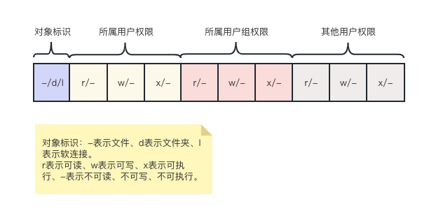

# 切换用户

**su**

su命令用于切换用户

`su [-] [用户名]`

- 选项
  
  - -：表示是否在切换用户后加载环境变量

- 参数
  
  - 用户名：表示要切换的用户，如果省略表示切换到root
  
  - exit退出，快捷键`ctrl+d`也可以退出

**sudo**

sudo命令是为普通命令授权，临时以root身份执行

`sudo 其他命令`

- 执行sudo需要为普通用户配置sudo认证

```shell
# root用户执行
visudo
# 或者
vim /etc/sudoers

# 增加sudo认证，NOPASSWD表示不需要输入密码
test    ALL=(ALL)       NOPASSWD:ALL
```

# 用户和用户组

linux系统中可以配置多个用户，多个用户组，用户也可以加入多个用户组中

**创建用户组**

`groupadd 用户组名`

```shell
groupadd test_group
```

**删除用户组**

`groupdel 用户组名`

```shell
groupdel test_group
```

**创建用户**

`useradd [-g -d] 用户名`

- 选项
  
  - -g：指定用户的组，不指定-g，会创建同名组并自动加入
  
  - -d：指定用户HOME路径，不指定默认在/home/用户名

```shell
useradd user_test
id user_test
uid=1002(user_test) gid=1002(user_test) 组=1002(user_test)

# 指定用户组
useradd -g test_group user_test1
id user_test1
uid=1003(user_test1) gid=1003(test_group) 组=1003(test_group)

# 指定HOME路径
useradd -d /home/user_test222 user_test2
id user_test2
uid=1004(user_test2) gid=1004(user_test2) 组=1004(user_test2)
ls -l /home
drwx------  2 user_test  user_test      59 6月  21 10:24 user_test
drwx------  2 user_test1 test_group     59 6月  21 10:30 user_test1
drwx------  2 user_test2 user_test2     59 6月  21 10:31 user_test222
```

**删除用户**

`useradd [-r] 用户名`

- 选项
  
  - -r：删除用户的home目录，不使用-r则会将home目录保留

```shell
# 不删除/home/test222
userdel user_test2
ls -l /home
drwx------  2 user_test  user_test      59 6月  21 10:24 user_test
drwx------  2 user_test1 test_group     59 6月  21 10:30 user_test1
drwx------  2       1004       1004     59 6月  21 10:31 user_test222
# 只有手动删除
rm -rf /home/user_test222

# 删除家目录
userdel -r user_test1
```

**查看用户所属组**

`id [用户名]`

- 参数
  
  - 用户名可以省略，表示查看自己的所属信息

**修改用户所属组**

`usermod -aG 用户组 用户名`

- 选项
  
  - -aG：固定选项

```shell
usermod -aG test_group user_test
id user_test
uid=1002(user_test) gid=1002(user_test) 组=1002(user_test),1003(test_group)
```

**查看所有用户列表**

`getent passwd`

```shell
geten
getenforce  getent
[root@localhost home]# getent passwd
root:x:0:0:root:/root:/bin/bash
bin:x:1:1:bin:/bin:/sbin/nologin
daemon:x:2:2:daemon:/sbin:/sbin/nologin
adm:x:3:4:adm:/var/adm:/sbin/nologin
lp:x:4:7:lp:/var/spool/lpd:/sbin/nologin
...
redis:x:995:991:Redis Database Server:/var/lib/redis:/sbin/nologin
user_test:x:1002:1002::/home/user_test:/bin/bash

# 分别对应
# 用户名:密码(x):用户ID:组ID:描述信息:HOME目录:执行终端(默认bash)

# 查看指定用户名是否存在
getent passwd | grep user_test
```

**查看所有用户组**

`getent group`

```shell
getent group
root:x:0:
bin:x:1:
...
docker:x:992:
redis:x:991:
user_test:x:1002:
test_group:x:1003:user_test

# 分别对应
# 组名称:组认证(x):组ID
```

# 权限

**权限说明**



- r
  
  - 针对文件时可以查看文件内容
  
  - 针对文件夹可以查看文件夹内容，如ls命令

- w
  
  - 针对文件可以修改文件
  
  - 针对文件夹，可以在文件夹内创建、删除、改名等操作

- x
  
  - 针对文件标识想文件作为程序执行
  
  - 针对文件夹表示更改工作目录到此文件夹，即cd进入

**chmod**

修改文件或文件夹的权限信息，只有文件或文件夹的所属用户或root用户可以修改

`chmod [-R] 权限 文件或文件夹`

- 选项
  
  - -R：表示递归更改子文件或子文件夹的权限

```shell
# 原生的权限控制
chmod -R u=rwx,g=rx,o=x aaa

# 根据数字控制权限，r=4，w=2，x=1
# 和上面的命令等价
chmod -R 761 aaa
```

**chown**

chown命令用于修改文件或文件夹的所属用户和所属用户组

`chown [-R] [用户][:][用户组] 文件或文件夹`

- 选项
  
  - -R：表示递归更改子文件或子文件夹的所属用户和用户组

```shell
# 只修改文件或文件夹的所属用户
chown -R user_test aaa
# 只修改文件或文件夹的所属用户组
chown -R :test_group aaa
# 修改文件或文件夹的所用用户和用户组
chown -R root:root aaa
```


