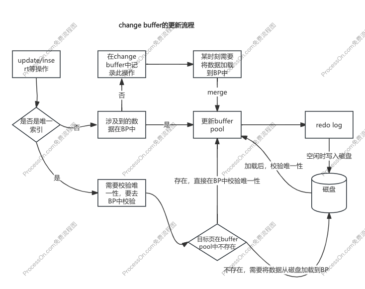

# 普通索引和唯一索引如何选择？

通过程序控制能保证字段唯一性的情况下，是选择普通索引还是唯一索引？

比如订单号能够通过程序控制保证唯一性，我们可以给订单号字段创建普通索引，也可以创建唯一索引。我们可以通过查询和更新两个维度来分析。

#### 查询角度

- 唯一索引：会搜索索引树，直到查询到第一个符合的数据，则停止搜索。
- 普通索引：会搜索索引树，直到查询到第一个符合的数据，然后再查下一条数据，如果不符合则停止搜索。

相比唯一索引，普通索引只比唯一索引多搜索一次，其实效率差不多，可以忽略不计。

#### 更新角度

写入要分两种情况：要更新的目标页在内存中/要更新的目标页不在内存中

**目标页在内存中**

- 唯一索引：如果在内存中只需要找到对应的位置，判断没有冲突，则直接插入。
- 普通索引：如果在内存中只需要找到对应的位置，直接插入。

**目标页不在内存中**

- 唯一索引：如果不在内存中需要先将磁盘数据加载到内存中，判断没有冲突，再插入。

- 普通索引：如果不在内存中，则将记录在change buffer中，就直接结束。



#### 结论

在业务允许的情况下，选择普通索引比选择唯一索引效率更高，因为普通索引比起唯一索引能够用到change buffer。

# 细说change buffer

当需要更新一个数据页时，

- 如果数据页在内存（BP）中，就直接更新就结束

- 如果数据业不在内存（BP）中，在不影响一致性的情况下，Innodb会将更新操作缓存到change buffer中就结束，这样就不需要从磁盘中读取这个数据页放入内存中。等到下次访问这个数据页时，再从磁盘中读取数据然后放入到内存中，同时和change buffer做合并操作，通过这种方式来保证数据的正确性。

#### change buffer注意点

- change buffer它是持久化数据，不仅存储到内存中，也会持久化到磁盘

- 除了访问数据会触发merge，系统后台线程也会定期merge，数据库正常关闭时也会merge。

- change buffer用的是BP中的内存，因此不能无限增大，可以通过参数`innodb_change_buffer_max_size`来设置占用BP内存的百分比。

#### 问题：

如果某次写入使用change buffer，之后主机掉电异常重启，是否会丢失change buffer的变更数据？

虽然说change buffer只会更新内存数据，但在提交事务时，会把change buffer的操作记录到redo log中，所以当重启时，会通过redo log日志进行恢复，change buffer的操作也会被恢复。

# MySql为什么会选错索引？

#### 创建实验数据

先创建一张表

```sql
-- 创建实验表t1，分别给a、b字段创建单列索引
CREATE TABLE `t1` (
  `id` int(11) NOT NULL AUTO_INCREMENT,
  `a` int(11) DEFAULT NULL,
  `b` int(11) DEFAULT NULL,
  PRIMARY KEY (`id`),
  KEY `a` (`a`),
  KEY `b` (`b`)
) ENGINE=InnoDB;
```

再写入数据

```sql
-- 定义一个存储过程
delimiter ;;
create procedure idata()
begin
  declare i int;
  set i=1;
  while(i<=100000)do
    insert into t1 values(i, i, i);
    set i=i+1;
  end while;
end;;
delimiter ;
-- 调用存储过程
call idata();
```

#### 优化器的工作逻辑

选择索引是优化器的工作，而优化器选择索引的目的是找到最优的的执行方案并用最小的代价去执行语句。

那么影响优化器的因素有哪些？

- 扫描行数

- 临时表

- 排序

**扫描行数**

在Mysql执行之前是没法精准知道满足条件的记录有多少条，而是通过统计信息来大致估算得来的。

我们可以通过`show index from table`来查看表各个索引的大致扫描行数，也叫做基数（cardinality）。

```shell
mysql> show index from t1;
+-------+------------+----------+--------------+-------------+-----------+-------------+----------+--------+------+------------+---------+---------------+
| Table | Non_unique | Key_name | Seq_in_index | Column_name | Collation | Cardinality | Sub_part | Packed | Null | Index_type | Comment | Index_comment |
+-------+------------+----------+--------------+-------------+-----------+-------------+----------+--------+------+------------+---------+---------------+
| t1    |          0 | PRIMARY  |            1 | id          | A         |       91630 |     NULL | NULL   |      | BTREE      |         |               |
| t1    |          1 | a        |            1 | a           | A         |       95115 |     NULL | NULL   | YES  | BTREE      |         |               |
| t1    |          1 | b        |            1 | b           | A         |       92735 |     NULL | NULL   | YES  | BTREE      |         |               |
+-------+------------+----------+--------------+-------------+-----------+-------------+----------+--------+------+------------+---------+---------------+
3 rows in set (0.00 sec)
```

可以看到a和b的基数只能说大致准确。

那么这个扫描行数是如何得到的？

扫描行数是通过采样统计法得到的，Innodb会默认选择N个数据页，统计这些数据页上的不同值，取得平均值后再乘这个索引的所有数据页，得到这个扫描行数。

而数据表是不断更新的，索引信息表也不会是固定不变的。所以当变更的数据行超过1/M时会自动重新做统计。

在Mysql中，有两种存储所以统计的方式，可以通过设置参数`innodb_stats_persistent`的值来选择：

- 设置为 on 的时候，表示统计信息会持久化存储。这时，默认的 N 是 20，M 是 10

- 设置为 off 的时候，表示统计信息只存储在内存中。这时，默认的 N 是 8，M 是 16。

很多情况下，因为扫描行数统计不对导致索引选择错误很多，我们可以通过重新统计索引信息来解决：

```sql
-- 重新统计索引信息
analyze table t1;
```

#### 索引选错的例子

有如下查询：

```shell
mysql> explain select * from t1 where (a between 1 and 1000) and (b between 50000 and 100000) order by b limit 10;
+----+-------------+-------+------------+-------+---------------+------+---------+------+-------+----------+------------------------------------+
| id | select_type | table | partitions | type  | possible_keys | key  | key_len | ref  | rows  | filtered | Extra                              |
+----+-------------+-------+------------+-------+---------------+------+---------+------+-------+----------+------------------------------------+
|  1 | SIMPLE      | t1    | NULL       | range | a,b           | b    | 5       | NULL | 50128 |     1.00 | Using index condition; Using where |
+----+-------------+-------+------------+-------+---------------+------+---------+------+-------+----------+------------------------------------+
```

上面的查询，分析器并没有选择a字段的只扫描1000行的索引，反而选择了b字段扫描50000行的索引。原因是这个查询用了b字段进行排序，优化器为了排序更快选择了扫描行数更多的b字段索引。

#### 如何解决索引选错的问题？

**强制使用指定索引**

在优化器选错索引的情况下，开发人员使用`force index`来强制指定使用索引。但这种方法让代码不够优雅，以后需要修改索引或者索引名称时，代码都要同步修改。

```shell
mysql> explain select * from t1 force index(a) where (a between 1 and 1000) and (b between 50000 and 100000) order by b limit 1;
+----+-------------+-------+------------+-------+---------------+------+---------+------+------+----------+----------------------------------------------------+
| id | select_type | table | partitions | type  | possible_keys | key  | key_len | ref  | rows | filtered | Extra                                              |
+----+-------------+-------+------------+-------+---------------+------+---------+------+------+----------+----------------------------------------------------+
|  1 | SIMPLE      | t1    | NULL       | range | a             | a    | 5       | NULL | 1000 |    11.11 | Using index condition; Using where; Using filesort |
+----+-------------+-------+------------+-------+---------------+------+---------+------+------+----------+----------------------------------------------------+
1 row in set, 1 warning (0.00 sec)
```

强制使用了a字段索引，扫描行数更少了，但会多一个文件排序，但依然还是使用a字段索引更快。

**修改语句引导优化器选择索引**

针对上面的查询语句，可以修改排序字段b为b,a，这样可以让优化器在选择索引时，考虑到a也需要排序进而去选择a字段索引。

```shell
mysql> explain select * from t1 where (a between 1 and 1000) and (b between 50000 and 100000) order by b,a limit 1;
+----+-------------+-------+------------+-------+---------------+------+---------+------+------+----------+----------------------------------------------------+
| id | select_type | table | partitions | type  | possible_keys | key  | key_len | ref  | rows | filtered | Extra                                              |
+----+-------------+-------+------------+-------+---------------+------+---------+------+------+----------+----------------------------------------------------+
|  1 | SIMPLE      | t1    | NULL       | range | a,b           | a    | 5       | NULL | 1000 |    50.00 | Using index condition; Using where; Using filesort |
+----+-------------+-------+------------+-------+---------------+------+---------+------+------+----------+----------------------------------------------------+
1 row in set, 1 warning (0.00 sec)
```

虽然引导了使用了a字段索引，但要考虑到调整语句是否符合业务需求。

**建新索引或删除索引**

可根据实际情况建新索引或者删除索引，让优化器选择更好的索引。

# 如何给字符串加索引？

给字段加索引，一般想到的是给整个字段建立索引。但对于字符串，特别是内容长度较长的字段加索引会导致占用的空间较大。针对字符串字段，我们可以通过添加前缀索引来节省空间。

#### 例子

创建用户表：

```sql
CREATE TABLE `user` (
  `id` int(10) unsigned NOT NULL AUTO_INCREMENT,
  `name` varchar(32) DEFAULT NULL,
  `email` varchar(64) DEFAULT NULL,
  PRIMARY KEY (`id`)
) ENGINE=InnoDB DEFAULT CHARSET=utf8mb4;
```

写入数据：

```sql
INSERT user(name, email)
VALUES
    ( '张1', 'zhang1@aaa.com' ),
    ( '张2', 'zhang2@aaa.com' ),
    ( '张3', 'zhang3@bbb.com' ),
    ( '张4', 'zhang4@bbb.com' );
```

添加不同的长度的前缀索引：

```sql
-- 整个字段内容加索引
ALTER TABLE user ADD INDEX index1(email);
-- 前5个字符内容加索引
ALTER TABLE user ADD INDEX index2(email(5));
-- 前6个字符内容加索引
ALTER TABLE user ADD INDEX index3(email(6));
```

不同索引字段的扫描行数：

```shell
# 使用index1，扫描行数为1，区分度好
mysql> EXPLAIN SELECT * FROM user force index(index1) WHERE email='zhang1@aaa.com';
+----+-------------+-------+------------+------+---------------+--------+---------+-------+------+----------+-------+
| id | select_type | table | partitions | type | possible_keys | key    | key_len | ref   | rows | filtered | Extra |
+----+-------------+-------+------------+------+---------------+--------+---------+-------+------+----------+-------+
|  1 | SIMPLE      | user  | NULL       | ref  | index1        | index1 | 259     | const |    1 |   100.00 | NULL  |
+----+-------------+-------+------------+------+---------------+--------+---------+-------+------+----------+-------+
1 row in set, 1 warning (0.00 sec)
# 使用index2，扫描行数为4，区分度差
mysql> EXPLAIN SELECT * FROM user force index(index2) WHERE email='zhang1@aaa.com';
+----+-------------+-------+------------+------+---------------+--------+---------+-------+------+----------+-------------+
| id | select_type | table | partitions | type | possible_keys | key    | key_len | ref   | rows | filtered | Extra       |
+----+-------------+-------+------------+------+---------------+--------+---------+-------+------+----------+-------------+
|  1 | SIMPLE      | user  | NULL       | ref  | index2        | index2 | 23      | const |    4 |   100.00 | Using where |
+----+-------------+-------+------------+------+---------------+--------+---------+-------+------+----------+-------------+
1 row in set, 1 warning (0.00 sec)
# 使用index3，扫描行数1，区分度好
mysql> EXPLAIN SELECT * FROM user force index(index3) WHERE email='zhang1@aaa.com';
+----+-------------+-------+------------+------+---------------+--------+---------+-------+------+----------+-------------+
| id | select_type | table | partitions | type | possible_keys | key    | key_len | ref   | rows | filtered | Extra       |
+----+-------------+-------+------------+------+---------------+--------+---------+-------+------+----------+-------------+
|  1 | SIMPLE      | user  | NULL       | ref  | index3        | index3 | 27      | const |    1 |   100.00 | Using where |
+----+-------------+-------+------------+------+---------------+--------+---------+-------+------+----------+-------------+
1 row in set, 1 warning (0.01 sec)
```

空间占用：index2优于index3，index3优于index1；

扫描行数：index1优于index3，index7优于index2；

**结论**

虽然说前缀索引能够节省空间，但是会出现扫描行数增加（查询效率降低），如何确定前缀索引的长度，让节省空间和查询效率达到一个平衡：通过区分度来确定。

```shell
mysql> SELECT
    -> count( DISTINCT LEFT ( email, 4 ) ) AS L4,
    -> count( DISTINCT LEFT ( email, 5 ) ) AS L5,
    -> count( DISTINCT LEFT ( email, 6 ) ) AS L6,
    -> count( DISTINCT LEFT ( email, 7 ) ) AS L7
    -> FROM
    -> user;
+----+----+----+----+
| L4 | L5 | L6 | L7 |
+----+----+----+----+
|  1 |  1 |  4 |  4 |
+----+----+----+----+
1 row in set (0.00 sec)
```

上面的结果：L6和L7比L4和L5的区分度高，优先选择L6和L7，而L6比L7占用空间更低，所以选择L6。

#### 前缀索引的缺点

**前缀索引不能使用覆盖索引**

因为前缀索引并不包含字段内容的全部，只要设置了前缀索引，优化器就任务索引内容不会包含字段内容的全部，即使实际的字段内容比前缀长度要短，也要回表。也就是说使用了前缀索引就不能用到覆盖索引。

#### 针对前缀区分度低的解决方案

**倒序存储**

对于字段前缀区分度不够高的字段，比如说一个市的公民身份证号，前几个数字都是一样的，直接使用前缀索引就会导致区分度不够高的问题，这种场景应该使用倒序存储，因为最后的内容区分度比较高。

但每次查询的时候应该先将字符串倒序才进行搜索：

```sql
select * from t where id_card = reverse('input_id_card_string');
```

**使用hash字段**

针对前缀区分度不够高的场景，还可以使用hash字段处理，新建一个整数字段并建立索引，在存储身份证号时，同时通过crc32()得到一个校验码存储到新的整数字段；查询时使用新字段查询和身份字段一起查询。

```sql
-- 增加hash字段，并对这个字段创建索引
alter table t add id_card_crc int unsigned, add index(id_card_crc);
-- 查询时使用hash字段以及身份证号查询，因为hash肯定是有hash冲突的
select * from t where id_card_crc=crc32('input_id_card_string') and id_card='input_id_card_string'
```

虽然说存在hash冲突，但概率是非常小的，绝大部分的扫描行数都是1。

**对比**

- 从占用空间的角度，倒序存储不需要增加额外的占用空间，而hash存储需要多一个字段

- 从CPU消耗的角度，倒序存储需要额外调用reverse函数，而hash存储需要额外调用crc32函数，只从这两个函数的复杂度来说，reverse比crc32更优

- 从查询效率的角度，使用hash字段比倒序更稳定，因为倒序依然摆脱不了长度不够导致区分度不高的问题，而hash虽然存在hash冲突，但概率很低。
