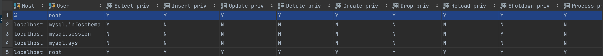

# 名词解释

**DB**

Database，即存储数据的仓库。

**DBMS**

Database Manage System，即操作和管理数据库的软件。

**SQL**

Structured Query Language，即操作关系型数据库的编程语言，定义了一套操作

关系型数据库统一标准。

**RDBMS**

Relation Database Manage System，即关系型数据库，建立在关系模型基础上，由多张相互连接的二维表组成的数据库。

**他们的关系**

- 客户端在DBMS软件上通过SQL语言操作DB。

- RDBMS比如MySQL等是遵循SQL语言标准的关系型数据库软件。

# 安装

**docker安装MySQL8.0.26**

- 拉取镜像

```shell
docker pull mysql:8.0.26

# 查看镜像是否拉取成功
docker images
REPOSITORY  TAG       IMAGE ID       CREATED         SIZE
mysql       8.0.26    9da615fced53   20 months ago   514MB
```

- 启动容器

```shell
docker run -p 3307:3306 -e MYSQL_ROOT_PASSWORD=123456 -d \
--privileged=true \
-v /Users/kx/workspace/docker/mysql8/log:/var/log/mysql \
-v /Users/kx/workspace/docker/mysql8/data:/var/lib/mysql \
-v /Users/kx/workspace/docker/mysql8/conf:/etc/mysql \
--name=mysql8 \
mysql:8.0.26

# 查看容器是否启动
docker ps
CONTAINER ID   IMAGE          COMMAND                  CREATED         STATUS         PORTS                               NAMES
177b572b16c2   mysql:8.0.26   "docker-entrypoint.s…"   4 minutes ago   Up 4 minutes   33060/tcp, 0.0.0.0:3307->3306/tcp   mysql8
```

- 进入容器

```shell
docker exec -it mysql8 env LANG=C.UTF-8 /bin/bash
```

- 进入MySQL

```shell
mysql -hlocalhost -uroot -p
Enter password:
Welcome to the MySQL monitor.  Commands end with ; or \g.
Your MySQL connection id is 9
Server version: 8.0.26 MySQL Community Server - GPL

Copyright (c) 2000, 2021, Oracle and/or its affiliates.

Oracle is a registered trademark of Oracle Corporation and/or its
affiliates. Other names may be trademarks of their respective
owners.

Type 'help;' or '\h' for help. Type '\c' to clear the current input statement.

mysql>
```

# SQL

**SQL分类**

- DDL
  
  - Data Definition Language，数据定义语言，用来定义数据库对象(数据库，表，
    
    字段)。
  
  - 常见的有：CREATE \ ALTER \ DROP \ RENAME \ TRUNCATE \ SHOW \ USE等。

- DML
  
  - Data Manipulation Language，数据库操作语言，用于数据表中数据进行增删改。
  
  - 常见的有：INSERT \ DELETE \ UPDATE。

- DQL
  
  - Data Query Language，数据库查询语言，用于数据表中数据的查询。
  
  - SELECT。

- DCL
  
  - Data Control Language，数据库控制语言，用来创建数据库用户、控制数据库的
    
    访问权限
  
  - 常见的有：COMMIT \ ROLLBACK \ SAVEPOINT \ GRANT \ REVOKE等。

**DDL**

- 数据库操作
  
  - 查询所有数据库
  
  ```sql
  mysql> show databases;
  +--------------------+
  | Database           |
  +--------------------+
  | information_schema |
  | mysql              |
  | performance_schema |
  | sys                |
  +--------------------+
  4 rows in set (0.00 sec)
  ```
  
  - 查询当前属于哪个数据库
  
  ```sql
  mysql> select database();
  +------------+
  | database() |
  +------------+
  | NULL       |
  +------------+
  1 row in set (0.00 sec)
  ```
  
  - 创建数据库
  
  ```sql
  # create database [ if not exists ] 数据库名 [ default charset 字符集 ] [ collate 排序 规则 ] ;
  mysql> create database if not exists db1 default charset utf8mb4;
  Query OK, 1 row affected (0.02 sec)
  ```
  
  - 删除数据库
  
  ```sql
  mysql> drop database db1;
  Query OK, 0 rows affected (0.03 sec)
  ```
  
  - 切换数据库
  
  ```sql
  mysql> use test1;
  Database changed
  ```

- 表操作
  
  - 查询当前数据库所有表
  
  ```sql
  mysql> show tables;
  +-----------------+
  | Tables_in_test1 |
  +-----------------+
  | tb_user         |
  +-----------------+
  1 row in set (0.00 sec)
  ```
  
  - 查看指定表结构
  
  ```sql
  # desc 表名;
  mysql> desc tb_user;
  +--------+-------------+------+-----+---------+-------+
  | Field  | Type        | Null | Key | Default | Extra |
  +--------+-------------+------+-----+---------+-------+
  | id     | int         | YES  |     | NULL    |       |
  | name   | varchar(50) | YES  |     | NULL    |       |
  | age    | int         | YES  |     | NULL    |       |
  | gender | varchar(1)  | YES  |     | NULL    |       |
  +--------+-------------+------+-----+---------+-------+
  4 rows in set (0.00 sec)
  ```
  
  - 查询指定表的建表语句
  
  ```sql
  # show create table 表名;
  mysql> show create table tb_user;
  +---------+--------------------------------------------------------------------------------------------------------------------------------------------------------------------------------------------------------------------------------------------------------------------------------------------------------------+
  | Table   | Create Table                                                                                                                                                                                                                                                                                                 |
  +---------+--------------------------------------------------------------------------------------------------------------------------------------------------------------------------------------------------------------------------------------------------------------------------------------------------------------+
  | tb_user | CREATE TABLE `tb_user` (
    `id` int DEFAULT NULL COMMENT '编号',
    `name` varchar(50) DEFAULT NULL COMMENT '姓名',
    `age` int DEFAULT NULL COMMENT '年龄',
    `gender` varchar(1) DEFAULT NULL COMMENT '性别'
  ) ENGINE=InnoDB DEFAULT CHARSET=utf8mb4 COLLATE=utf8mb4_0900_ai_ci COMMENT='用户表'            |
  +---------+--------------------------------------------------------------------------------------------------------------------------------------------------------------------------------------------------------------------------------------------------------------------------------------------------------------+
  1 row in set (0.00 sec)
  ```
  
  - 创建表结构
  
  ```sql
  mysql> create table tb_user(
      -> id int comment '编号',
      -> name varchar(50) comment '姓名',
      -> age int comment '年龄',
      -> gender varchar(1) comment '性别'
      -> ) comment '用户表';
  Query OK, 0 rows affected (0.04 sec)
  ```
  
  - 修改表结构
  
  ```sql
  # 1. 增加字段
  # ALTER TABLE 表名 ADD 字段名 类型 (长度) [ COMMENT 注释 ] [ 约束 ];
  mysql> ALTER TABLE tb_user ADD nickname varchar(20) COMMENT '昵称';
  Query OK, 0 rows affected (0.04 sec)
  Records: 0  Duplicates: 0  Warnings: 0
  # 2. 修改数据类型
  # ALTER TABLE 表名 MODIFY 字段名 新数据类型 (长度);
  mysql> ALTER TABLE tb_user MODIFY name varchar(20);
  Query OK, 0 rows affected (0.10 sec)
  Records: 0  Duplicates: 0  Warnings: 0
  # 3. 修改字段名和字段类型
  # ALTER TABLE 表名 CHANGE 旧字段名 新字段名 类型 (长度) [ COMMENT 注释 ] [ 约束 ];
  mysql>  ALTER TABLE tb_user CHANGE nickname nick_name varchar(30) COMMENT '昵称';
  Query OK, 0 rows affected (0.02 sec)
  Records: 0  Duplicates: 0  Warnings: 0
  # 4. 删除字段
  # ALTER TABLE 表名 DROP 字段名;
  mysql> ALTER TABLE tb_user DROP nick_name;
  Query OK, 0 rows affected (0.09 sec)
  Records: 0  Duplicates: 0  Warnings: 0
  # 5. 修改表名
  # ALTER TABLE 表名 RENAME TO 新表名;
  mysql> ALTER TABLE tb_user RENAME TO user;
  Query OK, 0 rows affected (0.03 sec)
  ```
  
  - 删除表
  
  ```sql
  # 1. 删除表
  # DROP TABLE [ IF EXISTS ] 表名;
  DROP TABLE IF EXISTS user;mysql> DROP TABLE IF EXISTS user;
  Query OK, 0 rows affected (0.03 sec)
  # 2. 删除并重新创建表
  # TRUNCATE TABLE 表名;
  mysql> TRUNCATE TABLE user;
  Query OK, 0 rows affected (0.06 sec)
  ```

**DML**

- 添加数据

```sql
# 1. 给指定字段添加数据
# INSERT INTO 表名 (字段名1, 字段名2, ...) VALUES (值1, 值2, ...);
mysql> INSERT INTO tb_user (id, name, age, gender) VALUES (1, 'shanla', 28, '男');
Query OK, 1 row affected (0.02 sec)
# 2. 给全部字段增加数据
# INSERT INTO 表名 VALUES (值1, 值2, ...);
# 3. 批量添加数据
# INSERT INTO [表名 (字段名1, 字段名2, ...)] VALUES (值1, 值2, ...), (值1, 值2, ...), (值 1, 值2, ...) ;
```

- 修改数据

```sql
# UPDATE 表名 SET 字段名1 = 值1 , 字段名2 = 值2 , .... [ WHERE 条件 ] ;
mysql> UPDATE tb_user SET age = 29 WHERE id = 1;
Query OK, 1 row affected (0.01 sec)
Rows matched: 1  Changed: 1  Warnings: 0
```

- 删除数据

```sql
# DELETE FROM 表名 [ WHERE 条件 ] ;
mysql> DELETE FROM tb_user WHERE id = 1;
Query OK, 1 row affected (0.00 sec)
```

**DQL**

- 基础查询

```shell
# 去除重复记录
# SELECT DISTINCT 字段列表 FROM 表名;
mysql> select distinct workaddress '工作地址' from emp;
+--------------+
| 工作地址     |
+--------------+
| 上海         |
| 北京         |
| 天津         |
| 江苏         |
| 西安         |
+--------------+
5 rows in set (0.00 sec)
```

- 查询条件

| 比较运算符               | 功能                |
| ------------------- | ----------------- |
| >                   | 大于                |
| >=                  | 大于等于              |
| <                   | 小于                |
| <=                  | 小于等于              |
| =                   | 等于                |
| !=或<>               | 不等于               |
| between ... and ... | 在某个范围之内（包含最小、最大值） |
| in                  | 存在in之后的列表中        |
| like 占位符            | 模糊匹配              |
| is null             | 是NULL             |

| 逻辑运算符    | 功能  |
| -------- | --- |
| AND 或 && | 且   |
| OR 或 \|  |     |
| NOT 或 !  | 非   |

- 聚合函数
  
  - 将一列数据作为一个整体，进行纵向计算

| 聚合函数  | 功能   |
| ----- | ---- |
| count | 统计数量 |
| max   | 最大值  |
| min   | 最小值  |
| avg   | 平均值  |
| sum   | 求和   |

```sql
# SELECT 聚合函数(字段列表) FROM 表名 ;
# 统计字段不为NULL的记录数
mysql> select count(idcard) from emp;
+---------------+
| count(idcard) |
+---------------+
|            14 |
+---------------+
1 row in set (0.00 sec)

# 统计平均年龄
mysql> select avg(age) from emp;
+----------+
| avg(age) |
+----------+
|  43.1429 |
+----------+
1 row in set (0.01 sec)

# 统计年龄之和
mysql> select sum(age) from emp where workaddress = '西安';
+----------+
| sum(age) |
+----------+
|      135 |
+----------+
1 row in set (0.00 sec)
```

- 分组查询
  
  - having是分组后的过滤条件。
  
  - 和where的区别
    
    - 执行时机不同：where是分组之前进行过滤，不满足where条件不参与分组；having是分组之后对结果进行过滤
    
    - 判断条件不同：where不能拿对聚合函数进行判断，having可以。
  
  - 执行顺讯：where > 聚合函数 > having。
  
  - 支持多字段分组。

```sql
# SELECT 字段列表 FROM 表名 [ WHERE 条件 ] GROUP BY 分组字段名 [ HAVING 分组后过滤条件 ];
# 根据性别分组并统计不同性别的数量
mysql> select gender, count(*) from emp group by gender ;
+--------+----------+
| gender | count(*) |
+--------+----------+
| 男     |        8 |
| 女     |        6 |
+--------+----------+
2 rows in set (0.00 sec)

# 根据性别分组并统计不同性别的平均年龄
mysql> select gender, avg(age) from emp group by gender ;
+--------+----------+
| gender | avg(age) |
+--------+----------+
| 男     |  50.5000 |
| 女     |  33.3333 |
+--------+----------+
2 rows in set (0.00 sec)

# 查询出年龄小于45，根据工作地分组，查询出员工数量大于等于3的工作地
mysql> select workaddress, count(*) address_count from emp where age < 45 group by workaddress having address_count >= 3;
+-------------+---------------+
| workaddress | address_count |
+-------------+---------------+
| 北京        |             5 |
+-------------+---------------+
1 row in set (0.00 sec)

# 查询出不同工作地、不同性别的数量
mysql> select workaddress, gender, count(*) '数量' from emp group by gender , workaddress;
+-------------+--------+--------+
| workaddress | gender | 数量   |
+-------------+--------+--------+
| 上海        | 男     |      2 |
| 北京        | 女     |      3 |
| 上海        | 女     |      1 |
| 北京        | 男     |      3 |
| 天津        | 女     |      1 |
| 江苏        | 男     |      2 |
| 西安        | 女     |      1 |
| 西安        | 男     |      1 |
+-------------+--------+--------+
8 rows in set (0.00 sec)
```

- 排序查询
  
  - 如果是升序, 可以不指定排序方式ASC
  
  - 如果是多字段排序，当第一个字段值相同时，才会根据第二个字段进行排序

```sql
# SELECT 字段列表 FROM 表名 ORDER BY 字段1 排序方式1 , 字段2 排序方式2 ;

# 根据入职时间, 对员工进行降序排序
mysql>  select * from emp order by entrydate desc;
+------+--------+-----------+--------+------+--------------------+-------------+------------+
| id   | workno | name      | gender | age  | idcard             | workaddress | entrydate  |
+------+--------+-----------+--------+------+--------------------+-------------+------------+
|   13 | 00013  | 张三丰    | 男     |   88 | 123656789012345678 | 江苏        | 2020-11-01 |
|   14 | 00014  | 灭绝      | 女     |   65 | 123456719012345670 | 西安        | 2019-05-01 |
|   15 | 00015  | 胡青牛    | 男     |   70 | 12345674971234567X | 西安        | 2018-04-01 |
|    8 | 00008  | 黛绮丝    | 女     |   38 | 123456157123645670 | 天津        | 2015-05-01 |
|   11 | 00011  | 张士诚    | 男     |   55 | 123567897123465670 | 江苏        | 2015-05-01 |
|   16 | 00016  | 周芷若    | 女     |   18 | 123456749712345680 | 北京        | 2012-06-01 |
|   10 | 00010  | 陈友谅    | 男     |   53 | 123456789012345670 | 上海        | 2011-01-01 |
|    9 | 00009  | 范凉凉    | 女     |   45 | 123156789012345678 | 北京        | 2010-04-01 |
|    4 | 00004  | 赵敏      | 女     |   18 | 123456757123845670 | 北京        | 2009-12-01 |
|    5 | 00005  | 小昭      | 女     |   16 | 123456769012345678 | 上海        | 2007-07-01 |
|    6 | 00006  | 杨逍      | 男     |   28 | 12345678931234567X | 北京        | 2006-01-01 |
|    3 | 00003  | 韦一笑    | 男     |   38 | 123456789712345670 | 上海        | 2005-08-01 |
|    7 | 00007  | 范瑶      | 男     |   40 | 123456789212345670 | 北京        | 2005-05-01 |
|   12 | 00012  | 常遇春    | 男     |   32 | 123446757152345670 | 北京        | 2004-02-01 |
+------+--------+-----------+--------+------+--------------------+-------------+------------+
14 rows in set (0.00 sec)
```

- 分页查询
  
  - 起始索引从0开始，起始索引 = （查询页码 - 1）* 每页显示记录数。
  
  - 如果查询的是第一页数据，起始索引可以省略，直接简写为 limit 10。

```sql
# SELECT 字段列表 FROM 表名 LIMIT 起始索引, 查询记录数 ;
# 第一页
mysql> select * from emp limit 10;
+------+--------+-----------+--------+------+--------------------+-------------+------------+
| id   | workno | name      | gender | age  | idcard             | workaddress | entrydate  |
+------+--------+-----------+--------+------+--------------------+-------------+------------+
|    3 | 00003  | 韦一笑    | 男     |   38 | 123456789712345670 | 上海        | 2005-08-01 |
|    4 | 00004  | 赵敏      | 女     |   18 | 123456757123845670 | 北京        | 2009-12-01 |
|    5 | 00005  | 小昭      | 女     |   16 | 123456769012345678 | 上海        | 2007-07-01 |
|    6 | 00006  | 杨逍      | 男     |   28 | 12345678931234567X | 北京        | 2006-01-01 |
|    7 | 00007  | 范瑶      | 男     |   40 | 123456789212345670 | 北京        | 2005-05-01 |
|    8 | 00008  | 黛绮丝    | 女     |   38 | 123456157123645670 | 天津        | 2015-05-01 |
|    9 | 00009  | 范凉凉    | 女     |   45 | 123156789012345678 | 北京        | 2010-04-01 |
|   10 | 00010  | 陈友谅    | 男     |   53 | 123456789012345670 | 上海        | 2011-01-01 |
|   11 | 00011  | 张士诚    | 男     |   55 | 123567897123465670 | 江苏        | 2015-05-01 |
|   12 | 00012  | 常遇春    | 男     |   32 | 123446757152345670 | 北京        | 2004-02-01 |
+------+--------+-----------+--------+------+--------------------+-------------+------------+
10 rows in set (0.00 sec)
# 第二页
mysql> select * from emp limit 10,10;
+------+--------+-----------+--------+------+--------------------+-------------+------------+
| id   | workno | name      | gender | age  | idcard             | workaddress | entrydate  |
+------+--------+-----------+--------+------+--------------------+-------------+------------+
|   13 | 00013  | 张三丰    | 男     |   88 | 123656789012345678 | 江苏        | 2020-11-01 |
|   14 | 00014  | 灭绝      | 女     |   65 | 123456719012345670 | 西安        | 2019-05-01 |
|   15 | 00015  | 胡青牛    | 男     |   70 | 12345674971234567X | 西安        | 2018-04-01 |
|   16 | 00016  | 周芷若    | 女     |   18 | 123456749712345680 | 北京        | 2012-06-01 |
+------+--------+-----------+--------+------+--------------------+-------------+------------+
4 rows in set (0.00 sec)
```

- 其他分类

```sql
# 查询性别为 男 ，并且年龄在 20-40 岁(含)以内的姓名为三个字的员工。
mysql> select * from emp where gender = '男' and ( age between 20 and 40 ) and name like '___';
+------+--------+-----------+--------+------+--------------------+-------------+------------+
| id   | workno | name      | gender | age  | idcard             | workaddress | entrydate  |
+------+--------+-----------+--------+------+--------------------+-------------+------------+
|    3 | 00003  | 韦一笑    | 男     |   38 | 123456789712345670 | 上海        | 2005-08-01 |
|   12 | 00012  | 常遇春    | 男     |   32 | 123446757152345670 | 北京        | 2004-02-01 |
+------+--------+-----------+--------+------+--------------------+-------------+------------+
2 rows in set (0.00 sec)
```

- 执行顺序
  
  - FROM > WHERE > GROUP BY > HAVING > SELECT > ORDER BY > LIMIT

**DCL**

- 查询用户
  
  - 即查询数据库的用户
  
  - 其中 Host代表当前用户访问的主机, 如果为localhost, 仅代表只能够在当前本机访问，是不可以远程访问的。 User代表的是访问该数据库的用户名。在MySQL中需要通过Host和User来唯一标识一个用户。

```sql
select * from mysql.user;
```



- 创建用户

```sql
# CREATE USER '用户名'@'主机名' IDENTIFIED BY '密码';
# 创建只能本机访问的用户
mysql> CREATE USER 'user1'@'localhost' IDENTIFIED BY '123';
Query OK, 0 rows affected (0.01 sec)
# 创建任意都可以访问的用户
mysql> CREATE USER 'user2'@'%' IDENTIFIED BY '123';
Query OK, 0 rows affected (0.01 sec)
```

验证用户是否创建成功

```shell
mysql -hlocalhost -uuser1 -p
Enter password:
Welcome to the MySQL monitor.  Commands end with ; or \g.
Your MySQL connection id is 26
Server version: 8.0.26 MySQL Community Server - GPL

Copyright (c) 2000, 2021, Oracle and/or its affiliates.

Oracle is a registered trademark of Oracle Corporation and/or its
affiliates. Other names may be trademarks of their respective
owners.

Type 'help;' or '\h' for help. Type '\c' to clear the current input statement.

mysql>show databases;
# 没有任何数据库
+--------------------+
| Database           |
+--------------------+
| information_schema |
+--------------------+
1 row in set (0.00 sec)
```

- 修改用户密码

```sql
# ALTER USER '用户名'@'主机名' IDENTIFIED WITH mysql_native_password BY '新密码' ;
mysql> ALTER USER 'user1'@'localhost' IDENTIFIED WITH mysql_native_password BY '123456';
Query OK, 0 rows affected (0.02 sec)
```

- 删除用户

```sql
# DROP USER '用户名'@'主机名' ;
mysql> DROP USER 'user1'@'localhost';
Query OK, 0 rows affected (0.02 sec)
```

- 查询权限【[更多权限]([MySQL :: MySQL 8.0 Reference Manual :: 6.2.2 Privileges Provided by MySQL](https://dev.mysql.com/doc/refman/8.0/en/privileges-provided.html))】

| 权限                  | 说明         |
| ------------------- | ---------- |
| ALL, ALL PRIVILEGES | 所有权限       |
| SELECT              | 查询数据       |
| INSERT              | 插入数据       |
| UPDATE              | 修改数据       |
| DELETE              | 删除数据       |
| ALTER               | 修改表        |
| DROP                | 删除数据库/表/视图 |
| CREATE              | 创建数据库/表    |

```sql
# SHOW GRANTS FOR '用户名'@'主机名' ;
mysql> SHOW GRANTS FOR 'user2'@'%';
+-----------------------------------+
| Grants for user2@%                |
+-----------------------------------+
| GRANT USAGE ON *.* TO `user2`@`%` |
+-----------------------------------+
```

- 授予权限
  
  - 多个权限之间，使用逗号分隔。
  
  - 授权时， 数据库名和表名可以使用 * 进行通配，代表所有。

```sql
# GRANT 权限列表 ON 数据库名.表名 TO '用户名'@'主机名';
mysql> GRANT ALL ON test1.* TO 'user2'@'%';
Query OK, 0 rows affected (0.00 sec)

mysql> SHOW GRANTS FOR 'user2'@'%';
+--------------------------------------------------+
| Grants for user2@%                               |
+--------------------------------------------------+
| GRANT USAGE ON *.* TO `user2`@`%`                |
| GRANT ALL PRIVILEGES ON `test1`.* TO `user2`@`%` |
+--------------------------------------------------+
2 rows in set (0.00 sec)
```

- 撤销权限

```sql
# REVOKE 权限列表 ON 数据库名.表名 FROM '用户名'@'主机名';
mysql> REVOKE ALL ON test1.* FROM 'user2'@'%';
Query OK, 0 rows affected (0.02 sec)

mysql> SHOW GRANTS FOR 'user2'@'%';
+-----------------------------------+
| Grants for user2@%                |
+-----------------------------------+
| GRANT USAGE ON *.* TO `user2`@`%` |
+-----------------------------------+
1 row in set (0.00 sec)
```

**数值类型**

| 类型          | 大小     | 有符号范围                                                 | 无符号范围                                                    | 描述          |
| ----------- | ------ | ----------------------------------------------------- | -------------------------------------------------------- | ----------- |
| TINYINT     | 1byte  | (-128，127)                                            | (0，255)                                                  | 小整数值        |
| SMALLINT    | 2bytes | (-32768，32767)                                        | (0，65535)                                                | 大整数值        |
| MEDIUMINT   | 3bytes | (-8388608，8388607)                                    | (0，16777215)                                             | 大整数值        |
| INT/INTEGER | 4bytes | (-2147483648， 2147483647)                             | (0，4294967295)                                           | 大整数值        |
| BIGINT      | 8bytes | (-2^63，2^63-1)                                        | (0，2^64-1)                                               | 极大整数值       |
| FLOAT       | 4bytes | (-3.402823466 E+38， 3.402823466351 E+38)              | 0 和 (1.175494351 E- 38，3.402823466 E+38)                 | 单精度浮点数值     |
| DOUBLE      | 8bytes | (-1.7976931348623157 E+308， 1.7976931348623157 E+308) | 0 和 (2.2250738585072014 E-308， 1.7976931348623157 E+308) | 双精度浮点数值     |
| DECIMAL     |        | 依赖于M(精度)和D(标度) 的值                                     | 依赖于M(精度)和D(标度)的 值                                        | 小数值(精 确定点数) |

**字符串类型**

| 类型         | 大小                 | 描述              |
| ---------- | ------------------ | --------------- |
| CHAR       | 0-255 bytes        | 定长字符串(需要指定长度)   |
| VARCHAR    | 0-65535 bytes      | 变长字符串(需要指定长度)   |
| TINYBLOB   | 0-255 bytes        | 不超过255个字符的二进制数据 |
| TINYTEXT   | 0-255 bytes        | 短文本字符串          |
| BLOB       | 0-65535 bytes      | 二进制形式的长文本数据     |
| TEXT       | 0-65535 bytes      | 长文本数据           |
| MEDIUMBLOB | 0-16777215 bytes   | 二进制形式的中等长度文本数据  |
| MEDIUMTEXT | 0-16777215 bytes   | 中等长度文本数据        |
| LONGBLOB   | 0-4294967295 bytes | 二进制形式的极大文本数据    |
| LONGTEXT   | 0-4294967295 bytes | 极大文本数据          |

char 和 varchar都可以描述字符串，char是定长字符串，指定长度多长就占用多少个字符，和字段值长度无关。varchar是变长字符串，指定的长度为最大占用长度，根据实际的值来判断占用的长度。char比varchar性能更高，因为不用再根据实际长度再进行扩容。

**日期时间类型**

| 类型                  | 大小         | 范围                                        | 格式                  | 描述       |
| ------------------- | ---------- | ----------------------------------------- | ------------------- | -------- |
| DATE                | 3          | 1000-01-01 至 9999-12-31                   | YYYY-MM-DD          | 日期值      |
| TIME                | 3          | -838:59:59 至 838:59:59                    | HH:MM:SS            | 时间值或持续时间 |
| YEAR                | 1          | 1901 至 2155                               | YYYY                | 年份值      |
| DATETIME            | 8          | 1000-01-01 00:00:00 至 9999-12-31 23:59:59 | YYYY-MM-DD HH:MM:SS | 混合日期和时间值 |
| TIMESTAMP           | 4          | 1970-01-01 00:00:01 至                     |                     |          |
| 2038-01-19 03:14:07 | YYYY-MM-DD |                                           |                     |          |
| HH:MM:SS            | 混合日期和时     |                                           |                     |          |
| 间值，时间戳              |            |                                           |                     |          |
