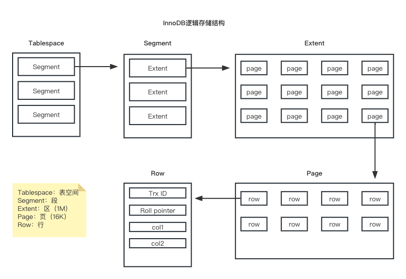

# 详解逻辑存储结构



**表空间**

表空间是逻辑存储结构的最高层，如果用户启用了`innodb_file_per_table`（8.0之后自动开启），则每张表都会有一个表空间文件（.idb)，一个MySQL实例对应多个表空间，用于存储记录、索引等数据。

**段**

段又分为数据段、索引段、回滚段，数据段就是B+Tree的叶子节点，索引段就是B+Tree的非叶子节点，回滚段用于回滚操作。

**区**

每个区大小为1M，默认情况下，InnoDB存储引擎大小为16K，即一个区中一共有64个连续的页。

**页**

页是InnoDB引擎最小的单元，每个页的大小默认为16K，为了保证页的连续性，InnoDB存储引擎每次从磁盘申请4-5个区。

**行**

也就是每一行的记录，在行中，至少有2个隐藏字段，第一个是Trx_id记录最近的事务id，第二个是Roll_pointer回滚指针，指向undo日志中这行最近的操作。通过他可以找到该记录修改前的信息，第三个是Db_row_id，是自生成的主键（在没有主键时才会生成）。

# 架构

InnoDB架构由内存部分、磁盘部分以及很多后台线程组成。


**内存部分**

- Buffer Pool
  
  - InnoDB基于磁盘文件存储，访问物理硬盘和访问内存速度相差很大，为了尽可能弥补这两者之间的IO效率的差值，将经常使用的数据加载到缓冲池中，避免每次访问都访问磁盘。
  
  - 在InnoDB的缓冲池中不仅缓存了索引页和数据页，还包含了undo页、插入缓存、自适应哈希索引以及InnoDB的锁信息等。
  
  - 缓冲池里面缓存磁盘上经常操作的真实数据，进行增删改操作时，先操作缓冲池中的数据，然后再以一定频率刷新到磁盘，从而减少磁盘IO，加快处理速度。
  
  - 缓冲池以page页为单位，根据状态将page分为3个类型
    
    - free page：空间page，未被使用。
    
    - clean page：被使用page，数据没有被修改过
    
    - dirty page：脏页，被使用page，数据被修改过，和磁盘中数据不一致
  
  - 在专用数据库服务器中，通常将多达80%的内存分配给缓冲池
  
  ```sql
  # 查看buffer pool分配的内存大小
  mysql> show variables like 'innodb_buffer_pool_size';
  +-------------------------+-----------+
  | Variable_name           | Value     |
  +-------------------------+-----------+
  | innodb_buffer_pool_size | 134217728 |
  +-------------------------+-----------+
  ```

- Change Buffer
  
  - 更改缓冲区，针对非唯一二级索引页，在执行DML语句时，这些数据page没在buffer pool中，不会直接操作磁盘，而会将数据变更存在更改缓冲区中，在以后数据被读取时，再将数据合并恢复到buffer pool中，再将合并后的数据刷新到磁盘中。

- Adaptive Hash Index
  
  - 自适应哈希索引，用于优化对Buffer pool数据的查询。InnoDB引擎没有直接支持哈希索引，但提供了一个自适应hash索引的功能，当使用索引字段等值匹配时，InnoDB会使用自适应哈希索引，效率比B+Tree要高很多。

- Log Buffer
  
  - 日志缓冲区，用来保存要写入磁盘中的log日志数据（redo log、undo log）。
  
  - 日志缓冲区会定期将数据刷新到磁盘，通过参数`innodb_flush_log_at_trx_commit`设置刷新机制。
  
  ```sql
  # 设置项有 1 0 2
  # 1 --- 日志每次事务提交时写入并刷新到磁盘，默认
  # 0 --- 每秒将日志写入并刷新到磁盘
  # 2 --- 日志每次在事务提交之后写入，并没病刷新到磁盘一次
  mysql> show variables like 'innodb_flush_log_at_trx_commit';
  +--------------------------------+-------+
  | Variable_name                  | Value |
  +--------------------------------+-------+
  | innodb_flush_log_at_trx_commit | 1     |
  +--------------------------------+-------+
  ```
  
  - 日志缓冲区大小默认是16M，通过参数`innodb_flush_log_at_trx_commit`设置大小。
  
  ```sql
  mysql> show variables like 'innodb_log_buffer_size';
  +------------------------+----------+
  | Variable_name          | Value    |
  +------------------------+----------+
  | innodb_log_buffer_size | 16777216 |
  +------------------------+----------+
  ```

**磁盘部分**

- System Tablespace
  
  - 系统表空间，是change buffer的存储区域

- File-Per-Table Tablespace
  
  - 单表单文件表空间，也就是通过`innodb_file_per_table`来设置的。

- General Tablespace
  
  - 通用表空间，可以通过创建通用表空间且在创建表时指定使用该表空间。
  
  ```sql
  # 创建表空间
  mysql> create tablespace ts_ge1 add datafile 'ge1.ibd' engine = innodb;
  Query OK, 0 rows affected (0.25 sec)
  # 创建表使用表空间
  mysql> create table a(id int primary key auto_increment, name varchar(10)) engine=innodb tablespace ts_ge1;
  Query OK, 0 rows affected (0.13 sec)
  ```

- Undo Tablespace
  
  - 撤销表空间，MySQL在初始化时会自动创建两个默认的undo表空间（初始大小16M），用于存储undo log日志

- Temporary Tablespace
  
  - InnoDB 使用会话临时表空间和全局临时表空间。存储用户创建的临时表等数据。

- Doublewrite Buffer Files
  
  - 双写缓冲区文件，InnoDB引擎将数据从buffer pool刷新到磁盘前，先将数据页写入双写缓冲区文件中，便于系统异常时恢复数据。

- Redo Log
  
  - 重做日志，用来实现事务的持久性、
  
  - 该日志文件由两部分组成：重做日志缓冲（redo log
    
    buffer）以及重做日志文件（redo log）,前者是在内存中，后者在磁盘中。当事务提交之后会把所有修改信息都会存到该日志中, 用于在刷新脏页到磁盘时,发生错误时, 进行数据恢复使用。

**后台线程**

- Master Thread
  
  - 核心后台线程
  
  - 负责调度其他线程
  
  - 还负责将缓冲池中的数据异步刷新到磁盘中，还包括脏页的刷新、合并插入缓存、undo页的回收。

- IO Thread
  
  - 使用大量的AIO（异步IO）处理IO请求
  
  - IO Thread分类
    
    - Read Thread：负责读操作
    
    - Write Thread：负责写操作
    
    - Log Thread：负责将日志缓冲区刷新到磁盘
    
    - Insert buffer thread：负责将写缓存区内容刷新到磁盘

- Purge Thread
  
  - 回收事务已经提交了的undo log，在事务提交之后，undo log不用了就要回收再利用。

- Page Cleaner Thread
  
  - 协助Master Thread刷新脏页到磁盘的线程，它可以减轻Master Thread的工作压力，减少阻塞。

# 事务原理

事务是一组操作的集合，要么同时成功要么同时失败，满足ACID四大特性。

其他的原子性、一致性、持久化是通过redo log和undo log日志来保证，持久化还通过数据库锁和MVCC来保证。

**redo log**

重做日志，通过记录事务提交时数据页的物理修改来实现事务的持久性，重做日志包含两部分，一个在内存中叫重做日志缓冲（redo log buffer），一个在磁盘中叫重做日志文件（redo log file）。

- 解决了什么问题
  
  - 问题：在事务中对数据增删改时会先操作buffer pool中的数据并形成脏页，脏页在一定的时机刷新到磁盘，但如果这个刷新过程失败了，那么磁盘数据就会出现问题，而此时事务也提交了，就导致数据没有持久化到磁盘。
  
  - 引入redo log：在事务中对数据增删改时，先将操作的数据页变化记录到redo log buffer里，在提交事务时，将redo log buffer的数据刷新到redo log file中，过一段时间，如果buffer pool刷新磁盘失败，此时就可以借用redo log进行数据恢复，这样就保证了事务的持久性。

- 什么不直接讲buffer pool中的脏页数据每次提交事务时刷新到磁盘
  
  - 因为在业务操作中，我们操作数据一般都是随机读写磁盘的，而不是顺序读写磁盘。 而redo log在往磁盘文件中写入数据，由于是日志文件，所以都是顺序写的。顺序写的效率，要远大于随机写。 这种先写日志的方式，称之为 WAL（Write-Ahead Logging）。

**undo log**

回滚日志，用于记录数据被修改前的信息，用来保证事务的原子性和MVCC（多版本并发控制）。

- 回滚日志中记录的是逻辑日志，比如说事务中执行了`update table set name = '新数据' where id = 1`，那么在回滚日志中记录的是`update table set name = '原数据' where id = 1`，这样就可以在事务发生错误时能够正确回滚到之前的数据。

- undo log在事务提交之后可能并不会立马删除，因为undo log还要用于MVCC。
  
  - 在insert事务提交之后会立马删除。
  
  - 在update、delete的时候，产生的undo log日志不仅在回滚时需要，在快照读时也需要，所以不会立即删除。

**MVCC**

全称 Multi-Version Concurrency Control，多版本并发控制。指维护一个数据的多个版本，

使得读写操作没有冲突，快照读为MySQL实现MVCC提供了一个非阻塞读功能。MVCC的具体实现，还需要依赖于数据库记录中的三个隐式字段、undo log日志、readView。

- 当前读
  
  - 读取到记录的最新版本，读取时还要保证其他并发事务不能修改当前记录，读取时需要对记录加锁，`select .. lock in share mode`、`select ... for update`、`insert`、`update`、`delete`都是一种当前读。

- 快照读
  
  - 普通的`select ...`不会加锁，是非阻塞的
    
    - RC隔离级别：每次select都会生成一个快照。
    
    - RR隔离级别：开启事务的第一个select语句生成快照。
    
    - S串行化：select会变成当前读。

- readview
  
  - Readview是快照读遵守的规则
  
  - 在RC隔离级别下，事务中的每次快照读都会去读最近一次提交并快照
  
  - 在RR隔离级别下，事务中的每次读都是读第一次快照的数据。

**总结**

- 原子性 - undo log

- 持久性 - redo log

- 一致性 - undo log + redo log

- 隔离性 - 锁 + MVCC
