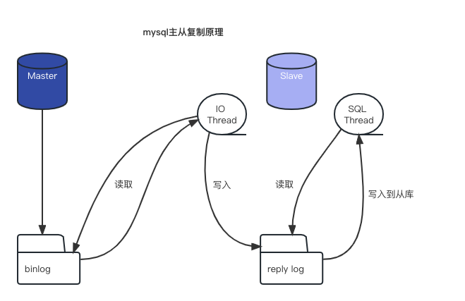

# 主从复制主要是做什么

- 主库出现问题，可以快速切换到从库提供服务

- 实现读写分离，降低主库的访问压力

- 从库备份，避免备份期间影响主库

# 原理



- 主库在事务提交时将数据变更记录记录到binlog日志中。

- 从库的IO Thread线程读取主库的binlog生成reply log。

- 从库的SQL Thread线程读取reply log将改变同步到从库。

# 主从搭建

**准备**

一主一从，因为现在已经用docker启动了一台mysql，现在只需要再启动一台作为从机。

```shell
docker run -p 3308:3306 -e MYSQL_ROOT_PASSWORD=123456 -d \
--privileged=true \
-v /Users/kx/workspace/docker/mysql8_slave1/log:/var/log/mysql \
-v /Users/kx/workspace/docker/mysql8_slave1/data:/var/lib/mysql \
-v /Users/kx/workspace/docker/mysql8_slave1/conf:/etc/mysql/conf.d \
--name=mysql8_slave1 \
mysql:8.0.26
```

**配置主机配置**

```roboconf
# mysql服务ID
server_id = 1
# 是否只读 1-只读 0-读写
read_only = 0
# 指定不需要同步的数据库
binlog-ignore-db = mysql
# 设置使用binlog的格式
binlog_format = mixed
# 跳过主从复制中遇到的所有错误或指定类型的错误，避免slave端复制中断。
# 如：1062错误是指一些主键重复，1032错误是因为主从数据库数据不一致
slave_skip_errors=1062
```

**重启主机**

```shell
docker restart mysql8
mysql8

docker ps
CONTAINER ID   IMAGE          COMMAND                  CREATED      STATUS        PORTS                               NAMES
d28f2bd07e1a   mysql:8.0.26   "docker-entrypoint.s…"   3 days ago   Up 1 second   33060/tcp, 0.0.0.0:3307->3306/tcp   mysql8
```

**创建从机连接主机的账号并授予主从复制权限**

```sql
# 创建链接主机的从机账号
mysql> create user 'slave1'@'%' identified with mysql_native_password by 'slave1@123456';
Query OK, 0 rows affected (0.04 sec)
# 为账号分配主从复制的权限
mysql> grant replication slave on *.* to 'slave1'@'%';
Query OK, 0 rows affected (0.01 sec)
```

**查看主机状态**

- file是从哪个日志开始推送日志文件

- position是从哪个位置开始推送日志

- binlog_ignore_db是不需要同步的数据库

```sql
mysql> show master status;
+---------------+----------+--------------+------------------+-------------------+
| File          | Position | Binlog_Do_DB | Binlog_Ignore_DB | Executed_Gtid_Set |
+---------------+----------+--------------+------------------+-------------------+
| binlog.000013 |      663 |              | mysql            |                   |
+---------------+----------+--------------+------------------+-------------------+
```

**配置从机**

```roboconf
[mysqld]
# mysql 服务ID
server_id = 2
# 是否只读
read_only = 1
```

**重启从机**

```shell
docker restart mysql8_slave1
mysql8_slave1

docker ps
CONTAINER ID   IMAGE          COMMAND                  CREATED         STATUS          PORTS                               NAMES
0a2eb9106d05   mysql:8.0.26   "docker-entrypoint.s…"   4 minutes ago   Up 1 second     33060/tcp, 0.0.0.0:3308->3306/tcp   mysql8_slave1
d28f2bd07e1a   mysql:8.0.26   "docker-entrypoint.s…"   3 days ago      Up 13 minutes   33060/tcp, 0.0.0.0:3307->3306/tcp   mysql8
```

**给从机配置主库配置**

```sql
# 8.0.23之前使用，但之后也兼容这样的命令
mysql> change master to master_host='192.168.6.14', master_port=3307, master_user='slave1', master_password='slave1@123456', master_log_file='binlog.000013', master_log_pos=663, master_connect_retry=30;
Query OK, 0 rows affected, 9 warnings (0.11 sec)
# 8.0.23以及之后，使用新的命令，主要是为了规避Master和slave这样的词语
mysql> change replication to source_host='192.168.6.14', source_port=3307, source_user='slave1', source_password='slave1@123456', source_log_file='binlog.000013', source_log_pos=663, source_connect_retry=30;
Query OK, 0 rows affected, 9 warnings (0.11 sec)
```

| 8.0.23之前的参数          | 8.0.23以及之后的参数        | 含义               |
| -------------------- | -------------------- | ---------------- |
| master_host          | source_host          | 主机IP地址           |
| master_user          | source_user          | 连接主库的用户名         |
| master_port          | source_port          | 主库的端口            |
| master_password      | source_password      | 连接主库的密码          |
| master_log_file      | source_log_file      | binlog日志文件名      |
| master_log_pos       | source_log_pos       | binlog日志文件位置     |
| master_connect_retry | source_connect_retry | 连接失败重试的时间间隔，单位为秒 |

**开启同步**

```sql
mysql> start slave;
Query OK, 0 rows affected, 1 warning (0.01 sec)
# 或
mysql> start replica;
Query OK, 0 rows affected, 1 warning (0.01 sec)
```

**查看同步状态**

```sql
mysql> show slave status\G;

# 或
mysql> show replica status\G;
```

**如何重新配置从机**

```sql
mysql> stop slave;
Query OK, 0 rows affected, 1 warning (0.01 sec)

mysql> reset slave;
Query OK, 0 rows affected, 1 warning (0.06 sec)
```

**测试**

在主库中创建、修改表看从机是否同步

# 思考

如何搭建主从，能将主库原有数据同步到从库。
