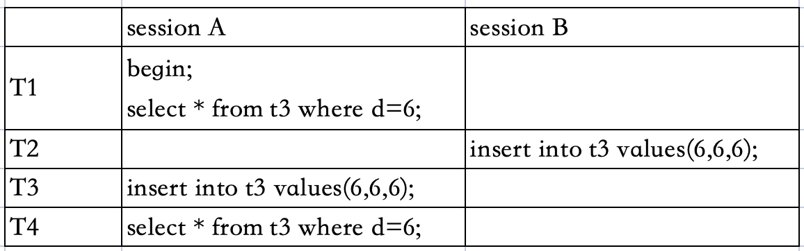
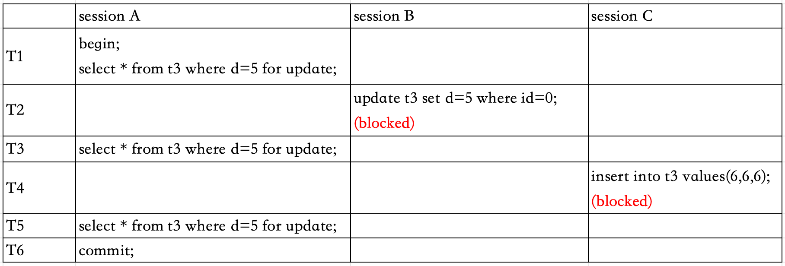

# Mysql为什么有些瞬间很慢？

#### 还原实际场景

平时一条SQL查询都很快，但某一个瞬间查询非常慢，但这样的场景很难复现，它不只随机，而且持续时间很短。

#### 剖析原因

**先从Innodb更新的过程说起**

Innodb在处理更新操作时，只会写redo log和更新内存，然后就返回成功了。


此时就会存在内存数据页和磁盘的数据不一致，这样的内存数据页称之为**脏页**。反之内存数据页中的数据和磁盘中的数据一致叫**干净页**

将内存中不同的数据同步到磁盘的过程，叫**刷脏页**，称之为**flush**。


如上流程图，flush的过程就是将内存中的redo log日志的清掉（给其他写入腾出空间），并将最新的数据同步给磁盘。

**触发flush的场景**

- 当redo log被写满了之后，此时会停止所有更新，触发flush。

- 当系统内存不足时，需要新的内存数据页，此时要淘汰一些数据页（有淘汰策略），腾出来的内存供别的数据页使用，如果淘汰的是脏页，此时就要出发flush。

- 当系统空闲时，Mysql会见缝插针地刷一点脏页。

- 当Mysql正常关闭时，会将内存中的脏页全部写入磁盘。

**分析flush对性能的影响**

第三和第四种场景，不会有什么性能问题。

第一种：redo log写满了，要刷脏页。这种情况是不能被业务接受的，因为所有的更新操作都要停摆，从监控来看：更新数跌为0。

第二种：内存不够用，需要先将脏页写到磁盘；这种场景是**常态**。

内存数据页的三种状态：

- 未被使用；

- 使用了并是干净页；

- 使用了并是脏页；

当要读入数据页不在内存中，就必须向缓冲池申请一个数据页，这时候就需要淘汰一些数据页（淘汰哪些数据页由淘汰策略决定）。如果淘汰的是干净页，则直接释放就好（因为内存和磁盘是一样的，不需要同步磁盘）；如果淘汰的是脏页，则需要先将脏页数据写入磁盘，变成干净页才能释放。

所以两种情况刷脏页会明显影响性能：

1、一个查询要淘汰的脏页太多，导致刷脏页的时间变长；

2、redo log写满，会导致更新停摆；

#### 刷脏页的策略

知道了刷脏页有可能会影响效率，所以控制刷脏页的策略能有效避免这些情况。

**让Innodb全力刷脏页**

Mysql通过`innodb_io_capacity`参数来告诉Innodb系统的磁盘能力，对于专用的数据库服务器建议设置为磁盘的IOPS。下面命令是测试磁盘的IOPS：

```shell
 fio -filename=$filename -direct=1 -iodepth 1 -thread -rw=randrw -ioengine=psync -bs=16k -size=500M -numjobs=10 -runtime=10 -group_reporting -name=mytest 
```

实际场景中，因为设置这个参数较小，会出现这种现象：系统没有任何瓶颈，但Mysql却很慢，就是因为设置这个参数较小，Innodb认为系统的磁盘IO能力这么差，就会将刷脏页的速度变小，因此导致Mysql查询更新效率降低。

**控制刷脏页的速率**

如果不使用了专用的数据库服务器，要兼顾其他服务对磁盘的消耗，所以应该制定一个策略：

Innodb刷脏页速度要考虑两个因素：一是脏页比例；二是redo log的写入速度。

两个因素分别可以算出一个百分比R，Innodb刷脏页的速率就按照`innodb_io_capacity`的R%来刷脏页。

要避免这种情况，要合理设置`innodb_io_capacity`的值，并且要多关注脏页比例，不要让他经常接近75%。以下是计算脏页比例的方法：

```sql
select VARIABLE_VALUE into @a from global_status where VARIABLE_NAME = 'Innodb_buffer_pool_pages_dirty';
select VARIABLE_VALUE into @b from global_status where VARIABLE_NAME = 'Innodb_buffer_pool_pages_total';
select @a/@b;
```

#### 刷脏页的其他情况

一旦一个查询需要刷脏页时，就会比平时查询要慢。另外Mysql有另一种机制，如果刷的脏页的旁边的数据页也是脏页，也会“连坐”一起刷掉，依次循环，这样会更慢。这个机制通过`innodb_flush_neighbors`参数来控制，为0不需要“连坐”，为1需要“连坐”。

如果使用专用的数据库服务器，一般都将`innodb_flush_neighbors`设置为0。另外在mysql8.0之后已经将`innodb_flush_neighbors`默认为0了。

# 为什么Delete表记录，表文件却没有变小？

在日常业务中，我们删除了表中的一大半记录，但表文件大小却没有变化，这是什么原因呢？

#### 讨论原因

从delete流程说起：


上图是Innodb索引数据页存储，当delete 400这条记录时，并不会将400这个位置删除，而是标记为可复用。当以后插入数据为300-700的数据时，可以继续复用400这个位置。如果这个数据页都被删除，那么整个数据页都可以被复用而且不受ID的限制。

这就是为什么delete删除记录，表文件大小为什么没有变化的原因。

其实除了delete会造成空洞，随机插入数据也造成空洞，因为随机插入会造成页分裂，导致中间的空洞。

#### 如何回收表空间

对于出现大量空洞的表，只能通过重建表来回收表空间。

重建表的逻辑是新建一个临时表B，将表A的数据取出来依次插入临时表B，这样就紧凑的不会有数据空洞。

重建表：（Mysql5.5版本及之前版本）

```sql
alter table A engine=InnoDB;
-- copy的形式，生成一个临时表进行copy
alter table t engine=innodb,ALGORITHM=copy;
```

上面的DDL语句需要在执行过程中需要获取MDL写锁，会阻塞新的更新操作，因此这种方法不是Online。

Online重建表：（Mysql5.6开始才支持）

```sql
alter table A engine=InnoDB;
-- inplace形式，在Innodb内部重建
alter table t engine=innodb,ALGORITHM=inplace;
```

Online DDL的流程：

1、建立一个临时文件，扫描表A的所有数据页；

2、用数据页中表A的记录生成B+Tree树存放到临时文件；

3、在生成临时文件的过程中，如果有新的更新语句写到一个日志文件中（row log）；

4、临时文件生成之后，将变更的row log运用到临时文件；

5、用临时文件替换表A的数据文件；

Online DDL因为记录了变更的日志文件（row log），所以此时的MDL写锁退化成读锁，这样就不用阻塞增删改查。那为什么不直接解锁（读锁都不要），是因为防止其他DDL语句。

虽然说Online DDL是Online的，但对于很大的表来说，这个操作是很消耗IO和CPU资源，所以Online DDL不要在线上执行大表的重建。

# count的问题

在日常开发中，我们经常会遇到统计大表总数的场景，但随着表越来越大，`count(*)`会越来越慢了。

#### count(*)的实现方式

不同的存储引擎实现方式不一样：

- MyISAM引擎是将一个表的总行数记录下来并存储到磁盘中的，`count(*)`的时候直接返回这个值就好了，效率很高；但要注意的是带where条件就慢了，也需要扫描行数累加。

- Innodb引擎是将数据一行一行的从引擎中读出来，然后累计计数，效率很低；

#### 为什么Innodb引擎不存储一个总数

因为Innodb要支持MVCC多版本并发控制，在不同的session中需要返回自己可见的行数，所以Innodb不能记录一个总数。

比如下面的场景：


- session A先启动一个事务，在RR下，始终读取到的都是1000；

- session B在session C后启动一个事务，开启事务时是1001，然后又insert了一条数据，所以统计到的数据是1002；

- session C统计数量时已经session C已经insert一条记录，但session B事务还没提交，所以session C统计的数量是1001；

#### 大表count(*)如何优化

**1.不带where条件的count**

可以通过计数的方式来解决，当新增一条记录时+1，当删除一条记录时-1。

首先想到的是通过redis来计数，当新增一条记录时+1，当删除一条记录时-1，如果缓存丢失了，可以再次进行count进行设置，但是会存在redis中的计数和实际查询出来的记录不一致的问题：


如上图的场景，当插入数据库和redis累加的中间时刻存在读取数据，就会导致redis中的总数和实际数据库中的数据不一致的问题。

再想到是通过数据库来计数，按照redis的思路依然是存在前后不一致的问题，但是可以通过事务的方式来解决：


如上图场景，session B在查询时开启事务，session A还没有提交时，session B是不会读到对应的变更，用这样来保持一致，但这种方案会影响性能。

**2.带where条件的count**

尽量where条件使用索引。

#### 讨论一下不同count的效率

日常开发中，我们常见的count有这几种：`count(*)`、`count(1)`、`count(字段)`、`count(主键)`。

这几种不同的count方式有什么不同？

- `count(主键)`：InnoDB 引擎会遍历整张表，把每一行的 id 值都取出来，返回给 server 层。server 层拿到 id 后，判断是不可能为空的，就按行累加。

- `count(1)`：InnoDB 引擎遍历整张表，但不取值。server 层对于返回的每一行，放一个数字“1”进去，判断是不可能为空的，按行累加。单看这两个用法的差别的话`count(1)` 执行得要比`count(主键 )` 快。因为从引擎返回 id 会涉及到解析数据行，以及拷贝字段值的操作。

- `count(字段)`：分两种情况：
  
  - 如果这个“字段”是定义为 not null 的话，一行行地从记录里面读出这个字段，判断不能为 null，按行累加；
  
  - 如果这个“字段”定义允许为 null，那么执行的时候，判断到有可能是 null，还要把值取出来再判断一下，不是 null 才累加。

- `count(*)`：并不会把全部字段取出来，而是专门做了优化，不取值。count(*) 肯定不是 null，按行累加。

所以效率对比：`count(字段)` < `count(主键)` < `count(1)` = `count(*)`

# Order By是如何工作的？

日常开发中，经常会写对结果集进行排序的场景：

```sql
select name, city from user where city = '杭州' order by name limit 1000;
```

表结构为：

```sql
CREATE TABLE `t` (
  `id` int(11) NOT NULL,
  `city` varchar(16) NOT NULL,
  `name` varchar(16) NOT NULL,
  `age` int(11) NOT NULL,
  `addr` varchar(128) DEFAULT NULL,
  PRIMARY KEY (`id`),
  KEY `city` (`city`)
) ENGINE=InnoDB;
```

因为city字段有索引，会根据city索引将符合的数据一条一条取出来，并放入sort_buffer中（这个sort_buffer是Mysql给每个查询线程分配的专门用来排序的内存），在内存中进行排序后取出前1000条返回。

如果sort_buffer的大小不能装下查询出来的结果集，此时就需要使用外部临时文件进行排序，通过explain分析就是使用了`Using filesort`，因为外部临时文件排序使用了归并排序，所有将数据分别放在多个临时文件中分别排序，最后合并成一个大文件，并取出前1000条返回。

#### 优化Order by的方案

**建立联合索引**

上面的例子只有一个city索引，搜索能用上索引，但排序就没办法使用。如果一个查询出的结果集本身就是有序的，那就不需要再进行排序。

我们再建立一个联合索引（city,name），当通过city搜索出来的数据，name本身就有序，则不需要再进行排序，直接取出1000条数据返回即可。

上面的例子甚至还能用到覆盖索引，连回表都不需要了。

# 如何快速随机取出随机行？

有这样的场景：

在一个单词表中随机取出5个单词显示给用户，其中单词表表结构是：

```sql
CREATE TABLE `words` (
    `id` int(11) NOT NULL AUTO_INCREMENT, 
    `word` varchar(64) DEFAULT NULL, 
    PRIMARY KEY (`id`)
) ENGINE=InnoDB;

-- 插入10000条记录
delimiter ;;
create procedure idata()
begin 
    declare i int; 
    set i=0; 
    while i<10000 do 
        insert into words(word) values(concat(char(97+(i div 1000)), char(97+(i % 1000 div 100)), char(97+(i % 100 div 10)), char(97+(i % 10)))); 
        set i=i+1; 
    end while;
end;;
delimiter ;

-- 调用存储过程生成10000条记录
call idata();
```

首先最容易想到的是通过`order by rand()`来实现：

```sql
select word from words order by rand() limit 5;
```

也就是通过随机排序，然后取出前5条记录。

#### 先分析order by rand()执行流程

首先通过explain分析一下：

```sql
mysql> explain select word from words order by rand() limit 5;
+----+-------------+-------+------------+------+---------------+------+---------+------+------+----------+---------------------------------+
| id | select_type | table | partitions | type | possible_keys | key  | key_len | ref  | rows | filtered | Extra                           |
+----+-------------+-------+------------+------+---------------+------+---------+------+------+----------+---------------------------------+
|  1 | SIMPLE      | words | NULL       | ALL  | NULL          | NULL | NULL    | NULL | 9980 |   100.00 | Using temporary; Using filesort |
+----+-------------+-------+------------+------+---------------+------+---------+------+------+----------+---------------------------------+
1 row in set, 1 warning (0.01 sec)
```

分析得到：这条SQL是全表扫描，且用到了内存临时表和文件临时表排序。

大致的流程：取出表所有的信息放入到内存临时表中，然后将临时表中的数据读取到sort_buffer中进行排序（如果数据量过大会用文件临时表），然后取出前5条数据。

#### 更优的处理方法

统计出words表的总行数：

```sql
select count(*) from words;
```

在程序中根据总行数计算出三个随机数：

```php
$r1 = floor($count * rand());
$r2 = floor($count * rand());
$r3 = floor($count * rand());
```

再根据三个随机数取出三个单词：

```sql
select * from words limit {$r1}, 1;
select * from words limit {$r2}, 1;
select * from words limit {$r3}, 1;
```

虽然说依然可能会全表扫描，但不会利用临时表和排序，效率依然比order by rand()效率要高。

如果要进一步优化可以利用主键索引，将`$r1`、`$r2`、`$r3`从小打到排序：

```sql
-- 得到主键id1
select * from words limit {$r1}, 1;
-- 第二个随机单词可通过第一个查询到的id1作为条件，得到id2
select * from words where id > id1 limit {$r2}, 1;
-- 第三个随机单词可通过第二个查询到的id2作为条件
select * from words where id > id2 limit {$r3}, 1;
```

#### 其他处理方法

**如果id自增且没有间隙**

统计出words表的总行数，在程序中根据总行数计算出三个随机id，再根据id=随机id可查到三个随机单词。

# 函数对索引的影响？

#### 条件语句中出现函数计算

有这样的场景：

有一个日志表，计算出月份为7月的记录总数：

```sql
-- 日志表表结构
CREATE TABLE `tradelog` (
  `id` int(11) NOT NULL,
  `tradeid` varchar(32) DEFAULT NULL,
  `operator` int(11) DEFAULT NULL,
  `t_modified` datetime DEFAULT NULL,
  PRIMARY KEY (`id`),
  KEY `tradeid` (`tradeid`),
  KEY `t_modified` (`t_modified`)
) ENGINE=InnoDB DEFAULT CHARSET=utf8mb4;

-- 随机写入10000条数据
delimiter ;;
create procedure idata3()
begin
    declare i int;
    declare start_date datetime;
    declare end_date datetime;
    declare diff_seconds int;

    -- 定义日期范围的开始日期和结束日期
    set start_date = '2019-01-01 00:00:00';
    set end_date = '2024-01-01 00:00:00';

    -- 计算开始日期和结束日期之间的秒数差
    set diff_seconds = TIMESTAMPDIFF(SECOND, start_date, end_date);

    set i = 1;
    while i <= 10000 do 
        insert into tradelog(tradeid, operator, t_modified) 
        values(
            concat(char(97 + (i div 1000)), floor(RAND() * 10000000000)),
            floor(rand() * 10), 
            DATE_ADD(start_date, INTERVAL FLOOR(RAND() * diff_seconds) SECOND)
        );
        set i = i + 1;
    end while;
end ;;
delimiter ;

-- 调用存储过程
call idata3();
```

我们很容易想到的就是通过month函数来筛选，这样写很简单：

```sql
select count(*) from tradelog where month(t_modified)=7;
```

通过分析：

```sql
explain select count(*) from tradelog where month(t_modified)=7;
+----+-------------+----------+------------+-------+---------------+------------+---------+------+------+----------+--------------------------+
| id | select_type | table    | partitions | type  | possible_keys | key        | key_len | ref  | rows | filtered | Extra                    |
+----+-------------+----------+------------+-------+---------------+------------+---------+------+------+----------+--------------------------+
|  1 | SIMPLE      | tradelog | NULL       | index | NULL          | t_modified | 6       | NULL | 9962 |   100.00 | Using where; Using index |
+----+-------------+----------+------------+-------+---------------+------------+---------+------+------+----------+--------------------------+
1 row in set, 1 warning (0.00 sec)
```

使用了month函数导致语句使用了全索引扫描，实际上，B+Tree提供的定位功能来源于同一层兄弟节点的有序性，如果使用month函数的话，当传入=7时，在树的第一层就不知道该怎么办了。

所以对索引字段做函数操作，可能会破坏索引值的有序性，因此优化器就决定放弃走树搜索功能。

需要注意的是，优化器并不是要放弃使用这个索引。在这个例子里，放弃了树搜索功能，优化器可以选择遍历主键索引，也可以选择遍历索引 t_modified，优化器对比索引大小后发现，索引 t_modified 更小（因为主键索引上存储了所有字段），遍历这个索引比遍历主键索引来得更快。因此最终还是会选择索引 t_modified。

**换一种逻辑相同的写法**

一般时间字段我们都是知道最小的时间和当前时间，所以可以这样写：

```sql
select count(*) from tradelog where 
(t_modified >= '2019-7-1' and t_modified<'2019-8-1') or
(t_modified >= '2020-7-1' and t_modified<'2020-8-1') or
(t_modified >= '2021-7-1' and t_modified<'2021-8-1') or
(t_modified >= '2022-7-1' and t_modified<'2022-8-1') or
(t_modified >= '2023-7-1' and t_modified<'2023-8-1') or
(t_modified >= '2024-7-1' and t_modified<'2024-8-1');
```

执行的结果和month函数的结果一样，但效率却比month函数高：

```sql
explain select count(*) from tradelog where
    -> (t_modified >= '2019-7-1' and t_modified<'2019-8-1') or
    -> (t_modified >= '2020-7-1' and t_modified<'2020-8-1') or
    -> (t_modified >= '2021-7-1' and t_modified<'2021-8-1') or
    -> (t_modified >= '2022-7-1' and t_modified<'2022-8-1') or
    -> (t_modified >= '2023-7-1' and t_modified<'2023-8-1') or
    -> (t_modified >= '2024-7-1' and t_modified<'2024-8-1');
+----+-------------+----------+------------+-------+---------------+------------+---------+------+------+----------+--------------------------+
| id | select_type | table    | partitions | type  | possible_keys | key        | key_len | ref  | rows | filtered | Extra                    |
+----+-------------+----------+------------+-------+---------------+------------+---------+------+------+----------+--------------------------+
|  1 | SIMPLE      | tradelog | NULL       | range | t_modified    | t_modified | 6       | NULL | 2441 |   100.00 | Using where; Using index |
+----+-------------+----------+------------+-------+---------------+------------+---------+------+------+----------+--------------------------+
1 row in set, 1 warning (0.02 sec)
```

如上分析结果看，用到了索引，扫描次数只是对应的行数。

#### 隐式类型转换导致的函数查询

如果有这条语句：

```sql
select * from tradelog where tradeid = 100000;
```

因为tradeid是字符串类型，而等值右边是整型，此时就需要将tradeid先转换成整型：

```sql
-- 上面的SQL等同于
select * from tradelog where CAST(tradeid AS signed int) = 100000;
```

所以相当于使用了函数查询，导致索引失效：

```sql
explain select * from tradelog where tradeid = 100000;
+----+-------------+----------+------------+------+---------------+------+---------+------+------+----------+-------------+
| id | select_type | table    | partitions | type | possible_keys | key  | key_len | ref  | rows | filtered | Extra       |
+----+-------------+----------+------------+------+---------------+------+---------+------+------+----------+-------------+
|  1 | SIMPLE      | tradelog | NULL       | ALL  | tradeid       | NULL | NULL    | NULL | 9962 |    10.00 | Using where |
+----+-------------+----------+------------+------+---------------+------+---------+------+------+----------+-------------+
1 row in set, 3 warnings (0.00 sec)
```

#### 隐式字符编码转换导致的函数查询

新增一个tradelog的关联表：

```sql
CREATE TABLE `trade_detail` (
    `id` INT ( 11 ) NOT NULL,
    `tradeid` VARCHAR ( 32 ) DEFAULT NULL,
    `trade_step` INT ( 11 ) DEFAULT NULL,
    `step_info` VARCHAR ( 32 ) DEFAULT NULL,
    PRIMARY KEY ( `id` ),
KEY `tradeid` ( `tradeid` ) 
) ENGINE = INNODB DEFAULT CHARSET = utf8;

-- 插入数据
insert into trade_detail values(1, 'aaaaaaaa', 1, 'add');
insert into trade_detail values(2, 'aaaaaaaa', 2, 'update');
insert into trade_detail values(3, 'aaaaaaaa', 3, 'commit');
insert into trade_detail values(4, 'aaaaaaab', 1, 'add');
insert into trade_detail values(5, 'aaaaaaab', 2, 'update');
insert into trade_detail values(6, 'aaaaaaab', 3, 'update again');
insert into trade_detail values(7, 'aaaaaaab', 4, 'commit');
insert into trade_detail values(8, 'aaaaaaac', 1, 'add');
insert into trade_detail values(9, 'aaaaaaac', 2, 'update');
insert into trade_detail values(10, 'aaaaaaac', 3, 'update again');
insert into trade_detail values(11, 'aaaaaaac', 4, 'commit');
```

有这样一条SQL，查询出trade表id=2并通过tradeid链表查询出trade_detail的数据：

```sql
SELECT d.* FROM tradelog l,trade_detail d WHERE d.tradeid = l.tradeid AND l.id = 2;
```

照理说都会用到两个表都能使用到索引，但实际上却没有：

```sql
mysql> explain SELECT d.* FROM tradelog l,trade_detail d WHERE d.tradeid = l.tradeid AND l.id = 2;
+----+-------------+-------+------------+-------+-----------------+---------+---------+-------+------+----------+-------------+
| id | select_type | table | partitions | type  | possible_keys   | key     | key_len | ref   | rows | filtered | Extra       |
+----+-------------+-------+------------+-------+-----------------+---------+---------+-------+------+----------+-------------+
|  1 | SIMPLE      | l     | NULL       | const | PRIMARY,tradeid | PRIMARY | 4       | const |    1 |   100.00 | NULL        |
|  1 | SIMPLE      | d     | NULL       | ALL   | NULL            | NULL    | NULL    | NULL  |   11 |   100.00 | Using where |
+----+-------------+-------+------------+-------+-----------------+---------+---------+-------+------+----------+-------------+
2 rows in set, 1 warning (0.00 sec)
```

tradelog用到了索引，但trade_detail是全表扫描。是因为两张表的字符集不一样，一个是utf8mb4，一个是utf8。分析这条SQL的执行流程：

1. 先从tradelog根据主键索引取到id=2的数据；

2. 然后根据这条数据的tradeid去trade_detail表中查找tradeid等于对应值；

3. 但tradelog表的字符集是utf8mb4，而trade_detail表的字符集是utf8，因为utf8mb4是utf8的超集，所以需要将utf8先转换成utf8mb4才能进行对比，这里只要转换函数就导致用不到索引，只能进行全表或全索引扫描。

实际上是这样的：

```sql
SELECT d.* FROM tradelog l,trade_detail d WHERE CONVERT(d.tradeid using utf8mb4) = l.tradeid AND l.id = 2;
```

如果是下面的查询，根据`d.id`查询：

```sql
explain select d.* from tradelog l , trade_detail d where d.tradeid=l.tradeid and d.id=2;
```

分析流程：

1. 先从trade_detail表主键索引取到id=2的数据；

2. 然后根据这条数据的tradeid去tradelog表中查找tradeid等于对应值；

3. 因为d.tradeid是utf8mb4，属于l.tradeid(utf8)的超集，不用进行转换，就能用到索引；

执行计划如下：

```sql
explain SELECT d.* FROM tradelog l,trade_detail d WHERE d.tradeid = l.tradeid AND d.id = 2;
+----+-------------+-------+------------+-------+---------------+---------+---------+-------+------+----------+-------------+
| id | select_type | table | partitions | type  | possible_keys | key     | key_len | ref   | rows | filtered | Extra       |
+----+-------------+-------+------------+-------+---------------+---------+---------+-------+------+----------+-------------+
|  1 | SIMPLE      | d     | NULL       | const | PRIMARY       | PRIMARY | 4       | const |    1 |   100.00 | NULL        |
|  1 | SIMPLE      | l     | NULL       | ref   | tradeid       | tradeid | 131     | const |    1 |   100.00 | Using index |
+----+-------------+-------+------------+-------+---------------+---------+---------+-------+------+----------+-------------+
2 rows in set, 1 warning (0.00 sec)
```

**第一个SQL如何优化**

第一种：调整表trade_detail的字符集为utf8mb4，相同的字符集就不存在字符集转换的问题了。

第二种：实在没办法调整字符集的情况下，可以将查询出来的utf8mb4字符集先手动转换成utf8，这样就不会存在转换字符集，也就能用到索引

```sql
select d.* from tradelog l , trade_detail d where d.tradeid=CONVERT(l.tradeid USING utf8) and l.id=2; 
```

执行计划如下：

```sql
explain SELECT d.* FROM tradelog l,trade_detail d WHERE d.tradeid = CONVERT(l.tradeid using utf8) AND l.id = 2;
+----+-------------+-------+------------+-------+---------------+---------+---------+-------+------+----------+-------+
| id | select_type | table | partitions | type  | possible_keys | key     | key_len | ref   | rows | filtered | Extra |
+----+-------------+-------+------------+-------+---------------+---------+---------+-------+------+----------+-------+
|  1 | SIMPLE      | l     | NULL       | const | PRIMARY       | PRIMARY | 4       | const |    1 |   100.00 | NULL  |
|  1 | SIMPLE      | d     | NULL       | ref   | tradeid       | tradeid | 99      | const |    1 |   100.00 | NULL  |
+----+-------------+-------+------------+-------+---------------+---------+---------+-------+------+----------+-------+
2 rows in set, 1 warning (0.00 sec)
```

#### 超出字符字段长度导致的慢查询

举个例子：

```sql
-- 创建一个表，并将b字段索引
CREATE TABLE `table_a` (
  `id` int(11) NOT NULL,
  `b` varchar(10) DEFAULT NULL,
  PRIMARY KEY (`id`),
  KEY `b` (`b`)
) ENGINE=InnoDB DEFAULT CHARSET=utf8mb4;

-- 随机写入1万条相同数据
delimiter;;
create procedure idata5()
begin
    declare i int;
    set i=1;
    while i<=10000 do 
        insert into table_a(id, b) values(i, '1234567890');
        set i=i+1;
    end while;
end;;
delimiter;

call idata5();
```

现在执行这样的SQL：

```sql
select * from table_a where b='1234567890abc';
```

其执行流程：

在传给引擎时，做了字符截断，因为b字段定义了varchar(10)，所以只截取前10位；

满足前10的有1万行；取出来进行对比；因为是`select *`还要做回表；回表拿到数据和1234567890abc对比；

```sql
explain select * from table_a where b='1234567890abcd';
+----+-------------+---------+------------+------+---------------+------+---------+-------+------+----------+--------------------------+
| id | select_type | table   | partitions | type | possible_keys | key  | key_len | ref   | rows | filtered | Extra                    |
+----+-------------+---------+------------+------+---------------+------+---------+-------+------+----------+--------------------------+
|  1 | SIMPLE      | table_a | NULL       | ref  | b             | b    | 43      | const | 5158 |   100.00 | Using where; Using index |
+----+-------------+---------+------------+------+---------------+------+---------+-------+------+----------+--------------------------+
1 row in set, 1 warning (0.00 sec)
```

# 查询一行，执行很慢的问题如何排查？

有如下表：

```sql
CREATE TABLE `t2` (
  `id` int(11) NOT NULL,
  `c` int(11) DEFAULT NULL,
  PRIMARY KEY (`id`)
) ENGINE=InnoDB;

delimiter ;;
create procedure idata4()
begin
  declare i int;
  set i=1;
  while(i<=100000) do
    insert into t2 values(i,i);
    set i=i+1;
  end while;
end;;
delimiter ;

call idata4();
```

有如下SQL：

```sql
select * from t2 where id = 1;
```

正常来说，id上有索引，查询速度会相当快。但有些情况会导致很慢：

#### 第一种：等待时间长

等待时间长一般是因为表锁或者行锁，常见的排查方法是通过：`show processlist`找到对应语句执行的状态。

**等DML锁**

复现DML锁场景：


通过processlist分析：

```sql
show processlist;
+----+------+------------------+------+---------+------+---------------------------------+-------------------------------+
| Id | User | Host             | db   | Command | Time | State                           | Info                          |
+----+------+------------------+------+---------+------+---------------------------------+-------------------------------+
|  3 | root | 172.17.0.1:43786 | db1  | Sleep   |  187 |                                 | NULL                          |
|  4 | root | 172.17.0.1:43794 | db1  | Query   |    4 | Waiting for table metadata lock | SELECT * FROM t2 WHERE id = 1 |
|  5 | root | 172.17.0.1:55600 | db1  | Sleep   |  187 |                                 | NULL                          |
|  6 | root | 172.17.0.1:55598 | NULL | Sleep   |  426 |                                 | NULL                          |
|  7 | root | localhost        | db1  | Query   |    0 | starting                        | show processlist              |
|  8 | root | 172.17.0.1:35276 | db1  | Sleep   |    9 |                                 | NULL                          |
+----+------+------------------+------+---------+------+---------------------------------+-------------------------------+
```

发现`SELECT * FROM t2 WHERE id = 1`正在等待metadata锁释放，此时就需要找到导致metadata的线程ID，并kill掉。但通过`show processlist`查看时不方便（可能是Sleep），可以通过开启`s=on`后，通过`sys.schema_table_lock_waits`表查看导致阻塞的process id。

```sql
select blocking_pid from sys.schema_table_lock_waits;
```

**等flush**

在日常场景中，当遇到刷脏页的时候，Mysql会感觉抖了一下，瞬间很慢。可以用如下操作进行模拟


执行流程：先在session A中执行一个时间非常长的语句，session B手动刷t2的脏页，会等待session A执行完，session C执行一条很简单的语句，需要等待t2刷脏页完成。所以分析得到：

```sql
show processlist;
+----+------+-----------+------+------------+------+-------------------------+-----------------------------+
| Id | User | Host      | db   | Command    | Time | State                   | Info                        |
+----+------+-----------+------+------------+------+-------------------------+-----------------------------+
|  2 | root | localhost | db1  | Query      |   77 | Waiting for table flush | select * from t2 where id=1 |
|  3 | root | localhost | db1  | Query      |  115 | User sleep              | select sleep(1) from t2     |
|  4 | root | localhost | db1  | Query      |   96 | Waiting for table flush | flush table t2              |
|  5 | root | localhost | db1  | Field List |   62 | Waiting for table flush | NULL                        |
|  6 | root | localhost | db1  | Field List |   19 | Waiting for table flush | NULL                        |
|  7 | root | localhost | NULL | Query      |    0 | starting                | show processlist            |
+----+------+-----------+------+------------+------+-------------------------+-----------------------------+
```

只要session A结束掉，session B和session C会立马执行完毕。

**等行锁**

制造一种锁等待的场景：


执行流程：先在session A开启事务并更新id=1的行，session B执行了id=1的当前读SQL，需要等待id=1的行锁释放，所以一直卡在这里。所以分析得到：

```sql
show processlist;
+----+------+-----------+------+---------+------+------------+------------------------------------------------+
| Id | User | Host      | db   | Command | Time | State      | Info                                           |
+----+------+-----------+------+---------+------+------------+------------------------------------------------+
|  2 | root | localhost | db1  | Query   |    8 | statistics | select * from t2 where id=1 lock in share mode |
|  5 | root | localhost | db1  | Sleep   |  579 |            | NULL                                           |
|  6 | root | localhost | db1  | Sleep   |  579 |            | NULL                                           |
|  7 | root | localhost | db1  | Query   |    0 | starting   | show processlist                               |
+----+------+-----------+------+---------+------+------------+------------------------------------------------+
4 rows in set (0.00 sec)
```

当session A执行事务提交或回滚后，session B会立即执行成功。

当发现有行锁可查询堵塞的线程id：

```sql
select * from sys.innodb_lock_waits where locked_table='`db1`.`t2`'\G
*************************** 1. row ***************************
                wait_started: 2024-09-12 11:13:20
                    wait_age: 00:00:11
               wait_age_secs: 11
                locked_table: `db1`.`t2`
                locked_index: PRIMARY
                 locked_type: RECORD
              waiting_trx_id: 421886051391328
         waiting_trx_started: 2024-09-12 11:13:20
             waiting_trx_age: 00:00:11
     waiting_trx_rows_locked: 1
   waiting_trx_rows_modified: 0
                 waiting_pid: 2
               waiting_query: select * from t2 where id=1 lock in share mode
             waiting_lock_id: 421886051391328:58:4:2
           waiting_lock_mode: S
             blocking_trx_id: 313878
                blocking_pid: 7
              blocking_query: select * from sys.innodb_lock_ ... here locked_table='`db1`.`t2`'
            blocking_lock_id: 313878:58:4:2
          blocking_lock_mode: X
        blocking_trx_started: 2024-09-12 11:11:49
            blocking_trx_age: 00:01:42
    blocking_trx_rows_locked: 1
  blocking_trx_rows_modified: 1
     sql_kill_blocking_query: KILL QUERY 7
sql_kill_blocking_connection: KILL 7
```

kill 掉blocking_pid对应的id，即可释放锁。

#### 第二种：查询时间长

场景一：查询没有索引的字段且记录靠后

```sql
select * from t2 where c=50000 limit 1;
```

场景二：快照读，但另一个session一直在更新该条记录，快照读需要回溯undo log链条，找到快照版本。


session A先开启事务，session B对id=1执行100万次更新，session A的`select * from t2 where id=1`因为是快照读，需要回溯100万次undo log链，执行很慢；而`select * from t2 where id=1 lock in share mode`是当前读，只需要读当前版本，执行很快。


# 幻读是什么？如何解决幻读问题？

### 幻读是怎么产生的

**场景一：**

有这样一张表：

```sql
CREATE TABLE `t3` (
  `id` int(11) NOT NULL,
  `c` int(11) DEFAULT NULL,
  `d` int(11) DEFAULT NULL,
  PRIMARY KEY (`id`),
  KEY `c` (`c`)
) ENGINE=InnoDB DEFAULT CHARSET=utf8mb4
```

且有如下数据：

```sql
select * from t3;
+----+------+------+
| id | c    | d    |
+----+------+------+
|  0 |    0 |    0 |
|  5 |    5 |    5 |
| 10 |   10 |   10 |
| 15 |   15 |   15 |
| 20 |   20 |   20 |
| 25 |   25 |   25 |
+----+------+------+
```

有如下流程：



T1：session A开启了事务并查询了d=6，查询结果为空；

T2：session B插入了6,6,6的数据，插入成功；

T3：session A插入6,6,6的数据，报错：提示主键为6已经存在；

T4：session A再次查询d=6，查询结果依然为空；

像这种情况，在事务中，查询值不存在时插入这条数据，但因为其他session种插入了这条数据，仿佛出现了“幻象”，这就叫做幻读。

### Innodb如何解决幻读

看如下流程：



T1：session A开启事务；并查询t3表d=5的数据且是当前读，此时查询到的是(5,5,5)。

T2：session B更新了id=0的d=5，因为T1是当前读且d=5需要对表进行锁行（d上没索引要走全表扫描，需要所有行锁住），为了解决出现幻读的问题，还加上了间隙锁（Gap Lock）。导致session B更新会被阻塞。

T3：结果和T1一样。

T4：和T2一样会被阻塞。

T5：结果和T1一样。

T6：提交了事务，释放了行锁和间隙锁，session B和session C执行成功。

索引Innodb通过行锁和间隙锁来解决幻读问题，但正因为增加了间隙锁使得锁范围增大，从而也会影响并发效率。

间隙锁是在可重复读隔离级别下才生效。

### next-key lock

间隙锁和行锁合称`next-key lock`，每个`next-key lock`是前开后闭区间。

也就是说，表 t3 初始化以后，如果用`select * from t3 for update`要把整个表所有记录锁起来，就形成了 7 个`next-key lock`，分别是 (-∞,0]、(0,5]、(5,10]、(10,15]、(15,20]、(20, 25]、(25, +supremum]。

因为是前开后闭原则，+∞是一个开区间，supremum是一个不存在的最大值（类似99999999999）。

# next-key lock加锁场景和规则

因为间隙锁只会在可重复读隔离级别下才有效，所以讨论next-key lock也是在可重复读隔离级别下。先记住加锁的一些原则，2个原则，2个优化，1个bug。

**原则**

- 原则一： 加锁的基本单位是`next-key lock`，`next-key lock`是前开后闭的。

- 原则二： 查找过程中被访问到的对象才会加锁。

**优化**

- 优化一： 索引上的等值查询，给唯一索引加锁的时候，退化为行锁。

- 优化二： 索引上的等值查询，向右遍历时且最后一个值不满足等值条件的时候，退化为间隙锁。

**Bug**

- bug一： 唯一索引上的范围查询会访问到不满足条件的第一个值为止。

### 案例分析

其中用到的案例是上面的t3，以及初始数据。

**案例一：等值查询间隙锁**


执行过程：

T1：session A开启了事务，并更新id=7（id=7的数据不存在）。

T2：session B插入一条(8,8,8)被阻塞。

T3：session C更新id=10的数据成功。

分析：

1. 根据原则一，id=7不存在，会加上一个`next-key lock`，加锁范围是(5,10]。

2. 再根据优化二，向右遍历第一个不满足的值是id=10，退化成间隙锁，范围是(5,10)。

所以session B插入id=8被阻塞是因为(5,10)有锁，而session C能更新id=10的数据是因为id=10这一行没有锁。

**案例二：非唯一索引的等值查询间隙锁**


执行过程：

T1：session A开启事务，查询索引字段c=5，并加上了共享锁（只允许其他事务读，不允许写，也不允许其他事务加排他锁）。

T2：session B更新id=5这条数据执行成功。

T3：session C插入一条(7,7,7)居然被阻塞。

分析：

1. 根据原则一，搜索索引从0到5，所以会给(0,5]增加`next-key lock`。

2. 因为c不是唯一索引，找到c=5这一行后不会马上停止，需要往右继续找不符合的值，第一个不符合的是10，根据原则二，会再增加(5,10]的`next-key lock`。

3. 再根据优化二：因为是等值查询向右遍历第一个不满足的值，会退化成间隙锁(5,10)。

4. session A只查询了id，用到了覆盖索引，并不需要访问主键索引，索引id=5的主键索引没有被访问所以不会加锁。

所以session B更新id=5，因为是根据主键索引更新，而id=5的主键索引又没有加锁，所以可以更新成功，而session C因为有(5,10)的间隙锁，导致更新阻塞。

延伸：

如果session A换成`select d from t3 where c=5 lock in share mode;`，因为查询id需要回表访问主键，索引id=5会被加锁，session B则执行被阻塞。

如果session A换成`select id from t3 where c=5 for update;`，因为加的是排他锁，Innodb会任务要更新这一条数据，所以会顺便给主键索引上满足条件的行加上行锁。
