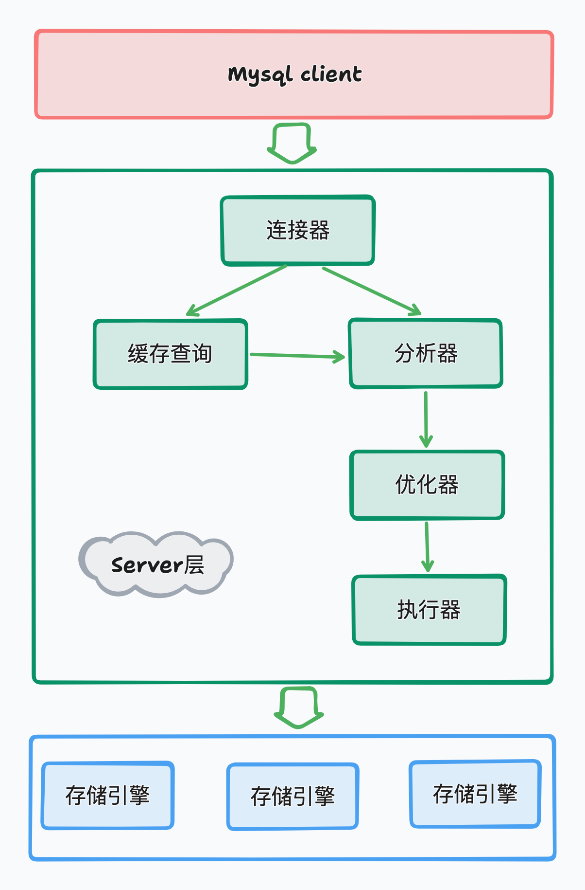

# Mysql架构图



Mysql由Server层和存储引擎层两部分组成。

# Server层

Server层主要包括连接器、缓存查询、分析器、优化器、执行器等，涵盖了大部分Mysql核心的服务功能，以及所有的内置函数（比如日期、时间、数学等），所有跨存储引擎的功能都在Server层实现，比如存储过程、触发器、视图等。

### 连接器

客服端连接Mysql第一步就是和连接器交互，连接器负责和客服端建立连接、获取权限、维持和管理连接。

```shell
mysql -h$ip -P$port -u$user -p
```

输入命令后，连接器开始工作，先验证身份，如果身份认证成功后会从权限表中读取用户的权限，后续的操作都依赖此时读取的权限，所以后续管理员对用户的权限进行调整也不会生效，而是等重新连接后才会生效。

如果建立连接后，没有后续的操作，连接会进入sleep状态。如果太长时间没有操作，连接器会自动断开连接，根据`wait_timeout`控制，默认为8小时。

连接分为长连接和短连接、长连接是指在建立连接后，如果客服端有持续的请求，会一直使用一个连接，与之对应的是短连接，每次查询几次后就会断开连接，下次查询会重新创建新连接。短连接是不推荐的，因为每次建立连接会非常复杂，但使用长连接会导致Mysql占用内存会涨得很快，可能会被系统kill掉。

处理长连接占用内容的方法：

1. 定期断开长连接，使用一段时间后或者执行一个占用内容较大的查询后断开连接。

2. 如果使用5.7或之后的版本，可以使用`mysql_reset_connection`来初始化连接资源，此操作不需要重新连接，但会释放资源。

### 缓存查询

建立连接后，会先进行缓存查询，如果缓存中存在数据则直接返回，这样效率很高。

但对于更新频繁的表就不要使用缓存查询，因为缓存频繁更新会命中率很低，缓存存储费力不讨好。

缓存查询通过参数`query_cache_type`开启，但实际场景中不可能开启所有查询走缓存，所以提供了按需查询的方法：

```sql
select SQL_CACHE * from T where ID=10;
```

注意：在Mysql8.0之后缓存查询这块的功能都被拿掉了。

### 分析器

缓存查询未命中，会进入分析器对执行语句进行分析，主要包括词法分析、表名、字段名进行验证等。如果查询的字段不存在也会在分析器阶段暴露出来。

### 优化器

经过分析器之后，语法错误被排除，知道要做什么事，但在执行之前，会先对SQL进行优化，如何选择索引、如何更优搜索都在优化器阶段。

### 执行器

经过优化器之后开始执行语句，在执行之前要先判断对表是否有相应的权限。

# 存储引擎层
