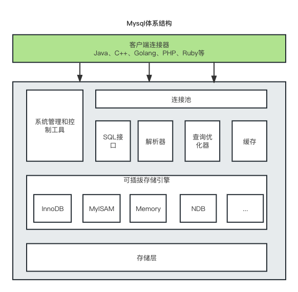
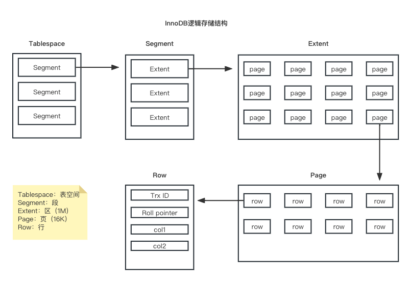

# MySQL的体系结构



MySQL包括连接层、服务层、引擎层、存储层，各司其职。

**连接层**

最上层是客户端和连接服务，包括本地Sock通信以及类似C/S架构的通信。主要是完成一些类似连接处理、授权认证、安全方案。且在该层上引入线程池概念，为通过认证的客户端提供现成。

**服务层**

核心服务功能，如SQL接口、缓存查询、SQL分析和优化、内置函数执行等。跨存储引擎的功能也在这一层实现，比如过程、函数等。以及查询解析、判断索引，生成相应的执行操作都在这一层。

**引擎层**

存储引擎层真正负责MySQL中数据的存储和提取，服务器通过API和存储引擎进行通信。不同存储引擎有不同的功能，可以给不同数据库设置不同的存储引擎，也可以不同表设置不同的存储引擎。

**存储层**

数据存储层也就是真正的数据存储在文件系统，并完成与存储引擎的交互。

# 存储引擎是啥

存储引擎就是存储数据、建立索引、更新/查询数据等技术的实现方式 。存储引擎是基于表的，而不是基于库的，所以存储引擎也可被称为表类型。我们可以在创建表的时候，来指定选择的存储引擎，如果没有指定将自动选择默认的存储引擎。

**MySQL支持的存储引擎**

```sql
# 查看MySQL支持的存储引擎
mysql> show engines;
+--------------------+---------+----------------------------------------------------------------+--------------+------+------------+
| Engine             | Support | Comment                                                        | Transactions | XA   | Savepoints |
+--------------------+---------+----------------------------------------------------------------+--------------+------+------------+
| FEDERATED          | NO      | Federated MySQL storage engine                                 | NULL         | NULL | NULL       |
| MEMORY             | YES     | Hash based, stored in memory, useful for temporary tables      | NO           | NO   | NO         |
| InnoDB             | DEFAULT | Supports transactions, row-level locking, and foreign keys     | YES          | YES  | YES        |
| PERFORMANCE_SCHEMA | YES     | Performance Schema                                             | NO           | NO   | NO         |
| MyISAM             | YES     | MyISAM storage engine                                          | NO           | NO   | NO         |
| MRG_MYISAM         | YES     | Collection of identical MyISAM tables                          | NO           | NO   | NO         |
| BLACKHOLE          | YES     | /dev/null storage engine (anything you write to it disappears) | NO           | NO   | NO         |
| CSV                | YES     | CSV storage engine                                             | NO           | NO   | NO         |
| ARCHIVE            | YES     | Archive storage engine                                         | NO           | NO   | NO         |
+--------------------+---------+----------------------------------------------------------------+--------------+------+------------+
```

**创建时指定存储引擎，否则默认为InnoDB**

```sql
-- 创建一个MyISAM引擎的表
create table my_myisam (
    id int,
    name varchar(10)
) engine = MyISAM;

-- 创建一个Memory引擎的表
create table my_memory (
    id int,
    name varchar(10)
) engine = Memory;
```

**InnoDB**

InnoDB是一种兼顾高可用和高性能的存储引擎，MySQL5.5后默认使用InnoDB。

- 特点
  
  - 支持事务，DML操作遵循ACID模型
  
  - 行级锁，提高并发访问性能
  
  - 外键，保证数据的完整性和正确性

- 存储
  
  - 以`.idb`文件保存每张表的结构、数据和索引。
  
  - 开启了`innodb_file_per_table`参数则每张表保存一个文件，否则采用压缩方式。
  
  ```sql
  # 查看innodb是否每张表存储一个文件
  mysql> show variables like 'innodb_file_per_table';
  +-----------------------+-------+
  | Variable_name         | Value |
  +-----------------------+-------+
  | innodb_file_per_table | ON    |
  +-----------------------+-------+
  ```

- 逻辑存储结构
  
  - 表空间 : InnoDB存储引擎逻辑结构的最高层，ibd文件其实就是表空间文件，在表空间中可以包含多个Segment段。
  
  - 段 : 表空间是由各个段组成的， 常见的段有数据段、索引段、回滚段等。InnoDB中对于段的管理，都是引擎自身完成，不需要人为对其控制，一个段中包含多个区。
  
  - 区 : 区是表空间的单元结构，每个区的大小为1M。 默认情况下， InnoDB存储引擎页大小为16K， 即一个区中一共有64个连续的页。
  
  - 页 : 页是组成区的最小单元，页也是InnoDB 存储引擎磁盘管理的最小单元，每个页的大小默认为 16KB。为了保证页的连续性，InnoDB 存储引擎每次从磁盘申请 4-5 个区。
  
  - 行 : InnoDB 存储引擎是面向行的，也就是说数据是按行进行存放的，在每一行中除了定义表时所指定的字段以外，还包含两个隐藏字段。



**MyISAM**

MySQL最高默认的存储引擎。

- 特点
  
  - 不支持事务、不支持外键
  
  - 表锁
  
  - 访问速度快

- 存储
  
  - `.sdi`文件存储表结构信息
  
  - `.MYD`存储数据
  
  - `.MYI`存储索引

**Memory**

Memory的表数据存储在内存中，表结构存储在磁盘，所以是不安全的。

- 特点
  
  - 内存存放访问速度快。

- 存储
  
  - `.sdi`存储表结构信息
  
  - 数据存储在内存中

**三种存储引擎的区别**

| 特点       | InnoDB | MyISAM | Memory |
| -------- | ------ | ------ | ------ |
| 存储限制     | 64TB   | 有      | 有      |
| 事务安全     | 支持     | 不支持    | 不支持    |
| 锁机制      | 行锁     | 表锁     | 表锁     |
| B+tree索引 | 支持     | 支持     | 支持     |
| Hash索引   | 不支持    | 不支持    | 支持     |
| 全文索引     | 支持     | 支持     | 不支持    |
| 空间使用     | 高      | 低      | 很低     |
| 内存使用     | 高      | 低      | 中等     |
| 批量插入速度   | 低      | 高      | 高      |
| 支持外键     | 支持     | 不支持    | 不支持    |

**存储引擎的选择**

- InnoDB: 是Mysql的默认存储引擎，支持事务、外键。如果应用对事务的完整性有比较高的要求，在并发条件下要求数据的一致性，数据操作除了插入和查询之外，还包含很多的更新、删除操作，那么InnoDB存储引擎是比较合适的选择。

- MyISAM ： 如果应用是以读操作和插入操作为主，只有很少的更新和删除操作，并且对事务的完整性、并发性要求不是很高，那么选择这个存储引擎是非常合适的。

- MEMORY：将所有数据保存在内存中，访问速度快，通常用于临时表及缓存。MEMORY的缺陷就是对表的大小有限制，太大的表无法缓存在内存中，而且无法保障数据的安全性。
