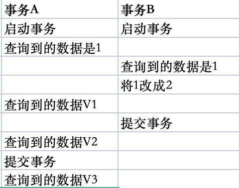

# 事务的理解

事务是保证一组数据库操作，要么全部成功，要么全部失败。Mysql中事务的实现是在存储引擎层上的。目前只有Innodb支持事务，这是Innodb成为默认存储引擎的一个重要的原因。

# 事务的特性

ACID是事务的四大特性，分别是：A（Atomicity）原子性、C（Consistency）一致性、I（Isolation）隔离性、D（Durability）持久性。

# 并发的事务问题

### 脏读

脏读是一个事务读取到另一个事务修改但未提交的数据。比如A和B两个事务，B将数据修改了，但还未提交，A读取该条数据时，读到的是已经修改的数据。

### 不可重复读

不可重复读是一个事务先后读取相同数据，两次读取到的数据不一致。比如A和B两个事务，A先读到数据，B开始修改该数据并修改提交，A再次读取数据，发现前后两次读取到的数据发生了变化。

### 幻读

幻读是一个事务先查询数据不存在，正准备插入数据，发现数据已存在不能插入，仿佛出现了“幻象”。比如A和B两个事务，A先读取数据不存在，B先插入数据并提交，A插入数据保存数据已存在。

# 隔离性

为了解决并发的事务问题，Innodb提供了四种隔离级别来处理。

### 读未提交

一个事务还未提交时，它的变更就会被其他事务看到。

### 读已提交

一个事务提交后，它的变更才会被其他事务看到。

### 可重复读（默认）

一个事务在执行过程中，看到的数据始终和启动时的数据一致。

### 串行化

当事务开启时，会对读和写的数据进行加锁，其他事务访问时需要等待。



**读未提交：**

V1=2，V2=2，V3=2，很好理解，能读到未提交的数据。

**读已提交：**

V1=1，V2=2，V3=2，很好理解，能读到已提交的数据。

**可重复读：**

V1=1，V2=1，V3=2，因为事务A开启时会保存一份可重复读“视图”，所以在没有提交之前读到的数据都是1，提交之后会读到2。

**串行化：**

V1=2，V2=2，V3=2，因为事务A会等到事务B提交之后才会读取数据，所以都是2。

### 查看隔离级别：

```sql
--transaction isolation 事务隔离
show variables like 'transaction_isolation';
```
