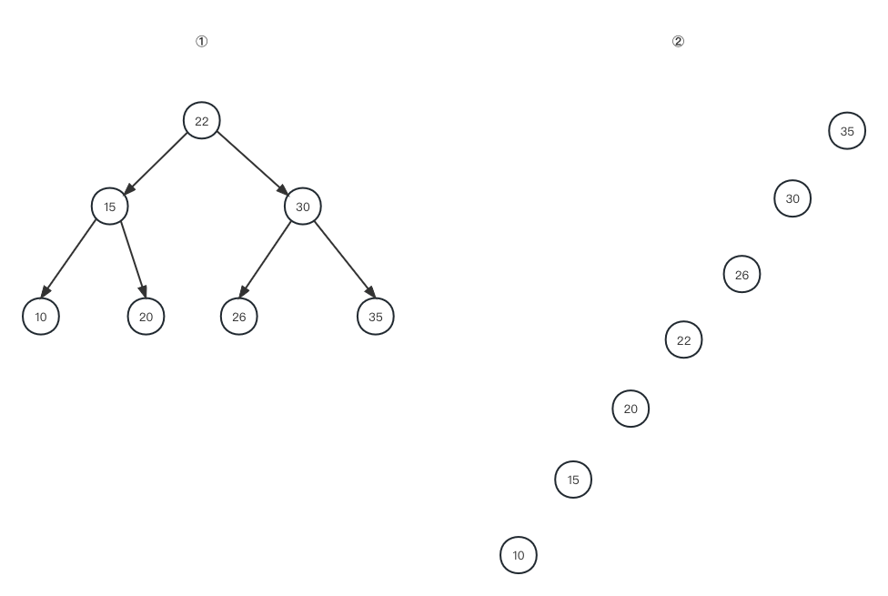
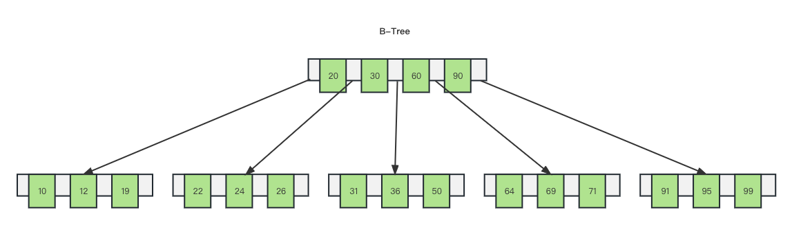
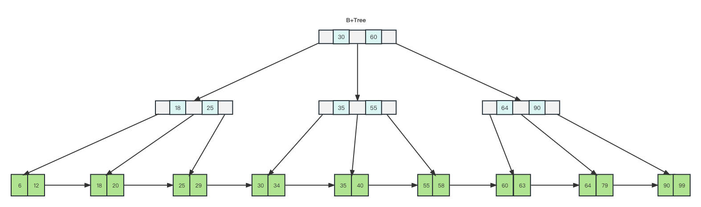
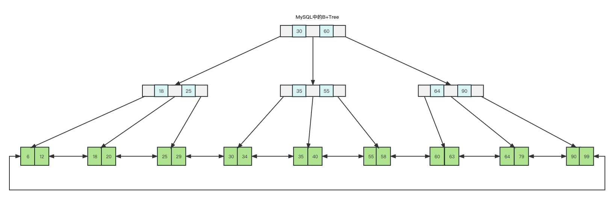
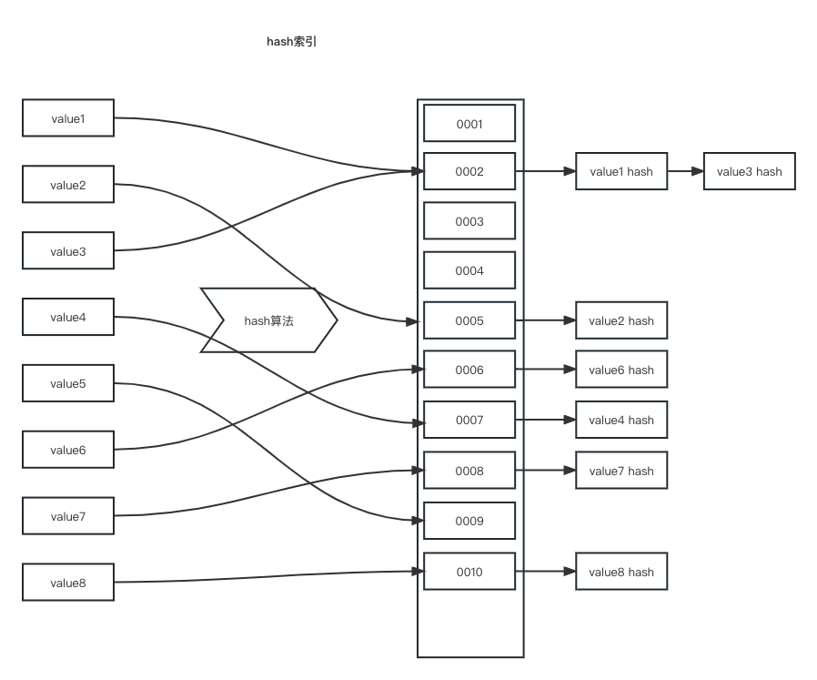

# 索引是什么

索引（index）是一种帮助MySQL高效获取数据的数据结构。在数据之外，MySQL还维护着满足特定查找算法的数据结构，这些数据结构以某种方式引用数据，这样就可以在这些数据结构上实现高级查找算法。

**索引的特点**

| 优势                              | 劣势                   |
| ------------------------------- | -------------------- |
| 提高数据检索的效率，降低数据库的IO成本            | 索引列是要占用空间的           |
| 通过索引列对数据进行排序，降低数据排序的成本，降低CPU的消耗 | 降低表的增删改操作速度，因为需要维护索引 |

但优势比起劣势，可以说劣势可以忽略不计。

# 索引结构

MySQL的索引是在存储引擎层实现的，不同的存储引擎有不同的索引结构。

| 索引结构          | 描述                                         |
| ------------- | ------------------------------------------ |
| B+tree索引      | 大部分引擎都支持B+树                                |
| Hash索引        | 底层数据结构是用哈希表实现的，只有精确匹配索引列的查询才有效，不支持范围查询     |
| R-tree空间索引    | 空间索引是MyISAM引擎的一个特殊索引类型，主要用于地理空间数据类型，通常使用较少 |
| Full-text全文索引 | 是一种通过建立倒排索引,快速匹配文档的方式。类似Lucene,Solr,ES     |

**支持情况**

| 索引结构      | InnoDB | MyISAM | Memory |
| --------- | ------ | ------ | ------ |
| B+tree    | 支持     | 支持     | 支持     |
| Hash      | 不支持    | 不支持    | 支持     |
| R-tree    | 不支持    | 支持     | 不支持    |
| Full-text | 支持     | 支持     | 不支持    |

**二叉树**



- 当插入顺序为：22、15、30、10、20、26、35，对于这样的顺序会生成一个平衡的二叉树，这样的二叉树查找速度最好

- 当插入顺序为：35、30、26、22、20、15、10，这样的顺序会生成一个单链表，查找速度和全表扫描没什么区别，这也是MySQL没有选择二叉树作为索引的原因。

**红黑树**

红黑树是一个自平衡的二叉树，能够解决因为顺序问题导致的不平衡的情况。

但随着数量的增加，红黑树的层级也会非常高，查找速度依然慢。

**B-Tree**

B-Tree是一种多叉路衡查找树，和二叉树相比，B树每个节点可以有多个分支，即多叉。

比如一颗最大度数为（max-degree）5阶的b-tree，B树每个节点最多存储4个数据，5个指针（指向子节点），

如果一个节点超过了4个数据，会将中间的元素向上提，并将原本的4个节点分裂成2个分支。



B树每个节点存储着指针和数据，相比红黑树可以根据max-degree来控制数的高度。

**B+Tree**

B+Tree是B-Tree的变种，主要将数据全部存储到最底层的子节点中，上层只存储索引数据。



**MySQL中的B+Tree**

MySQL中的B+Tree针对B+Tree做了优化，叶子节点从单向连边变成首尾相连的双向链表，提高区间访问的性能，利于排序。



**Hash索引**

哈希索引是利用了哈希算法将值换算成hash值，并映射到对应的槽位上，然后存储在hash表中，但哈希算法会存在哈希冲突，MySQL在冲突值增加链表来解决。



**为什么InnoDB选择B+Tree**

- 相对于二叉树，层级更少，搜索效率高。

- 对于B-Tree，无论叶子节点还是非叶子节点，都会保存数据，这样导致数据一页中存储的键值减少，指针跟着减少，要同样保存大量数据，只能增加树的高度，导致性能降低。

- 相对hash索引，B+Tree支持范围匹配以及排序操作。

# 索引分类

在MySQL数据库，将索引的具体类型主要分为以下几类：主键索引、唯一索引、常规索引、全文索引。

| 分类   | 含义                       | 特点           | 关键字      |
| ---- | ------------------------ | ------------ | -------- |
| 主键索引 | 针对表中主键创建的索引              | 默认自动创建，只能有一个 | PRIMARY  |
| 唯一索引 | 避免一列中数据值重复               | 可以有多个        | UNIQUE   |
| 常规索引 | 快速定位特定数据                 | 可以有多个        |          |
| 全文索引 | 全文索引查找文本中的关键词，而不是比较索引中的值 | 可以有多个        | FULLTEXT |

**聚集索引&二级索引**

按索引的存储形式，可以分为聚集索引和二级索引

| 分类   | 含义                           | 特点        |
| ---- | ---------------------------- | --------- |
| 聚集索引 | 将数据存储与索引放到一块，索引结果的叶子节点保存了行数据 | 必须有，且只有一个 |
| 二级索引 | 将数据与索引分开存储，索引结构的叶子节点存储是对应的主键 | 可以存在多个    |

比如说一张表，有id和name两个字段，为id创建主键索引，为name创建普通索引

- 对于主键索引就是聚集索引，最底层叶子节点中直接存储了数据，通过索引查找直接可以查到数据并返回。

- 而name的普通索引是一个二级索引，最底层叶子节点中存储的是id号，需要重新回到聚集索引中查找具体的行数据，效率更低，这种现象也叫回表查询。

**InnoDB主键索引的B+Tree高度有多高**

树高为2，可存储18000多条记录

树高为3，可存储2200w多条记录

所以在2200w多条记录中查找值，只需要遍历3次。

# 索引语法

**创建索引**

```sql
# CREATE [ UNIQUE | FULLTEXT ] INDEX index_name ON table_name ( index_col_name,... ) ;
# 创建普通索引
mysql> create index idx_user_name on tb_user(name);
Query OK, 0 rows affected (0.04 sec)
mysql> create index idx_email on tb_user(email);
Query OK, 0 rows affected (0.03 sec)
# 创建唯一索引
mysql> create unique index idx_user_phone on tb_user(phone);
Query OK, 0 rows affected (0.04 sec)
# 创建联合索引
mysql> create index idx_user_pro_age_sta on tb_user(profession,age,status);
Query OK, 0 rows affected (0.04 sec)
```

**查看索引**

```sql
# SHOW INDEX FROM table_name ;
mysql> show index from tb_user;
+---------+------------+----------------------+--------------+-------------+-----------+-------------+----------+--------+------+------------+---------+---------------+---------+------------+
| Table   | Non_unique | Key_name             | Seq_in_index | Column_name | Collation | Cardinality | Sub_part | Packed | Null | Index_type | Comment | Index_comment | Visible | Expression |
+---------+------------+----------------------+--------------+-------------+-----------+-------------+----------+--------+------+------------+---------+---------------+---------+------------+
| tb_user |          0 | PRIMARY              |            1 | id          | A         |          24 |     NULL |   NULL |      | BTREE      |         |               | YES     | NULL       |
| tb_user |          0 | idx_user_phone       |            1 | phone       | A         |          24 |     NULL |   NULL |      | BTREE      |         |               | YES     | NULL       |
| tb_user |          1 | idx_user_name        |            1 | name        | A         |          24 |     NULL |   NULL |      | BTREE      |         |               | YES     | NULL       |
| tb_user |          1 | idx_user_pro_age_sta |            1 | profession  | A         |          16 |     NULL |   NULL | YES  | BTREE      |         |               | YES     | NULL       |
| tb_user |          1 | idx_user_pro_age_sta |            2 | age         | A         |          22 |     NULL |   NULL | YES  | BTREE      |         |               | YES     | NULL       |
| tb_user |          1 | idx_user_pro_age_sta |            3 | status      | A         |          24 |     NULL |   NULL | YES  | BTREE      |         |               | YES     | NULL       |
| tb_user |          1 | idx_email            |            1 | email       | A         |          24 |     NULL |   NULL | YES  | BTREE      |         |               | YES     | NULL       |
+---------+------------+----------------------+--------------+-------------+-----------+-------------+----------+--------+------+------------+---------+---------------+---------+------------+
```

**删除索引**

```sql
# DROP INDEX index_name ON table_name ;
mysql> drop index idx_email on tb_user;
Query OK, 0 rows affected (0.03 sec)
```

# SQL性能分析

**SQL执行频率**

查看数据库到底是增删改多还是查询多

```sql
# show [session|global] status like 'Com_______'
mysql> show global status like 'Com_______';
+---------------+-------+
| Variable_name | Value |
+---------------+-------+
| Com_binlog    | 0     |
| Com_commit    | 0     |
| Com_delete    | 0     |
| Com_import    | 0     |
| Com_insert    | 24    |
| Com_repair    | 0     |
| Com_revoke    | 0     |
| Com_select    | 281   |
| Com_signal    | 0     |
| Com_update    | 0     |
| Com_xa_end    | 0     |
+---------------+-------+
```

**慢查询日志**

慢查询日志记录了所有执行时间超过指定参数（long_query_time，单位：秒，默认10s）的所有SQL语句的日志。

- 先查询一下慢查询日志是否开启

```sql
mysql> show variables like 'slow_query_log';
+----------------+-------+
| Variable_name  | Value |
+----------------+-------+
| slow_query_log | OFF   |
+----------------+-------+
```

- 开启慢查询日志

```confag-0-1h2p4fhn1ag-1-1h2p4fhn1
[mysqld]
# 开启MySQL慢日志查询开关
slow_query_log = 1

# 设置慢日志的时间为2秒，SQL语句执行时间超过2秒，就会视为慢查询，记录慢查询日志
long_query_time=2
```

**profile详情**

show profiles能够知道每一条SQL的时间耗时。

```sql
# 查看是否支持profile
mysql> select @@have_profiling;
+------------------+
| @@have_profiling |
+------------------+
| YES              |
+------------------+
# 开启profile
mysql> set profiling = 1;
Query OK, 0 rows affected, 1 warning (0.00 sec)

# 查询
mysql> select * from tb_user;
# 查看语句执行耗时
mysql> show profiles;
+----------+------------+-----------------------+
| Query_ID | Duration   | Query                 |
+----------+------------+-----------------------+
|        1 | 0.00020450 | select * from tb_user |
|        2 | 0.00040800 | SELECT DATABASE()     |
|        3 | 0.01641425 | show databases        |
|        4 | 0.00564000 | show tables           |
|        5 | 0.00429625 | select * from tb_user |
+----------+------------+-----------------------+
5 rows in set, 1 warning (0.00 sec)
# 查看queryID耗时的具体详情
mysql> show profile for query 5;
+--------------------------------+----------+
| Status                         | Duration |
+--------------------------------+----------+
| starting                       | 0.000093 |
| Executing hook on transaction  | 0.000021 |
| starting                       | 0.000013 |
| checking permissions           | 0.000007 |
| Opening tables                 | 0.000038 |
| init                           | 0.000008 |
| System lock                    | 0.000013 |
| optimizing                     | 0.000006 |
| statistics                     | 0.000017 |
| preparing                      | 0.000048 |
| executing                      | 0.003874 |
| end                            | 0.000029 |
| query end                      | 0.000009 |
| waiting for handler commit     | 0.000015 |
| closing tables                 | 0.000014 |
| freeing items                  | 0.000063 |
| cleaning up                    | 0.000030 |
+--------------------------------+----------+
17 rows in set, 1 warning (0.00 sec)
# 查看cpu实用情况
mysql> show profile cpu for query 5;
+--------------------------------+----------+----------+------------+
| Status                         | Duration | CPU_user | CPU_system |
+--------------------------------+----------+----------+------------+
| starting                       | 0.000093 | 0.000051 |   0.000041 |
| Executing hook on transaction  | 0.000021 | 0.000012 |   0.000009 |
| starting                       | 0.000013 | 0.000007 |   0.000005 |
| checking permissions           | 0.000007 | 0.000003 |   0.000003 |
| Opening tables                 | 0.000038 | 0.000021 |   0.000017 |
| init                           | 0.000008 | 0.000005 |   0.000004 |
| System lock                    | 0.000013 | 0.000007 |   0.000005 |
| optimizing                     | 0.000006 | 0.000003 |   0.000003 |
| statistics                     | 0.000017 | 0.000010 |   0.000007 |
| preparing                      | 0.000048 | 0.000027 |   0.000022 |
| executing                      | 0.003874 | 0.000492 |   0.000394 |
| end                            | 0.000029 | 0.000014 |   0.000012 |
| query end                      | 0.000009 | 0.000005 |   0.000004 |
| waiting for handler commit     | 0.000015 | 0.000008 |   0.000007 |
| closing tables                 | 0.000014 | 0.000008 |   0.000006 |
| freeing items                  | 0.000063 | 0.000035 |   0.000028 |
| cleaning up                    | 0.000030 | 0.000017 |   0.000013 |
+--------------------------------+----------+----------+------------+
17 rows in set, 1 warning (0.01 sec)
```

**explain/desc**

EXPLAIN 或者 DESC命令获取 MySQL 如何执行 SELECT 语句的信息，包括在 SELECT 语句执行过程中表如何连接和连接的顺序。

```sql
# explain / desc EXPLAIN SELECT 字段列表 FROM 表名 WHERE 条件 ;
mysql> explain select * from tb_user;
+----+-------------+---------+------------+------+---------------+------+---------+------+------+----------+-------+
| id | select_type | table   | partitions | type | possible_keys | key  | key_len | ref  | rows | filtered | Extra |
+----+-------------+---------+------------+------+---------------+------+---------+------+------+----------+-------+
|  1 | SIMPLE      | tb_user | NULL       | ALL  | NULL          | NULL | NULL    | NULL |   24 |   100.00 | NULL  |
+----+-------------+---------+------------+------+---------------+------+---------+------+------+----------+-------+
mysql> explain select * from tb_user where id = 1;
+----+-------------+---------+------------+-------+---------------+---------+---------+-------+------+----------+-------+
| id | select_type | table   | partitions | type  | possible_keys | key     | key_len | ref   | rows | filtered | Extra |
+----+-------------+---------+------------+-------+---------------+---------+---------+-------+------+----------+-------+
|  1 | SIMPLE      | tb_user | NULL       | const | PRIMARY       | PRIMARY | 4       | const |    1 |   100.00 | NULL  |
+----+-------------+---------+------------+-------+---------------+---------+---------+-------+------+----------+-------+
```

字段含义

| 字段            | 含义                                                                                                                             |
| ------------- | ------------------------------------------------------------------------------------------------------------------------------ |
| id            | select查询的序列号，表示查询中执行select子句或者是操作表的顺序(id相同，执行顺序从上到下；id不同，值越大，越先执行)。                                                            |
| select_type   | 表示 SELECT 的类型，常见的取值有 SIMPLE（简单表，即不使用表连接或者子查询）、PRIMARY（主查询，即外层的查询）、UNION（UNION 中的第二个或者后面的查询语句）、 SUBQUERY（SELECT/WHERE之后包含了子查询）等 |
| table         | 具体哪张表                                                                                                                          |
| type          | 表示连接类型，性能由好到差的连接类型为NULL、system、const、eq_ref、ref、range、 index、all 。                                                             |
| possible_keys | 显示可能应用在这张表上的索引，一个或多个。                                                                                                          |
| key           | 实际使用的索引，如果为NULL，则没有使用索引。                                                                                                       |
| key_len       | 表示索引中使用的字节数， 该值为索引字段最大可能长度，并非实际使用长度，在不损失精确性的前提下， 长度越短越好 。                                                                      |
| rows          | MySQL认为必须要执行查询的行数，在innodb引擎的表中，是一个估计值，可能并不总是准确的。                                                                               |
| filtered      | 表示返回结果的行数占需读取行数的百分比， filtered 的值越大越好。                                                                                          |

**type解析**

| type   | 说明                                     |
| ------ | -------------------------------------- |
| NULL   | 没有进行表查询，比如select 'A';select curdate(); |
| system | 不进行磁盘IO，查询系统表，仅返回一条数据                  |
| const  | 查找主键索引，属于精准查找                          |
| eq_ref | 查找唯一索引，属于精准查找                          |
| ref    | 查找非唯一性索引查询时，二级索引                       |
| range  | 查找某个索引的部分索引，范围查询，比如>,<,in,between      |
| index  | 查找整个索引树                                |
| all    | 没有用到索引，直接扫描了全表（磁盘）                     |

**Extra**解析

| extra类型               | 说明                                           |
| --------------------- | -------------------------------------------- |
| Using filesort        | 无法用到索引排序，称作“文件排序”                            |
| Using Index           | 用到了覆盖索引，不需要回表                                |
| Using Index Condition | 搜索条件虽然出现了索引列，但有部分条件无法使用到索引，需要再搜索一遍匹配无法使用的条件。 |
| Using Join Buffer     | 使用了连接缓存                                      |
| Using temporary       | 表示MySQL需要使用临时的表来存储结果集，常见与排序和分组查询             |
| Using where           | 表示全表扫描或者没有索引搜索。                              |

# 索引使用规范

**最左前缀法则**

如果使用了联合索引，要遵守最左前缀法则，指的是从联合索引的最左列开始，并且不能跳过索引中的列，如果跳过某一列，那么索引将会部分失效（后面的字段索引失效）。

```sql
# 联合索引字段的顺序为 profession age status
# 根据最左前缀法则，从左往右字段都存在，索引生效
mysql> explain select * from tb_user where profession = '软件工程' and age = 31 and status = '0';
+----+-------------+---------+------------+------+----------------------+----------------------+---------+-------------------+------+----------+-----------------------+
| id | select_type | table   | partitions | type | possible_keys        | key                  | key_len | ref               | rows | filtered | Extra                 |
+----+-------------+---------+------------+------+----------------------+----------------------+---------+-------------------+------+----------+-----------------------+
|  1 | SIMPLE      | tb_user | NULL       | ref  | idx_user_pro_age_sta | idx_user_pro_age_sta | 54      | const,const,const |    1 |   100.00 | Using index condition |
+----+-------------+---------+------------+------+----------------------+----------------------+---------+-------------------+------+----------+-----------------------+
# 缺少一个也用到了2个
mysql>  explain select * from tb_user where profession = '软件工程' and age = 31;
+----+-------------+---------+------------+------+----------------------+----------------------+---------+-------------+------+----------+-------+
| id | select_type | table   | partitions | type | possible_keys        | key                  | key_len | ref         | rows | filtered | Extra |
+----+-------------+---------+------------+------+----------------------+----------------------+---------+-------------+------+----------+-------+
|  1 | SIMPLE      | tb_user | NULL       | ref  | idx_user_pro_age_sta | idx_user_pro_age_sta | 49      | const,const |    1 |   100.00 | NULL  |
+----+-------------+---------+------------+------+----------------------+----------------------+---------+-------------+------+----------+-------+
# 但最左的profession字段不存在则索引失效
mysql> explain select * from tb_user where age = 31 and status = '0';
+----+-------------+---------+------------+------+---------------+------+---------+------+------+----------+-------------+
| id | select_type | table   | partitions | type | possible_keys | key  | key_len | ref  | rows | filtered | Extra       |
+----+-------------+---------+------------+------+---------------+------+---------+------+------+----------+-------------+
|  1 | SIMPLE      | tb_user | NULL       | ALL  | NULL          | NULL | NULL    | NULL |   24 |     4.17 | Using where |
+----+-------------+---------+------------+------+---------------+------+---------+------+------+----------+-------------+
```

注意：最左前缀法则不是根据字段的顺序来判断的，只要字段存在就可以。

```sql
mysql> explain select * from tb_user where age = 31 and status = '0' and profession = '软件工程';
+----+-------------+---------+------------+------+----------------------+----------------------+---------+-------------------+------+----------+-----------------------+
| id | select_type | table   | partitions | type | possible_keys        | key                  | key_len | ref               | rows | filtered | Extra                 |
+----+-------------+---------+------------+------+----------------------+----------------------+---------+-------------------+------+----------+-----------------------+
|  1 | SIMPLE      | tb_user | NULL       | ref  | idx_user_pro_age_sta | idx_user_pro_age_sta | 54      | const,const,const |    1 |   100.00 | Using index condition |
+----+-------------+---------+------------+------+----------------------+----------------------+---------+-------------------+------+----------+-----------------------+
```

<u>最左前缀法则可以是联合索引的前几个字段，也可以是字符串索引的前几个字符。</u>

**范围查询**

联合索引中，如果出现范围查询（>，<），范围查询右侧的列索引会失效。

```sql
mysql> explain select * from tb_user where profession = '软件工程' and age > 30 and status = '0';
+----+-------------+---------+------------+-------+----------------------+----------------------+---------+------+------+----------+-----------------------+
| id | select_type | table   | partitions | type  | possible_keys        | key                  | key_len | ref  | rows | filtered | Extra                 |
+----+-------------+---------+------------+-------+----------------------+----------------------+---------+------+------+----------+-----------------------+
|  1 | SIMPLE      | tb_user | NULL       | range | idx_user_pro_age_sta | idx_user_pro_age_sta | 49      | NULL |    2 |    10.00 | Using index condition |
+----+-------------+---------+------------+-------+----------------------+----------------------+---------+------+------+----------+-----------------------+
# 从上面的索引长度（key_len）能看出来使用了 procession 和 age，但 status索引没有用到
```

解决方法：使用>=和<=替换>和<。

```sql
# 看到了没有，key_len = 54，说明用到了status的索引
mysql> explain select * from tb_user where profession = '软件工程' and age >= 31 and status = '0';
+----+-------------+---------+------------+-------+----------------------+----------------------+---------+------+------+----------+-----------------------+
| id | select_type | table   | partitions | type  | possible_keys        | key                  | key_len | ref  | rows | filtered | Extra                 |
+----+-------------+---------+------------+-------+----------------------+----------------------+---------+------+------+----------+-----------------------+
|  1 | SIMPLE      | tb_user | NULL       | range | idx_user_pro_age_sta | idx_user_pro_age_sta | 54      | NULL |    2 |    10.00 | Using index condition |
+----+-------------+---------+------------+-------+----------------------+----------------------+---------+------+------+----------+-----------------------+
```

**索引失效场景**

- 索引列运算，只要在查询条件中对字段使用了列运算索引会失效。
  
  - 但只会影响使用了列运算字段的索引

```sql
# 对phone字段使用了列运算，索引失效
mysql> explain select * from tb_user where substring(phone,10,2) = '15';
+----+-------------+---------+------------+------+---------------+------+---------+------+------+----------+-------------+
| id | select_type | table   | partitions | type | possible_keys | key  | key_len | ref  | rows | filtered | Extra       |
+----+-------------+---------+------------+------+---------------+------+---------+------+------+----------+-------------+
|  1 | SIMPLE      | tb_user | NULL       | ALL  | NULL          | NULL | NULL    | NULL |   24 |   100.00 | Using where |
+----+-------------+---------+------------+------+---------------+------+---------+------+------+----------+-------------+

# 在后面加上了其他字段，其他索引不受影响
mysql> explain select * from tb_user where substring(phone,10,2) = '15' and profession = '软件工程';
+----+-------------+---------+------------+------+----------------------+----------------------+---------+-------+------+----------+-------------+
| id | select_type | table   | partitions | type | possible_keys        | key                  | key_len | ref   | rows | filtered | Extra       |
+----+-------------+---------+------------+------+----------------------+----------------------+---------+-------+------+----------+-------------+
|  1 | SIMPLE      | tb_user | NULL       | ref  | idx_user_pro_age_sta | idx_user_pro_age_sta | 47      | const |    4 |   100.00 | Using where |
+----+-------------+---------+------------+------+----------------------+----------------------+---------+-------+------+----------+-------------+
```

- 字符串类型不加引号，字段是字符串类型，在查询条件中没有带引号会导致索引失效。
  
  - 但只会影响使用了列运算字段的索引

```sql
mysql> explain select * from tb_user where phone = 17799990009;
+----+-------------+---------+------------+------+----------------+------+---------+------+------+----------+-------------+
| id | select_type | table   | partitions | type | possible_keys  | key  | key_len | ref  | rows | filtered | Extra       |
+----+-------------+---------+------------+------+----------------+------+---------+------+------+----------+-------------+
|  1 | SIMPLE      | tb_user | NULL       | ALL  | idx_user_phone | NULL | NULL    | NULL |   24 |    10.00 | Using where |
+----+-------------+---------+------------+------+----------------+------+---------+------+------+----------+-------------+
# 在后面加上了其他字段，其他索引不受影响
mysql> explain select * from tb_user where phone = 17799990009 and profession = '机械工程及其自动 化';
+----+-------------+---------+------------+------+-------------------------------------+----------------------+---------+-------+------+----------+-------------+
| id | select_type | table   | partitions | type | possible_keys                       | key                  | key_len | ref   | rows | filtered | Extra       |
+----+-------------+---------+------------+------+-------------------------------------+----------------------+---------+-------+------+----------+-------------+
|  1 | SIMPLE      | tb_user | NULL       | ref  | idx_user_phone,idx_user_pro_age_sta | idx_user_pro_age_sta | 47      | const |    1 |    10.00 | Using where |
+----+-------------+---------+------------+------+-------------------------------------+----------------------+---------+-------+------+----------+-------------+
```

- 模糊查询
  
  - `like 'xxx%'`索引不会失效
  
  - `like '%xxx%'`索引会失效。
  
  - `like '%xxx'`索引会失效。

```sql
mysql> explain select * from tb_user where profession like '软件%';
+----+-------------+---------+------------+-------+----------------------+----------------------+---------+------+------+----------+-----------------------+
| id | select_type | table   | partitions | type  | possible_keys        | key                  | key_len | ref  | rows | filtered | Extra                 |
+----+-------------+---------+------------+-------+----------------------+----------------------+---------+------+------+----------+-----------------------+
|  1 | SIMPLE      | tb_user | NULL       | range | idx_user_pro_age_sta | idx_user_pro_age_sta | 47      | NULL |    4 |   100.00 | Using index condition |
+----+-------------+---------+------------+-------+----------------------+----------------------+---------+------+------+----------+-----------------------+
1 row in set, 1 warning (0.00 sec)

mysql> explain select * from tb_user where profession like '%工程';
+----+-------------+---------+------------+------+---------------+------+---------+------+------+----------+-------------+
| id | select_type | table   | partitions | type | possible_keys | key  | key_len | ref  | rows | filtered | Extra       |
+----+-------------+---------+------------+------+---------------+------+---------+------+------+----------+-------------+
|  1 | SIMPLE      | tb_user | NULL       | ALL  | NULL          | NULL | NULL    | NULL |   24 |    11.11 | Using where |
+----+-------------+---------+------------+------+---------------+------+---------+------+------+----------+-------------+
1 row in set, 1 warning (0.00 sec)

mysql> explain select * from tb_user where profession like '%工%';
+----+-------------+---------+------------+------+---------------+------+---------+------+------+----------+-------------+
| id | select_type | table   | partitions | type | possible_keys | key  | key_len | ref  | rows | filtered | Extra       |
+----+-------------+---------+------------+------+---------------+------+---------+------+------+----------+-------------+
|  1 | SIMPLE      | tb_user | NULL       | ALL  | NULL          | NULL | NULL    | NULL |   24 |    11.11 | Using where |
+----+-------------+---------+------------+------+---------------+------+---------+------+------+----------+-------------+
```

- or连接条件，用or分割开的条件， 如果or前的条件中的列有索引，而后面的列中没有索引，那么涉及的索引都会失效。

```sql
# id 是主键索引，但 or 右边的age只是联合索引中的中间的字段，根据最左前缀法则相当于没有索引，导致所有字段索引失效
mysql> explain select * from tb_user where id = 10 or age = 23;
+----+-------------+---------+------------+------+---------------+------+---------+------+------+----------+-------------+
| id | select_type | table   | partitions | type | possible_keys | key  | key_len | ref  | rows | filtered | Extra       |
+----+-------------+---------+------------+------+---------------+------+---------+------+------+----------+-------------+
|  1 | SIMPLE      | tb_user | NULL       | ALL  | PRIMARY       | NULL | NULL    | NULL |   24 |    13.75 | Using where |
+----+-------------+---------+------------+------+---------------+------+---------+------+------+----------+-------------+
1 row in set, 1 warning (0.01 sec)


# 如果or两边都有索引则索引不会失效
mysql> explain select * from tb_user where phone = '17799990017' or profession = '软件工程';
+----+-------------+---------+------------+-------------+-------------------------------------+-------------------------------------+---------+------+------+----------+--------------------------------------------------------------------+
| id | select_type | table   | partitions | type        | possible_keys                       | key                                 | key_len | ref  | rows | filtered | Extra                                                              |
+----+-------------+---------+------------+-------------+-------------------------------------+-------------------------------------+---------+------+------+----------+--------------------------------------------------------------------+
|  1 | SIMPLE      | tb_user | NULL       | index_merge | idx_user_phone,idx_user_pro_age_sta | idx_user_phone,idx_user_pro_age_sta | 46,47   | NULL |    5 |   100.00 | Using sort_union(idx_user_phone,idx_user_pro_age_sta); Using where |
+----+-------------+---------+------------+-------------+-------------------------------------+-------------------------------------+---------+------+------+----------+--------------------------------------------------------------------+
```

- 数据分布影响，如果MySQL评估使用索引比全表扫描还慢，则不使用索引。
  
  - 会根据实际数据分布情况，判断是否使用索引

```sql
# phone >= 17799990005 相当于全表扫描，引擎放弃了使用索引
mysql> explain select * from tb_user where phone >= '17799990005';
+----+-------------+---------+------------+------+----------------+------+---------+------+------+----------+-------------+
| id | select_type | table   | partitions | type | possible_keys  | key  | key_len | ref  | rows | filtered | Extra       |
+----+-------------+---------+------------+------+----------------+------+---------+------+------+----------+-------------+
|  1 | SIMPLE      | tb_user | NULL       | ALL  | idx_user_phone | NULL | NULL    | NULL |   24 |    79.17 | Using where |
+----+-------------+---------+------------+------+----------------+------+---------+------+------+----------+-------------+
1 row in set, 1 warning (0.00 sec)
# phone > 17799990015 是很少部分数据，存储引擎使用了索引来提高效率。
mysql> explain select * from tb_user where phone >= '17799990015';
+----+-------------+---------+------------+-------+----------------+----------------+---------+------+------+----------+-----------------------+
| id | select_type | table   | partitions | type  | possible_keys  | key            | key_len | ref  | rows | filtered | Extra                 |
+----+-------------+---------+------------+-------+----------------+----------------+---------+------+------+----------+-----------------------+
|  1 | SIMPLE      | tb_user | NULL       | range | idx_user_phone | idx_user_phone | 46      | NULL |    9 |   100.00 | Using index condition |
+----+-------------+---------+------------+-------+----------------+----------------+---------+------+------+----------+-----------------------+
```

**SQL提示**

索引使用是依靠MySQL的机制选择的，可以认为引导使用索引、忽略索引、强制使用索引。

```sql
# 先创建一个procession的单列索引
mysql> create index idx_user_pro on tb_user(profession);
Query OK, 0 rows affected (0.05 sec)

# 引导使用idx_user_pro索引，但不能保证MySQL一定会选择引导的索引，因为会去判断是否最优
mysql> explain select * from tb_user use index(idx_user_pro) where profession = '软件工程';
+----+-------------+---------+------------+------+---------------+--------------+---------+-------+------+----------+-------+
| id | select_type | table   | partitions | type | possible_keys | key          | key_len | ref   | rows | filtered | Extra |
+----+-------------+---------+------------+------+---------------+--------------+---------+-------+------+----------+-------+
|  1 | SIMPLE      | tb_user | NULL       | ref  | idx_user_pro  | idx_user_pro | 47      | const |    1 |   100.00 | NULL  |
+----+-------------+---------+------------+------+---------------+--------------+---------+-------+------+----------+-------+

# 忽略使用索引
mysql> explain select * from tb_user ignore index(idx_user_pro) where profession = '软件工程';
+----+-------------+---------+------------+------+----------------------+----------------------+---------+-------+------+----------+-------+
| id | select_type | table   | partitions | type | possible_keys        | key                  | key_len | ref   | rows | filtered | Extra |
+----+-------------+---------+------------+------+----------------------+----------------------+---------+-------+------+----------+-------+
|  1 | SIMPLE      | tb_user | NULL       | ref  | idx_user_pro_age_sta | idx_user_pro_age_sta | 47      | const |    1 |   100.00 | NULL  |
+----+-------------+---------+------------+------+----------------------+----------------------+---------+-------+------+----------+-------+

# 强制使用指定索引
mysql> explain select * from tb_user force index(idx_user_pro) where profession = '软件工程';
+----+-------------+---------+------------+------+---------------+--------------+---------+-------+------+----------+-------+
| id | select_type | table   | partitions | type | possible_keys | key          | key_len | ref   | rows | filtered | Extra |
+----+-------------+---------+------------+------+---------------+--------------+---------+-------+------+----------+-------+
|  1 | SIMPLE      | tb_user | NULL       | ref  | idx_user_pro  | idx_user_pro | 47      | const |    1 |   100.00 | NULL  |
+----+-------------+---------+------------+------+---------------+--------------+---------+-------+------+----------+-------+
```

**覆盖索引**

回表查询：如果一个查询的字段没有被全部包含在使用的索引上，要查询没有包含的字段需要去主键索引中进行回表查询出未包含的字段数据，这就是回表，回表会降低性能。

如果查询的字段被索引都包含，那么直接从索引中获取字段，不需要进行回表，这就是覆盖索引。

可通过`explain`分析Extra项不是`Using index`，则表示有回表查询。

```sql
# 先删除 idx_user_pro 避免误导
mysql> drop index idx_user_pro on tb_user;
Query OK, 0 rows affected (0.02 sec)

# 查询字段id、profession在联合索引上都有，不用回表 -- Using where; Using index
mysql> explain select id, profession from tb_user where profession = '软件工程' and age = 31 and status = '0' ;
+----+-------------+---------+------------+------+----------------------+----------------------+---------+-------------------+------+----------+--------------------------+
| id | select_type | table   | partitions | type | possible_keys        | key                  | key_len | ref               | rows | filtered | Extra                    |
+----+-------------+---------+------------+------+----------------------+----------------------+---------+-------------------+------+----------+--------------------------+
|  1 | SIMPLE      | tb_user | NULL       | ref  | idx_user_pro_age_sta | idx_user_pro_age_sta | 54      | const,const,const |    1 |   100.00 | Using where; Using index |
+----+-------------+---------+------------+------+----------------------+----------------------+---------+-------------------+------+----------+--------------------------+
1 row in set, 1 warning (0.00 sec)

# # 查询字段id、profession, age在联合索引上都有，不用回表 -- Using where; Using index
mysql> explain select id,profession,age, status from tb_user where profession = '软件工程' and age = 31 and status = '0' ;
+----+-------------+---------+------------+------+----------------------+----------------------+---------+-------------------+------+----------+--------------------------+
| id | select_type | table   | partitions | type | possible_keys        | key                  | key_len | ref               | rows | filtered | Extra                    |
+----+-------------+---------+------------+------+----------------------+----------------------+---------+-------------------+------+----------+--------------------------+
|  1 | SIMPLE      | tb_user | NULL       | ref  | idx_user_pro_age_sta | idx_user_pro_age_sta | 54      | const,const,const |    1 |   100.00 | Using where; Using index |
+----+-------------+---------+------------+------+----------------------+----------------------+---------+-------------------+------+----------+--------------------------+
1 row in set, 1 warning (0.00 sec)

# 查询字段 name 没有在联合索引上，需要回表查询name的数据 -- Using index condition
mysql> explain select id,profession,age, status, name from tb_user where profession = '软件工程' and age = 31 and status = '0' ;
+----+-------------+---------+------------+------+----------------------+----------------------+---------+-------------------+------+----------+-----------------------+
| id | select_type | table   | partitions | type | possible_keys        | key                  | key_len | ref               | rows | filtered | Extra                 |
+----+-------------+---------+------------+------+----------------------+----------------------+---------+-------------------+------+----------+-----------------------+
|  1 | SIMPLE      | tb_user | NULL       | ref  | idx_user_pro_age_sta | idx_user_pro_age_sta | 54      | const,const,const |    1 |   100.00 | Using index condition |
+----+-------------+---------+------------+------+----------------------+----------------------+---------+-------------------+------+----------+-----------------------+
1 row in set, 1 warning (0.00 sec)

# select * 更不用说，需要回表。
mysql> explain select * from tb_user where profession = '软件工程' and age = 31 and status = '0';
+----+-------------+---------+------------+------+----------------------+----------------------+---------+-------------------+------+----------+-----------------------+
| id | select_type | table   | partitions | type | possible_keys        | key                  | key_len | ref               | rows | filtered | Extra                 |
+----+-------------+---------+------------+------+----------------------+----------------------+---------+-------------------+------+----------+-----------------------+
|  1 | SIMPLE      | tb_user | NULL       | ref  | idx_user_pro_age_sta | idx_user_pro_age_sta | 54      | const,const,const |    1 |   100.00 | Using index condition |
+----+-------------+---------+------------+------+----------------------+----------------------+---------+-------------------+------+----------+-----------------------+
1 row in set, 1 warning (0.00 sec)
```

所以生产环境上避免使用`*`查询，大概率会出现回表查询。

**前缀索引**

针对于字段是很长的字符串，这会让索引变得很大，查询时会浪费大量的磁盘IO，影响查询的效率。此时可以只将字符串的一部分前缀，建立索引，这样可以大大解决索引空间，从而提高效率。

- 计算前缀长度
  
  - 可以根据索引的选择性来决定，而选择性是指不重复的索引值（基数）和数据表的记录总数的比值。索引选择性越高则查  询效率越高， 唯一索引的选择性是1，这是最好的索引选择性，性能也是最好的。

```sql
# 去重后的数量除以总数就是索引选择性值，值越靠近1，性能越好
mysql> select count(distinct email) / count(*) from tb_user ;
+----------------------------------+
| count(distinct email) / count(*) |
+----------------------------------+
|                           1.0000 |
+----------------------------------+
# 取前9位计算值为 0.9583
mysql> select count(distinct substring(email,1,9)) / count(*) from tb_user ;
+-------------------------------------------------+
| count(distinct substring(email,1,9)) / count(*) |
+-------------------------------------------------+
|                                          0.9583 |
+-------------------------------------------------+
# 取前5位计算值为 0.9583。所以选择5位效率高且成本
mysql> select count(distinct substring(email,1,5)) / count(*) from tb_user ;
+-------------------------------------------------+
| count(distinct substring(email,1,5)) / count(*) |
+-------------------------------------------------+
|                                          0.9583 |
+-------------------------------------------------+
```

- 设置前缀索引

```sql
# create index idx_xxxx on table_name(column(n)) ;
mysql> create index idx_email_5 on tb_user(email(5));
Query OK, 0 rows affected (0.05 sec)
```

- 查询流程
  
  - 前缀索引会将前几位的数据存储到B+Tree树中，先通过树查询到数据，然后通过ID回表查询到具体数据。
  
  - 查询到的数据和结果对比，如果一致直接返回
  
  - 如果不一致再将链表的下一个数据取出来再进行对比。

**单列索引和联合索引**

如果几个字段都在一起查询，那么使用联合查询比单列索引好，因为可以减少回表。

**索引下推**

索引下推是在Mysql5.6引入的功能，对于联合索引，当前面的索引字段找到多个符合的数据后不会立马回表，而是继续对比其他索引字段，减少回表次数。

# 索引设计原则

- 针对于数据量较大，且查询比较频繁的表建立索引。

- 针对于常作为查询条件（where）、排序（order by）、分组（group by）操作的字段建立索引。

- 尽量选择区分度高的列作为索引，尽量建立唯一索引，区分度越高，使用索引的效率越高。

- 如果是字符串类型的字段，字段的长度较长，可以针对于字段的特点，建立前缀索引。

- 尽量使用联合索引，减少单列索引，查询时，联合索引很多时候可以覆盖索引，节省存储空间，避免回表，提高查询效率。

- 要控制索引的数量，索引并不是多多益善，索引越多，维护索引结构的代价也就越大，会影响增删改的效率。

- 如果索引列不能存储NULL值，请在创建表时使用NOT NULL约束它。当优化器知道每列是否包含NULL值时，它可以更好地确定哪个索引最有效地用于查询。
