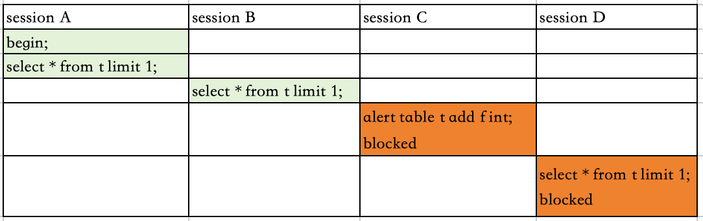
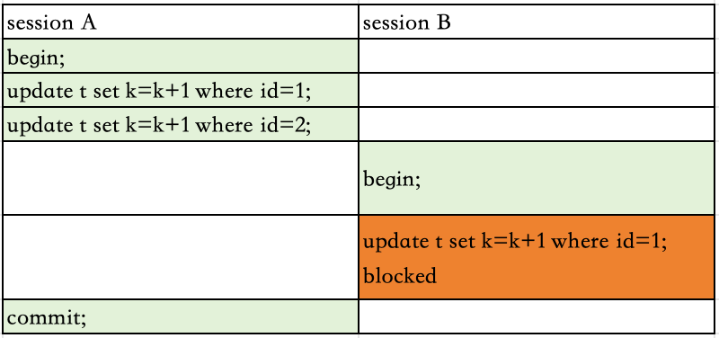
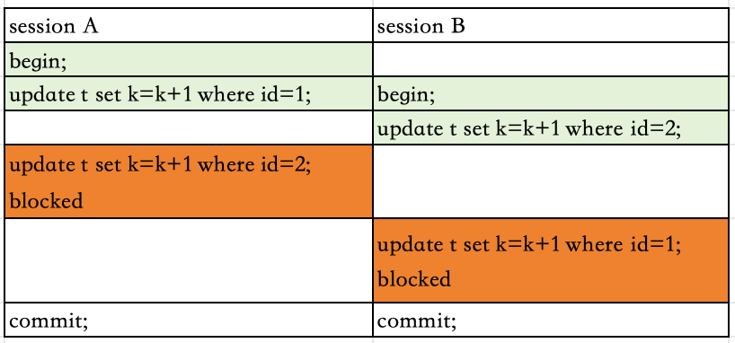
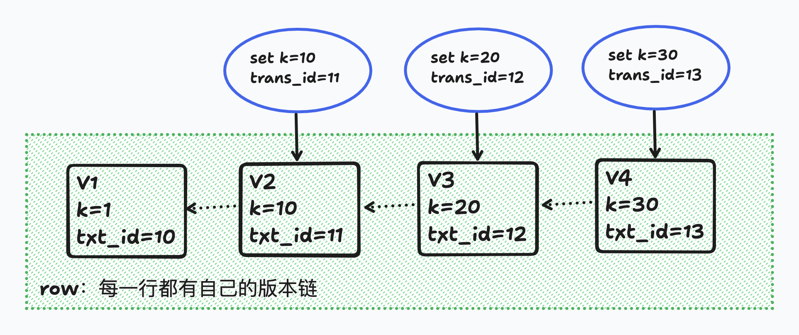
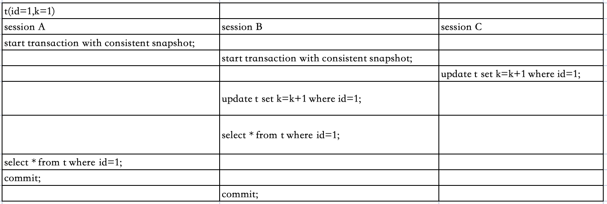
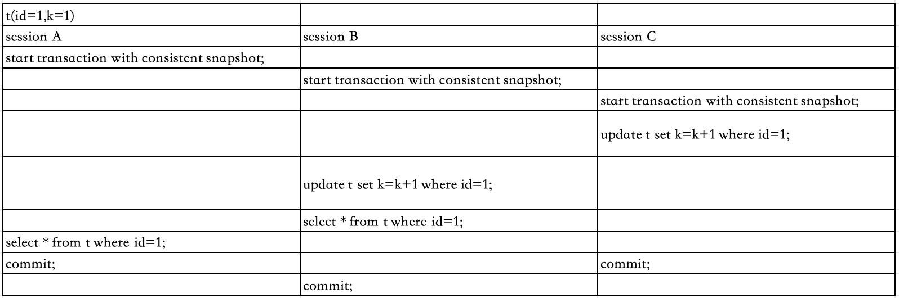

# 锁存在的意义

数据库锁设计的初衷是解决并发问题，Mysql作为多用户共享的资源，当出现并发问题时，数据库需要合理的控制资源的访问规则，锁就是用来控制资源的数据结构。

根据锁的控制范围，可以分为全局锁、表锁、行锁。

# 全局锁

全局锁是针对整个数据库实例加锁，加锁后整个实例就处于只读状态，后续的DML的写语句、DDL语句以及更新操作的事务提交语句都将被阻塞。

#### 应用场景

**1.备份整个库**

- 备份整个库时需要花费很多时间，避免不了会对数据有操作，会导致备份数据不完整，所以需要加全局锁来保证数据完整性。

- 加锁之后，DQL可以使用 （因为是全局读锁）。
1. 先加全局锁

```sql
# 加全局锁
flush tables with read lock;
```

2. 再备份数据

```shell
mysqldump -uroot -p123456 test1 > /opt/test1.sql
```

3. 最后释放全局锁（如果连接断开会自动释放全局锁，比较安全）

```sql
unlock tables;
```

<u>如果搜索引擎是InnoDB，可以使用不加全局锁进行一致性数据备份，因为Innodb的可重复读隔离级别是支持一致性视图的。</u>

```shell
mysqldump --single-transaction -uroot -p123456 test1 > /opt/test1.sql
```

但`--single-transation`方法只适用于所有表都使用了Innodb引擎。

#### 加全局锁备份需要注意的点

- 在主库上备份数据，不能进行增删改操作，业务停摆。

- 在从库上备份数据，会导致从库不能执行主库同步过来的二进制日志（binlog），会导致主从延迟。

#### 为什么不使用set global readonly=true？

`set global readonly=true`可以使数据库进入全库只读状态，但不推荐使用该种方式的原因：

- 在一些系统中，readonly可能用来做其他业务逻辑使用，比如用来判断是主库还是从库，所以修改global变量的影响更大。

- 在异常处理机制上有差异。如果执行`flush tables with read lock ;` 命令之后由于客户端发生异常断开，那么 MySQL 会自动释放这个全局锁，整个库回到可以正常更新的状态。而将整个库设置为 readonly 之后，如果客户端发生异常，则数据库就会一直保持 readonly 状态，这样会导致整个库长时间处于不可写状态，风险较高。

# 表级锁

锁住整张表，锁定粒度大，发生锁冲突的概率最高，并发度最低。

#### 表锁分类

Mysql里面表级锁分为两种：一种是表锁、一种是元数据锁（meta data lock，MDL）。

**1.表锁** 

- 表共享读锁（read lock）
  
  - A客户端对某一张表加上了读锁，那么A可以进行查询，但不能执行DDL和DML，B客户端也可以进行查询，但不能执行DDL和DML

- 表独占写锁（write lock）
  
  - A客户端对某一张表加锁了写锁，那么A可以对其进行DQL、DDL、DML，B客户端不能进行DQL、DDL、DML。


<u>总结：读锁不会阻塞其他客户端的读，但会阻塞写；写锁补单阻塞其他客户端的读，也会阻塞写。表锁的语法和加全局锁类似。</u>

```sql
  --加读锁，本线程和其他线程对t1只能读不能写
  lock tables t1 read; 
  --加写锁，本线程能对t2读写，其他线程不能读写
  lock tables t2 write;
  --释放锁
  flush tables t1;
```

**2.元数据锁(MDL)**

- meta data lock，元数据锁，简写MDL，MDL加锁过程是系统自动控制，无需显式使用。

- MDL锁主要是维护表元数据的数据一致性，不可以对元素进行写操作。如果一个查询正在遍历一个表中的数据，而执行期间另一个线程对这个表结构做变更，删了一列，那么查询线程拿到的结果跟表结构对不上，肯定是不行的。

- 为了避免DML和DDL冲突，保证读写的正确性。因此在Mysql5.5版本中引入了MDL。当对一个表做增删改查操作的时候，加 MDL 读锁；当要对表做结构变更操作的时候，加 MDL 写锁。

- 说人话就是一张表涉及到未提交的事务时，是不能修改这张表的表结构，元数据可以简单理解成标结构。

不同的SQL添加的元数据锁

| 对应SQL                                                      | 元数据锁类型       | 说明                                       |
| ---------------------------------------------------------- | ------------ | ---------------------------------------- |
| select .../ select ... lock in share mode                  | SHARED_READ  | 与SHARED_READ、SHARED_WRITE兼容，与EXCLUSIVE互斥 |
| insert .../ update .../ delete ... / select ... for update | SHARED_WRITE | 与SHARED_READ、SHARED_WRITE兼容，与EXCLUSIVE互斥 |
| alter table ...                                            | EXCLUSIVE    | 与其他的MDL都互斥                               |

演示SHARE_READ和SHARE_READ、SHARED_WRITE兼容

```shell
# 客户端A，开启事务并用select表
mysql> begin;
Query OK, 0 rows affected (0.00 sec)

mysql> select * from account;
+----+--------+---------+
| id | name   | money   |
+----+--------+---------+
|  1 | 张三   | 1000.00 |
|  2 | 李四   | 3000.00 |
|  3 | shanla |  100.00 |
+----+--------+---------+
3 rows in set (0.00 sec)

# B客户端，开启事务，用select表以及更新表都不会阻塞，说明SHARE_READ和SHARE_READ以及SHARE_WRITE不互斥
mysql> begin;
Query OK, 0 rows affected (0.00 sec)

mysql> select * from account;
+----+--------+---------+
| id | name   | money   |
+----+--------+---------+
|  1 | 张三   | 1000.00 |
|  2 | 李四   | 3000.00 |
|  3 | shanla |  100.00 |
+----+--------+---------+
3 rows in set (0.00 sec)

mysql> update account set money = 4000 where id = 3;
Query OK, 1 row affected (0.01 sec)
Rows matched: 1  Changed: 1  Warnings: 0

# 在C客户端查看元数据锁的信息
mysql> select object_type,object_schema,object_name,lock_type,lock_duration from performance_schema.metadata_locks ;
+-------------+--------------------+----------------+--------------+---------------+
| object_type | object_schema      | object_name    | lock_type    | lock_duration |
+-------------+--------------------+----------------+--------------+---------------+
| TABLE       | test1              | account        | SHARED_READ  | TRANSACTION   |
| TABLE       | test1              | account        | SHARED_READ  | TRANSACTION   |
| TABLE       | test1              | account        | SHARED_WRITE | TRANSACTION   |
| TABLE       | performance_schema | metadata_locks | SHARED_READ  | TRANSACTION   |
+-------------+--------------------+----------------+--------------+---------------+
```

演示SHARE_READ和EXCLUSIVE会阻塞，然后SHARE_WRITE也一样。

```shell
# A 客户端开启事务，生成SHARED_READ锁
mysql> begin;
Query OK, 0 rows affected (0.00 sec)

mysql> select * from account;
+----+--------+---------+
| id | name   | money   |
+----+--------+---------+
|  1 | 张三   | 1000.00 |
|  2 | 李四   | 3000.00 |
|  3 | shanla | 4000.00 |
+----+--------+---------+
3 rows in set (0.00 sec)

# B 客户端开启事务，通过alert table会生成EXCLUSIVE锁，且会阻塞
mysql> begin;
Query OK, 0 rows affected (0.00 sec)

mysql> alter table account add column avg_money int;
... # 这里会一直阻塞，因为和A客户端生成的SHARED_READ互斥阻塞

# C 客户端查看元数据锁的信息
mysql> select object_type,object_schema,object_name,lock_type,lock_duration from performance_schema.metadata_locks ;
+-------------+--------------------+----------------+---------------------+---------------+
| object_type | object_schema      | object_name    | lock_type           | lock_duration |
+-------------+--------------------+----------------+---------------------+---------------+
| TABLE       | test1              | account        | SHARED_READ         | TRANSACTION   |
| GLOBAL      | NULL               | NULL           | INTENTION_EXCLUSIVE | STATEMENT     |
| BACKUP LOCK | NULL               | NULL           | INTENTION_EXCLUSIVE | TRANSACTION   |
| SCHEMA      | test1              | NULL           | INTENTION_EXCLUSIVE | TRANSACTION   |
| TABLE       | test1              | account        | SHARED_UPGRADABLE   | TRANSACTION   |
| TABLESPACE  | NULL               | test1/account  | INTENTION_EXCLUSIVE | TRANSACTION   |
| TABLE       | test1              | #sql-1_21      | EXCLUSIVE           | STATEMENT     |
| TABLE       | test1              | account        | EXCLUSIVE           | TRANSACTION   |
| TABLE       | performance_schema | metadata_locks | SHARED_READ         | TRANSACTION   |
+-------------+--------------------+----------------+---------------------+---------------+

# A 客户端 commit，释放SHARED_READ锁，B客户端的阻塞会解除
mysql> commit;
Query OK, 0 rows affected (0.00 sec)

# B 客户端阻塞解除
Query OK, 0 rows affected (55.23 sec)
Records: 0  Duplicates: 0  Warnings: 0
```

##### 意向锁

- DML加了行锁之后，另外的客户端再来增加表锁时要判断是否有锁，需要遍历整个表去找是否有行锁，效率非常低。为了解决这个问题，在InnoDB中引入了意向锁，在DML加行锁时顺便给表加表的意向锁，下次其他客户端给表加锁时就不用遍历查找是否有行锁了，提高了效率。
- 意向共享锁（IS）
  - 通过`select ... lock in share mode`添加，与表锁共享锁兼容，与表排它锁互斥。
- 意向排它锁（IX）
  - 通过`insert`、`update`、`delete`、`select ... for update`添加，与表锁共享锁以及排它锁都互斥。
- 意向锁之间不会互斥。
- 一旦事务提交，意向共享锁、意向排它锁都会自动释放。

演示意向共享锁和表读锁是兼容的

```shell
# A客户端加意向共享锁
mysql> begin;
Query OK, 0 rows affected (0.00 sec)

mysql> select * from account where id = 1 lock in share mode;
+----+--------+---------+-----------+
| id | name   | money   | avg_money |
+----+--------+---------+-----------+
|  1 | 张三   | 1000.00 |      NULL |
+----+--------+---------+-----------+

# C客户端查看意向锁信息
mysql> select object_schema,object_name,index_name,lock_type,lock_mode,lock_data from performance_schema.data_locks;
+---------------+-------------+------------+-----------+---------------+-----------+
| object_schema | object_name | index_name | lock_type | lock_mode     | lock_data |
+---------------+-------------+------------+-----------+---------------+-----------+
| test1         | account     | NULL       | TABLE     | IS            | NULL      |
| test1         | account     | PRIMARY    | RECORD    | S,REC_NOT_GAP | 1         |
+---------------+-------------+------------+-----------+---------------+-----------+

# B客户端加表读锁成功，说明不互斥
mysql> lock tables account read;
Query OK, 0 rows affected (0.00 sec)
```

演示意向共享锁和表写锁是互斥的

```shell
# A客户端加意向共享锁
mysql> begin;
Query OK, 0 rows affected (0.00 sec)

mysql> select * from account where id = 1 lock in share mode;
+----+--------+---------+-----------+
| id | name   | money   | avg_money |
+----+--------+---------+-----------+
|  1 | 张三   | 1000.00 |      NULL |
+----+--------+---------+-----------+

# C客户端查看意向锁信息
mysql> select object_schema,object_name,index_name,lock_type,lock_mode,lock_data from performance_schema.data_locks;
+---------------+-------------+------------+-----------+---------------+-----------+
| object_schema | object_name | index_name | lock_type | lock_mode     | lock_data |
+---------------+-------------+------------+-----------+---------------+-----------+
| test1         | account     | NULL       | TABLE     | IS            | NULL      |
| test1         | account     | PRIMARY    | RECORD    | S,REC_NOT_GAP | 1         |
+---------------+-------------+------------+-----------+---------------+-----------+

# B客户端添加表写锁失败，说明是互斥的
mysql> lock tables account write;
... # 这里一直阻塞
```

演示意向排查锁和表读锁和表写锁都是互斥的

```shell
# A 客户端添加意向排查锁
mysql> begin;
Query OK, 0 rows affected (0.00 sec)

mysql> update account set avg_money = 1000 where id = 1;
Query OK, 1 row affected (0.00 sec)
Rows matched: 1  Changed: 1  Warnings: 0

# C客户端查看意向锁信息
mysql> select object_schema,object_name,index_name,lock_type,lock_mode,lock_data from performance_schema.data_locks;
+---------------+-------------+------------+-----------+---------------+-----------+
| object_schema | object_name | index_name | lock_type | lock_mode     | lock_data |
+---------------+-------------+------------+-----------+---------------+-----------+
| test1         | account     | NULL       | TABLE     | IX            | NULL      |
| test1         | account     | PRIMARY    | RECORD    | X,REC_NOT_GAP | 1         |
+---------------+-------------+------------+-----------+---------------+-----------+

# B客户端添加表读锁被阻塞
mysql> lock tables account read;
... # 被阻塞

# B客户端添加表写被阻塞
mysql> lock tables account write;
... # 被阻塞
```

#### 如何安全地给一个小表加字段？

通常给线上的数据表增加字段、修改字段、增加索引时，对于大表我们都会非常谨慎，但往往忽略了小表的操作，认为操作小表会很快，不会影响线上。这种认知是有问题的，也有可能会对数据库造成灾难。



session A先查询t表，会自动加上MDL读锁，因为开启了事务，要等到事务提交后才会释放MDL锁；session B查询t表时需要加的是读锁，所以可正常执行；session C修改了表字段，需要的是MDL写锁，但由于session A的读锁还未释放，session C会阻塞等待；session D虽然是MDL读锁，但由于前面的还在等待，他也会等待。

<u>如果某个表上的查询语句频繁，而且客户端有重试机制，也就是说超时后会再起一个新 session 再请求的话，这个库的线程很快就会爆满。</u>

此时可采用给alert语句增加等待时间，如果超过了等待时间则失败不再阻塞。

```sql
-- 等待N秒
alert table t WAIT N add f int;
```

# 行级锁

行级锁只有InnoDB支持，每次操作锁住对应的行数据，锁定粒度最小，发生锁冲突概率最低，并发度最高。行级锁不是锁记录，而是对索引上的索引项加锁来实现的。比如事务A更新一行数据时对该行加锁（事务提交之后才会释放），事务B也要更新该行时需要等待，必须等事务A提交或回滚后才能继续执行。

**两阶段锁协议**



sessionA开启事务，并更新表t，id=1和id=2的数据，此时会给id=1和id=2两行加上行锁；session B此时更新id=1的数据会被阻塞，必须等到session A事务提交之后才能继续执行。<u>也就是说在Innodb事务中，行锁是在需要的时候加上，但并不是立马释放，释放锁是在事务结束（提交或回滚）时，这就是两阶段锁协议。</u>

业务场景一：在商城中，客户购买商品时，需要扣减客户的账户余额，同时增加店铺的账户余额，程序怎么写更好？

分析：购买商品时，资金操作需要加上事务，有两种操作：一.先扣减客户的余额，再增加店铺的余额；二.先增加店铺余额，再扣减客户余额。因为店铺的余额记录只有一条，而且在大量客户购买时，瓶颈在更新店铺余额，应该减少操作店铺余额的锁等待，来提高并发。所以第二种写法操作店铺余额后立马commit就释放掉店铺余额的锁，以此来提高并发。

业务场景二：在业务场景一的基础上，店铺在某一天12点做活动，此时大量请求涌入，会发生什么？如何解决？

分析：虽然我们的程序将更新店铺余额操作写在最后，但遇到大量请求时，依然会堆积大量的锁等待，此时Mysql会直接崩掉，CPU消耗沾满（锁等待），但数据库每秒却执行很少的事务，也就是<mark>死锁</mark>。如何解决？这里只聊Mysql层面的，考虑分散店铺余额记录，将之前的一条余额记录分散成多条记录，在增加店铺余额时，随机取一条进行累加，以此来分散单行记录的锁等待时间。

**死锁和死锁检测**

并发系统中不同线程出现了循环依赖，涉及的线程都在等待别的线程释放资源，就会导致无限等待的情况，这就是死锁。

模拟发生死锁的场景：



session A开启事务，先更新id=1的记录（加锁）；session B开启事务，更新id=2的记录（加锁）；session A更新id=2的记录需要等待；session B更新id=1的记录需要等待，这样就会一直等待下去，导致死锁。

如何解决：

- 等待超时，Innodb有`innodb_lock_wait_timeout`参数控制锁等待超时时长（秒），默认值是50s，等待50s后第二个才会执行。这样的等待时间在实际业务中是无法忍受的，但如果把`innodb_lock_wait_timeout`时间设置为几秒，也是不可取的，会杀掉那些正常锁等待的线程。

- 发起死锁检测，发现死锁后，主动回滚锁链条中的某一个事务，让其他等待事务得以继续执行。通过配置`innodb_deadlock_detect`参数控制，设置为on表示开启。但死锁检测是有额外负担的，每一个被锁的事务都要看看它所依赖的线程有没有被别人锁住，如此循环，这样的时间复杂度是O(n)。会导致大量的CPU消耗。

要彻底解决死锁问题不能只靠Mysql，还要靠其他的外部方案进行限流。

**MVCC**

在Innodb可重复读隔离级别下，在事务开启后会存下一张快照，让在事务内读取到的数据都保持一致，但快照的时机也分情况。

- begin/start transaction，在第一个执行快照读语句时创建快照

- start transaction with consistent snapshot，在执行该语句的时候创建快照

快照在MVCC中如何工作？

先理解几个名词：

- transaction id，Innodb中每个事务都有一个唯一的事务ID，它是在事务开始时向Innodb事务系统申请的，是严格递增的。

- row txt_id，每行数据有多个版本，每次事务更新时都会生成一个新的版本，并发操作这行数据的transition id赋予给这个版本，记作row txt_id。但旧的数据版本依旧保留，在新的版本能追溯到旧版本（通过规则和undo log）

- roll_ptr，新版本指向旧版本的回滚指针。



如上图，row这一行记录，原始版本V1的值k=1，版本的操作事务ID是trx_id=10。

版本V2是事务trans_id=11修改时生成的，此时值k=10，版本的操作事务ID是trx_id=11。

版本V3是事务trans_id=12修改时生成的，此时值k=20，版本的操作事务ID是trx_id=12。

版本V4是事务trans_id=13修改时生成的，此时值k=30，版本的操作事务ID是trx_id=13。

虚线箭头就是回滚指针，指向上一个版本。此时物理磁盘已经修改成k=30，不同事务中看数据可以通过版本链通过一定的规则和回滚指针去追溯。

规则是什么？

Innodb在事务启动时，会为每个事务创建一个一致性读视图，一致性视图由四个元素组成：

1. m_ids：即事务启动时正在活跃的事务ID组成的视图数组，即记录当前活跃的所有事务ID的数组，活跃的是指启动了但没有提交的事务ID。
2. min_trx_id：m_ids中最小的trx_id；低水位
3. max_trx_id：m_ids中最大的trx_id；高水位
4. creator_trx_id：当前事务的事务ID；

那么上面事务的一致性读视图如下：

1. 事务trans_id=11创建时生成的一致性读视图：m_ids=[10,11]，min_trx_id=10，max_trx_id=11，creator_trx_id=11。
2. 事务trans_id=12创建时生成的一致性读视图：m_ids=[10,11,12]，min_trx_id=10，max_trx_id=12，creator_trx_id=12。
3. 事务trans_id=13创建时生成的一致性读视图：m_ids=[10,11,12,13]，min_trx_id=10，max_trx_id=13，creator_trx_id=13。

要知道当前事务到底看到哪个版本的数据，要从最新版本遍历去判断，找到最新的可见的就停止，如果不可见继续向后找。判断可见逻辑分下面几种情况：

1. 当版本的trx_id=creator_trx_id；说明正在访问自己修改的记录，当然可见
2. 当版本的trx_id>max_trx_id；说明在事务生成时这个版本还没创建，不可见
3. 当版本的trx_id<min_trx_id；说明在事务生成时这个版本已经提交，可见
4. 当版本的trx_id<=max_trx_id且>=min_trx_id；分为两种情况
   1. trx_id在m_ids中，说明创建时这个版本还未提交，不可见
   2. trx_id不在m_ids中，说明创建时这个版本已经提交，可见，照理来说这个情况应该是不存在的。

记录一致性读视图（ReadView）的时机：

1. 可重复读隔离级别（RR）下是在事务启动时记录（如果是start transaction with consistent snapshot立马创建，start transaction是在第一次读时创建）。

2. 读提交隔离级别（RC）下是在每次读之前都重新生成。

分析题1：



sessionA和sessionB分别查询到的数据是什么？

假设id=1的版本链最后一个版本的活跃的事务ID是99，session A的事务ID是100，session B的事务ID是101，session C的事务ID（没有开启事务但更新会自动开启事务）是102。

1. sessionA的一致性视图：m_ids=[99,100]，min_trx_id=99，max_trx_id=100，creator_trx_id=100

2. sessionB的一致性视图：m_ids=[99,100,101]，min_trx_id=99，max_trx_id=101，creator_trx_id=102

3. sessionC的一致性视图：m_ids=[99,100,101,102]，min_trx_id=99，max_trx_id=102，creator_trx_id=102

id=1的版本链：V1(k=1,trx_id=99) => V2(k=2,trx_id=102) => V3(k=3,trx_id=101)。

1. sessionA，遍历V3(trx_id>100)不可见 => V2(trx_id>100)不可见 => V1(trx_id<100)可见，最终sessionA读到的数据是V1版本，即k=1。

2. sessionB，遍历V3(trx_id=101)可见，最终sessionB读到的数据是V3版本，照理说sessionB开启事务比sessionC早，为什么读取到的数据不是k=2，是因为在更新时是先读再更新，这个读升级为当前读，因为sessionC早于sessionB更新了数据并提交（auto_commit=1），所以先当前读k=2，再+1，更新后是k=3，再读取是读自己更新的值。

分析题2：



sessionA和sessionB读取到的数据分别是什么？

这个和分析题1类似，但sessionC手动开启事务且比sessionB先提交，这就牵涉到两阶段提交协议，sessionB在更新id=1时发现sessionC正在更新id=1，需要等待sessionC提交事务，所以读取到的数据和分析题1是一样的。

更简便的规则记忆：

对于一个事务视图，除了自己的更新总是可见，有三种情况：

1. 版本未提交，不可见

2. 版本已提交，但在创建一致性视图之后提交的，不可见

3. 版本已提交，在创建一致性视图之前提交的，可见

**分类**

- 行锁
  
  - 锁定单个行记录，防止其他事务对此行进行update和delete操作，在RC和RR隔离级别下都支持。

- 间隙锁
  
  - 锁定索引记录间隙（不含记录），确保索引记录间隙不变，防止其他事务在这个间隙中进行insert（幻读）。在RR隔离级别下支持。

- 临键锁
  
  - 行锁和间隙锁的组合，同时锁住数据以及数据前后的间隙，在RR隔离级别下支持。

**行锁**

- 共享锁（S）：允许一个事务去读一行，防止其他事务获得相同数据集的排它锁。
  
  - 共享锁和其他共享锁兼容
  
  - 共享锁和其他排它锁互斥

- 排它锁（X）：允许获取排它锁的事务更新数据，防止其他事务获得相同数据集的共享锁和排它锁。
  
  - 排它锁和其他共享锁和排它锁都互斥

| SQL                           | 行锁类型 | 说明                     |
| ----------------------------- | ---- | ---------------------- |
| insert ...                    | 排他锁  | 自动加锁                   |
| update ...                    | 排他锁  | 自动加锁                   |
| delete ...                    | 排他锁  | 自动加锁                   |
| select ...                    | 不加锁  |                        |
| select ... lock in share mode | 共享锁  | 通过lock in share mode指定 |
| select ... for update         | 排他锁  | 通过for update指定         |

演示普通select不会加锁

```shell
# A客户端使用普通select
mysql> begin;
Query OK, 0 rows affected (0.00 sec)

mysql> select * from account where id = 1;
+----+--------+---------+-----------+
| id | name   | money   | avg_money |
+----+--------+---------+-----------+
|  1 | 张三   | 1000.00 |      1000 |
+----+--------+---------+-----------+

# C客户端查看行锁信息发现没有锁
mysql> select object_schema,object_name,index_name,lock_type,lock_mode,lock_data from performance_schema.data_locks;
Empty set (0.00 sec)
```

演示`select ... lock in share mode`，加共享锁，且共享锁之间兼容，与排它锁互斥

```shell
# A客户端添加行共享锁
mysql> begin;
Query OK, 0 rows affected (0.00 sec)

mysql> select * from account where id = 1 lock in share mode;
+----+--------+---------+-----------+
| id | name   | money   | avg_money |
+----+--------+---------+-----------+
|  1 | 张三   | 1000.00 |      1000 |
+----+--------+---------+-----------+

# C客户端查看行锁信息
mysql> select object_schema,object_name,index_name,lock_type,lock_mode,lock_data from performance_schema.data_locks;
+---------------+-------------+------------+-----------+---------------+-----------+
| object_schema | object_name | index_name | lock_type | lock_mode     | lock_data |
+---------------+-------------+------------+-----------+---------------+-----------+
| test1         | account     | NULL       | TABLE     | IS            | NULL      |
| test1         | account     | PRIMARY    | RECORD    | S,REC_NOT_GAP | 1         |
+---------------+-------------+------------+-----------+---------------+-----------+

# B客户端添加行共享锁，没有阻塞则表示兼容
mysql> begin;
Query OK, 0 rows affected (0.00 sec)

mysql> select * from account where id = 1 lock in share mode;
+----+--------+---------+-----------+
| id | name   | money   | avg_money |
+----+--------+---------+-----------+
|  1 | 张三   | 1000.00 |      1000 |
+----+--------+---------+-----------+

# C客户端再次查看锁信息
mysql> select object_schema,object_name,index_name,lock_type,lock_mode,lock_data from performance_schema.data_locks;
+---------------+-------------+------------+-----------+---------------+-----------+
| object_schema | object_name | index_name | lock_type | lock_mode     | lock_data |
+---------------+-------------+------------+-----------+---------------+-----------+
| test1         | account     | NULL       | TABLE     | IS            | NULL      |
| test1         | account     | PRIMARY    | RECORD    | S,REC_NOT_GAP | 1         |
| test1         | account     | NULL       | TABLE     | IS            | NULL      |
| test1         | account     | PRIMARY    | RECORD    | S,REC_NOT_GAP | 1         |
+---------------+-------------+------------+-----------+---------------+-----------+

# B客户端添加排它锁，发现阻塞表示互斥
mysql> update account set avg_money = 2000 where id = 1;
... # 这里阻塞

# C客户端查看锁信息
mysql> select object_schema,object_name,index_name,lock_type,lock_mode,lock_data from performance_schema.data_locks;
+---------------+-------------+------------+-----------+---------------+-----------+
| object_schema | object_name | index_name | lock_type | lock_mode     | lock_data |
+---------------+-------------+------------+-----------+---------------+-----------+
| test1         | account     | NULL       | TABLE     | IX            | NULL      |
| test1         | account     | NULL       | TABLE     | IS            | NULL      |
| test1         | account     | PRIMARY    | RECORD    | S,REC_NOT_GAP | 1         |
| test1         | account     | PRIMARY    | RECORD    | X,REC_NOT_GAP | 1         |
| test1         | account     | NULL       | TABLE     | IS            | NULL      |
| test1         | account     | PRIMARY    | RECORD    | S,REC_NOT_GAP | 1         |
+---------------+-------------+------------+-----------+---------------+-----------+
```

演示排他锁和排他锁之间互斥

```shell
# A客户端添加一个排他锁
mysql> begin;
Query OK, 0 rows affected (0.00 sec)

mysql> update account set avg_money=3000 where id = 1;
Query OK, 1 row affected (0.01 sec)
Rows matched: 1  Changed: 1  Warnings: 0

# B客户端添加一个排他锁，发现阻塞了
mysql> update account set avg_money = 4000 where id = 1;
... # 阻塞了

# C客户端查看锁信息
mysql> select object_schema,object_name,index_name,lock_type,lock_mode,lock_data from performance_schema.data_locks;
+---------------+-------------+------------+-----------+---------------+-----------+
| object_schema | object_name | index_name | lock_type | lock_mode     | lock_data |
+---------------+-------------+------------+-----------+---------------+-----------+
| test1         | account     | NULL       | TABLE     | IX            | NULL      |
| test1         | account     | PRIMARY    | RECORD    | X,REC_NOT_GAP | 1         |
| test1         | account     | NULL       | TABLE     | IX            | NULL      |
| test1         | account     | PRIMARY    | RECORD    | X,REC_NOT_GAP | 1         |
+---------------+-------------+------------+-----------+---------------+-----------+
```

演示无索引字段更新会将行级锁升级为表锁，创建了索引会不会导致行锁升级为表锁。

```shell
# 查看account表的索引，name字段无索引
mysql> show index from account;
+---------+------------+----------+--------------+-------------+-----------+-------------+----------+--------+------+------------+---------+---------------+---------+------------+
| Table   | Non_unique | Key_name | Seq_in_index | Column_name | Collation | Cardinality | Sub_part | Packed | Null | Index_type | Comment | Index_comment | Visible | Expression |
+---------+------------+----------+--------------+-------------+-----------+-------------+----------+--------+------+------------+---------+---------------+---------+------------+
| account |          0 | PRIMARY  |            1 | id          | A         |           3 |     NULL |   NULL |      | BTREE      |         |               | YES     | NULL       |
+---------+------------+----------+--------------+-------------+-----------+-------------+----------+--------+------+------------+---------+---------------+---------+------------+

# A客户端根据name更新，因为name字段没有建立索引，MySQL会将行级锁升级为表
mysql> begin;
Query OK, 0 rows affected (0.00 sec)

mysql> update account set avg_money = 1000 where name = '张三';
Query OK, 1 row affected (0.01 sec)
Rows matched: 1  Changed: 1  Warnings: 0

# B客户端设置其他的id会阻塞，说明此时锁了表
mysql> update account set avg_money = 3000 where id = 3;
... # 阻塞了

# C客户端查看锁信息
mysql> select object_schema,object_name,index_name,lock_type,lock_mode,lock_data from performance_schema.data_locks;
+---------------+-------------+------------+-----------+---------------+------------------------+
| object_schema | object_name | index_name | lock_type | lock_mode     | lock_data              |
+---------------+-------------+------------+-----------+---------------+------------------------+
| test1         | account     | NULL       | TABLE     | IX            | NULL                   |
| test1         | account     | PRIMARY    | RECORD    | X,REC_NOT_GAP | 3                      |
| test1         | account     | NULL       | TABLE     | IX            | NULL                   |
| test1         | account     | PRIMARY    | RECORD    | X             | supremum pseudo-record |
| test1         | account     | PRIMARY    | RECORD    | X             | 2                      |
| test1         | account     | PRIMARY    | RECORD    | X             | 3                      |
| test1         | account     | PRIMARY    | RECORD    | X             | 1                      |
+---------------+-------------+------------+-----------+---------------+------------------------+
```

**间隙锁&临键锁**

- 通过唯一索引字段（等值更新）且值不存在时，会生成间隙锁
  
  - 因为不存在，所以将前一个和后一个之间的间隙锁定怕中途有数据插入

- 通过非唯一索引字段（等值更新）操作生成间隙锁
  
  - 因为是非唯一索引字段，值就有可能会相同，所以不能锁单独一行，因为还有可能有多个，所以将前一个和后一个的间隙锁定怕中途有数据插入

- 通过唯一索引字段范围操作，生成间隙锁（临键锁，如果是>=这些会包含字段）
  
  - 因为是范围更新就没办法锁一行，会锁定范围内的所有行确保中途有数据操作

演示唯一索引等值操作，不存在时创建间隙锁

```shell
# A客户端按id更新不存在的行
mysql> begin;
Query OK, 0 rows affected (0.00 sec)

mysql> update account set avg_money = 1000 where id = 5;
Query OK, 0 rows affected (0.00 sec)

# C客户端查看锁信息，行锁为排他锁，且不是1行范围是supremum pseudo-record
mysql> select object_schema,object_name,index_name,lock_type,lock_mode,lock_data from performance_schema.data_locks;
+---------------+-------------+------------+-----------+-----------+------------------------+
| object_schema | object_name | index_name | lock_type | lock_mode | lock_data              |
+---------------+-------------+------------+-----------+-----------+------------------------+
| test1         | account     | NULL       | TABLE     | IX        | NULL                   |
| test1         | account     | PRIMARY    | RECORD    | X         | supremum pseudo-record |
+---------------+-------------+------------+-----------+-----------+------------------------+
```

演示非唯一索引字段等值操作时创建间隙锁

```shell
# A客户端按name更新，非唯一索引字段
mysql> begin;
Query OK, 0 rows affected (0.00 sec)

mysql> update account set avg_money = 3000 where name = '李四';
Query OK, 1 row affected (0.00 sec)
Rows matched: 1  Changed: 1  Warnings: 0

# C客户端查看锁信息，间隙锁supremum pseudo-record
mysql> select object_schema,object_name,index_name,lock_type,lock_mode,lock_data from performance_schema.data_locks;
+---------------+-------------+------------+-----------+-----------+------------------------+
| object_schema | object_name | index_name | lock_type | lock_mode | lock_data              |
+---------------+-------------+------------+-----------+-----------+------------------------+
| test1         | account     | NULL       | TABLE     | IX        | NULL                   |
| test1         | account     | PRIMARY    | RECORD    | X         | supremum pseudo-record |
| test1         | account     | PRIMARY    | RECORD    | X         | 3                      |
| test1         | account     | PRIMARY    | RECORD    | X         | 1                      |
| test1         | account     | PRIMARY    | RECORD    | X         | 2                      |
+---------------+-------------+------------+-----------+-----------+------------------------+
```

演示唯一索引范围操作时创建间隙锁

```shell
# A客户端唯一索引范围操作
mysql> begin;
Query OK, 0 rows affected (0.00 sec)

mysql> update account set avg_money = 3000 where id > 1;
Query OK, 1 row affected (0.00 sec)
Rows matched: 2  Changed: 1  Warnings: 0

# C客户端查看锁信息，创建了间隙锁
mysql> select object_schema,object_name,index_name,lock_type,lock_mode,lock_data from performance_schema.data_locks;
+---------------+-------------+------------+-----------+-----------+------------------------+
| object_schema | object_name | index_name | lock_type | lock_mode | lock_data              |
+---------------+-------------+------------+-----------+-----------+------------------------+
| test1         | account     | NULL       | TABLE     | IX        | NULL                   |
| test1         | account     | PRIMARY    | RECORD    | X         | supremum pseudo-record |
| test1         | account     | PRIMARY    | RECORD    | X         | 2                      |
| test1         | account     | PRIMARY    | RECORD    | X         | 3                      |
+---------------+-------------+------------+-----------+-----------+------------------------+
```
