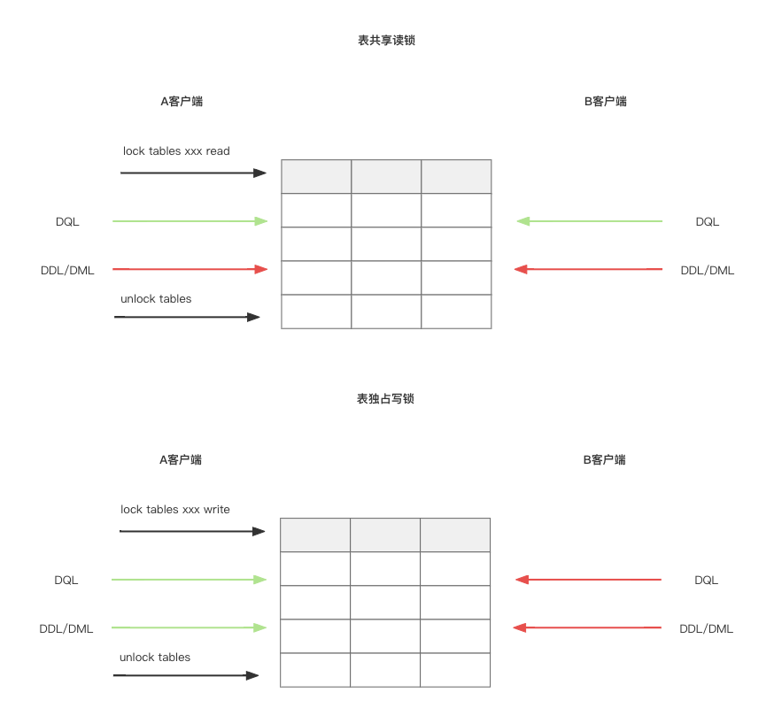

# 全局锁

全局锁是针对整个数据库实例加锁，加锁后整个实例就处于只读状态，后续的DML的写语句、DDL语句以及更新操作的事务提交语句都将被阻塞。

**应用场景**

- 备份整个库
  
  - 备份整个库时需要花费很多时间，避免不了会对数据有操作，会导致备份数据不完整。
  
  - 加锁之后，DQL可以使用。

先加全局锁

```sql
# 加全局锁
flush tables with read lock ;
```

再备份数据

```shell
mysqldump -uroot -p123456 test1 > /opt/test1.sql
```

最后释放全局锁

```sql
unlock tables ;
```

如果是InnoDB，可以使用不加锁一致性数据备份

```shell
mysqldump --single-transaction -uroot -p123456 test1 > /opt/test1.sql
```

**特点**

- 在主库上备份数据，不能进行增删改操作，业务停摆。

- 在从库上备份数据，会导致从库不能执行主库同步过来的二进制日志（binlog），会导致主从延迟。

# 表级锁

锁住整张表，锁定粒度大，发生锁冲突的概率最高，并发度最低。

**分类**

- 表锁
  
  - 表共享读锁（read lock）
    
    - A客户端对某一张表加上了读锁，那么A可以进行查询，但不能执行DDL和DML，B客户端也可以进行查询，但不能执行DDL和DML
  
  - 表独占写锁（write lock）
    
    - A客户端对某一张表加锁了写锁，那么A可以对其进行DQL、DDL、DML，B客户端不能进行DQL、DDL、DML。



总结：读锁不糊阻塞其他客户端的读，但会阻塞写；写锁补单阻塞其他客户端的读，也会阻塞写。

- 元数据锁
  
  - meta data lock，元数据锁，简写MDL，MDL加锁过程是系统自动控制，无需显式使用。
  
  - MDL锁主要是维护表元数据的数据一致性，不可以对元素进行写入操作。
  
  - 为了避免DML和DDL冲突，保证读写的正确性。
  
  - 说人话就是一张表涉及到未提交的事务时，是不能修改这张表的表结构，元数据可以简单理解成标结构。

不同的SQL添加的元数据锁

| 对应SQL                                                      | 元数据锁类型       | 说明                                       |
| ---------------------------------------------------------- | ------------ | ---------------------------------------- |
| select .../ select ... lock in share mode                  | SHARED_READ  | 与SHARED_READ、SHARED_WRITE兼容，与EXCLUSIVE互斥 |
| insert .../ update .../ delete ... / select ... for update | SHARED_WRITE | 与SHARED_READ、SHARED_WRITE兼容，与EXCLUSIVE互斥 |
| alter table ...                                            | EXCLUSIVE    | 与其他的MDL都互斥                               |

演示SHARE_READ和SHARE_READ、SHARED_WRITE兼容

```sql
# 客户端A，开启事务并用select表
mysql> begin;
Query OK, 0 rows affected (0.00 sec)

mysql> select * from account;
+----+--------+---------+
| id | name   | money   |
+----+--------+---------+
|  1 | 张三   | 1000.00 |
|  2 | 李四   | 3000.00 |
|  3 | shanla |  100.00 |
+----+--------+---------+
3 rows in set (0.00 sec)

# B客户端，开启事务，用select表以及更新表都不会阻塞，说明SHARE_READ和SHARE_READ以及SHARE_WRITE不互斥
mysql> begin;
Query OK, 0 rows affected (0.00 sec)

mysql> select * from account;
+----+--------+---------+
| id | name   | money   |
+----+--------+---------+
|  1 | 张三   | 1000.00 |
|  2 | 李四   | 3000.00 |
|  3 | shanla |  100.00 |
+----+--------+---------+
3 rows in set (0.00 sec)

mysql> update account set money = 4000 where id = 3;
Query OK, 1 row affected (0.01 sec)
Rows matched: 1  Changed: 1  Warnings: 0

# 在C客户端查看元数据锁的信息
mysql> select object_type,object_schema,object_name,lock_type,lock_duration from performance_schema.metadata_locks ;
+-------------+--------------------+----------------+--------------+---------------+
| object_type | object_schema      | object_name    | lock_type    | lock_duration |
+-------------+--------------------+----------------+--------------+---------------+
| TABLE       | test1              | account        | SHARED_READ  | TRANSACTION   |
| TABLE       | test1              | account        | SHARED_READ  | TRANSACTION   |
| TABLE       | test1              | account        | SHARED_WRITE | TRANSACTION   |
| TABLE       | performance_schema | metadata_locks | SHARED_READ  | TRANSACTION   |
+-------------+--------------------+----------------+--------------+---------------+
```

演示SHARE_READ和EXCLUSIVE会阻塞，然后SHARE_WRITE也一样。

```sql
# A 客户端开启事务，生成SHARED_READ锁
mysql> begin;
Query OK, 0 rows affected (0.00 sec)

mysql> select * from account;
+----+--------+---------+
| id | name   | money   |
+----+--------+---------+
|  1 | 张三   | 1000.00 |
|  2 | 李四   | 3000.00 |
|  3 | shanla | 4000.00 |
+----+--------+---------+
3 rows in set (0.00 sec)

# B 客户端开启事务，通过alert table会生成EXCLUSIVE锁，且会阻塞
mysql> begin;
Query OK, 0 rows affected (0.00 sec)

mysql> alter table account add column avg_money int;
... # 这里会一直阻塞，因为和A客户端生成的SHARED_READ互斥阻塞

# C 客户端查看元数据锁的信息
mysql> select object_type,object_schema,object_name,lock_type,lock_duration from performance_schema.metadata_locks ;
+-------------+--------------------+----------------+---------------------+---------------+
| object_type | object_schema      | object_name    | lock_type           | lock_duration |
+-------------+--------------------+----------------+---------------------+---------------+
| TABLE       | test1              | account        | SHARED_READ         | TRANSACTION   |
| GLOBAL      | NULL               | NULL           | INTENTION_EXCLUSIVE | STATEMENT     |
| BACKUP LOCK | NULL               | NULL           | INTENTION_EXCLUSIVE | TRANSACTION   |
| SCHEMA      | test1              | NULL           | INTENTION_EXCLUSIVE | TRANSACTION   |
| TABLE       | test1              | account        | SHARED_UPGRADABLE   | TRANSACTION   |
| TABLESPACE  | NULL               | test1/account  | INTENTION_EXCLUSIVE | TRANSACTION   |
| TABLE       | test1              | #sql-1_21      | EXCLUSIVE           | STATEMENT     |
| TABLE       | test1              | account        | EXCLUSIVE           | TRANSACTION   |
| TABLE       | performance_schema | metadata_locks | SHARED_READ         | TRANSACTION   |
+-------------+--------------------+----------------+---------------------+---------------+

# A 客户端 commit，释放SHARED_READ锁，B客户端的阻塞会解除
mysql> commit;
Query OK, 0 rows affected (0.00 sec)

# B 客户端阻塞解除
Query OK, 0 rows affected (55.23 sec)
Records: 0  Duplicates: 0  Warnings: 0
```

- 意向锁
  - DML加了行锁之后，另外的客户端再来增加表锁时要判断是否有锁，需要遍历整个表去找是否有行锁，效率非常低。为了解决这个问题，在InnoDB中引入了意向锁，在DML加行锁时顺便给表加表的意向锁，下次其他客户端给表加锁时就不用遍历查找是否有行锁了，提高了效率。
  - 意向共享锁（IS）
    - 通过`select ... lock in share mode`添加，与表锁共享锁兼容，与表排它锁互斥。
  - 意向排它锁（IX）
    - 通过`insert`、`update`、`delete`、`select ... for update`添加，与表锁共享锁以及排它锁都互斥。
  - 意向锁之间不会互斥。
  - 一旦事务提交，意向共享锁、意向排它锁都会自动释放。

演示意向共享锁和表读锁是兼容的

```sql
# A客户端加意向共享锁
mysql> begin;
Query OK, 0 rows affected (0.00 sec)

mysql> select * from account where id = 1 lock in share mode;
+----+--------+---------+-----------+
| id | name   | money   | avg_money |
+----+--------+---------+-----------+
|  1 | 张三   | 1000.00 |      NULL |
+----+--------+---------+-----------+

# C客户端查看意向锁信息
mysql> select object_schema,object_name,index_name,lock_type,lock_mode,lock_data from performance_schema.data_locks;
+---------------+-------------+------------+-----------+---------------+-----------+
| object_schema | object_name | index_name | lock_type | lock_mode     | lock_data |
+---------------+-------------+------------+-----------+---------------+-----------+
| test1         | account     | NULL       | TABLE     | IS            | NULL      |
| test1         | account     | PRIMARY    | RECORD    | S,REC_NOT_GAP | 1         |
+---------------+-------------+------------+-----------+---------------+-----------+

# B客户端加表读锁成功，说明不互斥
mysql> lock tables account read;
Query OK, 0 rows affected (0.00 sec)
```

演示意向共享锁和表写锁是互斥的

```sql
# A客户端加意向共享锁
mysql> begin;
Query OK, 0 rows affected (0.00 sec)

mysql> select * from account where id = 1 lock in share mode;
+----+--------+---------+-----------+
| id | name   | money   | avg_money |
+----+--------+---------+-----------+
|  1 | 张三   | 1000.00 |      NULL |
+----+--------+---------+-----------+

# C客户端查看意向锁信息
mysql> select object_schema,object_name,index_name,lock_type,lock_mode,lock_data from performance_schema.data_locks;
+---------------+-------------+------------+-----------+---------------+-----------+
| object_schema | object_name | index_name | lock_type | lock_mode     | lock_data |
+---------------+-------------+------------+-----------+---------------+-----------+
| test1         | account     | NULL       | TABLE     | IS            | NULL      |
| test1         | account     | PRIMARY    | RECORD    | S,REC_NOT_GAP | 1         |
+---------------+-------------+------------+-----------+---------------+-----------+

# B客户端添加表写锁失败，说明是互斥的
mysql> lock tables account write;
... # 这里一直阻塞
```

演示意向排查锁和表读锁和表写锁都是互斥的

```sql
# A 客户端添加意向排查锁
mysql> begin;
Query OK, 0 rows affected (0.00 sec)

mysql> update account set avg_money = 1000 where id = 1;
Query OK, 1 row affected (0.00 sec)
Rows matched: 1  Changed: 1  Warnings: 0

# C客户端查看意向锁信息
mysql> select object_schema,object_name,index_name,lock_type,lock_mode,lock_data from performance_schema.data_locks;
+---------------+-------------+------------+-----------+---------------+-----------+
| object_schema | object_name | index_name | lock_type | lock_mode     | lock_data |
+---------------+-------------+------------+-----------+---------------+-----------+
| test1         | account     | NULL       | TABLE     | IX            | NULL      |
| test1         | account     | PRIMARY    | RECORD    | X,REC_NOT_GAP | 1         |
+---------------+-------------+------------+-----------+---------------+-----------+

# B客户端添加表读锁被阻塞
mysql> lock tables account read;
... # 被阻塞

# B客户端添加表写被阻塞
mysql> lock tables account write;
... # 被阻塞
```

# 行级锁

行级锁只有InnoDB支持，每次操作锁住对应的行数据，锁定粒度最小，发生锁冲突概率最低，并发度最高。行级锁不是锁记录，而是对索引上的索引项加锁来实现的。

**分类**

- 行锁
  
  - 锁定单个行记录，防止其他事务对此行进行update和delete操作，在RC和RR隔离级别下都支持。

- 间隙锁
  
  - 锁定索引记录间隙（不含记录），确保索引记录间隙不变，防止其他事务在这个间隙中进行insert（幻读）。在RR隔离级别下支持。

- 临键锁
  
  - 行锁和间隙锁的组合，同时锁住数据以及数据前后的间隙，在RR隔离级别下支持。

**行锁**

- 共享锁（S）：允许一个事务去读一行，防止其他事务获得相同数据集的排它锁。
  
  - 共享锁和其他共享锁兼容
  
  - 共享锁和其他排它锁互斥

- 排它锁（X）：允许获取排它锁的事务更新数据，防止其他事务获得相同数据集的共享锁和排它锁。
  
  - 排它锁和其他共享锁和排它锁都互斥

| SQL                           | 行锁类型 | 说明                     |
| ----------------------------- | ---- | ---------------------- |
| insert ...                    | 排他锁  | 自动加锁                   |
| update ...                    | 排他锁  | 自动加锁                   |
| delete ...                    | 排他锁  | 自动加锁                   |
| select ...                    | 不加锁  |                        |
| select ... lock in share mode | 共享锁  | 通过lock in share mode指定 |
| select ... for update         | 排他锁  | 通过for update指定         |

演示普通select不会加锁

```sql
# A客户端使用普通select
mysql> begin;
Query OK, 0 rows affected (0.00 sec)

mysql> select * from account where id = 1;
+----+--------+---------+-----------+
| id | name   | money   | avg_money |
+----+--------+---------+-----------+
|  1 | 张三   | 1000.00 |      1000 |
+----+--------+---------+-----------+

# C客户端查看行锁信息发现没有锁
mysql> select object_schema,object_name,index_name,lock_type,lock_mode,lock_data from performance_schema.data_locks;
Empty set (0.00 sec)
```

演示`select ... lock in share mode`，加共享锁，且共享锁之间兼容，与排它锁互斥

```sql
# A客户端添加行共享锁
mysql> begin;
Query OK, 0 rows affected (0.00 sec)

mysql> select * from account where id = 1 lock in share mode;
+----+--------+---------+-----------+
| id | name   | money   | avg_money |
+----+--------+---------+-----------+
|  1 | 张三   | 1000.00 |      1000 |
+----+--------+---------+-----------+

# C客户端查看行锁信息
mysql> select object_schema,object_name,index_name,lock_type,lock_mode,lock_data from performance_schema.data_locks;
+---------------+-------------+------------+-----------+---------------+-----------+
| object_schema | object_name | index_name | lock_type | lock_mode     | lock_data |
+---------------+-------------+------------+-----------+---------------+-----------+
| test1         | account     | NULL       | TABLE     | IS            | NULL      |
| test1         | account     | PRIMARY    | RECORD    | S,REC_NOT_GAP | 1         |
+---------------+-------------+------------+-----------+---------------+-----------+

# B客户端添加行共享锁，没有阻塞则表示兼容
mysql> begin;
Query OK, 0 rows affected (0.00 sec)

mysql> select * from account where id = 1 lock in share mode;
+----+--------+---------+-----------+
| id | name   | money   | avg_money |
+----+--------+---------+-----------+
|  1 | 张三   | 1000.00 |      1000 |
+----+--------+---------+-----------+

# C客户端再次查看锁信息
mysql> select object_schema,object_name,index_name,lock_type,lock_mode,lock_data from performance_schema.data_locks;
+---------------+-------------+------------+-----------+---------------+-----------+
| object_schema | object_name | index_name | lock_type | lock_mode     | lock_data |
+---------------+-------------+------------+-----------+---------------+-----------+
| test1         | account     | NULL       | TABLE     | IS            | NULL      |
| test1         | account     | PRIMARY    | RECORD    | S,REC_NOT_GAP | 1         |
| test1         | account     | NULL       | TABLE     | IS            | NULL      |
| test1         | account     | PRIMARY    | RECORD    | S,REC_NOT_GAP | 1         |
+---------------+-------------+------------+-----------+---------------+-----------+

# B客户端添加排它锁，发现阻塞表示互斥
mysql> update account set avg_money = 2000 where id = 1;
... # 这里阻塞

# C客户端查看锁信息
mysql> select object_schema,object_name,index_name,lock_type,lock_mode,lock_data from performance_schema.data_locks;
+---------------+-------------+------------+-----------+---------------+-----------+
| object_schema | object_name | index_name | lock_type | lock_mode     | lock_data |
+---------------+-------------+------------+-----------+---------------+-----------+
| test1         | account     | NULL       | TABLE     | IX            | NULL      |
| test1         | account     | NULL       | TABLE     | IS            | NULL      |
| test1         | account     | PRIMARY    | RECORD    | S,REC_NOT_GAP | 1         |
| test1         | account     | PRIMARY    | RECORD    | X,REC_NOT_GAP | 1         |
| test1         | account     | NULL       | TABLE     | IS            | NULL      |
| test1         | account     | PRIMARY    | RECORD    | S,REC_NOT_GAP | 1         |
+---------------+-------------+------------+-----------+---------------+-----------+
```

演示排他锁和排他锁之间互斥

```sql
# A客户端添加一个排他锁
mysql> begin;
Query OK, 0 rows affected (0.00 sec)

mysql> update account set avg_money=3000 where id = 1;
Query OK, 1 row affected (0.01 sec)
Rows matched: 1  Changed: 1  Warnings: 0

# B客户端添加一个排他锁，发现阻塞了
mysql> update account set avg_money = 4000 where id = 1;
... # 阻塞了

# C客户端查看锁信息
mysql> select object_schema,object_name,index_name,lock_type,lock_mode,lock_data from performance_schema.data_locks;
+---------------+-------------+------------+-----------+---------------+-----------+
| object_schema | object_name | index_name | lock_type | lock_mode     | lock_data |
+---------------+-------------+------------+-----------+---------------+-----------+
| test1         | account     | NULL       | TABLE     | IX            | NULL      |
| test1         | account     | PRIMARY    | RECORD    | X,REC_NOT_GAP | 1         |
| test1         | account     | NULL       | TABLE     | IX            | NULL      |
| test1         | account     | PRIMARY    | RECORD    | X,REC_NOT_GAP | 1         |
+---------------+-------------+------------+-----------+---------------+-----------+
```

演示无索引字段更新会将行级锁升级为表锁，创建了索引会不会导致行锁升级为表锁。

```sql
# 查看account表的索引，name字段无索引
mysql> show index from account;
+---------+------------+----------+--------------+-------------+-----------+-------------+----------+--------+------+------------+---------+---------------+---------+------------+
| Table   | Non_unique | Key_name | Seq_in_index | Column_name | Collation | Cardinality | Sub_part | Packed | Null | Index_type | Comment | Index_comment | Visible | Expression |
+---------+------------+----------+--------------+-------------+-----------+-------------+----------+--------+------+------------+---------+---------------+---------+------------+
| account |          0 | PRIMARY  |            1 | id          | A         |           3 |     NULL |   NULL |      | BTREE      |         |               | YES     | NULL       |
+---------+------------+----------+--------------+-------------+-----------+-------------+----------+--------+------+------------+---------+---------------+---------+------------+

# A客户端根据name更新，因为name字段没有建立索引，MySQL会将行级锁升级为表
mysql> begin;
Query OK, 0 rows affected (0.00 sec)

mysql> update account set avg_money = 1000 where name = '张三';
Query OK, 1 row affected (0.01 sec)
Rows matched: 1  Changed: 1  Warnings: 0

# B客户端设置其他的id会阻塞，说明此时锁了表
mysql> update account set avg_money = 3000 where id = 3;
... # 阻塞了

# C客户端查看锁信息
mysql> select object_schema,object_name,index_name,lock_type,lock_mode,lock_data from performance_schema.data_locks;
+---------------+-------------+------------+-----------+---------------+------------------------+
| object_schema | object_name | index_name | lock_type | lock_mode     | lock_data              |
+---------------+-------------+------------+-----------+---------------+------------------------+
| test1         | account     | NULL       | TABLE     | IX            | NULL                   |
| test1         | account     | PRIMARY    | RECORD    | X,REC_NOT_GAP | 3                      |
| test1         | account     | NULL       | TABLE     | IX            | NULL                   |
| test1         | account     | PRIMARY    | RECORD    | X             | supremum pseudo-record |
| test1         | account     | PRIMARY    | RECORD    | X             | 2                      |
| test1         | account     | PRIMARY    | RECORD    | X             | 3                      |
| test1         | account     | PRIMARY    | RECORD    | X             | 1                      |
+---------------+-------------+------------+-----------+---------------+------------------------+
```

**间隙锁&临键锁**

- 通过唯一索引字段（等值更新）且值不存在时，会生成间隙锁
  
  - 因为不存在，所以将前一个和后一个之间的间隙锁定怕中途有数据插入

- 通过非唯一索引字段（等值更新）操作生成间隙锁
  
  - 因为是非唯一索引字段，值就有可能会相同，所以不能锁单独一行，因为还有可能有多个，所以将前一个和后一个的间隙锁定怕中途有数据插入

- 通过唯一索引字段范围操作，生成间隙锁（临键锁，如果是>=这些会包含字段）
  
  - 因为是范围更新就没办法锁一行，会锁定范围内的所有行确保中途有数据操作

演示唯一索引等值操作，不存在时创建间隙锁

```sql
# A客户端按id更新不存在的行
mysql> begin;
Query OK, 0 rows affected (0.00 sec)

mysql> update account set avg_money = 1000 where id = 5;
Query OK, 0 rows affected (0.00 sec)

# C客户端查看锁信息，行锁为排他锁，且不是1行范围是supremum pseudo-record
mysql> select object_schema,object_name,index_name,lock_type,lock_mode,lock_data from performance_schema.data_locks;
+---------------+-------------+------------+-----------+-----------+------------------------+
| object_schema | object_name | index_name | lock_type | lock_mode | lock_data              |
+---------------+-------------+------------+-----------+-----------+------------------------+
| test1         | account     | NULL       | TABLE     | IX        | NULL                   |
| test1         | account     | PRIMARY    | RECORD    | X         | supremum pseudo-record |
+---------------+-------------+------------+-----------+-----------+------------------------+
```

演示非唯一索引字段等值操作时创建间隙锁

```sql
# A客户端按name更新，非唯一索引字段
mysql> begin;
Query OK, 0 rows affected (0.00 sec)

mysql> update account set avg_money = 3000 where name = '李四';
Query OK, 1 row affected (0.00 sec)
Rows matched: 1  Changed: 1  Warnings: 0

# C客户端查看锁信息，间隙锁supremum pseudo-record
mysql> select object_schema,object_name,index_name,lock_type,lock_mode,lock_data from performance_schema.data_locks;
+---------------+-------------+------------+-----------+-----------+------------------------+
| object_schema | object_name | index_name | lock_type | lock_mode | lock_data              |
+---------------+-------------+------------+-----------+-----------+------------------------+
| test1         | account     | NULL       | TABLE     | IX        | NULL                   |
| test1         | account     | PRIMARY    | RECORD    | X         | supremum pseudo-record |
| test1         | account     | PRIMARY    | RECORD    | X         | 3                      |
| test1         | account     | PRIMARY    | RECORD    | X         | 1                      |
| test1         | account     | PRIMARY    | RECORD    | X         | 2                      |
+---------------+-------------+------------+-----------+-----------+------------------------+
```

演示唯一索引范围操作时创建间隙锁

```sql
# A客户端唯一索引范围操作
mysql> begin;
Query OK, 0 rows affected (0.00 sec)

mysql> update account set avg_money = 3000 where id > 1;
Query OK, 1 row affected (0.00 sec)
Rows matched: 2  Changed: 1  Warnings: 0

# C客户端查看锁信息，创建了间隙锁
mysql> select object_schema,object_name,index_name,lock_type,lock_mode,lock_data from performance_schema.data_locks;
+---------------+-------------+------------+-----------+-----------+------------------------+
| object_schema | object_name | index_name | lock_type | lock_mode | lock_data              |
+---------------+-------------+------------+-----------+-----------+------------------------+
| test1         | account     | NULL       | TABLE     | IX        | NULL                   |
| test1         | account     | PRIMARY    | RECORD    | X         | supremum pseudo-record |
| test1         | account     | PRIMARY    | RECORD    | X         | 2                      |
| test1         | account     | PRIMARY    | RECORD    | X         | 3                      |
+---------------+-------------+------------+-----------+-----------+------------------------+
```


