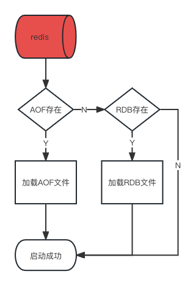

# Redis持久化

**为什么需要持久化**

Redis是存储在内存中的数据库，一旦重启服务或宕机会导致内存中的数据丢失，所以需要采用持久化功能将内存中的数据写入到磁盘，重新启动时恢复。

**持久化工具**

- RDB

- AOF

# RDB

**是什么**

RDB（Redis database）持久性以指定的时间间隔执行数据集的时间点快照，也就是把某一时刻的数据和状态以文件的形式写入磁盘。即使宕机，快照文件也不会丢失，来保证数据的可靠性。这个快照文件被称为RDB文件（dump.rdb）。

**自动触发**

- 修改配置

```shell
# Unless specified otherwise, by default Redis will save the DB:
#   * After 3600 seconds (an hour) if at least 1 change was performed
#   * After 300 seconds (5 minutes) if at least 100 changes were performed
#   * After 60 seconds if at least 10000 changes were performed
#
# You can set these explicitly by uncommenting the following line.
#
# save 3600 1 300 100 60 10000
save 5 2 # 如果发现有2次或以上的变更就触发一次自动保存
...
# The filename where to dump the DB
dbfilename dump6379.rdb # 修改rdb的名称方便
...
# Note that you must specify a directory here, not a file name.
dir /myredis/dumpfiles # 自定义rdb文件保存目录，这个目录要提前建好
```

- 重启redis

```shell
# 停掉redis
redis-cli -a 123 shutdown
# 启动redis
redis-server /myredis/redis.conf
```

- 可以通过命令查看配置

```shell
# config get 配置项
127.0.0.1:6379> config get dir
1) "dir"
2) "/myredis/dumpfiles"
```

- 触发备份

```shell
# 如果是5秒内，设置两个值，会立刻写入rdb
# 如果第一个在5秒内，第二个在5秒外，当第二个执行时就直接写入rdb，然后重新计时
127.0.0.1:6379> set k1 v1
OK
127.0.0.1:6379> set k2 v2
OK
```

- 如何恢复

```shell
# 模拟
# 1. 先将rdb重命名备份
mv dump6379.rdb dump6379.rdb.backup
# 2. flushdb清空库，此时会新生成rdb文件，但里面已经没有数据因为执行了flushdb，保持数据一致性
127.0.0.1:6379> flushdb
OK
127.0.0.1:6379> keys *
(empty array)
# 3. 重启redis
127.0.0.1:6379> shutdown
not connected> quit
redis-server /myredis/redis.conf
# 4. 没有数据，因为用的是清空数据库时候的rdb文件
127.0.0.1:6379> keys *
(empty array)
# 5. 将flushdb之前的rdb文件还原
rm dump6379.rdb
rm：是否删除普通文件 "dump6379.rdb"？y
mv dump6379.rdb.backup dump6379.rdb
# 6. 重启redis查看数据，已经恢复
127.0.0.1:6379> dbsize
(integer) 6
```

**手动触发**

有时候一些重要的数据写入，需要马上写入rdb，此时就需要手动触发。手动触发提供了两个命令save和bgsave。

- save
  
  - 在主程序中执行会阻塞当前redis服务，直到持久化工作完成。
  
  - 执行命令期间，redis不能处理其他命令。
  
  - 线上环境禁止使用
  
  ```shell
  127.0.0.1:6379> set k7 v7
  OK
  # 会立马将变更的数据写入rdb
  127.0.0.1:6379> save
  OK
  ```

- bgsave
  
  - 在后台异步进行快照操作，不阻塞，不影响Redis的其他命令。
  
  - gbsave会fork出一个和主进程一模一样的子进程进行持久化工作。
  
  - 在Linux程序中，fork()会产生一个和父进程完全相同的子进程，但子进程在此后多会exec系统调用，出于效率考虑，尽量避免膨胀。
  
  ```shell
  127.0.0.1:6379> set k8 v8
  OK
  127.0.0.1:6379> bgsave
  Background saving started
  # 可以通过lastsave查看最后一次save事件，自动触发也可以用
  127.0.0.1:6379> lastsave
  (integer) 1684587217
  ```

**优势**

- 适合大规模的数据恢复，很快，因为是快照。

- 可以业务调整定时备份。

- 对数据完整性和一致性要求不高。

- rdb文件在内存中的加载速度比aof快得多。

**劣势**

- 并不是实时备份，总会有某一刻没有备份的数据，所以在redis以外down的时候，就会丢失从当前到最近一次快照期间的数据。

- 数据的全量同步，如果数据量太大会导致I/O严重。

- RDB依赖主进程的fork，在更大的数据集中，可能会导致服务请求的瞬间延迟，fork时内存中的数据会被克隆一份，大致2倍的膨胀性，需要考虑。

**修复dump.rdb文件**

极端情况下redis正在写入一个很大的数据后备份时down掉，可能会导致dump.rdb不完整，这时就需要修复dump.rdb文件了。

```shell
[root@localhost myredis]# redis-check-rdb /myredis/dumpfiles/dump6379.rdb
[offset 0] Checking RDB file /myredis/dumpfiles/dump6379.rdb
[offset 26] AUX FIELD redis-ver = '7.0.0'
[offset 40] AUX FIELD redis-bits = '64'
[offset 52] AUX FIELD ctime = '1684587365'
[offset 67] AUX FIELD used-mem = '1080320'
[offset 79] AUX FIELD aof-base = '0'
[offset 81] Selecting DB ID 0
[offset 165] Checksum OK
[offset 165] \o/ RDB looks OK! \o/
[info] 10 keys read
[info] 0 expires
[info] 0 already expired
```

**触发RDB快照的场景**

- 配置文件的快照配置条件达成时会自动触发

- 执行save/bgsave时会手动触发

- 执行flushdb/flushall命令时会触发，将数据变为空保持一致性

- 执行shutdown时（且没有开启AOF持久化）会最后一次触发将没有备份的数据写入rdb文件。

- 主从复制时，主节点自动触发。

**禁止快照**

调整配置，`save ""`

**更多配置**

```shell
# 默认yes
# 如果配置成no，表示不在乎数据不一致或者有其他的手段发现和控制这种不一致
# 那么在快照写入失败时，也能确保redis继续接受新的写请求
stop-writes-on-bgsave-error yes
# 默认yes
# 对于存储到磁盘中的快照，可以设置是否进行压缩存储。如果是的话，redis会采用LZF算法进行压缩。
# 如果不想消耗CPU来进行压缩的话，可以设置为关闭此功能
rdbcompression yes
# 默认yes
# 在存储快照后，还可以让redis使用CRC64算法来进行数据校验，但是这样做会增加大约10%的性能消耗
# 如果希望获取到最大的性能提升，可以关闭此功能
rdbchecksum yes
# 在没有持久性的情况下删除复制中使用的RDB文件启用。默认情况下no，此选项是禁用的。
rdb-del-sync-files no
```

**注意**

- 不可以把备份文件dump.rdb和生产redis服务器放到同一台机器，必须分开存储，以防生产机物理顺怀后备份文件也挂了。

# AOF

以日志的形式记录每一个写操作，redis启动时会读取文件重新构建数据。也就是说redis重启时就根据日志文件的内容将写指令从前到最后执行一次以完成数据的恢复工作。

默认redis不开启AOF，需要手动修改配置文件。

**AOF工作流程**


**AOF三种回写磁盘策略**

- Always
  
  - 同步回写，每个写命令执行完就立刻同步写回磁盘（没有缓冲区）。
  
  - 优点：可靠性高，数据基本不丢失。
  
  - 缺点：每个写命令都要落盘，性能影响大。

- everysec
  
  - 每秒写回，先把日志写到AOF内存缓冲区，每隔1s把缓冲区内容写回磁盘。
  
  - 优点：性能适中。
  
  - 缺点：宕机时丢失1秒内的数据。

- no
  
  - 操作系统控制的写回，命令执行完后先写到AOF缓冲区，由操作系统决定何时将缓冲区内容写回磁盘。
  
  - 优点：性能好。
  
  - 缺点：宕机时丢失数据较多。

**AOF流程**

- 调整配置

```shell
# 先把rdb的保存目录设置为更清晰的目录
dir /myredis
# 开启AOF功能，默认是no
appendonly yes
# 设置回写策略
# appendfsync always
appendfsync everysec
# appendfsync
# AOF文件的目录，会在dir设置的目录下创建appendonlydir目录，并将AOF文件保存在下面
appenddirname "appendonlydir"
# AOF文件名，和redis6相比，redis只会生成一个文件，而redis7会生成三个文件
# .base.rdb是基本文件，.incr.aof是增量文件，.aof.manifest清单文件
# - appendonly.aof.1.base.rdb as a base file.
# - appendonly.aof.1.incr.aof, appendonly.aof.2.incr.aof as incremental files.
# - appendonly.aof.manifest as a manifest file.
appendfilename "appendonly.aof"
# aof重写期间是否同步
no-appendfsync-on-rewrite no
```

- 重启redis

```shell
127.0.0.1:6379> shutdown
not connected> quit
redis-server /myredis/redis.conf
redis-cli -a 123
```

- 修改命令

```shell
127.0.0.1:6379> keys *
(empty array)
127.0.0.1:6379> set k1 v1
OK
```

- 查看AOF日志文件是否生成

```shell
cd /myredis/appendonlydir
ll
总用量 12
-rw-r--r-- 1 root root 88 5月  22 11:50 appendonly.aof.1.base.rdb
-rw-r--r-- 1 root root 52 5月  22 11:53 appendonly.aof.1.incr.aof
-rw-r--r-- 1 root root 88 5月  22 11:50 appendonly.aof.manifest
```

- 模拟宕机数据恢复

```shell
# 1. 先整体拷贝appendonlydir
mv appendonlydir appendonlydir.backup
# 2. 清空库并退出
127.0.0.1:6379> flushdb
OK
127.0.0.1:6379> shutdown
not connected> quit
# 3. 重启服务，没有数据
redis-cli -a 123
127.0.0.1:6379> keys *
(empty array)
# 4. 停掉redis
127.0.0.1:6379> shutdown
not connected> quit
# 5. 将备份的appendonlydir还原
rm -rf appendonlydir && rm -f dump6379.rdb
mv appendonlydir.backup appendonlydir
# 6. 启动redis,发现数据恢复了
redis-server /myredis/redis.conf
redis-cli -a 123
127.0.0.1:6379> keys *
1) "k1"
```

**修复aof文件**

在极端情况下aof文件异常了，需要通过工具进行修复文件修复。

1. 修改aof文件模拟异常

```shell
vim appendonly.aof.1.incr.aof

# aof文件内容
*2
$6
SELECT
$1
0
*3
$3
set
$2
k1
$2
v1
# 在末尾随便增加
asdjflasjdf;ajdsf;ajsdf;ajsd
```

2. 重启redis

```shell
127.0.0.1:6379> shutdown
not connected> quit
redis-server /myredis/redis.conf
ps -ef|grep redis
# 发现redis没有启动
root      4195  4030  0 14:10 pts/0    00:00:00 grep --color=auto redis
```

3. 修复文件

```shell
redis-check-aof --fix /myredis/appendonlydir/appendonly.aof.1.incr.aof
# 结果：
Start checking Old-Style AOF
AOF /myredis/appendonlydir/appendonly.aof.1.incr.aof format error
AOF analyzed: filename=/myredis/appendonlydir/appendonly.aof.1.incr.aof, size=82, ok_up_to=52, ok_up_to_line=13, diff=30
This will shrink the AOF /myredis/appendonlydir/appendonly.aof.1.incr.aof from 82 bytes, with 30 bytes, to 52 bytes
Continue? [y/N]: y
Successfully truncated AOF /myredis/appendonlydir/appendonly.aof.1.incr.aof
```

4. 启动redis

```shell
redis-server /myredis/redis.conf
ps -ef|grep redis
root      4198     1  0 14:12 ?        00:00:00 redis-server *:6379
root      4204  4030  0 14:12 pts/0    00:00:00 grep --color=auto redis
```

**优势**

- 更好的保护数据不丢失，选择everysec策略既保证性能又保证了数据完整，最多丢失1秒的数据。

- 重写AOF机制有效解决了AOF日志过大的问题。

- AOF用易于理解和解析的格式一次包含所有操作的日志，即使使用了`flushdb`等命令，只要在期间没有进行日志重写都可以通过修改AOF文件进行紧急恢复。

**劣势**

- 相较于rdb文件，相同数据集的数据而言aof文件要打很多，恢复速度也较慢。因为aof存储了所有的写命令。

- aof文件运行效率要慢于rdb，每秒同步策略效率稍好点，不同步效率和rdb相同。

**AOF重写机制**

由于AOF持久化不断将写命令记录到AOF文件中（.incr.aof），会导致AOF文件越来越大，占用服务器资源越大以及AOF恢复时间越长。Redis采用重写机制，当AOF文件超过所设定的峰值时就会自动启动AOF文件内容的压缩，重写规则就是只保留可以恢复数据的最小指令值。

- 配置文件

```shell
# 根据上次重写后的大小，判断当前aof文件大小是不是增加了1倍
auto-aof-rewrite-percentage 100
# 重写时满足的文件大小
auto-aof-rewrite-min-size 64mb
# 上面的意思是：
# 比如上次重写文件大小是127k，现在incr.aof文件已经写到了64mb，
# 第一超过了上次127k的一倍，第二达到了64mb就会重写
```

- 触发
  
  - 自动触发，满足上面的设置条件
  
  - 手动触发，bgrewriteoaf
  
  ```shell
  127.0.0.1:6379> bgrewriteaof
  Background append only file rewriting started
  ```

- 重写原理
  
  1. 在重写开始前，redis会创建一个“重写子进程”，这个子进程会读取现有的AOF文件，并将其包含的指令进行分析压缩并写入到一个临时文件中。
  
  2. 与此同时，主进程会将新接收到的写指令一边累积到内存缓冲区中，一边继续写入到原有的AOF文件中，这样做是保证原有的AOF文件的可用性，避免在重写过程中出现意外。
  
  3. 当“重写子进程”完成重写工作后，它会给父进程发一个信号，父进程收到信号后就会将内存中缓存的写指令追加到新AOF文件中
  
  4. 当追加结束后，redis就会用新AOF文件来代替旧AOF文件，之后再有新的写指令，就都会追加到新的AOF文件中
  
  5. 重写aof文件的操作，并没有读取旧的aof文件，而是将整个内存中的数据库内容用命令的方式重写了一个新的aof文件，这点和快照有点类似

# RDB和AOF共存

Redis支持RDB和AOF共存的，当它们同时存在时，Redis启动时只会找AOF文件。因为AOF文件保存的数据集比RDB文件保存的数据更完整。但推荐保留RDB，更加保险。

RDB做全量持久化，AOF做增量持久化。



# 纯缓存模式

关闭RDB和AOF，以达到高速的纯缓存模式。

```shell
# 关闭RDB
save ""
# 关闭AOF
appendonly no
```
