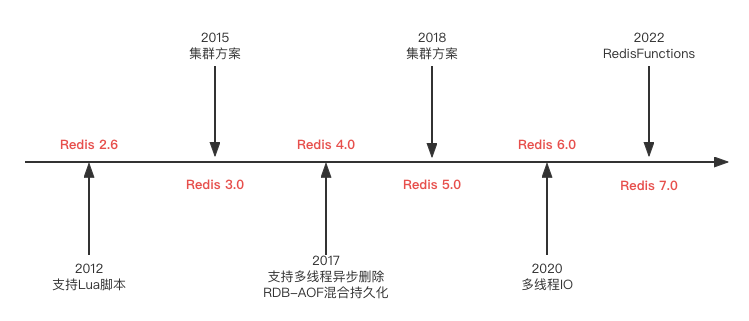
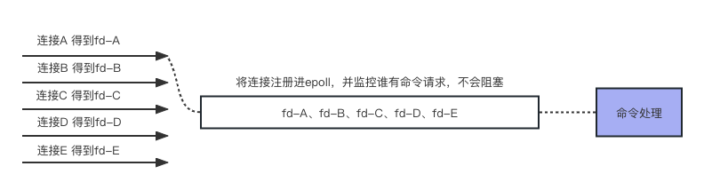
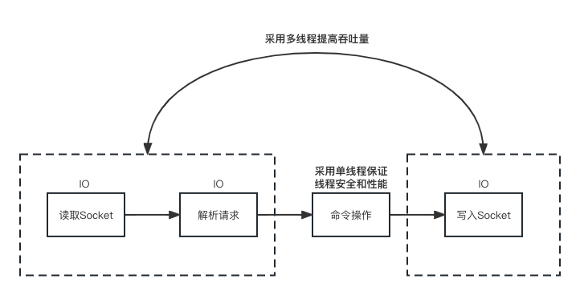

# Redis是单线程还是多线程



如果单说Redis是单线程还是多线程的是不严谨的。根据Redis的各个版本迭代，在4.0之前Redis是单线程，4.0之后开始慢慢支持多线程。

# 单线程

**Redis的单线程原理**

Redis的单线程说的是Redis的网络IO（主要包括建立连接、解析请求、返回数据）和键值对读写（也就是执行命令的操作）是由一个线程来完成的，是串行执行的。但是Redis的其他功能，如RDB、AOF、异步删除等是由额外的fork的线程来执行的。总的来说，Redis的命令工作是单线程。

**为什么3.x单线程依然很快的原因**

- 基于内存当然快，数据存储在内存中。

- 结构简单当然快，kv键值对结构简单。

- 多路复用和非阻塞IO，使用IO多路复用功能监听多个Socket连接客户端，只用一个线程连接来处理多个请求，减少线程带来的切换开销，同时也避免了IO阻塞操作。

- 单线程避免了不必要的上下文切换和多线程竞争，这就省去了多线程带来的时间和性能上的消耗，而且单线程不会导致死锁问题发生。

**为什么4.0之前一直使用单线程**

- 单线程模型开发和维护更简单

- 因为使用了IO多路复用让Redis也支持并发处理客户端请求

- Redis主要的性能瓶颈不在CPU，而在内存和网络IO。

**IO多路复用**

一个或一组线程处理多个TCP连接，使用单进程就能够实现同时处理多个客户端的连接，避免了一个客户端连接就占用一个进程或线程。大大提高了服务器的吞吐能力。



- 当进来一个客户端连接，为每个客户端分配一个fd（FileDescriptor）。

- 然后将fd注册进epoll队列之中。

- epoll对这些fd进行监控，发现某一个连接有新的请求，那么就处理他的请求。

- 处理完成之后返回给客户端，然后随机断开处理下一个。

# 多线程

**出现多线程的原因**

- 单线程通过`del`删除bigkey是一个很大的瓶颈。
  
  - Redis4.0引入了多个线程来实现异步删除等功能，比如`unlink`、`flushdb async`等。

- 随着日益增加的硬件，需要与时俱进，利用好多CPU的好处让Redis更快。

**Redis6.0之后的多线程原理**



Redis采用了多线程来处理网络请求，提高网络请求的并行速度。但是命令操作依然采用了单线程模型（为了保证原子性），所以Redis用多线程解决了网络IO问题，用单线程保证线程安全、高性能。

**开启Redis的多线程**

默认Redis的多线程是关闭的，如果需要开启则需要调整配置文件

```shell
# 设置线程个数
# 关于线程数的设置
# 官方的建议是如果为 4 核的 CPU，建议线程数设置为 2 或 3
# 如果为 8 核 CPU 建议线程数设置为 6，
# 线程数一定要小于机器核数，线程数并不是越大越好。
io-threads 4

# 开启多线程
io-threads-do-reads yes
```

# 调优

- 如果运用中发现Redis实例的CPU开销不大但吞吐量却没有提升，考虑尝试开启Redis多线程。

# 面试题

- Redis是单线程还是多线程？

- Redis为什么快？

- IO多路复用是什么？

- 现实中有没有调优的经验？
