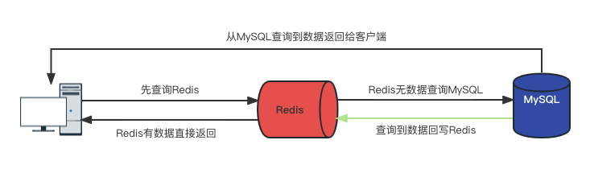

# MySQL+Redis读方案



Redis和MySQL通常情况下都是按照上图步骤使用。

1. 先查询Redis，命中则直接返回给客户端。

2. Redis未命中，查询MySQL返回给客户端。

3. MySQL回写给Redis，保证下一次Redis中有数据。

**常规伪代码**

```go
func getData(int id) map[string]string {
    // 先查询Redis
    data := redis.Get(id)
    if len(data) == 0 {
        // Redis未命中去数据库中查询
        data = dao.Get(id)
        if len(data) == 0 {
            return nil
        } else {
            // 回写Redis
            redis.Set(id, data)
            return data
        }
    } else {
        // Redis命中直接返回
        return data
    }
}
```

**问题**

上面的代码正常情况下不会有问题，但在高并发场景下，如果Redis中无数据，此时又同时来了N个请求，当还没有从MySQL查询到数据写回到Redis时，N个请求直接打满MySQL。

**双检加锁策略**

针对上面的问题，在查询MySQL之前，增加互斥锁并再次对Redis进行查询，确保查询数据库只会有一次不会被打死。

```go
func getData(int id) map[string]string {
    // 先查询Redis
    data := redis.Get(id)
    if len(data) == 0 {
        // Redis未命中去数据库中查询
        // 先加一个排它锁，保证只有一个线程访问MySQL，未拿到锁的排队等待
        if lock.Lock() {
            // 二次查询保证排队等待锁的线程能够从Redis拿到数据
            data = redis.Get(id)
            if len(data) == 0 {
                data = dao.Get(id)
                if len(data) == 0 {
                    return nil
                } else {
                    // 回写Redis
                    redis.Set(id, data)
                return data
                }
            } else {
                return data
            }
        }
    } else {
        // Redis命中直接返回
        return data
    }
}
```

# 缓存双写一致性更新策略

当MySQL数据有更新，如何保持MySQL和Redis数据一致性？大概有这四种策略。

**先更新MySQL，再更新Redis**

```log
A、B两个线程发起调用

【正常逻辑】

1 A update mysql 100

2 A update redis 100

3 B update mysql 80

4 B update redis 80

====================================

【异常逻辑】多线程环境下，A、B两个线程有快有慢，有前有后有并行

1 A update mysql 100

3 B update mysql 80

4 B update redis 80

2 A update redis 100

====================================

【最终结果】mysql和redis数据不一致，mysql80,redis100。
```

无法保证数据一致性，不推荐。

**先更新Redis，再更新MySQL**

```log
A、B两个线程发起调用

【正常逻辑】

1 A update redis 100

2 A update mysql 100

3 B update redis 80

4 B update mysql 80

====================================

【异常逻辑】多线程环境下，A、B两个线程有快有慢有并行

A update redis  100

B update redis  80

B update mysql 80

A update mysql 100

====================================

【最终结果】mysql和redis数据不一致，mysql100,redis80
```

无法保证数据一致性，不推荐，且以Redis为准不太好。

**先删除Redis，再更新MySQL**

```log
A、B两个线程发起调用
A是写，B是读

【正常逻辑】

1 A delete redis

2 A update mysql 100

3 B get redis 空

4 B get mysql 100

====================================

【异常逻辑】多线程环境下，A、B两个线程有快有慢有并行

A delete redis

A update mysql 100 # 原来的值是80

B get redis 空

B get mysql 80 # A还未更新完，值还是80，B拿到80并回写到Redis

====================================

【最终结果】mysql和redis数据不一致，mysql100，redis80

====================================

【解决方案】--- 延迟双删策略
1. A线程先删除redis
2. A线程继续更新MySQL
3. A线程延时等待一段时间（估算为读线程读取数据并写入redis的时间+百毫秒），这是为了B线程读的时候能够读到数据并写入缓存
4. B线程从MySQL读错误数据并写入redis
5. A线程再将B线程写入的错误redis删除
6. 其他再进来的线程就能从数据库中读取到最新的数据
【问题】不能保证在A线程删除redis之前，进来的线程读取到的是正确的数据
【好处】能够保证删除Redis之后的数据是正确的。
```

如果要用此策略，必须要配合延迟双删策略来保证最终一致性。

**先更新MySQL，再删除Redis**

```log
A、B两个线程发起调用
A是写，B是读，C是读

【逻辑】

1 A update mysql 100

2 B get redis 80 # B 拿到老值

3 A delete redis

4 C get redis 空

5 C get MySQL 100

6 C set redis 100

【最终结果】mysql和redis数据最终是一致的，只是A删除redis之前，其他线程获取的是脏数据
```

此方案最推荐，简单+也保证了最终一致性。

# 缓存双写一致性解决方案

使用阿里开源的canal开源框架实现

[官网](https://github.com/alibaba/canal)

**canal是什么**

canal是用于基于MySQL数据库binlog增量日志解析，提供增量数据的订阅和消费的组件。

**canal能做什么**

- 数据库镜像

- 数据库实时备份

- 索引构建和实时维护

- 带业务逻辑的增量数据处理


**canal如何使用**

- MySQL相关配置
  
  - 因为需要监控MySQL的binlog，要开启binlog等
  
  ```shell
  # 编辑my.cnf设置如下
  log-bin=mysql-bin # 开启binlog
  binlog-format=ROW # 选择ROW模式
  server_id=1 # 配置MySQL replaction需要定义，不要和canal的slaved重复
  ```
  
  - 重启MySQL
  
  - 查看binlog是否开启
  
  ```sql
  # 查看主机状态
  show master status;
  # 结果
  mysql-bin.000001	1801	
  # 查看binlog状态		
  SHOW VARIABLES LIKE 'log_bin';
  # 结果
  log_bin	ON
  ```
  
  - 创建授权canal连接MySQL账号
  
  ```sql
  DROP USER IF EXISTS 'canal'@'%';
  CREATE USER 'canal'@'%' IDENTIFIED BY 'canal';  
  GRANT ALL PRIVILEGES ON *.* TO 'canal'@'%' IDENTIFIED BY 'canal';  
  FLUSH PRIVILEGES;
   
  # 查看结果验证
  SELECT * FROM mysql.user;
  ```

- docker启动canal-server

```shell
# 拉取最新版本的canal-server
docker pull canal/canal-server
# run
docker run -d -it \
-h 192.168.6.14 \ # canal-server的域名
--name=canal-server \ # 容器名称
-p 11110:11110 -p 11111:11111 -p 11112:11112 -p 9100:9100 -m 4096m \ # 端口映射
-e canal.auto.scan=false \ # 是否自动扫描
-e canal.destinations=test \ # canal的名称
-e canal.instance.master.address=192.168.6.14:3306 \ # MySQLIP和端口
-e canal.instance.dbUsername=canal \ # 为canal创建的用户名
-e canal.instance.dbPassword=canal \ # 为canal创建的用户名密码
-e canal.instance.connectionCharset=UTF-8 \ # 字符集
-e canal.instance.tsdb.enable=true \
-e canal.instance.gtidon=false \
canal/canal-server
# 查看启动日志
docker logs canal-server
DOCKER_DEPLOY_TYPE=VM
==> INIT /alidata/init/02init-sshd.sh
==> EXIT CODE: 0
==> INIT /alidata/init/fix-hosts.py
==> EXIT CODE: 0
==> INIT DEFAULT
Generating SSH1 RSA host key:                              [  OK  ]
Starting sshd:                                             [  OK  ]
Starting crond:                                            [  OK  ]
==> INIT DONE
==> RUN /home/admin/app.sh
==> START ...
start canal ...
start canal successful # 说明成功了
==> START SUCCESSFUL ...
```

- docker客户端，本例使用了go-client，[地址](https://github.com/CanalClient/canal-go)
  
  - 下载客户端
  
  ```shell
  # 下载提供的客户端
  git clone https://github.com/withlin/canal-go.git
  ```
  
  - 编辑canal-go/samples/main.go
  
  ```go
  func main() {
    
    	// 192.168.199.17 替换成你的canal server的地址
    	// example 替换成-e canal.destinations=example 你自己定义的名字
    	connector := client.NewSimpleCanalConnector("192.168.6.14", 11111, "", "", "test", 60000, 60*60*1000)
    	err := connector.Connect()
    	if err != nil {
    		log.Println(err)
    		os.Exit(1)
    	}
    
    	// https://github.com/alibaba/canal/wiki/AdminGuide
    	//mysql 数据解析关注的表，Perl正则表达式.
    	//
    	//多个正则之间以逗号(,)分隔，转义符需要双斜杠(\\)
    	//
    	//常见例子：
    	//
    	//  1.  所有表：.*   or  .*\\..*
    	//	2.  canal schema下所有表： canal\\..*
    	//	3.  canal下的以canal打头的表：canal\\.canal.*
    	//	4.  canal schema下的一张表：canal\\.test1
    	//  5.  多个规则组合使用：canal\\..*,mysql.test1,mysql.test2 (逗号分隔)
    
    	//err = connector.Subscribe(".*\\..*")
        // 最好指定扫描自定义的表
    	err = connector.Subscribe("db1.table1")
    	if err != nil {
    		log.Println(err)
    		os.Exit(1)
    	}
    
    	for {
    
    		message, err := connector.Get(100, nil, nil)
    		if err != nil {
    			log.Println(err)
    			os.Exit(1)
    		}
    		batchId := message.Id
    		if batchId == -1 || len(message.Entries) <= 0 {
    			time.Sleep(300 * time.Millisecond)
    			fmt.Println("===没有数据了===")
    			continue
    		}
    
          // 根据自己的业务进行自定义
    		printEntry(message.Entries)
    
    	}
    }
  ```
  
  - 运行客户端程序
  
  ```shell
  go run samples/main.go
  # 开始监听bin-log
  ===没有数据了===
  ===没有数据了===
  # 发现有变动
  ================> binlog[mysql-bin.000001 : 1722],name[db1,table1], eventType: INSERT
  id : 6  update= true
  name : adfasf  update= true
  
  ```
