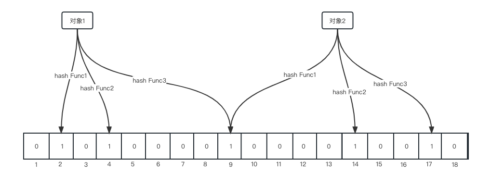
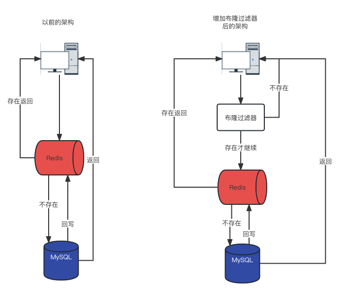

# 统计页面的UV/PV/DAU/MAU

**术语解释**

- UV（unique visitor），独立访客，一般理解为独立IP，需要考虑去重。

- PV（page view），页面浏览量。

- DAU（Daily Active User），日活用户量，登录或使用了某个产品的用户数，需要考虑去重。

- MAU（Monthly Active User），月活用户量。

**解决方案**

- 针对巨量（上千万）的UV，只需要数量不需要具体的用户，且对精准度要求不高。
  
  - 利用HyperLogLog的去重基数且占用资源非常少的优势进行存储

代码实现：

```go
func main() {
    ctx := context.Background()

    rdb := redis.NewClient(&redis.Options{
        Addr:     "localhost:6379",
        Password: "123", // no password set
        DB:       0,     // use default DB
    })

    rand.Seed(time.Now().UnixNano())
    fmt.Println("-----模拟有用户点击首页，每个用户来自不同的IP地址，开始-----")
    for i := 0; i < 100; i++ {
        ip := strconv.Itoa(rand.Intn(999)) + "." + strconv.Itoa(rand.Intn(999)) + "." + strconv.Itoa(rand.Intn(999)) + "." + strconv.Itoa(rand.Intn(999))
        hll := rdb.PFAdd(ctx, "hll", ip)
        fmt.Printf("ip=%s, 该IP访问首页的次数：%d\n", ip, hll.Val())
    }
    fmt.Println("-----模拟有用户点击首页，每个用户来自不同的IP地址，结束-----")
}
```

运行程序：

```shell
go run uv.go
```

查看基数统计：

```shell
127.0.0.1:6379> pfcount hll
(integer) 98 # 存在误差
```

- PV，前提是巨量且要求不精准
  
  - 可以通过incr进行自增统计。
  
  - 如果对精准度要求不高也可以通过HyperLogLog。

代码实现：

```go
func main() {
    ctx := context.Background()

    rdb := redis.NewClient(&redis.Options{
        Addr:     "localhost:6379",
        Password: "123", // no password set
        DB:       0,     // use default DB
    })

    // uv
    key := "page:001"
    rdb.Set(ctx, key, 1, -1)

    for i := 0; i < 100; i++ {
        rdb.Incr(ctx, key)
    }

    // 查询uv
    uv := rdb.Get(ctx, key)
    fmt.Printf("uv:%s\n", uv)
}
```

运行程序：

```shell
go run pv.go
uv:get page:001: 101
```

- DAU&MAU，思路和UV差不多，按照具体的日期形成key，前提是要求不精准。

# 经纬度距离计算

附近的酒店推荐

**解决方案**

根据GEO类型将注册的酒店坐标进行存储，实时获取自己的坐标经纬度，计算离自己2km内的酒店

```go
const hotelKey = "hotels"

var rdb *redis.Client

func init() {
    rdb = redis.NewClient(&redis.Options{
        Addr:     "localhost:6379",
        Password: "123", // no password set
        DB:       0,     // use default DB
    })
}

func main() {
    ctx := context.Background()
    // 添加坐标
    geoAdd(ctx, "希尔顿欢朋酒店", 120.122094, 30.345323)
    geoAdd(ctx, "海外海国际酒店", 120.128721, 30.334236)
    // 获取坐标
    pos, _ := geoPos(ctx, "海外海国际酒店")
    fmt.Println(pos)
    // 获取hash
    hashes, _ := geoHash(ctx, "希尔顿欢朋酒店", "海外海国际酒店")
    fmt.Println(hashes)
    // 获取距离
    dist, _ := geoDist(ctx, "希尔顿欢朋酒店", "海外海国际酒店")
    fmt.Println(dist)
    // 获取就近的酒店
    locations, _ := geoRadius(ctx, 120.120388, 30.341701, 2)
    fmt.Println(locations)
}

// geoAdd 添加坐标
func geoAdd(ctx context.Context, hotelName string, lon float64, lat float64) bool {
    rdb.GeoAdd(ctx, hotelKey, &redis.GeoLocation{Longitude: lon, Latitude: lat, Name: hotelName})
    return true
}

// geoPos 获取坐标
func geoPos(ctx context.Context, hotelName string) ([]*redis.GeoPos, error) {
    pos, err := rdb.GeoPos(ctx, hotelKey, hotelName).Result()
    if err != nil {
        return nil, err
    }
    return pos, nil
}

// geoHash 获取hash
func geoHash(ctx context.Context, hotelNames ...string) ([]string, error) {
    hashes, err := rdb.GeoHash(ctx, hotelKey, hotelNames...).Result()
    if err != nil {
        return nil, err
    }
    return hashes, nil
}

// geoDist 获取距离
func geoDist(ctx context.Context, hotelName1 string, hotelName2 string) (float64, error) {
    dist, err := rdb.GeoDist(ctx, hotelKey, hotelName1, hotelName2, "km").Result()
    if err != nil {
        return 0, err
    }
    return dist, nil
}

// geoRadius 根据距离获取坐标
func geoRadius(ctx context.Context, lon float64, lat float64, radius float64) ([]redis.GeoLocation, error) {
    locations, err := rdb.GeoRadius(ctx, hotelKey, lon, lat, &redis.GeoRadiusQuery{
        Radius: radius,
        Unit:   "km",
    }).Result()
    if err != nil {
        return nil, err
    }
    return locations, nil
}
```

执行程序：

```shell
go run geo.go 
[0xc0000aa080]
[wtmktknnrd0 wtmktd5jdp0]
1.3875
[{希尔顿欢朋酒店 0 0 0 0} {海外海国际酒店 0 0 0 0}]
```

# 签到类

**场景**

- 精准的日活统计

- 打卡

- 连续签到

```go
const signKey = "signKey:"

var rdb1 *redis.Client

func init() {
    rdb1 = redis.NewClient(&redis.Options{
        Addr:     "localhost:6379",
        Password: "123", // no password set
        DB:       0,     // use default DB
    })
}

func main() {
    ctx := context.Background()
    key := signKey + "2023:" + "1"
    // 第一天签到
    rdb1.SetBit(ctx, key, 1, 1)
    // 第二天签到
    rdb1.SetBit(ctx, key, 2, 1)
    // 第三天签到
    rdb1.SetBit(ctx, key, 3, 0)

    // 获取签到情况
    sign1 := rdb1.GetBit(ctx, key, 1).Val()
    sign2 := rdb1.GetBit(ctx, key, 2).Val()
    sign3 := rdb1.GetBit(ctx, key, 3).Val()
    sign4 := rdb1.GetBit(ctx, key, 4).Val()
    fmt.Printf("sign1:%d\n", sign1)
    fmt.Printf("sign2:%d\n", sign2)
    fmt.Printf("sign3:%d\n", sign3)
    fmt.Printf("sign4:%d\n", sign4)
}
```

执行程序：

```shell
go run bitmap.go
sign1:1
sign2:1
sign3:0
sign4:0
```

# 布隆过滤器

**是什么**

由一个初始都为零的bit数组和多个哈希函数构成，用来快速判断集合中是否存在某个元素。

**主要解决什么问题**

- 主要用来判断一个元素是否在一个巨量集合中
  
  - 一个元素存在时，元素不一定存在，如果不存在时，那么一定不存在。

- 通常判断一个元素是否存在，可以将元素放入链表、哈希表等中，然后通过比较来判断是否存在，在数量级不够的情况下没有问题，但一旦数量级起来之后会占用大量的空间，且查询速度不断衰减。

**原理**

布隆过滤器本质是一个大型位数组和几个不同的无偏哈希函数（无偏表示均匀分布）。因为采用了哈希函数必定有哈希冲突（不同值通过哈希函数可能会有相同的哈希值），所以布隆过滤器不够精准的原因（但只是很小的不精准）。

- 哈希函数
  
  - 哈希函数是将任意大小的输入数据转换成特定大小的输出数据的函数，转换后的数据称为哈希值或哈希编码，也叫散列值。
  
  - 散列函数的输入和输出不是唯一对应关系的，如果两个散列值相同，两个输入值很可能是相同的，但也可能不同，这种情况称为“散列碰撞（collision）。
  
  - 用 hash表存储大数据量时，空间效率还是很低，当只有一个 hash 函数时，还很容易发生哈希碰撞。
  
  - 所以布隆过滤器要用几个不同的哈希函数计算，不然很容器发生哈希碰撞。

- 布隆过滤器如何添加key



布隆过滤器将对象通过不同的哈希函数进行哈希处理，然后算得一个下标值，然后通过对数组长度取模得到一个位置（坑位），只有所有的位置都为1时能大概率判断存在于布隆过滤器（但不绝对保证），因为其他对象算出来的哈希也是完全相同的坑位。

- 布隆过滤器查询key
  
  - 存在则有可能存在， 不存在则一定不存在。

- 布隆过滤器不能删除有值的坑位
  
  - 因为一个坑位有可能有不止一个对象，所以删除了会导致误判率更大。

**注意**

- 使用时不要让实际元素远大于初始化数量，一次给够空间避免扩容

- 当实际元素数量超过了初始化数量时，需要对布隆过滤器进行重建，重新分配一个更大的过滤器，再将历史元素批量add进入新的过滤器。

**优缺点**

- 优点
  
  - 高效插入和查询，内存占用少

- 缺点
  
  - 存在误判，不能精准过滤
  
  - 不能删除元素，删除元素增加误判率

**使用场景**

- 解决缓存穿透问题

- 黑名单校验

**布隆过滤器实现**

- 整体架构



先查询布隆过滤器，如果过滤器中不存在则说明一定不存在则直接返回，如果存在才访问Redis，增加了一道防护，减少了缓存穿透的问题。

- 步骤
  
  - 初始化过滤器
    
    - 预加载符合条件的记录
    
    - 计算每条记录hash值
    
    - 计算hash值对应的bitmap位置
    
    - 将对应坑位设置为1
  
  - 先判断元素是否在过滤器中
    
    - 计算元素对应的hash值
    
    - 计算hash值对应的bitmap位置
    
    - 获取到值，如果为1则放行，如果为0则直接返回
  
  - Redis查询以及MySQL查询

**代码实现**

结合Redis的bitmap实现的布隆过滤器

```go
type BloomFilter struct {
    Key string
}

var rdb2 *redis.Client

func init() {
    rdb2 = redis.NewClient(&redis.Options{
        Addr:     "localhost:6379",
        Password: "123", // no password set
        DB:       0,     // use default DB
    })
}

func NewBloomFilter(key string) *BloomFilter {
    return &BloomFilter{
        Key: key,
    }
}

// Add 向布隆过滤器添加值
func (bf *BloomFilter) Add(ctx context.Context, value []byte) {
    // 计算hashcode，本例只用一次哈希，多次哈希误判率更
    hashValue := bf.hash(value)
    // 通过hashValue和2的32次方取余后，获得对应的下标坑位
    index := hashValue % uint64(math.Pow(2, 32))
    // 设置对应的坑位为1
    rdb2.SetBit(ctx, bf.Key, int64(index), 1)
}

// Contains 判断值是否存在
func (bf *BloomFilter) Contains(ctx context.Context, value []byte) bool {
    // 计算value值的hashcode
    hashValue := bf.hash(value)
    // 通过hashValue和2的32次方取余，获取得到对应的下标坑位
    index := hashValue % uint64(math.Pow(2, 32))
    // 获取对应的坑位值
    if rdb2.GetBit(ctx, bf.Key, int64(index)).Val() == int64(1) {
        return true
    } else {
        return false
    }
}

// hash 通过哈希函数计算出哈希值
func (bf *BloomFilter) hash(value []byte) uint64 {
    hashFunc := fnv.New64()
    hashFunc.Reset()
    hashFunc.Write(value)
    return hashFunc.Sum64()
}

func main() {
    ctx := context.Background()
    filter := NewBloomFilter("whitelistCustomer")

    // 初始化布隆过滤器
    filter.Add(ctx, []byte("customer:001"))
    filter.Add(ctx, []byte("customer:002"))
    filter.Add(ctx, []byte("customer:003"))
    filter.Add(ctx, []byte("customer:004"))

    // 测试
    fmt.Println(filter.Contains(ctx, []byte("customer:001")))
    fmt.Println(filter.Contains(ctx, []byte("customer:002")))
    fmt.Println(filter.Contains(ctx, []byte("customer:003")))
    fmt.Println(filter.Contains(ctx, []byte("customer:004")))
    fmt.Println(filter.Contains(ctx, []byte("customer:005")))

    // 具体的业务
    // 先判断过滤器中是否存在，如果不存在则说明一定不存在，如果存在则有可能存在继续往下走
    if filter.Contains(ctx, []byte("customer:006")) == false {
        fmt.Println("无数据直接返回")
    } else {
        // 过滤器通过查询Redis
        // Redis存在直接返回
        // Redis不存在向数据库查询，此处使用双检一致性算法进一步保证缓存穿透
    }
}
```

运行程序：

```shell
go run bloom_filter.go
true
true
true
true
false
无数据直接返回
```

**延伸**

- 布谷鸟过滤器解决了布隆过滤器不能删除元素的问题

# 实现抢红包

用户发往群里发一个金额为100的随机红包并限制5人抢，要求金额不能过于差距太大，不能重复抢，24小时红包到期不能再抢，且要记录哪些人抢了多少钱。

**需求分析**

- 发红包程序
  
  - 利用算法将总金额拆分成5个不同的随机红包（二倍均值法）。
  
  - 将拆分出来的数据写入到List中。

- 抢红包程序
  
  - 先判断用户是否已经抢过，抢过了直接返回结果。
  
  - 从List中pop一个红包，如果没有了则提示已经抢完了。
  
  - 记录用户以及用户的红包金额

**二倍均值法**

拆分的金额 = 随机区间(0, (剩余红包金额M / 剩余人数N) * 2)，此公式保证了每次随机金额的平均值是相等的，不会因为抢红包的先后顺序而造成不公平。

**代码实现**

```go
package main

import (
	"context"
	"fmt"
	"github.com/google/uuid"
	"github.com/redis/go-redis/v9"
	"math/rand"
	"net/http"
	"strconv"
	"time"
)

const RedPackage = "RedPackage:"
const RedPackageConsume = "RedPackageConsume:"

var redRdb *redis.Client

func main() {
	// 连接redis
	redRdb = redis.NewClient(&redis.Options{
		Addr:     "192.168.10.33:6379",
		Password: "123456", // no password set
		DB:       0,        // use default DB
	})

	http.HandleFunc("/sendRedPackage", sendRedPackage)
	http.HandleFunc("/splitRedPackage", splitRedPackage)

	listenErr := http.ListenAndServe(":8080", nil)
	if listenErr != nil {
		panic("http ListenAndServe Fail:" + listenErr.Error())
	}
}

// sendRedPackage 发红包程序
func sendRedPackage(w http.ResponseWriter, r *http.Request) {
	// 用户ID
	uid := r.FormValue("uid")
	// 红包总金额
	totalAmount, _ := strconv.ParseFloat(r.FormValue("total_amount"), 2)
	// 红包个数
	num, _ := strconv.Atoi(r.FormValue("num"))

	if totalAmount <= 0 {
		fmt.Fprint(w, "红包金额必须大于0")
		return
	}
	if num <= 0 {
		fmt.Fprintf(w, "红包个数必须大于0")
		return
	}

	// 将金额转换成分
	totalAmountCent := int(totalAmount * 100)

	// 拆分的红包列表
	var splitRedList []string
	// 已拆红包金额
	useAmount := 0

	// 拆分红包
	rand.Seed(time.Now().UnixNano())
	for i := 0; i < num; i++ {
		if i == num-1 {
			// 最后一个红包 = 总金额 - 已拆红包金额
			splitRedList = append(splitRedList, strconv.Itoa(totalAmountCent-useAmount))
		} else {
			// 拆分红包金额 = 随机区间（0，（剩余红包金额 / 剩余的人数）* 2）
			max := (totalAmountCent - useAmount) / (num - i) * 2
			splitRedAmount := rand.Intn(max-1) + 1
			if splitRedAmount == 0 {
				fmt.Fprintf(w, "金额太小无法拆分")
				return
			}
			splitRedList = append(splitRedList, strconv.Itoa(splitRedAmount))
			useAmount += splitRedAmount
		}
	}

	ctx := context.Background()
	uuidValue := uuid.New().String()
	// 将拆分的红包列表push到List
	pushErr := redRdb.LPush(ctx, RedPackage+uid+uuidValue, splitRedList).Err()
	if pushErr != nil {
		fmt.Fprintf(w, "Lpush失败：%s\n", pushErr.Error())
		return
	}

	fmt.Fprintf(w, "拆分出来的红包为：%v，单位（分），红包ID：%s\n", splitRedList, uid+uuidValue)
}

// splitRedPackage 抢红包程序
func splitRedPackage(w http.ResponseWriter, r *http.Request) {
	redPackageId := r.FormValue("red_package_id")
	uid := r.FormValue("uid")
	ctx := context.Background()
	// 先查看用户是否已经抢过
	result := redRdb.HGet(ctx, RedPackageConsume+redPackageId, uid).Val()
	if result == "" {
		// 从红包list中pop一个金额
		redAmount, _ := redRdb.LPop(ctx, RedPackage+redPackageId).Int()
		if redAmount == 0 {
			fmt.Fprintf(w, "红包已经被抢光了")
		} else {
			// 抢到红包的记录
			redRdb.HSet(ctx, RedPackageConsume+redPackageId, uid, redAmount)
			fmt.Fprintf(w, "恭喜您抢到了红包：%f\n", float64(redAmount/100))
		}
	} else {
		fmt.Fprintf(w, "您已经抢了该红包")
	}
}
```

抢红包程序的逻辑不够严谨，有可能存在一个用户抢多个红包的情况，如果优化可以采用Lua脚本。
