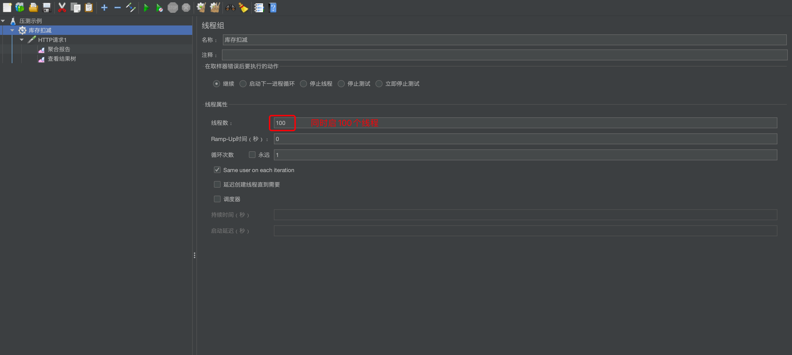
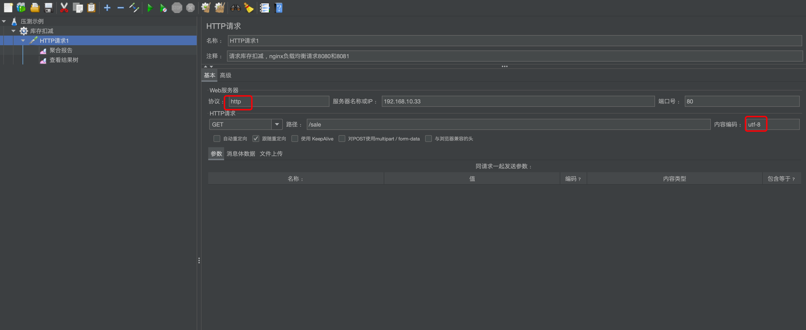
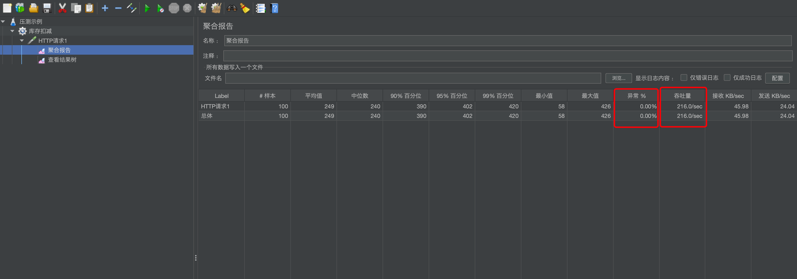
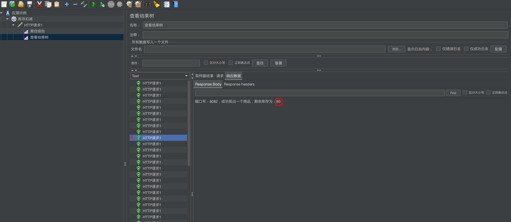
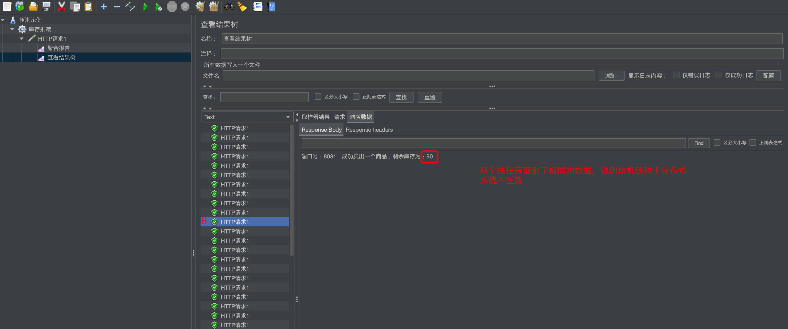
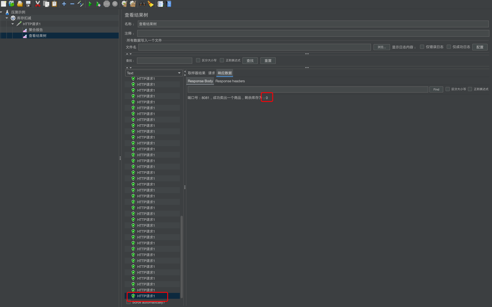
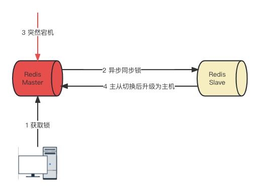

# 单机锁

单机锁是指在单个机器或进程内使用的锁机制，用于保护共享资源访问，它适用于单机环境中的并发控制和数据一致性需求。

**问题**

对于单机环境没什么问题，但是一旦遇到服务器扩容或分布式系统就无法保证互斥效果，因为单机锁只在单台机器上有效。

**go语言的单机锁**

```go
func main() {
    var lock sync.Mutex
    i := 0
    // 加锁
    lock.Lock()
    // 释放锁
    defer lock.Unlock()
    i++
    fmt.Println(i)
}
```

# 引入分布式锁

为了解决分布式系统中的互斥访问的问题，用于保护共享资源或临界区的访问，在多个进程或多台机器之间，确保只有一个进程能够获取到锁，并在完成后释放锁，以保证一致性和并发控制。实现分布式锁需要选择合适的存储介质，比如redis、zookeeper等。

**写好一个分布式锁的要求**

- 独占性
  
  - OnlyOne，任何时刻只能有且仅有一个线程持有

- 高可用
  
  - Redis集群下，不能因为某一个节点挂了而出现获取锁和释放锁失败
  
  - 高并发请求下，性能不能减弱

- 防死锁
  
  - 杜绝死锁，必须有超时控制机制或撤销操作，有兜底跳出方案

- 不乱抢
  
  - 不能unlock别人的锁，只能自己加锁自己解锁

- 重入性
  
  - 同一个节点的同一个线程如果获取锁后，它也要可以再次获取这个锁。

# 手写分布式锁

以扣减库存为例，逐步迭代，本例使用golang。

**第一版本：单机锁**

```go
var rdb5 *redis.Client
var lock sync.Mutex

func init() {
    rdb5 = redis.NewClient(&redis.Options{
        Addr:     "localhost:6379",
        Password: "123", // no password set
        DB:       0,     // use default DB
    })
}

func main() {
    ctx := context.Background()
    key := "inventory:001"
    sale(ctx, key)
}

// sale 售卖商品扣减库存主逻辑
func sale(ctx context.Context, key string) {
    lock.Lock()
    defer lock.Unlock()
    inventoryNum, _ := strconv.Atoi(rdb5.Get(ctx, key).Val())
    if inventoryNum > 0 {
        inventoryNum--
        rdb5.Set(ctx, key, inventoryNum, -1)
        fmt.Printf("成功卖出一个商品，剩余库存为：%d\n", inventoryNum)
    } else {
        fmt.Println("商品已售罄")
    }
}
```

运行程序：

```shell
# 预先向redis设置库存数据
127.0.0.1:6379> set inventory:001 100
OK

# 运行程序
go run inventory.go
成功卖出一个商品，剩余库存为：99
go run inventory.go
成功卖出一个商品，剩余库存为：98
```

问题：对于单机肯定没有问题，但分布式系统必定出错。

**第二版：使用nginx分布式微服务架构**

- 改造成可以访问的http请求

```go
var rdb5 *redis.Client
var lock sync.Mutex

var port string

func init() {
    rdb5 = redis.NewClient(&redis.Options{
        Addr:     "192.168.10.33:6379",
        Password: "123456", // no password set
        DB:       0,        // use default DB
    })
    flag.StringVar(&port, "port", "8080", "启动端口")
    flag.Parse()
}

func main() {
    http.HandleFunc("/sale", saleHandler)
    http.ListenAndServe(":"+port, nil)
}

func saleHandler(w http.ResponseWriter, r *http.Request) {
    ctx := context.Background()
    key := "inventory:001"
    message := sale(ctx, key)
    fmt.Fprintf(w, "端口号："+port+"，"+message)
}

func sale(ctx context.Context, key string) string {
    lock.Lock()
    defer lock.Unlock()
    inventoryNum, _ := strconv.Atoi(rdb5.Get(ctx, key).Val())
    if inventoryNum > 0 {
        inventoryNum = inventoryNum - 1
        rdb5.Set(ctx, key, inventoryNum, 0)
        return fmt.Sprintf("成功卖出一个商品，剩余库存为：%d\n", inventoryNum)
    } else {
        return fmt.Sprintln("商品已售罄")
    }
}
```

- 启动微服务

```shell
go build -o inventory inventory.go
# 先启动8080和8081两个微服务
./inventory -port 8080
./inventory -port 8081
```

- 配置nginx负载均衡

```nginx
upstream inventoryUpstream {
    server localhost:8080 weight=1;
    server localhost:8081 weight=1;
}

server {
    listen  80;
    server_name inventory.com;

    location / {
            proxy_pass http://inventoryUpstream;
            proxy_set_header Host $host;
            proxy_set_header X-Real-IP $remote_addr;
    }
}
```

- 重启nginx

```shell
./nginx -s reload
```

- 通过并发工具（Apache jmeter）测试











- 查看redis中的剩余库存

```shell
127.0.0.1:6379> get inventory:001
"34"
```

问题：进一步验证单机锁对于分布式系统无效，需要采用分布式锁，引入redis。

**第三版：使用Redis实现分布式锁**

引入分布式锁：

```go
func sale(ctx context.Context, key string) string {
    lockKey := "inventoryRedisLock"
    // 通过uuid+现成ID
    uuidValue := uuid.New().String() + ":" + strconv.FormatInt(goid.Get(), 10)
    // 没有抢占到锁会一直循环获取
    for !rdb5.SetNX(ctx, lockKey, uuidValue, 0).Val() {
        // 暂停20毫秒继续获取锁
        time.Sleep(20 * time.Millisecond)
    }
    // 使用完成之后删除锁
    defer rdb5.Del(ctx, lockKey)

    inventoryNum, _ := strconv.Atoi(rdb5.Get(ctx, key).Val())
    if inventoryNum > 0 {
        inventoryNum = inventoryNum - 1
        rdb5.Set(ctx, key, inventoryNum, 0)
        return fmt.Sprintf("成功卖出一个商品，剩余库存为：%d\n", inventoryNum)
    } else {
        return fmt.Sprintln("商品已售罄")
    }
}
```

- 压测结果：未超卖



问题：设置锁没有过期时间，一旦一台程序挂了且没有释放锁，其他程序就无法抢占锁

**第四版：改进锁过期时间**

```go
func sale(ctx context.Context, key string) string {
    lockKey := "inventoryRedisLock"
    // 通过uuid+现成ID
    uuidValue := uuid.New().String() + ":" + strconv.FormatInt(goid.Get(), 10)
    // 没有抢占到锁会一直循环获取，这里新增了锁的过期时间，避免程序挂了导致其他正常的程序获取不到锁的问题，这个时间需要根据实际业务估算，且不能使用一条语句保证原子性
    // 查看SexNX源码里层是原子性的。
    for !rdb5.SetNX(ctx, lockKey, uuidValue, 20*time.Second).Val() {
        // 暂停20毫秒继续获取锁
        time.Sleep(20 * time.Millisecond)
    }
    // 使用完成之后删除锁
    defer rdb5.Del(ctx, lockKey)

    inventoryNum, _ := strconv.Atoi(rdb5.Get(ctx, key).Val())
    if inventoryNum > 0 {
        inventoryNum = inventoryNum - 1
        rdb5.Set(ctx, key, inventoryNum, 0)
        return fmt.Sprintf("成功卖出一个商品，剩余库存为：%d\n", inventoryNum)
    } else {
        return fmt.Sprintln("商品已售罄")
    }
}
```

- 压测未超卖

问题：如果处理时间超过了预设的过期时间，会导致误删其他线程的锁。比如A线程的处理时间超过了20秒，20秒后锁过期了，B线程获取到锁进入，此时A处理完成后删除了B的锁，B处理后发现自己的锁被删除。

**第五版：改进误删锁问题**

```go
func sale(ctx context.Context, key string) string {
    lockKey := "inventoryRedisLock"
    // 通过uuid+现成ID
    uuidValue := uuid.New().String() + ":" + strconv.FormatInt(goid.Get(), 10)
    // 没有抢占到锁会一直循环获取，这里新增了锁的过期时间，避免程序挂了导致其他正常的程序获取不到锁的问题，这个时间需要根据实际业务估算，且不能使用一条语句保证原子性
    // 查看SexNX源码里层是原子性的。
    for !rdb5.SetNX(ctx, lockKey, uuidValue, 20*time.Second).Val() {
        // 暂停20毫秒继续获取锁
        time.Sleep(20 * time.Millisecond)
    }
    // 使用完成之后删除锁，且要判断误删锁
    defer func() {
        if rdb5.Get(ctx, lockKey).Val() == uuidValue {
            rdb5.Del(ctx, lockKey)
        }
    }()

    inventoryNum, _ := strconv.Atoi(rdb5.Get(ctx, key).Val())
    if inventoryNum > 0 {
        inventoryNum = inventoryNum - 1
        rdb5.Set(ctx, key, inventoryNum, 0)
        return fmt.Sprintf("成功卖出一个商品，剩余库存为：%d\n", inventoryNum)
    } else {
        return fmt.Sprintln("商品已售罄")
    }
}
```

- 压测数据正常

问题：删除锁是两步操作，并不是原子操作，依然可能存在风险。

**第六版：保证保证性**

- Redis使用Lua脚本

```shell
127.0.0.1:6379> eval "return 'hello lua'" 0
"hello lua"

127.0.0.1:6379> eval "redis.call('set', 'k1', 'v1') return redis.call('get', 'k1')" 0
"v1"

127.0.0.1:6379> eval "return redis.call('mset', KEYS[1], ARGV[1], KEYS[2], ARGV[2])" 2 k1 k2 11 12
OK
127.0.0.1:6379> get k1
"11"
127.0.0.1:6379> get k2
"12"
```

- 本例需要的Lua脚本

```lua
if redis.call('get', KEYS[1] == ARGV[1]) then
    return redis.call('del', KEYS[1])
else
    return 0
end
```

- Redis执行Lua

```shell
# 当inventoryRedisLock的值为112121212时删除
127.0.0.1:6379> eval "if redis.call('get', KEYS[1] == ARGV[1]) then     return redis.call('del', KEYS[1]) else     return 0 end" 1 inventoryRedisLock 112121212
(integer) 0
```

- 代码实现

```go
func sale(ctx context.Context, key string) string {
    lockKey := "inventoryRedisLock"
    // 通过uuid+现成ID
    uuidValue := uuid.New().String() + ":" + strconv.FormatInt(goid.Get(), 10)
    // 没有抢占到锁会一直循环获取，这里新增了锁的过期时间，避免程序挂了导致其他正常的程序获取不到锁的问题，这个时间需要根据实际业务估算，且不能使用一条语句保证原子性
    // 查看SexNX源码里层是原子性的。
    for !rdb5.SetNX(ctx, lockKey, uuidValue, 20*time.Second).Val() {
        // 暂停20毫秒继续获取锁
        time.Sleep(20 * time.Millisecond)
    }
    // 使用完成之后删除锁，且要判断误删锁
    defer func() {
        // 通过Lua脚本保证原子性
        luaScript := "if redis.call('get', KEYS[1] == ARGV[1]) then " +
            "return redis.call('del', KEYS[1]) " +
            "else " +
            "return 0 " +
            "end"
        rdb5.Eval(ctx, luaScript, []string{lockKey}, uuidValue)
    }()

    inventoryNum, _ := strconv.Atoi(rdb5.Get(ctx, key).Val())
    if inventoryNum > 0 {
        inventoryNum = inventoryNum - 1
        rdb5.Set(ctx, key, inventoryNum, 0)
        return fmt.Sprintf("成功卖出一个商品，剩余库存为：%d\n", inventoryNum)
    } else {
        return fmt.Sprintln("商品已售罄")
    }
}
```

问题：重入性问题，比如说对于一个线程，需要进行两次获取锁，就会出现自己阻塞自己的情况，所以需要解决重入性问题。

**第七版：解决重入性问题**

解决重入性问题的时候发现现有的代码结构已经不适用了，需要将加锁、解锁抽离成公共方法，方便多次调用，需要重构。

- 分布式锁工厂（distributed_lock.go）

```go
package distributedLock

import "context"

type DistributedLock interface {
    Lock(ctx context.Context, uuid string) error
    UnLock(ctx context.Context, uuid string) error
}

type DistributedLockFactory struct {
}

func (f *DistributedLockFactory) NewDistributedLock(lockType string) DistributedLock {
    switch lockType {
    case "redis":
        return &RedisDistributedLock{}
    default:
        panic("还未实现")
    }
}
```

- Redis实现工厂（distributed_lock_redis.go）

```go
package distributedLock

import (
    "context"
    "errors"
    "fmt"
    "github.com/redis/go-redis/v9"
    "time"
)

var rdb *redis.Client
var lockKey string
var expireTime time.Duration

type RedisDistributedLock struct {
}

func init() {
    rdb = redis.NewClient(&redis.Options{
        Addr:     "192.168.10.33:6379",
        Password: "123456", // no password set
        DB:       0,        // use default DB
    })
    lockKey = "inventoryRedisLock"
    expireTime = 20 * time.Second
}

// Lock 加锁
func (r *RedisDistributedLock) Lock(ctx context.Context, uuidValue string) error {
    var isLock bool
    luaScript := "if redis.call('exists',KEYS[1]) == 0 or redis.call('hexists',KEYS[1],ARGV[1]) == 1 then " +
        "redis.call('hincrby',KEYS[1],ARGV[1],1) " +
        "redis.call('expire',KEYS[1],ARGV[2]) " +
        "return 1 " +
        "else " +
        "return 0 " +
        "end"
    for {
        isLock, _ = rdb.Eval(ctx, luaScript, []string{lockKey}, uuidValue, expireTime).Bool()
        if isLock == false {
            // 重试等待
            fmt.Println("正在重试加锁：" + uuidValue)
            time.Sleep(20 * time.Millisecond)
        } else {
            break
        }
    }

    return nil
}

// UnLock 解锁
func (r *RedisDistributedLock) UnLock(ctx context.Context, uuidValue string) error {
    luaScript := "if redis.call('HEXISTS',KEYS[1],ARGV[1]) == 0 then " +
        "return nil " +
        "elseif redis.call('HINCRBY',KEYS[1],ARGV[1],-1) == 0 then " +
        "return redis.call('del',KEYS[1]) " +
        "else " +
        "return 0 " +
        "end"
    fmt.Println("解锁：" + uuidValue)
    if rdb.Eval(ctx, luaScript, []string{lockKey}, uuidValue).Val() == nil {
        return errors.New("没有这个锁，HEXISTS查询无")
    }
    return nil
}
```

- 业务逻辑

```go
func sale(ctx context.Context, key string) string {
    uuidValue := uuid.New().String() + ":" + strconv.FormatInt(goid.Get(), 10)
    redisLock := new(distributedLock.DistributedLockFactory).NewDistributedLock("redis")
    err = redisLock.Lock(ctx, uuidValue)
    if err != nil {
        return fmt.Sprintln("加锁失败")
    }
    // 使用完成之后删除锁，且要判断误删锁
    defer func() string {
        err = redisLock.UnLock(ctx, uuidValue)
        if err != nil {
            return fmt.Sprintln(err.Error())
        }
        return ""
    }()

    // 验证重入性
    err = redisLock.Lock(ctx, uuidValue)
    if err != nil {
        return fmt.Sprintln("加锁失败1")
    }
    // 使用完成之后删除锁，且要判断误删锁
    defer func() string {
        err = redisLock.UnLock(ctx, uuidValue)
        if err != nil {
            return fmt.Sprintln(err.Error())
        }
        return ""
    }()
    fmt.Println(rdb5.Get(ctx, key))
    inventoryNum, _ := strconv.Atoi(rdb5.Get(ctx, key).Val())
    if inventoryNum > 0 {
        inventoryNum = inventoryNum - 1
        rdb5.Set(ctx, key, inventoryNum, 0)
        return fmt.Sprintf("成功卖出一个商品，剩余库存为：%d\n", inventoryNum)
    } else {
        return fmt.Sprintln("商品已售罄")
    }
}
```

问题：当A进程加锁的时间到期进程还在处理业务，此时需要继续延期A的锁时间以免其他进程获取到锁。

**第八版：增加自动续期**

当获取到锁后，立刻起一个定时任务监听，如果发现没有删除则继续增加延期时间。

```go
// Lock 加锁
func (r *RedisDistributedLock) Lock(ctx context.Context, uuidValue string) error {
    var isLock bool
    luaScript := "if redis.call('exists',KEYS[1]) == 0 or redis.call('hexists',KEYS[1],ARGV[1]) == 1 then " +
        "redis.call('hincrby',KEYS[1],ARGV[1],1) " +
        "redis.call('expire',KEYS[1],ARGV[2]) " +
        "return 1 " +
        "else " +
        "return 0 " +
        "end"
    for {
        isLock, _ = rdb.Eval(ctx, luaScript, []string{lockKey}, uuidValue, expireTime).Bool()
        if isLock == false {
            // 重试等待
            fmt.Println("正在重试加锁：" + uuidValue)
            time.Sleep(20 * time.Millisecond)
        } else {
            break
        }
    }

    // 启动一个定时器，间隔时间查询是否存在，存在则进行延时，如果不存在则取消定时器。结束
    timer := time.NewTicker(expireTime / 3)
    done := make(chan bool)
    go func() {
        for {
            select {
            case <-done:
                return
            case <-timer.C:
                expireLuaScript := "if redis.call('HEXISTS',KEYS[1],ARGV[1]) == 1 then " +
                    "return redis.call('expire',KEYS[1],ARGV[2]) " +
                    "else " +
                    "return 0 " +
                    "end"
                isDelete, _ := rdb.Eval(ctx, expireLuaScript, []string{lockKey}, uuidValue, expireTime).Bool()
                if isDelete == false {
                    done <- true
                }
            }
        }
    }()
    return nil
}
```

问题：单机Redis宕机后无法提供服务，此时想到的是复制、哨兵、集群等策略，但这些策略都会有一个问题就是异步同步数据，主机死后，从机同步不及时会存在数据不一致问题。

# 官方提供的红锁算法



对于类复制模型，当异步同步未成功的情况下，会出现一个锁被多个用户获得的情况。

**红锁算法**

红锁大致逻辑和上诉的手写所逻辑类似（也是基于set加锁、Lua脚本解锁）。主要区别红锁算法可以有N个Redis主节点，这些节点完全独立，不使用复制和任何其他隐式协调系统。

| 步骤  | 具体操作                                                                                                                                                                                                    |
| --- | ------------------------------------------------------------------------------------------------------------------------------------------------------------------------------------------------------- |
| 1   | 获取当前时间，以毫秒为单位；                                                                                                                                                                                          |
| 2   | 依次尝试从5个实例，使用相同的 key 和随机值（例如 UUID）获取锁。当向Redis 请求获取锁时，客户端应该设置一个超时时间，这个超时时间应该小于锁的失效时间。例如你的锁自动失效时间为 10 秒，则超时时间应该在 5-50 毫秒之间。这样可以防止客户端在试图与一个宕机的 Redis 节点对话时长时间处于阻塞状态。如果一个实例不可用，客户端应该尽快尝试去另外一个 Redis 实例请求获取锁； |
| 3   | 客户端通过当前时间减去步骤 1 记录的时间来计算获取锁使用的时间。当且仅当从大多数（N/2+1，这里是 3 个节点）的 Redis 节点都取到锁，并且获取锁使用的时间小于锁失效时间时，锁才算获取成功；                                                                                                    |
| 4   | 如果取到了锁，其真正有效时间等于初始有效时间减去获取锁所使用的时间（步骤 3 计算的结果）。                                                                                                                                                          |
| 5   | 如果由于某些原因未能获得锁（无法在至少 N/2 + 1 个 Redis 实例获取锁、或获取锁的时间超过了有效时间），客户端应该在所有的 Redis 实例上进行解锁（即便某些Redis实例根本就没有加锁成功，防止某些节点获取到锁但是客户端没有得到响应而导致接下来的一段时间不能被重新获取锁）。                                                       |

概括一下就是，设置一个获取锁的有效时间，依次尝试去N个实例获取锁，当且仅当从大多数（N/2+1）的Redis节点获取到锁，且获取锁时间小于锁失效的时间则获取成功，否则失败。

- 容错公式
  
  - N=2X+1，N是最终部署的机器数，X是容错机器数
  
  - 容错机器数是指挂了多少台机器依然可以提供服务
  
  - 最终部署机器数一定是奇数，因为奇数就能产出效果。

**go-redsync**

- 单机版

```go
func saleByRedLock(ctx context.Context, key string) string {
    client1 := goredislib.NewClient(&goredislib.Options{
        Addr:     "192.168.10.33:6379",
        Password: "123",
        DB:       0,
    })
    pool := goredis.NewPool(client1)
    rs := redsync.New(pool)
    mutex := rs.NewMutex("inventoryRedisLock")
    // 加锁
    mutex.LockContext(ctx)
    // 解锁
    defer mutex.UnlockContext(ctx)
    inventoryNum, _ := strconv.Atoi(rdb6.Get(ctx, key).Val())
    if inventoryNum > 0 {
        inventoryNum = inventoryNum - 1
        rdb6.Set(ctx, key, inventoryNum, 0)
        return fmt.Sprintf("成功卖出一个商品，剩余库存为：%d\n", inventoryNum)
    } else {
        return fmt.Sprintln("商品已售罄")
    }
}
```

- 多机版
  
  - 先启动几台Redis
  
  ```shell
  docker run -p 6381:6381 -d --privileged=true \
  --name=redis6381 \
  -v /Users/kx/workspace/docker/redis6381/redis.conf:/etc/redis/redis.conf \
  -v /Users/kx/workspace/docker/redis6381/data:/data \
  redis:6.0.8 \
  redis-server /etc/redis/redis.conf
  
  docker run -p 6382:6382 -d --privileged=true \
  --name=redis6382 \
  -v /Users/kx/workspace/docker/redis6382/redis.conf:/etc/redis/redis.conf \
  -v /Users/kx/workspace/docker/redis6382/data:/data \
  redis:6.0.8 \
  redis-server /etc/redis/redis.conf
  
  docker run -p 6383:6383 -d --privileged=true \
  --name=redis6383 \
  -v /Users/kx/workspace/docker/redis6383/redis.conf:/etc/redis/redis.conf \
  -v /Users/kx/workspace/docker/redis6383/data:/data \
  redis:6.0.8 \
  redis-server /etc/redis/redis.conf
  ```
  
  - 代码实现
  
  ```go
  func saleByRedLock(ctx context.Context, key string) string {
  	client6381 := goredislib.NewClient(&goredislib.Options{
  		Addr:     "172.100.23.28:6381",
  		Password: "123",
  		DB:       0,
  	})
  	pool6381 := goredis.NewPool(client6381)
  
  	client6382 := goredislib.NewClient(&goredislib.Options{
  		Addr:     "172.100.23.28:6382",
  		Password: "123",
  		DB:       0,
  	})
  	pool6382 := goredis.NewPool(client6382)
  
  	client6383 := goredislib.NewClient(&goredislib.Options{
  		Addr:     "172.100.23.28:6383",
  		Password: "123",
  		DB:       0,
  	})
  	pool6383 := goredis.NewPool(client6383)
  
  	rs := redsync.New(pool6381, pool6382, pool6383)
  
  	mutex := rs.NewMutex("inventoryRedisLock")
  	// 加锁
  	mutex.LockContext(ctx)
  	// 解锁
  	defer mutex.UnlockContext(ctx)
  	inventoryNum, _ := strconv.Atoi(rdb6.Get(ctx, key).Val())
  	if inventoryNum > 0 {
  		inventoryNum = inventoryNum - 1
  		rdb6.Set(ctx, key, inventoryNum, 0)
  		return fmt.Sprintf("成功卖出一个商品，剩余库存为：%d\n", inventoryNum)
  	} else {
  		return fmt.Sprintln("商品已售罄")
  	}
  }
  // 测试存在一个问题，访问特别慢
  ```

[「Go工具箱」redis官网推荐的go版本的分布式锁：redsync-腾讯云开发者社区-腾讯云](https://cloud.tencent.com/developer/article/2211973)


