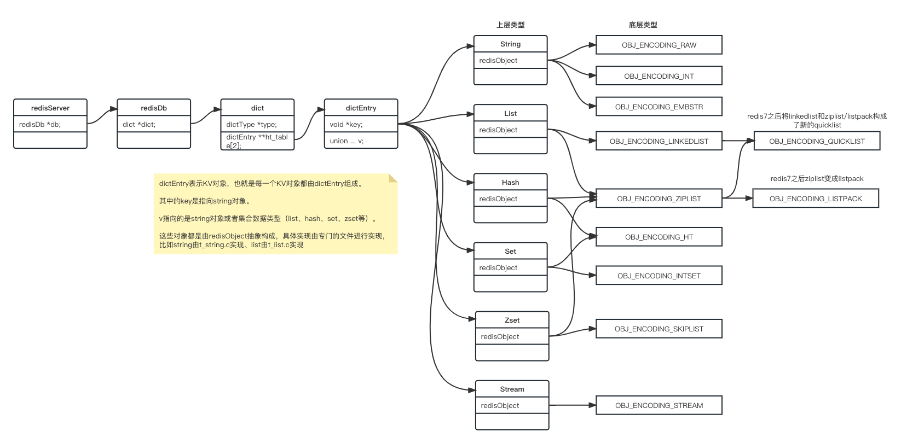
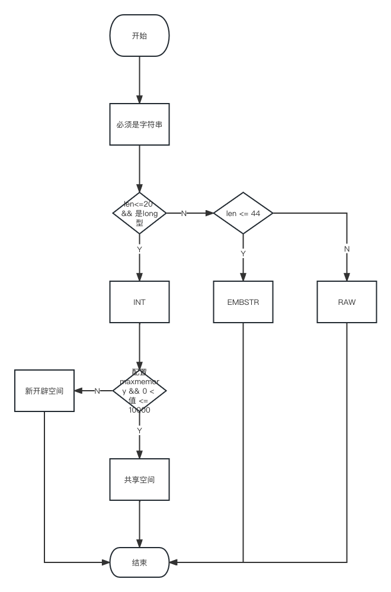
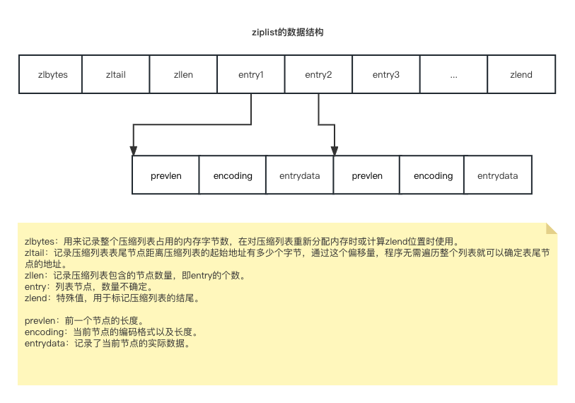
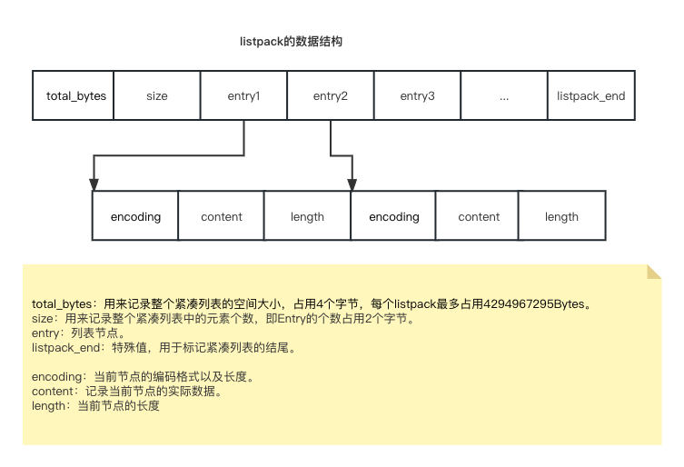
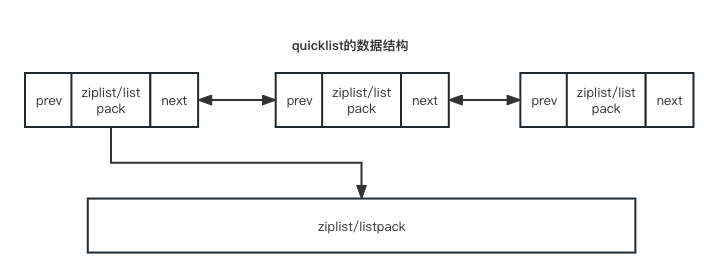
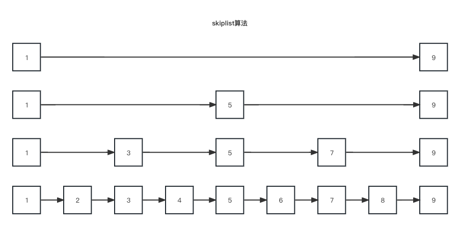

# 十大类型其实是六大类型

- string，标准的string

```shell
127.0.0.1:6379> set k1 v1111
OK
127.0.0.1:6379> type k1
string
```

- list

```shell
127.0.0.1:6379> lpush list1 1 2 3
(integer) 3
127.0.0.1:6379> type list1
list
```

- hash

```shell
127.0.0.1:6379> hset h1 id 1 name shanla
(integer) 2
127.0.0.1:6379> type h1
hash
```

- set

```shell
127.0.0.1:6379> sadd s1 1 1 2 2 3
(integer) 3
127.0.0.1:6379> type s1
set
```

- zset

```shell
127.0.0.1:6379> zadd z1 100 v1 90 v2 89 v3 1001 v4
(integer) 4
127.0.0.1:6379> type z1
zset
```

- bitmap实质是string

```shell
127.0.0.1:6379> setbit login:u1 1 1
(integer) 0
127.0.0.1:6379> setbit login:u1 2 1
(integer) 0
127.0.0.1:6379> type login:u1
string
```

- hyperLogLog实质是string

```shell
127.0.0.1:6379> pfadd hll1 z3
(integer) 1
127.0.0.1:6379> pfadd hll1 l4
(integer) 1
127.0.0.1:6379> type hll1
string
```

- GEO实质是zset

```shell
127.0.0.1:6379> geoadd city 116.403963 39.915119 "天安门"
(integer) 1
127.0.0.1:6379> type city
zset
```

- stream

```shell
127.0.0.1:6379> xadd mystream * id 11 cname z3
"1686100808565-0"
127.0.0.1:6379> type mystream
stream
```

- BITFIELD实质是string

```shell
127.0.0.1:6379> bitfield k1 incrby i5 100 1 get u4 0
1) (integer) 1
2) (integer) 7
127.0.0.1:6379> type k1
string
```

# Redis底层逻辑流转



**解析redisObject**

所有对象都是一个抽象的redisObject。

```c
// file is server.h
// redis底层类型（编码类型）定义
#define OBJ_ENCODING_RAW 0     /* Raw representation */
#define OBJ_ENCODING_INT 1     /* Encoded as integer */
#define OBJ_ENCODING_HT 2      /* Encoded as hash table */
#define OBJ_ENCODING_ZIPMAP 3  /* Encoded as zipmap */
#define OBJ_ENCODING_LINKEDLIST 4 /* No longer used: old list encoding. */
#define OBJ_ENCODING_ZIPLIST 5 /* Encoded as ziplist */
#define OBJ_ENCODING_INTSET 6  /* Encoded as intset */
#define OBJ_ENCODING_SKIPLIST 7  /* Encoded as skiplist */
#define OBJ_ENCODING_EMBSTR 8  /* Embedded sds string encoding */
#define OBJ_ENCODING_QUICKLIST 9 /* Encoded as linked list of listpacks */
#define OBJ_ENCODING_STREAM 10 /* Encoded as a radix tree of listpacks */
#define OBJ_ENCODING_LISTPACK 11 /* Encoded as a listpack */

#define LRU_BITS 24
#define LRU_CLOCK_MAX ((1<<LRU_BITS)-1) /* Max value of obj->lru */
#define LRU_CLOCK_RESOLUTION 1000 /* LRU clock resolution in ms */

#define OBJ_SHARED_REFCOUNT INT_MAX     /* Global object never destroyed. */
#define OBJ_STATIC_REFCOUNT (INT_MAX-1) /* Object allocated in the stack. */
#define OBJ_FIRST_SPECIAL_REFCOUNT OBJ_STATIC_REFCOUNT
// 这里就是redisObject结构体
typedef struct   {
    unsigned type:4; // 当前值对象的数据类型
    unsigned encoding:4; // 当前对象底层存储的编码类型
    // 采用LRU算法清楚内存中的对象
    unsigned lru:LRU_BITS; /* LRU time (relative to global lru_clock) or
                            * LFU data (least significant 8 bits frequency
                            * and most significant 16 bits access time). */
    int refcount; // 记录对象引用次数
    void *ptr; // 指向真正的底层数据结构的指针
} robj;
```

```c
// file is object.c
// 将底层类型转换成通用的文字
char *strEncoding(int encoding) {
    switch(encoding) {
    case OBJ_ENCODING_RAW: return "raw";
    case OBJ_ENCODING_INT: return "int";
    case OBJ_ENCODING_HT: return "hashtable";
    case OBJ_ENCODING_QUICKLIST: return "quicklist";
    case OBJ_ENCODING_ZIPLIST: return "ziplist";
    case OBJ_ENCODING_LISTPACK: return "listpack";
    case OBJ_ENCODING_INTSET: return "intset";
    case OBJ_ENCODING_SKIPLIST: return "skiplist";
    case OBJ_ENCODING_EMBSTR: return "embstr";
    case OBJ_ENCODING_STREAM: return "stream";
    default: return "unknown";
    }
}
```

- 小案例说明

```shell
127.0.0.1:6379> set hello world
OK
127.0.0.1:6379> type hello
string
# 底层的编码类型是embstr
127.0.0.1:6379> object encoding hello
"embstr"
127.0.0.1:6379> set age 18
OK
# 当设置是整数时，底层是int类型
127.0.0.1:6379> object encoding age
"int"
```

- 设置enable-debug-command为local

```roboconf
# 编辑redis.conf文件
# enable-protected-configs no
# enable-debug-command no
  enable-debug-command local
# enable-module-command no
```

```shell
127.0.0.1:6379> debug object age
Value at:0x7fc371cc4210 refcount:2147483647 encoding:int serializedlength:2 lru:8385853 lru_seconds_idle:12
# Value at:内存地址，对应redisObject对象中的ptr
# refcount：引用次数，对应refcount
# encoding: 物理编码类型，对应encoding
# serializedlength：序列化后的长度
# lru：记录最近使用的时间戳
# lru_seconds_idle: 空闲时间，空闲时间越大被淘汰
```

# String类型底层解析

Redis的string类型并不是使用了C语言原生的char数组字符串，而是创建了自己的字符串结构-SDS简单动态字符串。

**Redis String类型使用的三大物理方式**

- int
  
  - 保存long型（长整型）的64位（8个字节）有符号整数
  
  - 范围：-2^63-2^63-1
  
  - 超过范围或者不是整型不会用int保存。

```shell
# 范围内的整数底层类型为int
127.0.0.1:6379> set k1 123
OK
127.0.0.1:6379> object encoding k1
"int"
# 超出范围的整数底层类型为其他的字符串类型
127.0.0.1:6379> set k1 12345678912345678900
OK
127.0.0.1:6379> object encoding k1
"embstr"
# 小数也是其他的字符串类型
127.0.0.1:6379> set k2 3.1315926
OK
127.0.0.1:6379> object encoding k2
"embstr"
```

- embstr
  
  - 嵌入式字符串
  
  - 保存长度小于等于44字节的字符串

```shell
127.0.0.1:6379> set k3 aaaaaaaaaaaaaaaaaaaaaaaaaaaaaaaaaaaaaaaaaaaa
OK
127.0.0.1:6379> object encoding k3
"embstr"
# 超过44位就变成了raw
127.0.0.1:6379> set k3 aaaaaaaaaaaaaaaaaaaaaaaaaaaaaaaaaaaaaaaaaaaab
OK
127.0.0.1:6379> object encoding k3
"raw"
```

- raw
  
  - 无需处理的字符串
  
  - 保存长度大于44字节的长字符串

**为什么要自创一套字符串结构**

- 先看源码
  
  - sds定义了多种不同用于存补偿长度的字符串。
  
  - len表示字符串长度，可以方便的拿出字符串。
  
  - alloc表示已分配的未使用的空间，有了这个值就可以使用预分配空间算法，不用考虑内存分配问题。
  
  - flags表示字符串的数据，到底是sdshdr8还是sdshdr16。
  
  - buf表示字符串数据，真实存数据的。

```c
// file is sds.h
/* Note: sdshdr5 is never used, we just access the flags byte directly.
 * However is here to document the layout of type 5 SDS strings. */
struct __attribute__ ((__packed__)) sdshdr5 {
    unsigned char flags; /* 3 lsb of type, and 5 msb of string length */
    char buf[];
};
struct __attribute__ ((__packed__)) sdshdr8 {
    uint8_t len; /* used */
    uint8_t alloc; /* excluding the header and null terminator */
    unsigned char flags; /* 3 lsb of type, 5 unused bits */
    char buf[];
};
struct __attribute__ ((__packed__)) sdshdr16 {
    uint16_t len; /* used */
    uint16_t alloc; /* excluding the header and null terminator */
    unsigned char flags; /* 3 lsb of type, 5 unused bits */
    char buf[];
};
struct __attribute__ ((__packed__)) sdshdr32 {
    uint32_t len; /* used */
    uint32_t alloc; /* excluding the header and null terminator */
    unsigned char flags; /* 3 lsb of type, 5 unused bits */
    char buf[];
};
struct __attribute__ ((__packed__)) sdshdr64 {
    uint64_t len; /* used */
    uint64_t alloc; /* excluding the header and null terminator */
    unsigned char flags; /* 3 lsb of type, 5 unused bits */
    char buf[];
};
```

- 原因
  
  - 字符串读取
    
    - 原生char[]需要从头遍历，知道遇到'\0'为止，时间复杂度是O(N)
    
    - SDS记录当前字符串的长度，直接读取即可，时间复杂度是O(1)
  
  - 内存重新分配
    
    - 原生char[]分配内存空间超出后，会导致数据下标越级或者内存溢出
    
    - SDS采用空间预分配以及惰性空间释放
      
      - SDS 字符串变长时，len 长度小于 1M，那么将会额外分配与 len 相同长度的未使用空间。如果修改后长度大于 1M，那么将分配1M的使用空间。
      
      - SDS 字符串缩短时并不会回收多余的内存空间，而是使用 free 字段将多出来的空间记录下来。如果后续有变更操作，直接使用 free 中记录的空间，减少了内存的分配。
  
  - 二进制安全
    
    - 原生char[]遇到'\0'会结束，如果一些特殊的字符就有有问题
    
    - SDS会根据len长度来判断字符串结束，直接解决了二进制安全问题。

**源码解析**

```c
// file is t_string.c
/* SET key value [NX] [XX] [KEEPTTL] [GET] [EX <seconds>] [PX <milliseconds>]
 *     [EXAT <seconds-timestamp>][PXAT <milliseconds-timestamp>] */
void setCommand(client *c) {
    robj *expire = NULL;
    int unit = UNIT_SECONDS;
    int flags = OBJ_NO_FLAGS;

    if (parseExtendedStringArgumentsOrReply(c,&flags,&unit,&expire,COMMAND_SET) != C_OK) {
        return;
    }

    c->argv[2] = tryObjectEncoding(c->argv[2]);
    setGenericCommand(c,flags,c->argv[1],c->argv[2],expire,unit,NULL,NULL);
}

// file is object.c
/* 尝试对一个字符串对象进行编码，以节省空间 */
robj *tryObjectEncoding(robj *o) {
    long value;
    sds s = o->ptr;
    size_t len;

    /* 确保这是一个字符串对象 */
    serverAssertWithInfo(NULL,o,o->type == OBJ_STRING);

    /* 对字符串编码 */
    if (!sdsEncodedObject(o)) return o;

     if (o->refcount > 1) return o;

    /* 入股字符串小于20个字节且能转换成长整型则通过int来保证 */
    len = sdslen(s);
    if (len <= 20 && string2l(s,len,&value)) {
        /* 如果配置了maxmemory且值在OBJ_SHARED_INTEGERS（10000）之间直接使用共享对象值 */
        if ((server.maxmemory == 0 ||
            !(server.maxmemory_policy & MAXMEMORY_FLAG_NO_SHARED_INTEGERS)) &&
            value >= 0 &&
            value < OBJ_SHARED_INTEGERS)
        {
            decrRefCount(o);
            incrRefCount(shared.integers[value]);
            return shared.integers[value];
        } else {
            if (o->encoding == OBJ_ENCODING_RAW) {
                sdsfree(o->ptr);
                o->encoding = OBJ_ENCODING_INT;
                o->ptr = (void*) value;
                return o;
            } else if (o->encoding == OBJ_ENCODING_EMBSTR) {
                decrRefCount(o);
                return createStringObjectFromLongLongForValue(value);
            }
        }
    }

    /* 当长度小于44时使用embstr */
    if (len <= OBJ_ENCODING_EMBSTR_SIZE_LIMIT) {
        robj *emb;

        if (o->encoding == OBJ_ENCODING_EMBSTR) return o;
        emb = createEmbeddedStringObject(s,sdslen(s));
        decrRefCount(o);
        return emb;
    }

    /* 否则用RAW */
    trimStringObjectIfNeeded(o);

    /* Return the original object. */
    return o;
}

/* embstr对象创建方法 */
robj *createEmbeddedStringObject(const char *ptr, size_t len) {
    robj *o = zmalloc(sizeof(robj)+sizeof(struct sdshdr8)+len+1);
    struct sdshdr8 *sh = (void*)(o+1);

    o->type = OBJ_STRING;
    o->encoding = OBJ_ENCODING_EMBSTR;
    o->ptr = sh+1; // 分配连续的内存空间使得访问效率更高
    o->refcount = 1;
    if (server.maxmemory_policy & MAXMEMORY_FLAG_LFU) {
        o->lru = (LFUGetTimeInMinutes()<<8) | LFU_INIT_VAL;
    } else {
        o->lru = LRU_CLOCK();
    }

    sh->len = len;
    sh->alloc = len;
    sh->flags = SDS_TYPE_8;
    if (ptr == SDS_NOINIT)
        sh->buf[len] = '\0';
    else if (ptr) {
        memcpy(sh->buf,ptr,len);
        sh->buf[len] = '\0';
    } else {
        memset(sh->buf,0,len+1);
    }
    return o;
}

/* RAW格式 */
void trimStringObjectIfNeeded(robj *o) {
    if (o->encoding == OBJ_ENCODING_RAW &&
        sdsavail(o->ptr) > sdslen(o->ptr)/10)
    {
        // 使用随意的空间
        o->ptr = sdsRemoveFreeSpace(o->ptr);
    }
}
```

- 总结
  
  - 如果长度小于等于20则且是整数则用int类型保存，还有值在0-10000之间直接用共享空间，不用再开辟空间，节省了指针的空间开销。
  
  - 如果长度在小于等于40则采用embstr类型保存，采用连续的内存空间，避免内存碎片。
  
  - 如果长度大于40直接用RAW，随意开辟内存空间。



**注意**

- 只要对修改embstr会先转化为raw再进行修改无论是否达到44个字节，不想再重新分配空间浪费效率

```shell
127.0.0.1:6379> set k3 a
OK
127.0.0.1:6379> object encoding k3
"embstr"
127.0.0.1:6379> append k3 b
(integer) 2
127.0.0.1:6379> object encoding k3
"raw"
```

# Hash类型底层解析

hash类型通过设置的hash-max-ziplist-entries/hash-max-listpack-entries以及hash-max-ziplist-value/hash-max-listpack-value来判断以哪种底层结构存储。（Redis7之前使用ziplist，Redis7之后使用listpack）

- hash-max-listpack-entries：使用紧凑列表保存时哈希集合中的最大元素个数

- hash-max-listpack-value：使用紧凑列表保存时哈希集合中单个元素最大长度

下面就直接使用Redis7的参数。

**Redis Hash底层的两种结构**

- listpack/ziplist
  
  - 当哈希对象保存的键值对数量小于hash-max-listpack-entries且每个值长度都小于hash-max-listpack-value使用listpack
  
  - listpack/ziplist可以升级为hashtable

- hashtable
  
  - 反之使用hashtable
  
  - hashtable不能降级为listpack/ziplist

```shell
127.0.0.1:6379> config get hash*
# Redis7保留ziplist的配置主要是过度，其实没用了
1) "hash-max-listpack-value"
2) "64"
3) "hash-max-listpack-entries"
4) "512"
5) "hash-max-ziplist-entries"
6) "512"
7) "hash-max-ziplist-value"
8) "64"
127.0.0.1:6379> config set hash-max-listpack-value 3
OK
127.0.0.1:6379> config set hash-max-listpack-entries 3
OK
127.0.0.1:6379> hset user01 id 1
(integer) 1
127.0.0.1:6379> object encoding user01
# 符合条件用了listpack
"listpack"
127.0.0.1:6379> hset user02 id 2 name shanla age 19
(integer) 3
127.0.0.1:6379> object encoding user02
# 不符合条件使用hashtable
"hashtable"
```

**源码解析**

- hash如何根据设置进行不同类型存储

```c
// file is t_hash.c
void hsetCommand(client *c) {
    int i, created = 0;
    robj *o;

    if ((c->argc % 2) == 1) {
        addReplyErrorArity(c);
        return;
    }

    if ((o = hashTypeLookupWriteOrCreate(c,c->argv[1])) == NULL) return;
    hashTypeTryConversion(o,c->argv,2,c->argc-1);

    for (i = 2; i < c->argc; i += 2)
        created += !hashTypeSet(o,c->argv[i]->ptr,c->argv[i+1]->ptr,HASH_SET_COPY);

    /* HMSET (deprecated) and HSET return value is different. */
    char *cmdname = c->argv[0]->ptr;
    if (cmdname[1] == 's' || cmdname[1] == 'S') {
        /* HSET */
        addReplyLongLong(c, created);
    } else {
        /* HMSET */
        addReply(c, shared.ok);
    }
    signalModifiedKey(c,c->db,c->argv[1]);
    notifyKeyspaceEvent(NOTIFY_HASH,"hset",c->argv[1],c->db->id);
    server.dirty += (c->argc - 2)/2;
}

void hashTypeTryConversion(robj *o, robj **argv, int start, int end) {
    int i;
    size_t sum = 0;

    if (o->encoding != OBJ_ENCODING_LISTPACK) return;

    for (i = start; i <= end; i++) {
        if (!sdsEncodedObject(argv[i]))
            continue;
        size_t len = sdslen(argv[i]->ptr);
        // 当长度大于hash_max_listpack_value用hashtable
        if (len > server.hash_max_listpack_value) {
            hashTypeConvert(o, OBJ_ENCODING_HT);
            return;
        }
        sum += len;
    }
    if (!lpSafeToAdd(o->ptr, sum))
        hashTypeConvert(o, OBJ_ENCODING_HT);
}
```

- ziplist(Redis6)
  
  - 压缩列表是为了节约内存而开发，由连续内存块组正的顺序型数据结构，优点类似数组。
  
  - ziplist是一个经过特殊处理的双向链表，它不存储prev和next指针，而是存储上一个节点长度和当前节点长度，通过牺牲读写性能，换取高效的内存空间利用率
  
  - 只用在字段个数少，字段值小的场景

```c
// file is ziplist.c
typedef struct zlentry {
    unsigned int prevrawlensize; // 上一个节点的长度所占的字节数
    unsigned int prevrawlen;     // 上一个节点的长度
    unsigned int lensize;        // 当前节点长度字节数
    unsigned int len;            // 当前节点长度
    unsigned int headersize;     // 当前节点的header大小， headersize = lensize+prevrawlensize
    unsigned char encoding;      // 当前节点的编码格式
    unsigned char *p;            // 当前节点指针
} zlentry;
```



entry是一个一个的节点，比如`hset user01 id 1 name shanla`，则表现为id、1、name、shanla为entry1、entry2、entry3、entry4。

entry没有采用双端链表，而采用记录上一个节点的长度以及自己的节点长度，通过长度推算记录。主要是因为：

1. 普通的双向链表，在存储数据很少的情况下，我们存储的实际数据大小可能还没有指针占用的内存大，为了节省空间，采用了字节长度来计算牺牲了计算时间。

2. 普通双向链表一般是不连续的，遍历相对比较慢；而ziplist可以很好的解决这个问题，因为记录了偏移量很快就能找到节点。

3. 普通双向链表获取整个链表时要遍历整个链表，而ziplist中有一个zltail，直接就能获取到整个链表，时间复杂度是O(1)。
- listpack(Redis7)
  
  - listpack是为了解决ziplist的连锁更新问题而开发
  
  - ziplist新增元素或修改元素时，如果空间不够，压缩列表占用的空间就需要重新分配，当新插入的元素较大时，可能会导致胡须元素的prevlen占用空间都发生变化，从而导致连锁更新问题，导致每个元素都要重新分配，造成压缩列表性能下降。
  
  - listpack将ziplist的entry中的prevlen去掉了，只记录自己的长度来保证连锁更新问题。

```c
// file is listpack.c
unsigned char *lpNew(size_t capacity) {
    unsigned char *lp = lp_malloc(capacity > LP_HDR_SIZE+1 ? capacity : LP_HDR_SIZE+1);
    if (lp == NULL) return NULL;
    lpSetTotalBytes(lp,LP_HDR_SIZE+1);
    lpSetNumElements(lp,0);
    lp[LP_HDR_SIZE] = LP_EOF;
    return lp;
}
```



# List类型底层解析

List类型的底层是采用了quicklist，在Redis7之前quicklist是由ziplist+linkedlist组成，而Redis7之后因为listpack替换了ziplist，所以之后quicklist是由listpack+linkedlist组成。

**list相关配置**

```shell
127.0.0.1:6379> config get list*
1) "list-max-ziplist-size"
2) "-2"
3) "list-max-listpack-size"
4) "-2"
5) "list-compress-depth"
6) "0"
```

- list-max-listpack-size/list-max-ziplist-size
  
  - 是指quicklist的每个节点（要么是listpack，要么是ziplist）的节点长度最大值
  
  - 正数表示长度最大值
  
  - 负数有特定意义
    
    - -5: 每个quicklist节点上的ziplist大小不能超过64 Kb。
    
    - -4: 每个quicklist节点上的ziplist大小不能超过32 Kb。
    
    - -3: 每个quicklist节点上的ziplist大小不能超过16 Kb。
    
    - -2: 每个quicklist节点上的ziplist大小不能超过8 Kb。（-2是默认）
    
    - -1: 每个quicklist节点上的ziplist大小不能超过4 Kb。

- list-compress-depth
  
  - 表示一个quicklist两端不被压缩的节点个数。这里的节点是指quicklist双向链表的节点。
    
    - 0: 是个特殊值，表示都不压缩。这是Redis的默认值。
    
    - 1: 表示quicklist两端各有1个节点不压缩，中间的节点压缩。
    
    - 依此类推…

**源码解析**

```c
// file is t_list.c
void pushGenericCommand(client *c, int where, int xx) {
    int j;

    robj *lobj = lookupKeyWrite(c->db, c->argv[1]);
    if (checkType(c,lobj,OBJ_LIST)) return;
    if (!lobj) {
        if (xx) {
            addReply(c, shared.czero);
            return;
        }
        // 创建quicklist对象
        lobj = createQuicklistObject();
        // redis7之后使用了listpack
        quicklistSetOptions(lobj->ptr, server.list_max_listpack_size,
                            server.list_compress_depth);
        dbAdd(c->db,c->argv[1],lobj);
    }

    for (j = 2; j < c->argc; j++) {
        listTypePush(lobj,c->argv[j],where);
        server.dirty++;
    }

    addReplyLongLong(c, listTypeLength(lobj));

    char *event = (where == LIST_HEAD) ? "lpush" : "rpush";
    signalModifiedKey(c,c->db,c->argv[1]);
    notifyKeyspaceEvent(NOTIFY_LIST,event,c->argv[1],c->db->id);
}

/* LPUSH <key> <element> [<element> ...] */
void lpushCommand(client *c) {
    pushGenericCommand(c,LIST_HEAD,0);
}

// file is object.c
robj *createQuicklistObject(void) {
    quicklist *l = quicklistCreate();
    robj *o = createObject(OBJ_LIST,l);
    o->encoding = OBJ_ENCODING_QUICKLIST;
    return o;
}

// quicklist.h
// quicklist的结构
typedef struct quicklist {
    quicklistNode *head;
    quicklistNode *tail;
    unsigned long count;        /* total count of all entries in all listpacks */
    unsigned long len;          /* number of quicklistNodes */
    signed int fill : QL_FILL_BITS;       /* fill factor for individual nodes */
    unsigned int compress : QL_COMP_BITS; /* depth of end nodes not to compress;0=off */
    unsigned int bookmark_count: QL_BM_BITS;
    quicklistBookmark bookmarks[];
} quicklist;

// quicklistNode结构
typedef struct quicklistNode {
    struct quicklistNode *prev;
    struct quicklistNode *next;
    unsigned char *entry;
    size_t sz;             /* entry size in bytes */
    unsigned int count : 16;     /* count of items in listpack */
    unsigned int encoding : 2;   /* RAW==1 or LZF==2 */
    unsigned int container : 2;  /* PLAIN==1 or PACKED==2 */
    unsigned int recompress : 1; /* was this node previous compressed? */
    unsigned int attempted_compress : 1; /* node can't compress; too small */
    unsigned int extra : 10; /* more bits to steal for future usage */
} quicklistNode;
```



# Set类型底层解析

Set类型底层数据结构采用了inset或hashtable两种类型来存储。

**Redis Set底层的两种类型**

- intset
  
  - 当存储类型为整型且元素个数小于set-max-intset-entries时使用intset类型

- hashtable
  
  - 否则使用hashtable。

```shell
127.0.0.1:6379> config get set*
1) "set-max-intset-entries"
2) "512"
3) "set-proc-title"
4) "yes"
127.0.0.1:6379> config set set-max-intset-entries 3
OK
127.0.0.1:6379> sadd h1 1 2
(integer) 2
127.0.0.1:6379> object encoding h1
"intset"
127.0.0.1:6379> sadd h1 1 2 3 4
(integer) 2
127.0.0.1:6379> object encoding h1
"hashtable"
```

**源码解析**

```c
// file is t_set.c
void saddCommand(client *c) {
    robj *set;
    int j, added = 0;

    set = lookupKeyWrite(c->db,c->argv[1]);
    if (checkType(c,set,OBJ_SET)) return;

    if (set == NULL) {
        set = setTypeCreate(c->argv[2]->ptr);
        dbAdd(c->db,c->argv[1],set);
    }

    for (j = 2; j < c->argc; j++) {
        if (setTypeAdd(set,c->argv[j]->ptr)) added++;
    }
    if (added) {
        signalModifiedKey(c,c->db,c->argv[1]);
        notifyKeyspaceEvent(NOTIFY_SET,"sadd",c->argv[1],c->db->id);
    }
    server.dirty += added;
    addReplyLongLong(c,added);
}

int setTypeAdd(robj *subject, sds value) {
    long long llval;
    // 如果编码是hashtable
    if (subject->encoding == OBJ_ENCODING_HT) {
        dict *ht = subject->ptr;
        dictEntry *de = dictAddRaw(ht,value,NULL);
        if (de) {
            dictSetKey(ht,de,sdsdup(value));
            dictSetVal(ht,de,NULL);
            return 1;
        }
    } else if (subject->encoding == OBJ_ENCODING_INTSET) {
        // 如果编码是intset
        if (isSdsRepresentableAsLongLong(value,&llval) == C_OK) {
            uint8_t success = 0;
            subject->ptr = intsetAdd(subject->ptr,llval,&success);
            if (success) {
                /* Convert to regular set when the intset contains
                 * too many entries. */
                size_t max_entries = server.set_max_intset_entries;
                /* limit to 1G entries due to intset internals. */
                if (max_entries >= 1<<30) max_entries = 1<<30;
                if (intsetLen(subject->ptr) > max_entries)
                    setTypeConvert(subject,OBJ_ENCODING_HT);
                return 1;
            }
        } else {
            /* Failed to get integer from object, convert to regular set. */
            setTypeConvert(subject,OBJ_ENCODING_HT);

            /* The set *was* an intset and this value is not integer
             * encodable, so dictAdd should always work. */
            serverAssert(dictAdd(subject->ptr,sdsdup(value),NULL) == DICT_OK);
            return 1;
        }
    } else {
        serverPanic("Unknown set encoding");
    }
    return 0;
}
```

# Zset类型底层解析

Zset类型底层有[ziplist/listpack]或skiplist两种类型。

**Redis Zset的两种底层类型**

- listpack/ziplist
  
  - 当zset元素个数不超过zset-max-listpack-entries且每个元素值长度不超过zset-max-listpack-value时使用listpack。
  
  - Redis6和Redis7要区分成ziplist和listpack。

- quicklist
  
  - 反之使用quicklist

**源码解析**

```c
// file is t_zset.c
int zsetAdd(robj *zobj, double score, sds ele, int in_flags, int *out_flags, double *newscore) {
    // 省略代码...

    // listpack编码
    if (zobj->encoding == OBJ_ENCODING_LISTPACK) {
        // 代码省略...
    }

    // skiplist编码
    if (zobj->encoding == OBJ_ENCODING_SKIPLIST) {
        // 代码省略...
    } else {
        serverPanic("Unknown sorted set encoding");
    }
    return 0; /* Never reached. */
}
```

**为什么使用skiplist**

zset是一个有序的不重复的集合，如果采用普通的链表，查找的效率很低，其时间复杂度是O(N)。为了优化时间复杂度，引用了skiplist。

skiplist主要增加索引（多级索引，二分查找）来优化查找效率，但牺牲了一定的空间。



比如现在要查找8，不用全表遍历，而是通过索引

1. 先查找第三层索引，8在1-9之间

2. 再查找第二层索引1-5-9，8在5-9之间

3. 再查找第三层索引5-7-9，8在7-9之间

4. 最后查找第四层7-9，从而遍历查找到8

通过演算，其时间复杂度为O(logN)，二分查找一般都是O(logN)，但空间复杂度为O(N)。典型的空间换时间的案例。

**跳表优缺点**

- 优点
  
  - 降低了时间复杂度，多用于读多写少的场景。

- 缺点
  
  - 空间复杂度高
  
  - 维护成本高，比如删除新增数据都需要更新所有索引
