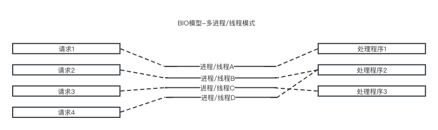
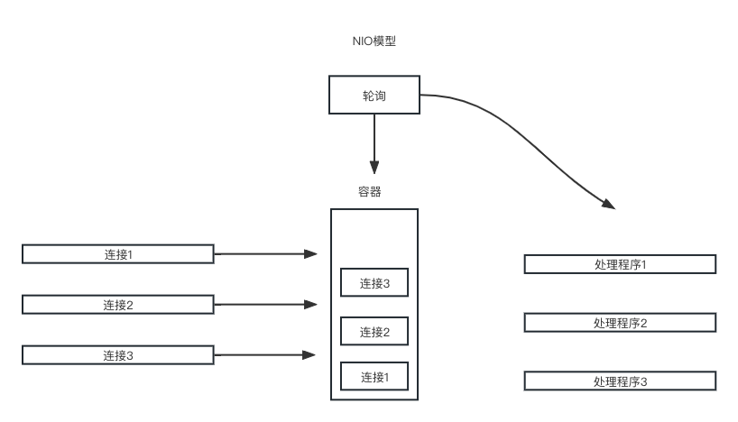
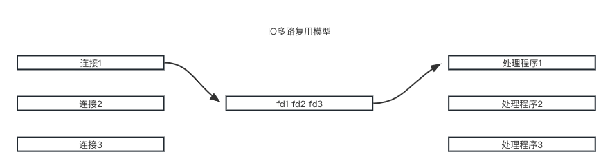
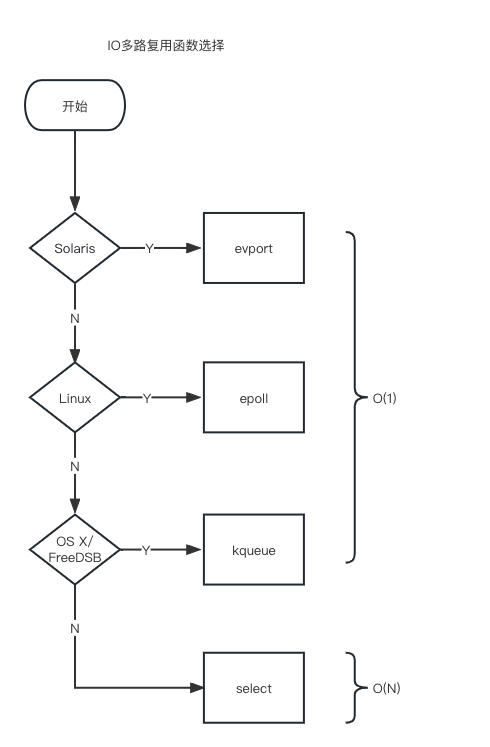
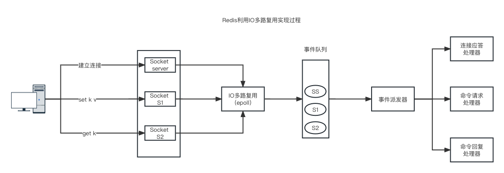

# 痛点在哪

**之前是什么的**

- 同步阻塞网络IO模型
  
  - 特点就是用一个进程来处理一个请求，在并发多客户端时性能非常差。

**解决思路**

因为一个请求需要一个进程来服务，进程对于Linux是一个开销不小的家伙，所以为了高效海量为用户提供服务，必须要让一个进程同时处理很多请求才行。

# 名词解释

**同步**

调用者要一直等待被调用者给出结果。

**异步**

被调用者先应答调用者，有了结果之后通过回调给到调用者。

**阻塞**

调用者一直等待其他事情都不做，当前进程会被挂起，什么也不干。

**非阻塞**

调用者不会等待，发出请求后会去做其他事，不会阻塞当前进程。

**总结**

同步和异步强调被调用者是不是马上给出结果，阻塞和非阻塞强调调用者能不能做其他事。

**组合**

- 同步阻塞
  
  - 调用者和被调用者都先处理和处理同一件事。

- 同步非阻塞
  
  - 被调用者处理，调用者可以做其他事。

- 异步阻塞
  
  - 被调用者后台处理，调用者只是等待不做其他事。

- 异步非阻塞
  
  - 被调用者后台处理，调用者可以做其他事。

# 5种网络IO模型

- BIO
  
  - Blocking IO，阻塞IO

- NIO
  
  - NoneBlocking IO，非阻塞IO

- IO Multiplexing
  
  - IO多路复用

- signal driven IO
  
  - 信号驱动IO

- asynchronous IO
  
  - 异步IO

# 如何进化

**BIO**

最开始的BIO是一个进程进行阻塞的处理，这样就会导致大量的请求时会一直阻塞。为了解决这个问题采用了多进程/线程模式。

阻塞式IO是为每一个客户端请求分配一个进程/线程处理。其缺点就是海量的请求会开辟海量的进程/线程，十分耗费资源。

问题：

1. 开辟的大量进程/线程会消耗大量的资源

**NIO**

NIO就是为了解决BIO申请大量的进程/线程的问题，将每个请求写进容器中，然后通过遍历的方式发现谁有事要处理的进行处理，避免生成非常的进程/线程。

问题：

1. 如果连接非常多，而不管是否有操作，每个连接都会被遍历，会做很多无用功，会占用大量的CPU时间。

2. 这个遍历过程还是在用户态进行的，用户态判断socket是否有数据还是调用内核的read()方法实现的，这就涉及到用户态和内核态的切换，每遍历一个就要切换一次，开销很大因为这些问题的存在。

**IO多路复用**

IO多路复用是进一步解决NIO的问题，首先是将整个用户态直接移动到Linux的内核中，直接将用户态和内核态切换的开销解决，再次整体遍历优化成只对有操作的进行处理。

给每个Socket连接请求分配一个文件描述符（Fd），监听这些fd，发现谁有请求就处理谁的。

# IO多路复用的具体实现

**select**

select 其实就是把NIO中用户态要遍历的fd数组(每一个socket链接)拷贝到了内核态，让内核态来遍历，因为用户态判断socket是否有数据还是要调用内核态的，所有拷贝到内核态后，这样遍历判断的时候就不用一直用户态和内核态频繁切换了。

缺点：

1. bitmap最大1024位，一个进程最多只能处理1024个客户端

2. &rset不可重用，每次socket有数据就相应的位会被置位

3. 文件描述符数组拷贝到了内核态(只不过无系统调用切换上下文的开销。（内核层可优化为异步事件通知）)，仍然有开销。select 调用需要传入 fd 数组，需要拷贝一份到内核，高并发场景下这样的拷贝消耗的资源是惊人的。（可优化为不复制）

4. select并没有通知用户态哪一个socket有数据，仍然需要O(n)的遍历。select 仅仅返回可读文件描述符的个数，具体哪个可读还是要用户自己遍历。（可优化为只返回给用户就绪的文件描述符，无需用户做无效的遍历）

**poll**

解决了select的bitmap大小限制以及rset不可重用的问题。

缺点：

1. pollfds数组拷贝到了内核态，仍然有开销

2. poll并没有通知用户态哪一个socket有数据，仍然需要O(n)的遍历

**epoll**

epoll进一步优化，并不是遍历所有的fd，而是将有事件发生的fd放进就绪链表中，通过遍历就绪链表。

优点：

1. 一个socket的生命周期中只有一次从用户态拷贝到内核态的过程，开销小。

2. 使用event事件通知机制，每次socket中有数据会主动通知内核，并加入到就绪链表中，不需要遍历所有的socket。

总结一句话就是epoll 是只轮询那些真正发出了事件的流。

# Redis如何使用IO多路复用

Redis利用epoll函数来实现IO多路复用，将连接信息以及事件放到队列中，依次放到事件派发器，事件派发器将时间发给事件处理器。

Redis 服务采用 Reactor 的方式来实现文件事件处理器（每一个网络连接其实都对应一个文件描述符） 

所谓 I/O 多路复用机制，就是说通过一种机制，可以监视多个描述符，一旦某个描述符就绪（一般是读就绪或写就绪），能够通知程序进行相应的读写操作。这种机制的使用需要 select 、 poll 、 epoll 来配合。多个连接共用一个阻塞对象，应用程序只需要在一个阻塞对象上等待，无需阻塞等待所有连接。当某条连接有新的数据可以处理时，操作系统通知应用程序，线程从阻塞状态返回，开始进行业务处理。
