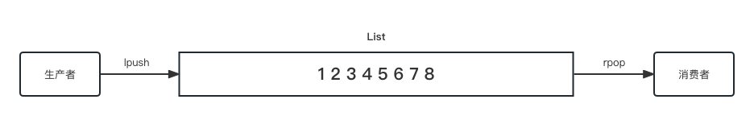
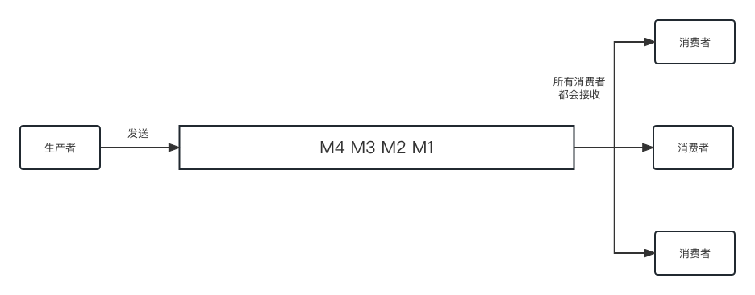
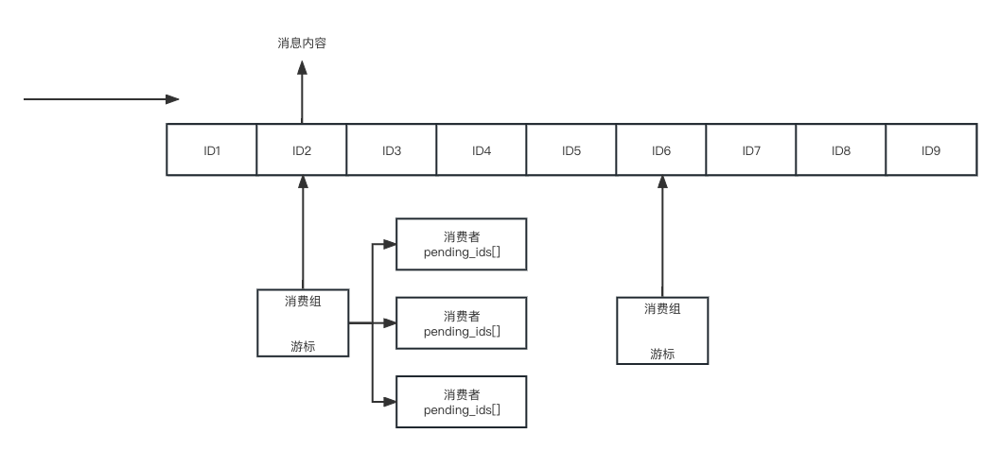

# Key

redis是key-value数据库，类型是针对value的，key都是字符串。key是区分大小写，而命令不区分大小写。

**key的常用操作**

| 操作                   | 含义                             | 返回值                       |
| -------------------- | ------------------------------ | ------------------------- |
| keys *               | 查看当前库所有的key，谨慎使用               | 为空返回(empty array)         |
| exists key           | 判断key是否存在                      | 存在返回1，反之0                 |
| type key1            | 判断key是什么类型                     | string、list等等，key不存在为none |
| del key1             | 删除指定的key                       | 成功返回1，失败返回0               |
| unlink key1          | 非阻塞删除，仅从keyspace中删除，真正的删除会异步进行 | 成功返回1，失败返回0               |
| ttl key1             | 查看还有多少秒过期                      | -1表示用不过期、-2表示已过期或被删除      |
| expire key1 秒数       | 为指定的key设置秒过期时间                 | 成功返回1，失败返回0               |
| pexpire key1 毫秒      | 为指定的key设置毫秒过期时间                | 成功返回1，失败返回0               |
| expireat key1 时间戳    | 为指定的key设置秒时间戳过期时间              | 成功返回1，失败返回0               |
| pexpireat key1 毫秒时间戳 | 为指定的key设置毫秒时间戳过期时间             | 成功返回1，失败返回0               |
| move key dbindex     | 将key移动到指定的数据库db中               | 成功返回1，失败返回0               |
| select dbindex       | 切换数据库                          | 成功返回1，失败返回0               |
| dbsize               | 查看当前数据库key的数量                  | key的数量                    |
| flushdb              | 清空当前库                          |                           |
| flushall             | 清空全部库                          |                           |

# Help帮助命令

redis内置的帮助文档命令

```shell
# help @类型
127.0.0.1:6379> help @string
```

# String

string是redis最基本的类型，一个key对应一个value。String类型是二进制安全的，意思是redis的string类型可以包含任意数据。字符串value最多可以是512M。

**命令场景**

- 最常用的

```shell
# 最简单的设置和获取，永不过期
127.0.0.1:6379> set key helloworld
OK
127.0.0.1:6379> get key
"helloworld"

# set时设置过期时间，是一个原子操作
127.0.0.1:6379> set key1 helloworld1 ex 60
OK
127.0.0.1:6379> ttl key1
(integer) 57
# set时保持之前的过期时间
127.0.0.1:6379> set key1 helloworld1_update keepttl
OK
127.0.0.1:6379> ttl key1
```

SET的参数

```shell
SET key value [NX | XX] [GET] [EX seconds | PX milliseconds |
  EXAT unix-time-seconds | PXAT unix-time-milliseconds | KEEPTTL]

# NX 当key不存在时设置
# XX 当key已存在时设置
# GET 返回key原本的值，不存在时返回nil
127.0.0.1:6379> set key1 helloworld1_update GET
"helloworld1"
127.0.0.1:6379> get key1
"helloworld1_update"
# EX seconds 以秒为单位设置过期时间
# PX milliseconds 以毫秒为单位设置过期时间
# EXAT unix-time-seconds 以秒时间戳设置过期时间
# PXAT unix-time-milliseconds 以毫秒时间戳设置过期时间
# KEEPTTL 保持之前的过期时间，但对于已过期或不存在的key，设置后是永久
```

- 同时设置/获取多个

```shell
# mset key value [key value ...]
127.0.0.1:6379> mset key1 aa key2 bb key3 cc
OK
127.0.0.1:6379> mget key1 key2 key3
1) "aa"
2) "bb"
3) "cc"

# msetnx key value [key value ...] 当key不存在时才设置
127.0.0.1:6379> msetnx key1 xx key2 yy key3 zz
(integer) 0
127.0.0.1:6379> msetnx key4 xx key5 yy key6 zz
(integer) 1
# 如果部分key存在，所有的都不会成功
127.0.0.1:6379> msetnx key6 bb key7 kk
(integer) 0
```

- 设置/获取指定区间的值

```shell
# getrange key start end
127.0.0.1:6379> set key7 "This is a string"
OK
127.0.0.1:6379> get key7
"This is a string"
127.0.0.1:6379> getrange key7 0 3
"This"
127.0.0.1:6379> getrange key7 -3 -1
"ing"

# setrange key offset value
127.0.0.1:6379> setrange key7 10 string10
(integer) 18
127.0.0.1:6379> get key7
"This is a string10"
```

- 数值增减（必须是数字）

```shell
# 必须是数字且必须是整数
127.0.0.1:6379> get key7
"This is a string10"
127.0.0.1:6379> incr key7
(error) ERR value is not an integer or out of range
# 自增1
127.0.0.1:6379> set key8 0
OK
127.0.0.1:6379> incr key8
(integer) 1
127.0.0.1:6379> get key8
"1"
# 按指定数字自增
127.0.0.1:6379> incrby key8 2
(integer) 3
127.0.0.1:6379> incrby key8 2
(integer) 5
127.0.0.1:6379> incrby key8 2
(integer) 7
# 按指定小数自增
127.0.0.1:6379> incrbyfloat key9 1.2
"11.2"
# 自减1
127.0.0.1:6379> decr key8
(integer) 6
# 按指定数字自减
127.0.0.1:6379> decrby key8 3
(integer) 2
127.0.0.1:6379> decrby key8 3
(integer) -1
```

- 获取字符串长度，内容追加

```shell
127.0.0.1:6379> get key7
"This is a string10"
# 统计string的长度
127.0.0.1:6379> strlen key7
(integer) 18
# 追加内容
127.0.0.1:6379> append key7 " append string"
(integer) 32
127.0.0.1:6379> get key7
"This is a string10 append string"
```

- 分布式锁

当多个客户端竞争同一个资源时，根据redis的setnx先获取锁（原子）再获取资源。

```shell
# 加锁成功访问资源
127.0.0.1:6379> set lock pay ex 10 nx
OK
# 加锁失败等待
127.0.0.1:6379> set lock pay ex 10 nx
(nil)
# 加锁成功
127.0.0.1:6379> set lock pay ex 10 nx
OK
# setex:设置带过期时间的key，动态设置 等同于 set key value ex 10
# setnx:只有在 key 不存在时设置 key 的值 等同于 set key value nx
```

* getset

```shell
127.0.0.1:6379> getset key7 "reset string"
"This is a string10 append string"
127.0.0.1:6379> get key7
"reset string"
```

**运用场景**

- 抖音直播无限点赞，点一次加一次

```shell
127.0.0.1:6379> incr like
(integer) 1
127.0.0.1:6379> incr like
(integer) 2
```

# List

List是单key多value，是一个典型的双向链表结构，容量为$2$32-1个元素，大约40多亿，一般用于栈、队列、消息队列等场景。

从左、从右都可以插入数据，如果key不存在时则新创建一个链表；如果key存在则新增内容；如果值全部移除对应的key也就删除。

List是有序、可重复的。

**命令场景**

- lpush/rpush/lrange

```shell
# lpush 从左边push数据
127.0.0.1:6379> lpush list1 1 2 3 4
(integer) 4
127.0.0.1:6379> type list1
list
# lrange 遍历list，注意并没有rrange
127.0.0.1:6379> lrange list1 0 -1
1) "4"
2) "3"
3) "2"
4) "1"
# rpush 从右边push数据
127.0.0.1:6379> rpush list1 0 -1 -2 -3
(integer) 8
127.0.0.1:6379> lrange list1 0 -1
1) "4"
2) "3"
3) "2"
4) "1"
5) "0"
6) "-1"
7) "-2"
8) "-3"
```

- lpop/rpop

```shell
# lpop 从左边pop一个元素
127.0.0.1:6379> lpop list1
"4"
# 从左边pop2个元素
127.0.0.1:6379> lpop list1 2
1) "3"
2) "2"
# rpop 从右边pop一个元素
127.0.0.1:6379> rpop list1
"-3"
# 从右边pop2个元素
127.0.0.1:6379> rpop list1 2
1) "-2"
2) "-1"
```

- lindex

```shell
# lindex 按照索引下标获得元素
127.0.0.1:6379> lrange list1 0 -1
1) "1"
2) "0"
127.0.0.1:6379> lindex list1 1
"0"
```

- llen

```shell
# llen 获取list的元素个数
127.0.0.1:6379> llen list1
(integer) 2
```

- lrem key N V

```shell
127.0.0.1:6379> lrange list2 0 -1
1) "2"
2) "3"
3) "1"
4) "1"
5) "2"
6) "2"
7) "1"
8) "1"
# lrem 从左往右，删除N个等于V的值
127.0.0.1:6379> lrem list2 2 2
(integer) 2
127.0.0.1:6379> lrange list2 0 -1
1) "3"
2) "1"
3) "1"
4) "2"
5) "1"
6) "1"
```

- ltrim key startIndex endIndex

```shell
# 截取指定范围的值再赋值给key
127.0.0.1:6379> ltrim list2 0 3
OK
127.0.0.1:6379> lrange list2 0 -1
1) "3"
2) "1"
3) "1"
4) "2"
```

- rpoplpush

```shell
# rpoplpush 源list 目标list，从源list右边pop一个元素到目标list的左边
127.0.0.1:6379> lpush list3 1 1 1 1
(integer) 4
127.0.0.1:6379> rpush list4 2 2 2 2
(integer) 4
127.0.0.1:6379> rpoplpush list3 list4
"1"
127.0.0.1:6379> lrange list3 0 -1
1) "1"
2) "1"
3) "1"
127.0.0.1:6379> lrange list4 0 -1
1) "1"
2) "2"
3) "2"
4) "2"
5) "2"
```

- lset

```shell
# lset key index value 设置下标为index的值为value
127.0.0.1:6379> lset list4 2 "lset"
OK
127.0.0.1:6379> lrange list4 0 -1
1) "1"
2) "2"
3) "lset"
4) "2"
5) "2"
# 下标不存在的时候会报错
127.0.0.1:6379> lset list4 5 "index not exist"
(error) ERR index out of range
```

- linsert

```shell
# linsert key before/after 已有值 插入的新值
# 针对不重复的list可行
127.0.0.1:6379> linsert list4 before 2 "before"
(integer) 6
127.0.0.1:6379> lrange list4 0 -1
1) "1"
2) "before"
3) "2"
4) "lset"
5) "2"
6) "2"
```

**运用场景**

- 发布订阅

# Hash

K-V模式，但V是一个K-V。

**命令场景**

- hset/hget/hmset/hmget/hgetall/hdel

```shell
# hset key field value [field value ...]
127.0.0.1:6379> hset user01 id 1 name "zhangsan" age 12 score 88.3
(integer) 4
# hget key field 获取Hash的单个字段值
127.0.0.1:6379> hget user01 score
"88.3"
# hmget 获取hash的多个字段值
127.0.0.1:6379> hmget user01 id name age score
1) "1"
2) "zhangsan"
3) "12"
4) "88.3"
# hgetall 获取所有字段值
127.0.0.1:6379> hgetall user01
1) "id"
2) "1"
3) "name"
4) "zhangsan"
5) "age"
6) "12"
7) "score"
8) "88.3"
# 如果字段不存在则新增，如果存在则覆盖
127.0.0.1:6379> hset user01 remark "good"
(integer) 1
# hdel key field [field ...] 删除多个field
127.0.0.1:6379> hdel user01 remark
(integer) 1
```

- hlen

```shell
# hlen key 获取元素个数
127.0.0.1:6379> hlen user01
(integer) 5
```

- hkeys/hvals

```shell
# hkeys key 获取hash的所有字段
127.0.0.1:6379> hkeys user01
1) "id"
2) "name"
3) "age"
4) "score"
5) "remark"
# hvals key 获取hash的所有value
127.0.0.1:6379> hvals user01
1) "1"
2) "zhangsan"
3) "12"
4) "88.3"
5) "good+love1"
```

- hincrby/hincrbyfloat

```shell
# hincrby key field num 字段自增
127.0.0.1:6379> hincrby user01 age 2
(integer) 14
# hincrby key field float 字段自增小数
127.0.0.1:6379> hincrbyfloat user01 score 2
"90.3"
```

- hsetnx

```shell
# hsetnx key field value 当field不存在时设置成功返回1，否则失败返回0
127.0.0.1:6379> hsetnx user01 remark 1
(integer) 0
127.0.0.1:6379> hsetnx user01 remark1 3
(integer) 1
```

**运用场景**

- 添加购物车、增加商品数量、全选

# Set

Set类型是单key多value模式，且是无序的，且value不能重复。

如果key不存在时，sadd会创建key；如果添加一个已存在的值会失败；

**命令场景**

- sadd/smembers

```shell
# sadd key value [value ...] 往集合里面添加元素
127.0.0.1:6379> sadd set2 2 1 2 3 4 5 6 1 7
(integer) 7
# smembers key 遍历集合中所有元素
127.0.0.1:6379> smembers set2
1) "1"
2) "2"
3) "3"
4) "4"
5) "5"
6) "6"
7) "7"
# 3已经在set2中了，添加失败
127.0.0.1:6379> sadd set2 3
(integer) 0
127.0.0.1:6379> sadd set2 8
(integer) 1
```

- sismember key member

```shell
# sismember key member 判断元素是否存在集合中
127.0.0.1:6379> sismember set2 8
(integer) 1
127.0.0.1:6379> sismember set2 9
(integer) 0
```

- srem key member [member ...]

```shell
# srem key member [member ...] 从集合中删除多个元素
127.0.0.1:6379> srem set2 8
(integer) 1
127.0.0.1:6379> smembers set2
1) "1"
2) "2"
3) "3"
4) "4"
5) "5"
6) "6"
7) "7"
```

- scard

```shell
# scard key 获取集合中的元素个数
127.0.0.1:6379> scard set2
(integer) 7
```

- srandmember key [number]

```shell
# srandmember key [number] 从集合中随机获取几个元素，但不会从集合中删除
# 随机获取一个元素
127.0.0.1:6379> srandmember set2
"3"
127.0.0.1:6379> srandmember set2
"2"
# 随机获取3个元素
127.0.0.1:6379> srandmember set2 3
1) "7"
2) "6"
3) "3"
```

- spop key [member]

```shell
# spop key [member] 随机pop多个元素
# 随机pop1个元素
127.0.0.1:6379> spop set2
"2"
127.0.0.1:6379> smembers set2
1) "1"
2) "3"
3) "4"
4) "5"
5) "6"
6) "7"
# 随机pop2个元素
127.0.0.1:6379> spop set2 2
1) "1"
2) "4"
127.0.0.1:6379> smembers set2
1) "3"
2) "5"
3) "6"
4) "7"
```

- smove key1 key2 key1中存在的元素

```shell
# smove key1 key2 key1中存在的元素 从key1中奖已存在的元素移动到key2
# 注意如果移动的元素也存在key2中，key1会移除该元素，但key2不会重复
27.0.0.1:6379> smembers set1
1) "1"
2) "2"
3) "3"
4) "4"
5) "5"
6) "6"
7) "7"
127.0.0.1:6379> smembers set2
1) "3"
2) "5"
3) "6"
4) "7"
127.0.0.1:6379> smove set1 set2 2
(integer) 1
127.0.0.1:6379> smembers set1
1) "1"
2) "3"
3) "4"
4) "5"
5) "6"
6) "7"
127.0.0.1:6379> smembers set2
1) "2"
2) "3"
3) "5"
4) "6"
5) "7"
127.0.0.1:6379> smove set1 set2 5
(integer) 1
127.0.0.1:6379> smembers set1
1) "1"
2) "3"
3) "4"
4) "6"
5) "7"
127.0.0.1:6379> smembers set2
1) "2"
2) "3"
3) "5"
4) "6"
5) "7"
```

- 集合运算
  
  - 求差集
  
  ```shell
  # sdiff key [key ...] 会返回属于A但不属于B的所有元素
  127.0.0.1:6379> sadd set1 1 2 3 4
  (integer) 4
  127.0.0.1:6379> sadd set2 3 4 5 6
  (integer) 4
  127.0.0.1:6379> sdiff set1 set2
  1) "1"
  2) "2"
  ```
  
  - 求并集
  
  ```shell
  # union key [key ...] 会返回A和B的所有元素集合
  127.0.0.1:6379> sunion set1 set2
  1) "1"
  2) "2"
  3) "3"
  4) "4"
  5) "5"
  6) "6"
  ```
  
  - 求交集
  
  ```shell
  # sinter key [key ...] 会返回A和B都有的元素集合
  127.0.0.1:6379> sinter set1 set2
  1) "3"
  2) "4"
  
  # sintercard numberkeys key [key ...] [limit] 会返回A和B交集的元素个数
  # numberkeys 是key的数量
  # limit 是限制的数量
  127.0.0.1:6379> sintercard 2 set1 set2 limit 1
  (integer) 1
  127.0.0.1:6379> sintercard 2 set1 set2
  (integer) 2
  ```

**运用场景**

- 抽奖小程序

```shell
# 1. 用户点击参与抽奖，往集合中添加用户ID
127.0.0.1:6379> sadd lotteryA 1
(integer) 1
127.0.0.1:6379> sadd lotteryA 2
(integer) 1
127.0.0.1:6379> sadd lotteryA 3
(integer) 1
127.0.0.1:6379> sadd lotteryA 4
(integer) 1
# 2. 显示有多少人参与了抽奖
127.0.0.1:6379> scard lotteryA
(integer) 4
# 3. 抽出中奖用户，使用srandmember或spop随机生成
127.0.0.1:6379> srandmember lotteryA 2
1) "4"
2) "3"
```

- 朋友圈点赞查看同赞好友

```shell
# 1. 新增点赞
127.0.0.1:6379> sadd friendCircle:1 1
(integer) 1
127.0.0.1:6379> sadd friendCircle:1 2
(integer) 1
127.0.0.1:6379> sadd friendCircle:1 3
(integer) 1
127.0.0.1:6379> sadd friendCircle:1 4
(integer) 1
# 2. 取消点赞
127.0.0.1:6379> srem friendCircle:1 4
(integer) 1
# 3. 展示所有点过赞的用户
127.0.0.1:6379> smembers friendCircle:1
1) "1"
2) "2"
3) "3"
# 4. 点赞数
127.0.0.1:6379> scard friendCircle:1
(integer) 3
# 5. 展示用户1的点赞的朋友
127.0.0.1:6379> sadd friend:1 2 3
(integer) 2
127.0.0.1:6379> sinter friend:1 friendCircle:1
1) "2"
2) "3"
```

- 脉脉可能认识的人，和朋友圈点赞的朋友类似

# Zset(sorted set)

有序的set，在set的基础上，每个val值前加一个score分数值。

**命令场景**

- zadd/zrange/zrevrange/zrem

```shell
# zadd key score value [socre value ...] 添加元素
127.0.0.1:6379> zadd zset1 10 a 20 b 30 c 25 d
(integer) 4
# zrange key start stop [withscores] 按照元素分数从小到大顺序返回索引从start到end的元素
127.0.0.1:6379> zrange zset1 0 -1 withscores
1) "a"
2) "10"
3) "b"
4) "20"
5) "d"
6) "25"
7) "c"
8) "30"
# zrevrange key start stop [withscores] 按照元素分数从大到小
127.0.0.1:6379> zrevrange zset1 0 -1 withscores
1) "c"
2) "30"
3) "d"
4) "25"
5) "b"
6) "20"
7) "a"
8) "10"
# zrem key value 删除元素
127.0.0.1:6379> zadd zset1 50 e
(integer) 1
127.0.0.1:6379> zrem zset1 e
(integer) 1
```

- zrangebyscore

```shell
# zrangebyscore key scoreMin scoreMax [withscores] [limit offset count]
# 获取指定分数范围的元素
# ( 表示包含
127.0.0.1:6379> zrangebyscore zset1 19 (25 withscores limit 0 2
1) "b"
2) "20"
```

- zscore

```shell
# zscore key value 获取元素的分数
127.0.0.1:6379> zscore zset1 d
"25"
```

- zcard/zcount

```shell
# zcard key 获取zset的元素个数
127.0.0.1:6379> zcard zset1
(integer) 4

# zcount key min max 获取指定分数范围内的元素个数
127.0.0.1:6379> zcount zset1 1 20
(integer) 2
```

- zincrby

```shell
# zincrby key increment value 增加某个元素的分数
127.0.0.1:6379> zincrby zset1 10 a
"20"
```

- zmpop

```shell
# zmpop num key [min|max] [count number] 从集合中pop出一个或多个非空元素
127.0.0.1:6379> zmpop 1 zset1 min count 1
1) "zset1"
2) 1) 1) "a"
      2) "20"
127.0.0.1:6379> zrange zset1 0 -1 withscores
1) "b"
2) "20"
3) "d"
4) "25"
5) "c"
6) "30"
```

- zrank/zrevrank

```shell
# zrank key value 获取value对应的下标
127.0.0.1:6379> zrank zset1 c
(integer) 2
# zrevrank 逆序获取下标
127.0.0.1:6379> zrevrank zset1 c
(integer) 0
```

**运用场景**

- 实时商品热销排行榜

```shell
# 1. 初始化基础销量
127.0.0.1:6379> zadd goods:sellsort 1000 sn1001 1000 sn1002
(integer) 2
# 2. 销量增加
127.0.0.1:6379> zincrby goods:sellsort 1 sn1001
"1001"
# 3. 取出前10名的排行榜
127.0.0.1:6379> zrevrange goods:sellsort 0 10 withscores
1) "sn1001"
2) "1001"
3) "sn1002"
4) "1000"
```

# Bitmap

bitmap是由0和1状态表现的二进制位的bit数组，是string类型作为底层数据结构实现的一种统计二值状态的数据类型。位图本质是数组，它是由string数据类型的按位的操作。

Bitmap支持的最大位数是$2$32位，使用512M内存就可以存储多大42.9亿的字节信息。

8位占一个字节。

**命令场景**

- setbit/getbit

```shell
# setbit key offset value 给指定key的值的第offset位赋值val
127.0.0.1:6379> setbit b1 0 1
(integer) 0
127.0.0.1:6379> setbit b1 1 1
(integer) 0
127.0.0.1:6379> setbit b1 2 1
(integer) 0
# getbit key offset 获取指定key的第offset位
127.0.0.1:6379> getbit b1 0
(integer) 1
127.0.0.1:6379> getbit b1 3
(integer) 0
127.0.0.1:6379> getbit b1 2
(integer) 1
```

- bitcount

```shell
# bitcount key start end 返回指定的key中[start,end]之间为1的数量
127.0.0.1:6379> bitcount b1 0 10
(integer) 3
```

- strlen

```shell
# strlen 统计占用的字节数，8位是一个字节
127.0.0.1:6379> setbit b1 8 1
(integer) 0
127.0.0.1:6379> strlen b1
(integer) 2
```

- bitop

```shell
# bitop operation destkey key 对不同的key进行位运算（AND/OR/NOT/XOR）
# 设置20230519这一天0号用户签到1
127.0.0.1:6379> setbit 20230519 0 1
(integer) 0
# 设置20230519这一天1号用户签到1
127.0.0.1:6379> setbit 20230519 1 1
(integer) 0
# 设置20230519这一天2号用户签到1
127.0.0.1:6379> setbit 20230519 2 1
(integer) 0
# 设置20230520这一天0号用户签到1
127.0.0.1:6379> setbit 20230520 0 1
(integer) 0
# 设置20230520这一天1号用户签到1
127.0.0.1:6379> setbit 20230520 1 1
(integer) 0
# 求20230519 20230520这两天都签到的用户有几个
127.0.0.1:6379> bitop and destkey 20230519 20230520
(integer) 1
127.0.0.1:6379> bitcount destkey
(integer) 2
```

**应用场景**

- 完美针对签到功能

# HyperLogLog

HyperLogLog类型主要是针对数据去重的基数统计，是专门用来做基数统计的算法，和集合比较，HyperLogLog只会根据输入元素来计算技术，而不会存储元素本身，这是它比集合占用资源少很多的原因。

**原理**

HyperLogLog采用概率算法实现，通过牺牲准确率来换取空间。对于不要求绝对准确率的场景下可以使用，因为概率算法不直接存储数据本身，通过一定的概率统计方法预估基数值，同时保证误差在一定范围内，由于又不储存数据故此可以大大节约内存。

- 误差在0.81%左右
  
  - 1.04%sqrt(16384)

**命令场景**

- pfadd/pfcount

```shell
# pfadd key value [value ...]
127.0.0.1:6379> pfadd hll01 1 2 3 4 5
(integer) 1
127.0.0.1:6379> pfadd hll02 1 2 2 3 4 5
(integer) 1
# 去重基数统计为5
127.0.0.1:6379> pfcount hll02
(integer) 5
```

- pfmerge

```shell
# pfmerge newKey oldKey1 oldKey2 [oldKey ...]
# 将两个HyperLogLog合并后的基数统计
127.0.0.1:6379> pfmerge disResult hll01 hll02
OK
127.0.0.1:6379> pfcount disResult
(integer) 5
```

**运用场景**

- 巨量统计网站的UV并且不要求准确性

# GEO

GEO主要是为了存储、计算经纬度的数据类型，底层是一个zset，只是前面的score变成了经纬度。

**命令场景**

- geoadd

```shell
# geoadd key longitude latitude value [longitude latitude value ...]
# 添加经纬度和对应地名
127.0.0.1:6379> geoadd companyList 120.032698 30.285296 "A公司" 120.086199 30.139219 "B公司"
2
```

- geopos

```shell
# geopos key value [value ...]
# 返回地名的经纬度
127.0.0.1:6379> geopos companyList A公司 B公司
120.03269702196121216
30.2852957900664066
120.08619636297225952
30.13921980965370295
```

- geohash

```shell
# geohash key value [value...]
# 返回经纬度对应的geobash值，一般用于方便记录
127.0.0.1:6379> geohash companyList A公司 B公司
wtmk73m0ss0
wtm7kwsjej0
```

- geodist

```shell
# geodist key value1 value2 [m|km|ft|mi]
# 计算两个地名之间的记录
127.0.0.1:6379> geodist companyList A公司 B公司 km
17.0418
```

- georadius

```shell
# georadius key longitude latitude radius <M | KM | FT | MI> [WITHCOORD] [WITHDIST] [WITHHASH] [COUNT count [ANY]] [ASC | DESC] [STORE key | STOREDIST key]
# 以给定的经纬度为中心，查找附近多少距离的目标
127.0.0.1:6379> georadius companyList 120.120388 30.341701 20 km withdist count 10
A公司
10.5003
```

- georadiusbymember

```shell
127.0.0.1:6379> georadiusbymember companyList A公司 10 km withdist withcoord
A公司
```

**运用场景**

- 附近的酒店推送等

# Stream

Stream类型简而言之就是Redis版的MQ消息中间件+阻塞队列。主要用来实现消息队列，它支持消息的持久化、支持自动生成全局唯一ID、支持ack确认消息、支持消费组模式等，让消息队列更加稳定可靠。

**为什么会出现Stream**

在redis5.0之前，Redis实现消息队列有两种方案，第一种是List、第二种是Pub/Sub。

- List实现消息队列
  
  - 逻辑：通过将元素添加到List的左边，再在右边取出进行的点对点模式的队列消费机制。
  
  - 缺点：只能点对点模式



- Pub/Sub
  
  - 逻辑：生产者产生数据，多个消费者进行消费。
  
  - 缺点：消息无法持久化，如果出现网络断开、Redis宕机等。消息就会被丢弃，且也没有Ack机制保证数据的可靠性，假设一个消费者都没有，那么消息就会被直接丢弃。
  
  

**Stream原理**



Stream可以通过生成唯一的队列ID并组成一个消息链表，通过创建消费组以及消费组中的消费者对队列进行消费，每当消费组读取消息后，对应的游标就会移动到未读取的消息上，消费者读取消息后将消息ID放入Pending_ids中，消费后操作ACK会将Pending_ids中删除，如果没有消费就一直在Pending_ids中保证了不会再网络传输中丢失。

**命令场景**

- 队列相关
  
  - xadd
  
  ```shell
  # 添加消息到队列末尾，消息ID必须比上一个大，由毫秒时间戳+数字组成不重复
  # * 让系统自动生成ID
  127.0.0.1:6379> xadd mystream1 * id 11 name z3
  1684564279285-0
  127.0.0.1:6379> xadd mystream1 * id 12 name l4
  1684564294335-0
  127.0.0.1:6379> xadd mystream1 * id 13 name w5
  1684564301355-0
  ```
  
  - xrange
  
  ```shell
  # 从小到大遍历所有消息
  127.0.0.1:6379> xrange mystream1 - +
  1684564279285-0
  id
  11
  name
  z3
  1684564294335-0
  id
  12
  name
  l4
  1684564301355-0
  id
  13
  name
  w5
  # ID从小打到遍历多少个消息
  127.0.0.1:6379> xrange mystream1 - + count 1
  1684564279285-0
  id
  11
  name
  z3
  ```
  
  - xrevrange，和xrange相反，从大到小
  
  - xdel
  
  ```shell
  # 按ID删除消息
  127.0.0.1:6379> xdel mystream1 1684564279285-0
  1
  127.0.0.1:6379> xrange mystream1 - +
  1684564294335-0
  id
  12
  name
  l4
  1684564301355-0
  id
  13
  name
  w5
  ```
  
  - xlen
  
  ```shell
  # 获取队列的消息的长度
  127.0.0.1:6379> xlen mystream1
  2
  ```
  
  - xtrim
  
  ```shell
  127.0.0.1:6379> xrange mystream1 - +
  1684564294335-0
  id
  12
  name
  l4
  1684564301355-0
  id
  13
  name
  w5
  1684565029593-0
  id
  14
  name
  z3
  1684565035472-0
  id
  15
  name
  z5
  # maxlen 允许的最大长度，保留3个最大的ID，其他全部抛弃
  127.0.0.1:6379> xtrim mystream1 maxlen 3
  1
  127.0.0.1:6379> xrange mystream1 - +
  1684564301355-0
  id
  13
  name
  w5
  1684565029593-0
  id
  14
  name
  z3
  1684565035472-0
  id
  15
  name
  z5
  # minid 允许的最小id，从某个id值开始（但不包括）比该值小的都会被抛弃
  127.0.0.1:6379> xtrim mystream1 minid 1684564301355-0
  0
  127.0.0.1:6379> xtrim mystream1 minid 1684565029593-0
  1
  127.0.0.1:6379> xrange mystream1 - +
  1684565029593-0
  id
  14
  name
  z3
  1684565035472-0
  id
  15
  name
  z5
  ```
  
  - xread
  
  ```shell
  # 用于非阻塞获取消息
  # $ 表示比当前最大的ID还大的ID，意思就是取将来的消息
  127.0.0.1:6379> xread count 1 streams mystream1 $
  
  # 0-0表示从最小的ID开始取
  127.0.0.1:6379> xread count 1 streams mystream1 0-0
  mystream1
  1684565029593-0
  id
  14
  name
  z3
  # 阻塞获取消息
  # 此处是消费端
  127.0.0.1:6379> xread count 1 block 0 streams mystream1 $
  # 注意这里会一直阻塞等待xadd
  mystream1
  1684566582649-0
  id
  16
  name
  l16
  # 此处是生成者
  127.0.0.1:6379> xadd mystream1 * id 16 name l16
  "1684566582649-0"
  ```

- 消费相关
  
  - xgroup create
  
  ```shell
  # 为队列创建消费组
  # $ 表示从Stream尾部开始消费，意思只消费新的消息
  # 0 表示从Stream头部开始消费，意思从头开始消费
  127.0.0.1:6379> xgroup create mystream1 groupA $
  OK
  127.0.0.1:6379> xgroup create mystream1 groupB 0
  OK
  ```
  
  - xreadgroup group
  
  ```shell
  # 消费组里的consumer1从头开始消费未被消费的
  127.0.0.1:6379> xreadgroup group groupB consumer1 streams mystream1 >
  mystream1
  1684565029593-0
  id
  14
  name
  z3
  1684565035472-0
  id
  15
  name
  z5
  1684566582649-0
  id
  16
  name
  l16
  # 用第二个消费者来消费已经没有消息消费，可以说消息只会被消息组中的一个消费者消费
  127.0.0.1:6379> xreadgroup group groupB consumer2 streams mystream1 >
  ```
  
  - xpending
  
  ```shell
  # xpending 查看消费组已读取、未确认的消息
  127.0.0.1:6379> xpending mystream1 groupB
  3 # 消息数量
  1684565029593-0 # 最小ID
  1684566582649-0 # 最大ID
  consumer1 # 消费者名
  3 # 该消费者读取的ID个数
  
  # 查看某个消费者具体读取了哪些信息
  127.0.0.1:6379> xpending mystream1 groupB - + 10 consumer1
  1684565029593-0
  consumer1
  599660
  1
  1684565035472-0
  consumer1
  599660
  1
  1684566582649-0
  consumer1
  599660
  1
  ```
  
  - xack
  
  ```shell
  # xack 向消息队列确认消息处理已完成
  127.0.0.1:6379> xack mystream1 groupB 1684565029593-0
  1
  127.0.0.1:6379> xpending mystream1 groupB - + 10 consumer1
  1684565035472-0
  consumer1
  754963
  1
  1684566582649-0
  consumer1
  754963
  1
  ```

- XINFO

```shell
# xinfo查看队列信息
127.0.0.1:6379> xinfo stream mystream1
length
3
radix-tree-keys
1
radix-tree-nodes
2
last-generated-id
1684566582649-0
max-deleted-entry-id
1684564279285-0
entries-added
6
recorded-first-entry-id
1684565029593-0
groups
2
first-entry
1684565029593-0
id
14
name
z3
last-entry
1684566582649-0
id
16
name
l16
```

# Bitfield

位域类型，bitfield命令可以将字符串看做一个由二进制位组成的数组，并对这个数组中任意便宜进行访问。可以使用该命令对一个有符号的5位整数进行1 2 3 4位设置指定值。也可以对一个31位无符号整形数的第 4  5 6 7位进行取值。

[Ascii码表](https://ascii.org.cn/)

**命令场景**

- bitfield get

```shell
127.0.0.1:6379> set fieldkey hello
OK
# 按偏移量取值 i带符号 u不带符号
127.0.0.1:6379> bitfield fieldkey get i8 0
104 # 104字节码对应字母h
127.0.0.1:6379> bitfield fieldkey get i8 8
101 # 101字节码对应字母e
127.0.0.1:6379> bitfield fieldkey get i8 16
108 # 108字节码对应字母l
```

- bitfield set

```shell
# 从第8位开始设置字节码位120，120对应字母x
127.0.0.1:6379> bitfield fieldkey set i8 8 120
101
127.0.0.1:6379> get fieldkey
hxllo
```

- bitfield incrby

```shell
# incrby 进
127.0.0.1:6379> bitfield fieldkey incrby u4 2 1
11
127.0.0.1:6379> bitfield fieldkey incrby u4 2 1
12
127.0.0.1:6379> bitfield fieldkey incrby u4 2 1
13
127.0.0.1:6379> bitfield fieldkey incrby u4 2 1
14
127.0.0.1:6379> bitfield fieldkey incrby u4 2 1
15
127.0.0.1:6379> bitfield fieldkey incrby u4 2 1
0
```

- overflow
