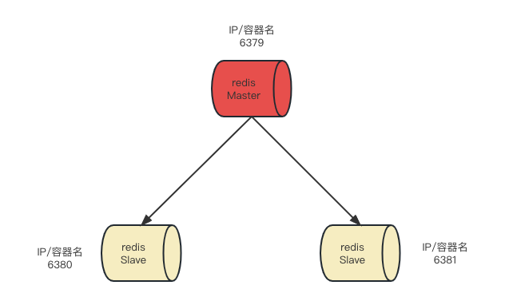
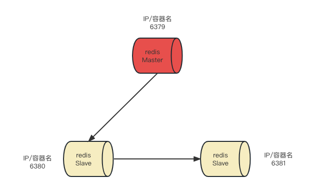
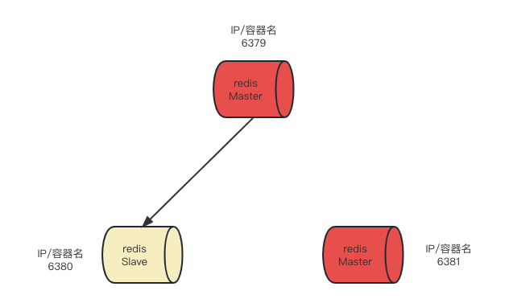

# 是什么

Redis主从复制就是master以写为主，slave以读为主。当master数据变化时自动将新的数据异步同步到其他slave数据库。

# 运用场景

- 读写分离

- 容灾恢复

- 数据备份

- 水平扩容支撑高并发

# 命令场景

- info replication

```shell
# 查看节点的主从关系和配置信息
127.0.0.1:6379> info Replication
# Replication
role:master
connected_slaves:0
master_failover_state:no-failover
master_replid:4932d7962796f4c3e60416dc0d506b3ba2bb89a5
master_replid2:0000000000000000000000000000000000000000
master_repl_offset:0
second_repl_offset:-1
repl_backlog_active:0
repl_backlog_size:1048576
repl_backlog_first_byte_offset:0
repl_backlog_histlen:0
```

# 常见模式

**一主二从**



因为使用虚拟机太大，本例架构采用docker启动3台Redis，且用同一个网络，根据容器名互通。

- 创建一个专属的docker网络

```shell
# 创建一个docker网络
docker network create redis_network1
a3e3ed186174e07f00b71e05cebda3cdfef3a873856611477378a869e5af4747
# 显示网络
docker network ls
NETWORK ID     NAME               DRIVER    SCOPE
a3e3ed186174   redis_network1     bridge    local
```

- 在容器数据卷中配置redis.conf

```shell
# 拷贝7.0原始的conf文件到/xxx/docker/redis-exp-1/redis6379.conf
vim redis6379.conf

# 修改一下配置
# 作为一个守护进程，因为本例采用了docker -d会启动一个后台进程，本例需要设置为no防止冲突
# 特别注意：如果是虚拟机或云主机一定要设置为yes
daemonize no

# 注释掉bind 127.0.0.1，暴露外网
# bind 127.0.0.1 -::1

# 允许其他主机的客户端连接到此redis，关闭默认的保护模式
protected-mode no

# 配置端口，从机修改成自己的端口，比如6380
port 6379

# 工作目录
dir /myredis

# 设置IPD文件名称，从机修改为如redis_6380.pid等
pidfile /var/run/redis_6379.pid

# log日志名称，从机修改为自己的，比如/myredis/6380.log
logfile "/myredis/6379.log"

# 设置密码
requirepass 123

# 设置rdb文件名称，从机做对应修改
dbfilename dump6379.rdb

# 开启AOF
appendonly yes
appendfilename "appendonly.aof"
appenddirname "appendonlydir"

################# 从机需要单独配置 ######################
# 设置主机的IP 和 端口，本例docker采用了自定义网络，6380和6381两个端口配置文件都修改
replicaof redis-exp-1 6379
# 主机的密码
masterauth 123
```

- 启动3台Redis服务器

```shell
docker run -p 6379:6379 -d --name redis-exp-1 \
--network redis_network1 \
--privileged=true \
-v /Users/kx/workspace/docker/redis-exp-1/myredis:/myredis \
-v /Users/kx/workspace/docker/redis-exp-1/redis6379.conf:/etc/redis/redis6379.conf \
-v /Users/kx/workspace/docker/redis-exp-1/data:/data \
redis:7.0.0 \
redis-server /etc/redis/redis6379.conf

docker run -p 6380:6380 -d --name redis-exp-2 \
--network redis_network1 \
--privileged=true \
-v /Users/kx/workspace/docker/redis-exp-2/redis6380.conf:/etc/redis/redis6380.conf \
-v /Users/kx/workspace/docker/redis-exp-2/data:/data \
-v /Users/kx/workspace/docker/redis-exp-2/myredis:/myredis \
redis:7.0.0 \
redis-server /etc/redis/redis6380.conf

docker run -p 6381:6381 -d --name redis-exp-3 \
--network redis_network1 \
--privileged=true \
-v /Users/kx/workspace/docker/redis-exp-3/redis6381.conf:/etc/redis/redis6381.conf \
-v /Users/kx/workspace/docker/redis-exp-3/data:/data \
-v /Users/kx/workspace/docker/redis-exp-3/myredis:/myredis \
redis:7.0.0 \
redis-server /etc/redis/redis6381.conf
```

- 查看容器是否启动

```shell
docker ps
# 结果
CONTAINER ID   IMAGE                           COMMAND                  CREATED       STATUS             PORTS                                                      NAMES
738d86d43121   redis:7.0.0                     "docker-entrypoint.s…"   2 hours ago   Up About an hour   6379/tcp, 0.0.0.0:6381->6381/tcp                           redis-exp-3
4552ceeced0f   redis:7.0.0                     "docker-entrypoint.s…"   2 hours ago   Up About an hour   6379/tcp, 0.0.0.0:6380->6380/tcp                           redis-exp-2
769ddfd0c737   redis:7.0.0                     "docker-entrypoint.s…"   2 hours ago   Up 2 hours         0.0.0.0:6379->6379/tcp                                     redis-exp-1
```

- 进入Master，查看信息并新增key

```shell
docker exec -it 738d86d43121 /bin/bash
root@738d86d43121:/data# redis-cli -a 123 -p 6379
127.0.0.1:6379> info replication
# Replication
role:master # 角色是master
connected_slaves:2 # 有2个子节点
slave0:ip=172.21.0.3,port=6380,state=online,offset=7966,lag=1
slave1:ip=172.21.0.4,port=6381,state=online,offset=7966,lag=1
master_failover_state:no-failover
master_replid:54966ba737756e5c538e8e5a0fd0abe10eb6f24f
master_replid2:0000000000000000000000000000000000000000
master_repl_offset:7966
second_repl_offset:-1
repl_backlog_active:1
repl_backlog_size:1048576
repl_backlog_first_byte_offset:1
repl_backlog_histlen:7966
127.0.0.1:6379> set k1 v1
OK
```

- 进入任意一台Slave

```shell
docker exec -it 4552ceeced0f /bin/bash
root@4552ceeced0f:/data# redis-cli -a 123 -p 6380
Warning: Using a password with '-a' or '-u' option on the command line interface may not be safe.
127.0.0.1:6380> info replication
# Replication
role:slave # 角色是master
master_host:redis-exp-1 # master host
master_port:6379 # master port
master_link_status:up # 状态
master_last_io_seconds_ago:5
master_sync_in_progress:0
slave_read_repl_offset:8162
slave_repl_offset:8162
slave_priority:100
slave_read_only:1
replica_announced:1
connected_slaves:0
master_failover_state:no-failover
master_replid:54966ba737756e5c538e8e5a0fd0abe10eb6f24f
master_replid2:0000000000000000000000000000000000000000
master_repl_offset:8162
second_repl_offset:-1
repl_backlog_active:1
repl_backlog_size:1048576
repl_backlog_first_byte_offset:15
repl_backlog_histlen:8148
127.0.0.1:6380> get k1
"v1"
```

- 也可以通过命令指定归属哪个master主机

```shell
# 手动设置后重启了服务不会生效，一般采用config配置
127.0.0.1:6381> slaveof redis-exp-1 6379
```

**链式传递**



从机可以作为另外一台从机的master，但作为master的从机依然不能写。

本例接上面的例子，将6381从机的master从6379变成6380。

- 修改6381的主机为6380

```shell
127.0.0.1:6381> slaveof redis-exp-2 6380
OK
# 查看从机信息
127.0.0.1:6381> info replication
# Replication
role:slave
master_host:redis-exp-2 # 主机变为6380
master_port:6380
master_link_status:up
master_last_io_seconds_ago:5
master_sync_in_progress:0
slave_read_repl_offset:854
slave_repl_offset:854
slave_priority:100
slave_read_only:1
replica_announced:1
connected_slaves:0
master_failover_state:no-failover
master_replid:d4c016d2704ea24297eb9c845d337ec768cc2662
master_replid2:0000000000000000000000000000000000000000
master_repl_offset:854
second_repl_offset:-1
repl_backlog_active:1
repl_backlog_size:1048576
repl_backlog_first_byte_offset:15
repl_backlog_histlen:840
```

- 查看从机6381状态

```shell
127.0.0.1:6380> info replication
# Replication
role:slave # 角色依然是slave
master_host:redis-exp-1
master_port:6379
master_link_status:up
master_last_io_seconds_ago:2
master_sync_in_progress:0
slave_read_repl_offset:1022
slave_repl_offset:1022
slave_priority:100
slave_read_only:1
replica_announced:1
connected_slaves:1 # 但多了一个slave
slave0:ip=172.21.0.4,port=6381,state=online,offset=1022,lag=0
master_failover_state:no-failover
master_replid:d4c016d2704ea24297eb9c845d337ec768cc2662
master_replid2:0000000000000000000000000000000000000000
master_repl_offset:1022
second_repl_offset:-1
repl_backlog_active:1
repl_backlog_size:1048576
repl_backlog_first_byte_offset:15
repl_backlog_histlen:1008
```

- 查看从机6379状态

```shell
127.0.0.1:6379> info replication
# Replication
role:master
connected_slaves:1 # 从机数从2个变成了1个
slave0:ip=172.21.0.3,port=6380,state=online,offset=1148,lag=1
master_failover_state:no-failover
master_replid:d4c016d2704ea24297eb9c845d337ec768cc2662
master_replid2:0000000000000000000000000000000000000000
master_repl_offset:1148
second_repl_offset:-1
repl_backlog_active:1
repl_backlog_size:1048576
repl_backlog_first_byte_offset:1
repl_backlog_histlen:1148
```

- 在6379写入数据，然后在6380和6381查看数据

```shell
127.0.0.1:6379> set k100 v100
OK

127.0.0.1:6380> get k100
"v100"

127.0.0.1:6381> get k100
"v100"
```

- 6380不能写入数据

```shell
127.0.0.1:6380> set k200 200
(error) READONLY You can't write against a read only replica.
```

**自立门户**



不当从机，自己当主机

```shell
127.0.0.1:6381> slaveof no one
OK
127.0.0.1:6381> info replication
# Replication
role:master # 自己变成了主机，可写
connected_slaves:0
master_failover_state:no-failover
master_replid:520c3eff38befab4bf86f0ef470079d9706d3305
master_replid2:d4c016d2704ea24297eb9c845d337ec768cc2662
master_repl_offset:1596
second_repl_offset:1597
repl_backlog_active:1
repl_backlog_size:1048576
repl_backlog_first_byte_offset:15
repl_backlog_histlen:1582
```

# 注意事项

- 从机不可以执行写命令

```shell
127.0.0.1:6381> set k4 v4
(error) READONLY You can't write against a read only replica.
```

- 从机无论什么时候启动，都先从主机同步全量数据，后续则增量同步到从机。

- 主机shutdown后，从机不会上位，主机重新启动后，关系恢复。

```shell
# 1. 先shutdown主机
127.0.0.1:6379> shutdown
# 2. 查看6381的信息
127.0.0.1:6381> info replication
# Replication
role:slave # 然后还是从机
master_host:redis-exp-1
master_port:6379
master_link_status:down # 主机状态是down
master_last_io_seconds_ago:-1
master_sync_in_progress:0
slave_read_repl_offset:812
slave_repl_offset:812
master_link_down_since_seconds:39
slave_priority:100
slave_read_only:1
replica_announced:1
connected_slaves:0
master_failover_state:no-failover
master_replid:e6586b795c7cd15409919eb42a18128181a10d6f
master_replid2:0000000000000000000000000000000000000000
master_repl_offset:812
second_repl_offset:-1
repl_backlog_active:1
repl_backlog_size:1048576
repl_backlog_first_byte_offset:1
repl_backlog_histlen:812
# 3. 查看6380的信息
127.0.0.1:6380> info replication
# Replication
role:slave
master_host:redis-exp-1
master_port:6379
master_link_status:down
master_last_io_seconds_ago:-1
master_sync_in_progress:0
slave_read_repl_offset:812
slave_repl_offset:812
master_link_down_since_seconds:162
slave_priority:100
slave_read_only:1
replica_announced:1
connected_slaves:0
master_failover_state:no-failover
master_replid:e6586b795c7cd15409919eb42a18128181a10d6f
master_replid2:0000000000000000000000000000000000000000
master_repl_offset:812
second_repl_offset:-1
repl_backlog_active:1
repl_backlog_size:1048576
repl_backlog_first_byte_offset:1
repl_backlog_histlen:812
127.0.0.1:6380> keys *
1) "k1
# 4. 启动主机
docker start 769ddfd0c737
769ddfd0c737
# 5, 再次查看从机状态
127.0.0.1:6381> info replication
# Replication
role:slave
master_host:redis-exp-1
master_port:6379
master_link_status:up # 主机状态为up
master_last_io_seconds_ago:4
master_sync_in_progress:0
slave_read_repl_offset:14
slave_repl_offset:14
slave_priority:100
slave_read_only:1
replica_announced:1
connected_slaves:0
master_failover_state:no-failover
master_replid:d4c016d2704ea24297eb9c845d337ec768cc2662
master_replid2:0000000000000000000000000000000000000000
master_repl_offset:14
second_repl_offset:-1
repl_backlog_active:1
repl_backlog_size:1048576
repl_backlog_first_byte_offset:15
repl_backlog_histlen:0
```

# 主从复制的工作流程

- slave启动、发送同步请求
  
  - slave启动连接到master后会发送一个sync命令

- 首次连接、全量数据
  
  - slave首次连接master会全量同步master数据并覆盖原有数据
  
  - master收到sync命令后会在后台保存快照（主动触发RDB），同时手机所有接收到用于修改的命令缓存起来，等待RDB持久化完成后，master将RDB和缓存的命令发送给slave。
  
  - slave接收到数据后，落盘并加载到内存完成同步。

- 心跳持续、保持通信
  
  - 配置默认10s检测一下心跳
  
  ```shell
  repl-ping-replica-period 10
  ```

- 增量同步
  
  - master的写命令自动同步给slave保持增量同步

- 从机下线，重连续传
  
  - master会检查backlog中的offset（偏移），master和slave都会保存一个复制的offset和一个masterID，master只会把offset之后的数据同步给slave。

# 不足

- 复制延时
  
  - 随着节点数增加，从Master同步到Slave机器有一定的延迟，当系统很繁忙的时候，延迟问题会更加严重，Slave机器数量的增加也会使这个问题更加严重。

- master宕机无法上位
