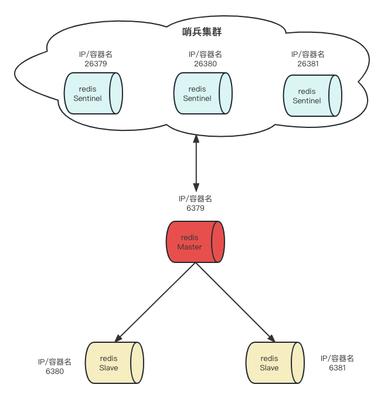

# 什么问题

- 主从复制架构，master主机宕机后无法提供服务，需要将其中一台从机切换为新主库

- 所以增加哨兵对主机和从机进行监控，如果master故障了根据投票数自动将一个从库转换成新主库，继续对外提供服务。

# 哨兵能做什么

- 主从监控
  
  - 哨兵监控redis的主机和从机们是否运行正常

- 消息通知
  
  - 监控发现故障后会通知客户端

- 故障转移
  
  - 如果master异常，则会进行主从切换，将其中一台slave切换成新的主机

- 配置中心
  
  - 客户端通过连接哨兵来获得新的redis服务的主机地址

# 场景模式

本例采用3台哨兵以及1主2从为例。

**架构图**



- 主从复制
  
  - 哨兵最好不能低于2台，哨兵机器有可能挂掉
  
  - 一般采用3个以及3个以上的哨兵数量，便于投票

- 哨兵集群

**主从复制**

- 调整6379.conf配置
  
  - 大体和上一节的配置一样，只需要设置一下6379的masterauth，使得6379宕机之后重新启动成为从机能够连接到新主机。

```shell
vim redis6379.conf
# masterauth <master-password>
masterauth 123
```

- 启动3台redis

```shell
docker run -p 6379:6379 -d --name redis-exp-1 \
--network redis_network1 \
--privileged=true \
-v /Users/kx/workspace/docker/redis-exp-1/myredis:/myredis \
-v /Users/kx/workspace/docker/redis-exp-1/redis6379.conf:/etc/redis/redis6379.conf \
-v /Users/kx/workspace/docker/redis-exp-1/data:/data \
redis:7.0.0 \
sh -c "redis-server /etc/redis/redis6379.conf"

docker run -p 6380:6380 -d --name redis-exp-2 \
--network redis_network1 \
--privileged=true \
-v /Users/kx/workspace/docker/redis-exp-2/redis6380.conf:/etc/redis/redis6380.conf \
-v /Users/kx/workspace/docker/redis-exp-2/data:/data \
-v /Users/kx/workspace/docker/redis-exp-2/myredis:/myredis \
redis:7.0.0 \
sh -c "redis-server /etc/redis/redis6380.conf"

docker run -p 6381:6381 -d --name redis-exp-3 \
--network redis_network1 \
--privileged=true \
-v /Users/kx/workspace/docker/redis-exp-3/redis6381.conf:/etc/redis/redis6381.conf \
-v /Users/kx/workspace/docker/redis-exp-3/data:/data \
-v /Users/kx/workspace/docker/redis-exp-3/myredis:/myredis \
redis:7.0.0 \
sh -c "redis-server /etc/redis/redis6381.conf"
```

- 验证主从复制是否成功

```shell
# 1. 在主机上写入数据
docker exec -it 5ce9d238824f /bin/bash
root@5ce9d238824f:/data# redis-cli -a 123 -p 6379
Warning: Using a password with '-a' or '-u' option on the command line interface may not be safe.
127.0.0.1:6379> set k200 v200
OK
127.0.0.1:6379> quit
# 2. 在从机上查看数据是否同步
docker exec -it 1d86c816ea4f /bin/bash
root@1d86c816ea4f:/data# redis-cli -a 123 -p 6380
Warning: Using a password with '-a' or '-u' option on the command line interface may not be safe.
127.0.0.1:6380> get k200
"v200"

docker exec -it 765c4b485460 /bin/bash
root@765c4b485460:/data# redis-cli -a 123 -p 6381
Warning: Using a password with '-a' or '-u' option on the command line interface may not be safe.
127.0.0.1:6381> get k200
"v200"
```

**哨兵集群**

- 配置文件

```shell
# 将对应版本的sentinel.conf拷贝出来，分别放在对应的数据卷内，此处只展示26379.conf
vim xxx/docker/redis-sen-3/sentinel26379.conf

# 内容如下配置
# 服务监听地址，用户客户端连接，默认本机地址
bind 0.0.0.0
# 关闭保护模式
protected-mode no
# 端口
port 26379
# 是否以后台方式运行，docker启动设置为0，如果是虚拟机或云主机一定要设置为yes
daemonize no
# pid文件路径
pidfile /var/run/redis-sentinel26379.pid
# 日志文件路径
logfile "/myredis/sentinel26379.log"
# 工作目录
dir /myredis
# 设置要监听的主机
# sentinel monitor <master-name> <ip> <redis-port> <quorum>
# master-name 给主机取的名字
# ip 主机的I
# quorum 是最少多少个哨兵认为客观下线，即同意故障迁移的法定票数
# sentinel monitor mymaster redis-exp-1 6379 2
# 这里有一个问题就是3台哨兵和master共用了同一个网络，居然不能使用容器名只能用IP
sentinel monitor mymaster 172.21.0.2 6379 2
# 要监控master的密码
sentinel auth-pass mymaster 123
# 指定多少毫秒之后，主节点没有应答哨兵，此时哨兵主观上认为主节点下线，使用默认30
sentinel down-after-milliseconds mymaster 30000
# 表示允许并行同步的slave个数，当Master挂了后，哨兵会选出新的Master，此时，剩余的slave会向新的master发起同步数据，使用默认
sentinel parallel-syncs mymaster 1
# 故障转移的超时时间，进行故障转移时，如果超过设置的毫秒，表示故障转移失败，使用默认180s
sentinel failover-timeout mymaster 180000
# 配置当某一事件发生时所需要执行的脚本
# sentinel notification-script mymaster /var/redis/notify.sh
# 客户端重新配置主节点参数脚本ag-0-1h15k5tooag-1-1h15k5too
# sentinel client-reconfig-script mymaster /var/redis/reconfig.sh
```

- 启动3台哨兵

```shell
docker run -p 26379:26379 -d --name redis-sen-1 \
--network redis_network1 \
--privileged=true \
-v /Users/kx/workspace/docker/redis-sen-1/sentinel26379.conf:/etc/redis/sentinel26379.conf \
-v /Users/kx/workspace/docker/redis-sen-1/myredis:/myredis \
redis:7.0.0 \
sh -c "redis-sentinel /etc/redis/sentinel26379.conf"

docker run -p 26380:26380 -d --name redis-sen-2 \
--network redis_network1 \
--privileged=true \
-v /Users/kx/workspace/docker/redis-sen-2/sentinel26380.conf:/etc/redis/sentinel26380.conf \
-v /Users/kx/workspace/docker/redis-sen-2/myredis:/myredis \
redis:7.0.0 \
sh -c "redis-sentinel /etc/redis/sentinel26380.conf"

docker run -p 26381:26381 -d --name redis-sen-3 \
--network redis_network1 \
--privileged=true \
-v /Users/kx/workspace/docker/redis-sen-3/sentinel26381.conf:/etc/redis/sentinel26381.conf \
-v /Users/kx/workspace/docker/redis-sen-3/myredis:/myredis \
redis:7.0.0 \
sh -c "redis-sentinel /etc/redis/sentinel26381.conf"
```

- 查看状态

```shell
➜  redis-sen-1 git:(master) ✗ docker ps
CONTAINER ID   IMAGE         COMMAND                  CREATED              STATUS              PORTS                                NAMES
f91c1540459c   redis:7.0.0   "docker-entrypoint.s…"   About a minute ago   Up 4 seconds        6379/tcp, 0.0.0.0:26379->26379/tcp   redis-sen-1
daa47b2c8d23   redis:7.0.0   "docker-entrypoint.s…"   About a minute ago   Up About a minute   6379/tcp, 0.0.0.0:26381->26381/tcp   redis-sen-3
fee89ed2288a   redis:7.0.0   "docker-entrypoint.s…"   About a minute ago   Up About a minute   6379/tcp, 0.0.0.0:26380->26380/tcp   redis-sen-2
765c4b485460   redis:7.0.0   "docker-entrypoint.s…"   6 hours ago          Up 2 hours          6379/tcp, 0.0.0.0:6381->6381/tcp     redis-exp-3
1d86c816ea4f   redis:7.0.0   "docker-entrypoint.s…"   6 hours ago          Up 2 hours          6379/tcp, 0.0.0.0:6380->6380/tcp     redis-exp-2
5ce9d238824f   redis:7.0.0   "docker-entrypoint.s…"   6 hours ago          Up 2 hours          0.0.0.0:6379->6379/tcp               redis-exp-1
```

**Master宕机**

- 通过shutdown模拟宕机

```shell
127.0.0.1:6379> shutdown
```

- 查看从机的数据

```shell
127.0.0.1:6380> keys *
# 这个错误是因为从机还保持着第一次连接6379
Error: Server closed the connection
# 或者会出现 Error: Broken pipe
# 第二次恢复
not connected> keys *
1) "k200"
2) "k100"
3) "k300"
4) "k1"
# 查看信息
127.0.0.1:6380> info replication
# Replication
role:slave # 6380还是从机
master_host:172.21.0.4
master_port:6381 # 此时他的主机已经变成了6381
master_link_status:up
master_last_io_seconds_ago:0
master_sync_in_progress:0
slave_read_repl_offset:132518
slave_repl_offset:132518
slave_priority:100
slave_read_only:1
replica_announced:1
connected_slaves:0
master_failover_state:no-failover
master_replid:93d1b51ae9de7170ac08fa134361186e585f1a8a
master_replid2:75acee3ab3f87930d5cb129cf6ce0d9b10107e75
master_repl_offset:132518
second_repl_offset:110067
repl_backlog_active:1
repl_backlog_size:1048576
repl_backlog_first_byte_offset:1
repl_backlog_histlen:132518

# 查看6381的信息
127.0.0.1:6381> info replication
# Replication
role:master # 6381已经成为了Master
connected_slaves:1
slave0:ip=172.21.0.3,port=6380,state=online,offset=163522,lag=1
master_failover_state:no-failover
master_replid:93d1b51ae9de7170ac08fa134361186e585f1a8a
master_replid2:75acee3ab3f87930d5cb129cf6ce0d9b10107e75
master_repl_offset:163522
second_repl_offset:110067
repl_backlog_active:1
repl_backlog_size:1048576
repl_backlog_first_byte_offset:1
repl_backlog_histlen:163522
```

- 查看哨兵日志

```shell
cat /myredis/sentinel26379.log
```

```log
# 6379 主观下线
22 9:X 24 May 2023 12:41:01.629 # +sdown master mymaster 172.21.0.2 6379
# 这个错误不知道如何解决
23 9:X 24 May 2023 12:41:01.685 # Could not rename tmp config file (Device or resource busy)
24 9:X 24 May 2023 12:41:01.688 # WARNING: Sentinel was not able to save the new configuration on disk!!!: Devce or resource busy
# 开启一个新的epoch
25 9:X 24 May 2023 12:41:01.690 # +new-epoch 1
26 9:X 24 May 2023 12:41:01.696 # Could not rename tmp config file (Device or resource busy)
27 9:X 24 May 2023 12:41:01.699 # WARNING: Sentinel was not able to save the new configuration on disk!!!: Device or resource busy
# 选举一个哨兵兵王-主要用于去拉从机，75f77dd4a5fc3116e8fbd4f5c7f091433c85e546这个ID是26380哨兵
28 9:X 24 May 2023 12:41:01.704 # +vote-for-leader 75f77dd4a5fc3116e8fbd4f5c7f091433c85e546 1
# 6379 客观下线，投票结果是2票认为已经下线了
29 9:X 24 May 2023 12:41:01.707 # +odown master mymaster 172.21.0.2 6379 #quorum 3/2
30 9:X 24 May 2023 12:41:01.710 # Next failover delay: I will not start a failover before Wed May 24 12:47:02 2023
# 让26380去处理，在6381中可以看到选举情况
31 9:X 24 May 2023 12:41:02.277 # +config-update-from sentinel 75f77dd4a5fc3116e8fbd4f5c7f091433c85e546 172.21.0.6 26380 @ mymaster 172.21.0.2 6379
# 选择了6381作为新的主机
32 9:X 24 May 2023 12:41:02.281 # +switch-master mymaster 172.21.0.2 6379 172.21.0.4 6381
# 让6380跟随6381
33 9:X 24 May 2023 12:41:02.284 * +slave slave 172.21.0.3:6380 172.21.0.3 6380 @ mymaster 172.21.0.4 6381
# 让6379跟随6381，即使6379启动了之后依然还是作为slave
34 9:X 24 May 2023 12:41:02.287 * +slave slave 172.21.0.2:6379 172.21.0.2 6379 @ mymaster 172.21.0.4 6381
```

- 验证新的主从是否正常同步

```shell
# 在6381写入数据
127.0.0.1:6381> set k400 v400
OK
# 在6380查询数据
127.0.0.1:6380> get k400
"v400"
```

**6379重启**

```shell
docker start redis-exp-1
docker exec -it redis-exp-1 /bin/bash
root@b23a65c02ddf:/data# redis-cli -a 123
Warning: Using a password with '-a' or '-u' option on the command line interface may not be safe.
127.0.0.1:6379> get k400
"v400"
# 重新启动后他是从机的身份了
127.0.0.1:6379> set k500 v500
(error) READONLY You can't write against a read only replica.
```

# 哨兵运行流程

**哨兵运行流程**

1. 哨兵发现一台master主观下线后，然后选出一个哨兵兵王来主持。

2. 每个哨兵进行投票是否下线，超过了设定的值就说明Master客观下线。

3. 然后由兵王根据一定的规则拉取一个slave成为新的master。

4. 将其他机器都指向新的master。

**主观下线**

sDown（Subjectively Down），即主观下线。

- 单台哨兵自己主观上检测到关于master状态异常时（哨兵自己向master发送心跳未收到合法的回复），就达到了主观下线的条件。

- 主观下线根据sentinel.conf配置的`sentinel down-after-milliseconds`的值来判定。

- 有时候并不是master宕机了，有可能是网络阻塞等问题导致的，所以要多台哨兵投票达到客观下线。

**客观下线**

oDown（Objectively Down），即客观下线。

- 多台哨兵投票达到了配置设置的`quorum`的值时，来判定master是否真的宕机，这保证了公平性和高可用。

**选举Sentinel Leader**

当master被哨兵判断主观下线后，会找哨兵们来协商并选举出一个哨兵兵王（Raft算法），由这个兵王组织投票，拉新的主机。

Raft算法原则是先到先得，3台哨兵分别向其他2台哨兵发送申请，谁先得到同意就谁成为兵王。

**拉新master流程**

- 新主登基（从slave中选一个新的master）
  
  - 先根据redis.conf中的`slave-priority`或`replica-priority`级别高的选（值越小级别越高）
  
  - 如果第一个条件一样则根据复制偏移量（offset）最大的选。
  
  - 如果第二个条件一样则根据节点的RunID最小的选一个。

- 群臣俯首（其他slave重新跟随新的master）
  
  - 新的master先执行`slaveof no one`独立成为新的master节点。
  
  - sentinel leader发送命令，让其他节点slaveof跟随新的master。

- 旧主拜服（以前的master启动后还是slave）
  
  - 老的master重启后依然还是slave。

# 注意点

- 哨兵节点个数应该是多余3个的奇数的集群。

- 各个哨兵节点的配置应该是一致的。

- 哨兵集群+主从复制并不能保证数据不丢失，因为哨兵检测到客观下线后到拉起一个新的master需要时间，这一段时间其实也提供不了服务，导致数据丢失。
