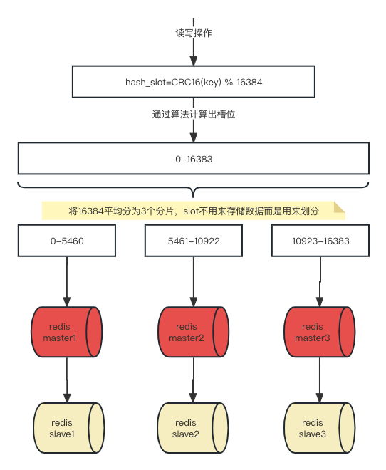
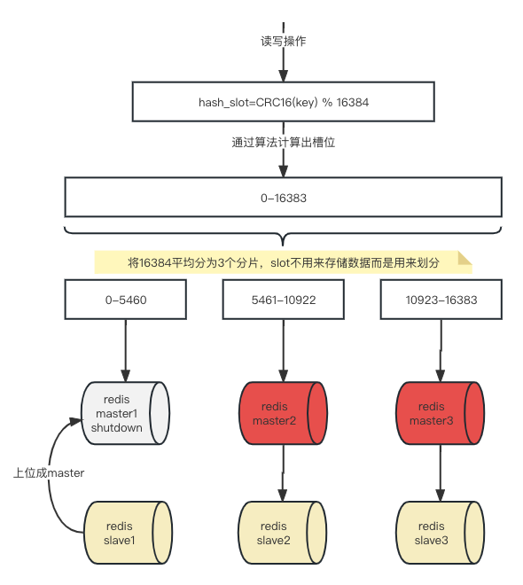

# 遇到什么问题

- 对于大型网站数据量巨大，单台的主从复制难以承担巨量的数据，需要进行水平拓展，且拓展出来的机器要能数据共享。

- 哨兵+主从复制的方式在master宕机后有一段时间无法提供服务，需要降低这样的风险，集群采用了多台master，一台宕机，其他的master依然能够工作，不会导致整体服务不可用，降低了风险。（但集群依然无法不能保证数据不丢失，因为如果数据落到了宕机的master还是会丢失数据）

# 集群能做什么

- 集群支持多个master，每个master支持多个slave。
  
  - 读写分离
  
  - 数据海量读写和存储

- 集群（Cluster）自带故障转移机制
  
  - 支持高可用

- 支持连接单台（-c）可操作集群内所有的节点
  
  - 很方便

- 槽位（slot）负责分配各个服务节点

# 集群算法

**哈希槽**

redis集群引入了哈希槽算法，集群的key空间被分为16384（2^14）个槽，对应的槽号为0-16383。理论上可以设置16384个主节点，但因为网络衰减，建议最多使用1000个主节点。

- 每个key通过CRC16校验后对18384取模决定放到那个节点，集群的每个主节点负责一部分哈希槽。

**分片**

也就是集群中的master主机，一台master就叫做分片。

- 为了找到给定key的分片，对key进行CRC16(key)算法处理并通过对总分片数量取模。然后，使用确定性哈希函数，这意味着给定的key将多次始终映射到同一个分片，我们可以推断将来读取特定key的位置。

**为什么使用分片-哈希槽**

这种结构有利于增加或删除节点，换句话说就是有利于动态的扩容和缩容。

- 想增加一个节点，将其他的节点的槽位均分给新节点

- 想删除一个节点，将该节点的槽位分配给其中一个节点即可（也可以按规则分配）

[更多算法，参考](https://github.com/kangxuan/Notes/blob/main/docker/5-%E5%AE%89%E8%A3%85Redis%E9%9B%86%E7%BE%A4.md)

**为什么最大槽位数是16384个**

- redis集群需要进行心跳检测，16384大概为2kb大小，发送的心跳包不大，有利于节约带宽。

- 节点数超过1000个会导致网络拥堵，所以建议不超过1000个节点，那么1000个节点16384个槽位够用，没必要太多。

- 槽位越小，节点少的情况下，压缩比高，容易传输。

# 三主三从集群

**架构图**



本例以redis7.0以及docker演示

**步骤**

1. docker启动6台redis服务
2. 构建集群关系
3. 检查集群状态
4. 验证主从读写
5. 容错切换实例

**docker启动6台redis服务**

- 新增配置

```shell
# 创建6个容器卷目录
mkdir redis-node-6381
mkdir redis-node-6382
mkdir redis-node-6383
mkdir redis-node-6384
mkdir redis-node-6385
mkdir redis-node-6386

# 写入配置
vim redis-node-6381/redisCluster6381.conf
--------------------------------------------
bind 0.0.0.0
daemonize no
protected-mode no
port 6381
logfile "/myredis/cluster6381.log"
pidfile /myredis/cluster6381.pid
# 在每个redis-node-6381下创建这个目录，不然会启动失败
dir /myredis
dbfilename dump6381.rdb
appendonly yes
appendfilename "appendonly6381.aof"
requirepass 123
masterauth 123

cluster-enabled yes
cluster-config-file nodes-6381.conf
cluster-node-timeout 5000
---------------------------------------------
# 创建myredis目录
mkdir redis-node-6381/myredis
mkdir redis-node-6382/myredis
mkdir redis-node-6383/myredis
mkdir redis-node-6384/myredis
mkdir redis-node-6385/myredis
mkdir redis-node-6386/myredis
```

- 启动实例

```shellag-0-1h16g7d8cag-1-1h16g7d8c
docker run -p 6381:6381 -d --name redis-node-6381 \
--network redis_network1 \
--privileged=true \
-v /Users/kx/workspace/docker/redis-node-6381/myredis:/myredis \
-v /Users/kx/workspace/docker/redis-node-6381/redisCluster6381.conf:/etc/redis/redisCluster6381.conf \
redis:7.0.0 \
sh -c "redis-server /etc/redis/redisCluster6381.conf"

docker run -p 6382:6382 -d --name redis-node-6382 \
--network redis_network1 \
--privileged=true \
-v /Users/kx/workspace/docker/redis-node-6382/myredis:/myredis \
-v /Users/kx/workspace/docker/redis-node-6382/redisCluster6382.conf:/etc/redis/redisCluster6382.conf \
redis:7.0.0 \
sh -c "redis-server /etc/redis/redisCluster6382.conf"

docker run -p 6383:6383 -d --name redis-node-6383 \
--network redis_network1 \
--privileged=true \
-v /Users/kx/workspace/docker/redis-node-6383/myredis:/myredis \
-v /Users/kx/workspace/docker/redis-node-6383/redisCluster6383.conf:/etc/redis/redisCluster6383.conf \
redis:7.0.0 \
sh -c "redis-server /etc/redis/redisCluster6383.conf"

docker run -p 6384:6384 -d --name redis-node-6384 \
--network redis_network1 \
--privileged=true \
-v /Users/kx/workspace/docker/redis-node-6384/myredis:/myredis \
-v /Users/kx/workspace/docker/redis-node-6384/redisCluster6384.conf:/etc/redis/redisCluster6384.conf \
redis:7.0.0 \
sh -c "redis-server /etc/redis/redisCluster6384.conf"

docker run -p 6385:6385 -d --name redis-node-6385 \
--network redis_network1 \
--privileged=true \
-v /Users/kx/workspace/docker/redis-node-6385/myredis:/myredis \
-v /Users/kx/workspace/docker/redis-node-6385/redisCluster6385.conf:/etc/redis/redisCluster6385.conf \
redis:7.0.0 \
sh -c "redis-server /etc/redis/redisCluster6385.conf"

docker run -p 6386:6386 -d --name redis-node-6386 \
--network redis_network1 \
--privileged=true \
-v /Users/kx/workspace/docker/redis-node-6386/myredis:/myredis \
-v /Users/kx/workspace/docker/redis-node-6386/redisCluster6386.conf:/etc/redis/redisCluster6386.conf \
redis:7.0.0 \
sh -c "redis-server /etc/redis/redisCluster6386.conf"
```

**构建集群关系**

```shell
# --cluster create 创建集群
# --cluster-replicas 1 为每个master分配一个slave，redis会自动处理
# 这里的IP可以使用容器名，因为是同一个网络
redis-cli -a 123 \
--cluster create \
--cluster-replicas 1 \
redis-node-6381:6381 redis-node-6382:6382 redis-node-6383:6383 redis-node-6384:6384 redis-node-6385:6385 redis-node-6386:6386

Warning: Using a password with '-a' or '-u' option on the command line interface may not be safe.
>>> Performing hash slots allocation on 6 nodes...
# 第一个master的槽位为0 - 5460
Master[0] -> Slots 0 - 5460
# 第二个master的槽位为5461 - 10922
Master[1] -> Slots 5461 - 10922
# 第三个master的槽位为10923 - 16383
Master[2] -> Slots 10923 - 16383
# 让6385跟随6381
Adding replica redis-node-6385:6385 to redis-node-6381:6381
# 让6386跟随6382
Adding replica redis-node-6386:6386 to redis-node-6382:6382
# 让6384跟随6383
Adding replica redis-node-6384:6384 to redis-node-6383:6383
# 1c82b3473b095c6027ce58b1d2a169cf2650b37a 是ID
M: 1c82b3473b095c6027ce58b1d2a169cf2650b37a redis-node-6381:6381
   slots:[0-5460] (5461 slots) master
M: 93fa24426fb41c06e27dfd51ed6e0d8ef0df53b2 redis-node-6382:6382
   slots:[5461-10922] (5462 slots) master
M: 84d05beeb21ed8da44d749e4117cd48c8fa4be1a redis-node-6383:6383
   slots:[10923-16383] (5461 slots) master
S: 22a3b42fb1c93908375f057f2b89ead5c3fe1f65 redis-node-6384:6384
   replicates 84d05beeb21ed8da44d749e4117cd48c8fa4be1a
S: e450391d75b6564e9d3fc08142d19e541906cec9 redis-node-6385:6385
   replicates 1c82b3473b095c6027ce58b1d2a169cf2650b37a
S: 489a56f861b4e54d74b96e1fd6a2b5f23982cf2b redis-node-6386:6386
   replicates 93fa24426fb41c06e27dfd51ed6e0d8ef0df53b2
Can I set the above configuration? (type 'yes' to accept): yes
>>> Nodes configuration updated
>>> Assign a different config epoch to each node
>>> Sending CLUSTER MEET messages to join the cluster
Waiting for the cluster to join
.
>>> Performing Cluster Check (using node redis-node-6381:6381)
M: 1c82b3473b095c6027ce58b1d2a169cf2650b37a redis-node-6381:6381
   slots:[0-5460] (5461 slots) master
   1 additional replica(s)
M: 84d05beeb21ed8da44d749e4117cd48c8fa4be1a 172.21.0.4:6383
   slots:[10923-16383] (5461 slots) master
   1 additional replica(s)
S: 489a56f861b4e54d74b96e1fd6a2b5f23982cf2b 172.21.0.7:6386
   slots: (0 slots) slave
   replicates 93fa24426fb41c06e27dfd51ed6e0d8ef0df53b2
S: e450391d75b6564e9d3fc08142d19e541906cec9 172.21.0.6:6385
   slots: (0 slots) slave
   replicates 1c82b3473b095c6027ce58b1d2a169cf2650b37a
S: 22a3b42fb1c93908375f057f2b89ead5c3fe1f65 172.21.0.5:6384
   slots: (0 slots) slave
   replicates 84d05beeb21ed8da44d749e4117cd48c8fa4be1a
M: 93fa24426fb41c06e27dfd51ed6e0d8ef0df53b2 172.21.0.3:6382
   slots:[5461-10922] (5462 slots) master
   1 additional replica(s)
[OK] All nodes agree about slots configuration.
>>> Check for open slots...
>>> Check slots coverage...
# 全部槽位已被分配
[OK] All 16384 slots covered.
```

**查看集群状态**

```shell
# 随便进入一个redis
redis-cli -a 123 -p 6381
Warning: Using a password with '-a' or '-u' option on the command line interface may not be safe.

# 查看主从信息
127.0.0.1:6381> info replication
# Replication
role:master #角色是master
connected_slaves:1
slave0:ip=172.21.0.6,port=6385,state=online,offset=420,lag=1
master_failover_state:no-failover
master_replid:055c4dba82e5ed82e8fb8e9f517f92ee79602365
master_replid2:0000000000000000000000000000000000000000
master_repl_offset:420
second_repl_offset:-1
repl_backlog_active:1
repl_backlog_size:1048576
repl_backlog_first_byte_offset:1
repl_backlog_histlen:420

# 查看集群信息
127.0.0.1:6381> CLUSTER INFO
cluster_state:ok
cluster_slots_assigned:16384
cluster_slots_ok:16384
cluster_slots_pfail:0
cluster_slots_fail:0
cluster_known_nodes:6
cluster_size:3
cluster_current_epoch:6
cluster_my_epoch:1
cluster_stats_messages_ping_sent:775
cluster_stats_messages_pong_sent:767
cluster_stats_messages_sent:1542
cluster_stats_messages_ping_received:762
cluster_stats_messages_pong_received:775
cluster_stats_messages_meet_received:5
cluster_stats_messages_received:1542
total_cluster_links_buffer_limit_exceeded:0

# 查看节点信息
127.0.0.1:6381> CLUSTER NODES
# 6384跟随6383,6386跟随6382,6385跟随6381
84d05beeb21ed8da44d749e4117cd48c8fa4be1a 172.21.0.4:6383@16383 master - 0 1685011794000 3 connected 10923-16383
489a56f861b4e54d74b96e1fd6a2b5f23982cf2b 172.21.0.7:6386@16386 slave 93fa24426fb41c06e27dfd51ed6e0d8ef0df53b2 0 1685011794781 2 connected
e450391d75b6564e9d3fc08142d19e541906cec9 172.21.0.6:6385@16385 slave 1c82b3473b095c6027ce58b1d2a169cf2650b37a 0 1685011794580 1 connected
22a3b42fb1c93908375f057f2b89ead5c3fe1f65 172.21.0.5:6384@16384 slave 84d05beeb21ed8da44d749e4117cd48c8fa4be1a 0 1685011794000 3 connected
1c82b3473b095c6027ce58b1d2a169cf2650b37a 172.21.0.2:6381@16381 myself,master - 0 1685011793000 1 connected 0-5460
93fa24426fb41c06e27dfd51ed6e0d8ef0df53b2 172.21.0.3:6382@16382 master - 0 1685011793000 2 connected 5461-10922
```

**验证主从读写**

```shell
# 普通连接有问题
redis-cli -a 123 -p 6381
Warning: Using a password with '-a' or '-u' option on the command line interface may not be safe.
127.0.0.1:6381> keys *
(empty array)
127.0.0.1:6381> set k1 v1
# 报错是因为根据算法k1落到了12706槽位上，需要移动到6383写入
(error) MOVED 12706 172.21.0.4:6383

# 集群方式连接
redis-cli -a 123 -p 6381 -c
Warning: Using a password with '-a' or '-u' option on the command line interface may not be safe.
127.0.0.1:6381> set k1 v1
# 重定向到6383写入成功
-> Redirected to slot [12706] located at 172.21.0.4:6383
OK
172.21.0.4:6383>

# 查看key属于哪个槽位
172.21.0.4:6383> cluster keyslot k1
(integer) 12706
# 查看槽位是否被占用
172.21.0.4:6383> cluster countkeysinslot 12706
(integer) 1
```

# 故障转移

停掉其中一台master，看他的从机是否上位



- 关闭6381主机

```shell
127.0.0.1:6381> shutdown
```

- 进入正常的redis查看集群节点信息

```shell
root@4da8861e3ca7:/data# redis-cli -a 123 -p 6382 -c
Warning: Using a password with '-a' or '-u' option on the command line interface may not be safe.
127.0.0.1:6382> cluster nodes
22a3b42fb1c93908375f057f2b89ead5c3fe1f65 172.21.0.5:6384@16384 slave 84d05beeb21ed8da44d749e4117cd48c8fa4be1a 0 1685013612331 3 connected
93fa24426fb41c06e27dfd51ed6e0d8ef0df53b2 172.21.0.3:6382@16382 myself,master - 0 1685013611000 2 connected 5461-10922
489a56f861b4e54d74b96e1fd6a2b5f23982cf2b 172.21.0.7:6386@16386 slave 93fa24426fb41c06e27dfd51ed6e0d8ef0df53b2 0 1685013613000 2 connected
# 6381已经fail
1c82b3473b095c6027ce58b1d2a169cf2650b37a 172.21.0.2:6381@16381 master,fail - 1685013544750 1685013542737 1 connected
# 之前的6385成为了master
e450391d75b6564e9d3fc08142d19e541906cec9 172.21.0.6:6385@16385 master - 0 1685013613842 7 connected 0-5460
84d05beeb21ed8da44d749e4117cd48c8fa4be1a 172.21.0.4:6383@16383 master - 0 1685013613338 3 connected 10923-16383
```

- 6381恢复后查看节点信息

```shell
# 启动6381
docker start redis-node-6381
# 查看节点信息
docker exec -it redis-node-6381 /bin/bash
root@09ffc287c879:/data# redis-cli -a 123 -p 6381
Warning: Using a password with '-a' or '-u' option on the command line interface may not be safe.
127.0.0.1:6381> cluster nodes
84d05beeb21ed8da44d749e4117cd48c8fa4be1a 172.21.0.4:6383@16383 master - 0 1685013886573 3 connected 10923-16383
e450391d75b6564e9d3fc08142d19e541906cec9 172.21.0.6:6385@16385 master - 0 1685013886875 7 connected 0-5460
22a3b42fb1c93908375f057f2b89ead5c3fe1f65 172.21.0.5:6384@16384 slave 84d05beeb21ed8da44d749e4117cd48c8fa4be1a 0 1685013884557 3 connected
93fa24426fb41c06e27dfd51ed6e0d8ef0df53b2 172.21.0.3:6382@16382 master - 0 1685013886000 2 connected 5461-10922
489a56f861b4e54d74b96e1fd6a2b5f23982cf2b 172.21.0.7:6386@16386 slave 93fa24426fb41c06e27dfd51ed6e0d8ef0df53b2 0 1685013886000 2 connected
# 6381还是slave，跟着6385
1c82b3473b095c6027ce58b1d2a169cf2650b37a 172.21.0.2:6381@16381 myself,slave e450391d75b6564e9d3fc08142d19e541906cec9 0 1685013885000 7 connected
```

- 6381和6385主从对调

```shell
# 连接6381，反转
127.0.0.1:6381> cluster failover
OK
127.0.0.1:6381> cluster nodes
84d05beeb21ed8da44d749e4117cd48c8fa4be1a 172.21.0.4:6383@16383 master - 0 1685014019000 3 connected 10923-16383
e450391d75b6564e9d3fc08142d19e541906cec9 172.21.0.6:6385@16385 slave 1c82b3473b095c6027ce58b1d2a169cf2650b37a 0 1685014019947 8 connected
22a3b42fb1c93908375f057f2b89ead5c3fe1f65 172.21.0.5:6384@16384 slave 84d05beeb21ed8da44d749e4117cd48c8fa4be1a 0 1685014018000 3 connected
93fa24426fb41c06e27dfd51ed6e0d8ef0df53b2 172.21.0.3:6382@16382 master - 0 1685014020000 2 connected 5461-10922
489a56f861b4e54d74b96e1fd6a2b5f23982cf2b 172.21.0.7:6386@16386 slave 93fa24426fb41c06e27dfd51ed6e0d8ef0df53b2 0 1685014019000 2 connected
# 6381重新成为了master，6385重新回到6381的slave
1c82b3473b095c6027ce58b1d2a169cf2650b37a 172.21.0.2:6381@16381 myself,master - 0 1685014018000 8 connected 0-5460
```

# 主从扩容


**步骤**

1. 新建6387、6388两个实例

2. 将6387（主机）加入到原集群

3. 重新分配槽位

4. 再将从机加入集群成为新的主机的从节点

**新建6387、6388两个实例**

配置文件类似上面的6381

```shell
docker run -p 6387:6387 -d --name redis-node-6387 \
--network redis_network1 \
--privileged=true \
-v /Users/kx/workspace/docker/redis-node-6387/myredis:/myredis \
-v /Users/kx/workspace/docker/redis-node-6387/redisCluster6387.conf:/etc/redis/redisCluster6387.conf \
redis:7.0.0 \
sh -c "redis-server /etc/redis/redisCluster6387.conf"

docker run -p 6388:6388 -d --name redis-node-6388 \
--network redis_network1 \
--privileged=true \
-v /Users/kx/workspace/docker/redis-node-6388/myredis:/myredis \
-v /Users/kx/workspace/docker/redis-node-6388/redisCluster6388.conf:/etc/redis/redisCluster6388.conf \
redis:7.0.0 \
sh -c "redis-server /etc/redis/redisCluster6388.conf"
```

**将主机加入到原集群**

```shell
# 随便进入一个
docker exec -it redis-node-6387 /bin/bash
# 添加节点到原来的集群
# --cluster add-node 添加节点
# 将6387加入集群通过6381介绍
redis-cli -a 123 \
--cluster add-node redis-node-6387:6387 redis-node-6381:6381
Warning: Using a password with '-a' or '-u' option on the command line interface may not be safe.
>>> Adding node redis-node-6387:6387 to cluster redis-node-6381:6381
>>> Performing Cluster Check (using node redis-node-6381:6381)
M: 1c82b3473b095c6027ce58b1d2a169cf2650b37a redis-node-6381:6381
   slots:[0-5460] (5461 slots) master
   1 additional replica(s)
M: 84d05beeb21ed8da44d749e4117cd48c8fa4be1a 172.21.0.4:6383
   slots:[10923-16383] (5461 slots) master
   1 additional replica(s)
S: e450391d75b6564e9d3fc08142d19e541906cec9 172.21.0.6:6385
   slots: (0 slots) slave
   replicates 1c82b3473b095c6027ce58b1d2a169cf2650b37a
S: 22a3b42fb1c93908375f057f2b89ead5c3fe1f65 172.21.0.5:6384
   slots: (0 slots) slave
   replicates 84d05beeb21ed8da44d749e4117cd48c8fa4be1a
M: 93fa24426fb41c06e27dfd51ed6e0d8ef0df53b2 172.21.0.3:6382
   slots:[5461-10922] (5462 slots) master
   1 additional replica(s)
S: 489a56f861b4e54d74b96e1fd6a2b5f23982cf2b 172.21.0.7:6386
   slots: (0 slots) slave
   replicates 93fa24426fb41c06e27dfd51ed6e0d8ef0df53b2
[OK] All nodes agree about slots configuration.
>>> Check for open slots...
>>> Check slots coverage...
[OK] All 16384 slots covered.
>>> Getting functions from cluster
>>> Send FUNCTION LIST to redis-node-6387:6387 to verify there is no functions in it
>>> Send FUNCTION RESTORE to redis-node-6387:6387
>>> Send CLUSTER MEET to node redis-node-6387:6387 to make it join the cluster.
# 新建节点成功
[OK] New node added correctly.
```

**重新分配槽位**

- 检查一下当前的节点信息

```shell
redis-cli -a 123 --cluster check redis-node-6381:6381
Warning: Using a password with '-a' or '-u' option on the command line interface may not be safe.
redis-node-6381:6381 (1c82b347...) -> 0 keys | 5461 slots | 1 slaves.
172.21.0.4:6383 (84d05bee...) -> 1 keys | 5461 slots | 1 slaves.
# 此时6387还没有分配槽位
172.21.0.8:6387 (9f1986d1...) -> 0 keys | 0 slots | 0 slaves.
172.21.0.3:6382 (93fa2442...) -> 0 keys | 5462 slots | 1 slaves.
[OK] 1 keys in 4 masters.
0.00 keys per slot on average.
>>> Performing Cluster Check (using node redis-node-6381:6381)
M: 1c82b3473b095c6027ce58b1d2a169cf2650b37a redis-node-6381:6381
   slots:[0-5460] (5461 slots) master
   1 additional replica(s)
M: 84d05beeb21ed8da44d749e4117cd48c8fa4be1a 172.21.0.4:6383
   slots:[10923-16383] (5461 slots) master
   1 additional replica(s)
S: e450391d75b6564e9d3fc08142d19e541906cec9 172.21.0.6:6385
   slots: (0 slots) slave
   replicates 1c82b3473b095c6027ce58b1d2a169cf2650b37a
S: 22a3b42fb1c93908375f057f2b89ead5c3fe1f65 172.21.0.5:6384
   slots: (0 slots) slave
   replicates 84d05beeb21ed8da44d749e4117cd48c8fa4be1a
M: 9f1986d18281d8cc64f30e7516655d47017f9a91 172.21.0.8:6387
   slots: (0 slots) master
M: 93fa24426fb41c06e27dfd51ed6e0d8ef0df53b2 172.21.0.3:6382
   slots:[5461-10922] (5462 slots) master
   1 additional replica(s)
S: 489a56f861b4e54d74b96e1fd6a2b5f23982cf2b 172.21.0.7:6386
   slots: (0 slots) slave
   replicates 93fa24426fb41c06e27dfd51ed6e0d8ef0df53b2
[OK] All nodes agree about slots configuration.
>>> Check for open slots...
>>> Check slots coverage...
[OK] All 16384 slots covered.
```

- 分配槽位给6387

```shell
redis-cli -a 123 --cluster reshard redis-node-6387:6387
Warning: Using a password with '-a' or '-u' option on the command line interface may not be safe.
>>> Performing Cluster Check (using node redis-node-6387:6387)
M: 9f1986d18281d8cc64f30e7516655d47017f9a91 redis-node-6387:6387
   slots: (0 slots) master
S: 22a3b42fb1c93908375f057f2b89ead5c3fe1f65 172.21.0.5:6384
   slots: (0 slots) slave
   replicates 84d05beeb21ed8da44d749e4117cd48c8fa4be1a
S: 489a56f861b4e54d74b96e1fd6a2b5f23982cf2b 172.21.0.7:6386
   slots: (0 slots) slave
   replicates 93fa24426fb41c06e27dfd51ed6e0d8ef0df53b2
S: e450391d75b6564e9d3fc08142d19e541906cec9 172.21.0.6:6385
   slots: (0 slots) slave
   replicates 1c82b3473b095c6027ce58b1d2a169cf2650b37a
M: 84d05beeb21ed8da44d749e4117cd48c8fa4be1a 172.21.0.4:6383
   slots:[10923-16383] (5461 slots) master
   1 additional replica(s)
M: 93fa24426fb41c06e27dfd51ed6e0d8ef0df53b2 172.21.0.3:6382
   slots:[5461-10922] (5462 slots) master
   1 additional replica(s)
M: 1c82b3473b095c6027ce58b1d2a169cf2650b37a 172.21.0.2:6381
   slots:[0-5460] (5461 slots) master
   1 additional replica(s)
[OK] All nodes agree about slots configuration.
>>> Check for open slots...
>>> Check slots coverage...
[OK] All 16384 slots covered.
# 多少个槽位想移动，按照16384/4均分的思想，移动4096
How many slots do you want to move (from 1 to 16384)? 4096
# 给新来的6387
What is the receiving node ID? 9f1986d18281d8cc64f30e7516655d47017f9a91
Please enter all the source node IDs.
  Type 'all' to use all the nodes as source nodes for the hash slots.
  Type 'done' once you entered all the source nodes IDs.
# 所有的节点分别匀一些槽位选择all
Source node #1: all
...
```

- 再次查看节点信息

```shell
redis-cli -a 123 --cluster check redis-node-6381:6381
Warning: Using a password with '-a' or '-u' option on the command line interface may not be safe.
redis-node-6381:6381 (1c82b347...) -> 0 keys | 4096 slots | 1 slaves.
172.21.0.4:6383 (84d05bee...) -> 1 keys | 4096 slots | 1 slaves.
# 此时6387已经分到了4096个槽位
172.21.0.8:6387 (9f1986d1...) -> 0 keys | 4096 slots | 0 slaves.
172.21.0.3:6382 (93fa2442...) -> 0 keys | 4096 slots | 1 slaves.
[OK] 1 keys in 4 masters.
0.00 keys per slot on average.
>>> Performing Cluster Check (using node redis-node-6381:6381)
M: 1c82b3473b095c6027ce58b1d2a169cf2650b37a redis-node-6381:6381
   slots:[1365-5460] (4096 slots) master
   1 additional replica(s)
M: 84d05beeb21ed8da44d749e4117cd48c8fa4be1a 172.21.0.4:6383
   slots:[12288-16383] (4096 slots) master
   1 additional replica(s)
S: e450391d75b6564e9d3fc08142d19e541906cec9 172.21.0.6:6385
   slots: (0 slots) slave
   replicates 1c82b3473b095c6027ce58b1d2a169cf2650b37a
S: 22a3b42fb1c93908375f057f2b89ead5c3fe1f65 172.21.0.5:6384
   slots: (0 slots) slave
   replicates 84d05beeb21ed8da44d749e4117cd48c8fa4be1a
M: 9f1986d18281d8cc64f30e7516655d47017f9a91 172.21.0.8:6387
# 从这可以看出来是每个节点均分了一些给6387
   slots:[0-1364],[5461-6826],[10923-12287] (4096 slots) master
M: 93fa24426fb41c06e27dfd51ed6e0d8ef0df53b2 172.21.0.3:6382
   slots:[6827-10922] (4096 slots) master
   1 additional replica(s)
S: 489a56f861b4e54d74b96e1fd6a2b5f23982cf2b 172.21.0.7:6386
   slots: (0 slots) slave
   replicates 93fa24426fb41c06e27dfd51ed6e0d8ef0df53b2
[OK] All nodes agree about slots configuration.
>>> Check for open slots...
>>> Check slots coverage...
[OK] All 16384 slots covered.
```

**再将从机加入集群成为新的主机的从节点**

```shell
redis-cli -a 111111 \
--cluster add-node redis-node-6388:6388 redis-node-6387:6387 --cluster-slave --cluster-master-id 9f1986d18281d8cc64f30e7516655d47017f9a91
>>> Adding node redis-node-6388:6388 to cluster redis-node-6387:6387
>>> Performing Cluster Check (using node redis-node-6387:6387)
M: 9f1986d18281d8cc64f30e7516655d47017f9a91 redis-node-6387:6387
   slots:[0-1364],[5461-6826],[10923-12287] (4096 slots) master
S: 22a3b42fb1c93908375f057f2b89ead5c3fe1f65 172.21.0.5:6384
   slots: (0 slots) slave
   replicates 84d05beeb21ed8da44d749e4117cd48c8fa4be1a
S: 489a56f861b4e54d74b96e1fd6a2b5f23982cf2b 172.21.0.7:6386
   slots: (0 slots) slave
   replicates 93fa24426fb41c06e27dfd51ed6e0d8ef0df53b2
S: e450391d75b6564e9d3fc08142d19e541906cec9 172.21.0.6:6385
   slots: (0 slots) slave
   replicates 1c82b3473b095c6027ce58b1d2a169cf2650b37a
M: 84d05beeb21ed8da44d749e4117cd48c8fa4be1a 172.21.0.4:6383
   slots:[12288-16383] (4096 slots) master
   1 additional replica(s)
M: 93fa24426fb41c06e27dfd51ed6e0d8ef0df53b2 172.21.0.3:6382
   slots:[6827-10922] (4096 slots) master
   1 additional replica(s)
M: 1c82b3473b095c6027ce58b1d2a169cf2650b37a 172.21.0.2:6381
   slots:[1365-5460] (4096 slots) master
   1 additional replica(s)
[OK] All nodes agree about slots configuration.
>>> Check for open slots...
>>> Check slots coverage...
[OK] All 16384 slots covered.
>>> Send CLUSTER MEET to node redis-node-6388:6388 to make it join the cluster.
Waiting for the cluster to join

>>> Configure node as replica of redis-node-6387:6387.
# 成功
[OK] New node added correctly.
```

- 再次检查节点信息

```shell
redis-cli -a 123 --cluster check redis-node-6381:6381
Warning: Using a password with '-a' or '-u' option on the command line interface may not be safe.
redis-node-6381:6381 (1c82b347...) -> 0 keys | 4096 slots | 1 slaves.
172.21.0.4:6383 (84d05bee...) -> 1 keys | 4096 slots | 1 slaves.
# 6387已经多了一个slave
172.21.0.8:6387 (9f1986d1...) -> 0 keys | 4096 slots | 1 slaves.
172.21.0.3:6382 (93fa2442...) -> 0 keys | 4096 slots | 1 slaves.
[OK] 1 keys in 4 masters.
0.00 keys per slot on average.
>>> Performing Cluster Check (using node redis-node-6381:6381)
M: 1c82b3473b095c6027ce58b1d2a169cf2650b37a redis-node-6381:6381
   slots:[1365-5460] (4096 slots) master
   1 additional replica(s)
M: 84d05beeb21ed8da44d749e4117cd48c8fa4be1a 172.21.0.4:6383
   slots:[12288-16383] (4096 slots) master
   1 additional replica(s)
S: e450391d75b6564e9d3fc08142d19e541906cec9 172.21.0.6:6385
   slots: (0 slots) slave
   replicates 1c82b3473b095c6027ce58b1d2a169cf2650b37a
S: 22a3b42fb1c93908375f057f2b89ead5c3fe1f65 172.21.0.5:6384
   slots: (0 slots) slave
   replicates 84d05beeb21ed8da44d749e4117cd48c8fa4be1a
M: 9f1986d18281d8cc64f30e7516655d47017f9a91 172.21.0.8:6387
   slots:[0-1364],[5461-6826],[10923-12287] (4096 slots) master
   1 additional replica(s)
M: 93fa24426fb41c06e27dfd51ed6e0d8ef0df53b2 172.21.0.3:6382
   slots:[6827-10922] (4096 slots) master
   1 additional replica(s)
S: 787c1a3580771cc0d794c9363592e0641f49437d 172.21.0.9:6388
   slots: (0 slots) slave
   replicates 9f1986d18281d8cc64f30e7516655d47017f9a91
S: 489a56f861b4e54d74b96e1fd6a2b5f23982cf2b 172.21.0.7:6386
   slots: (0 slots) slave
   replicates 93fa24426fb41c06e27dfd51ed6e0d8ef0df53b2
[OK] All nodes agree about slots configuration.
>>> Check for open slots...
>>> Check slots coverage...
[OK] All 16384 slots covered.
```

# 主从缩容

**步骤**

1. 先清除slave节点6388

2. 清出来的槽位重新分配

3. 再删除master节点6387

4. 恢复成3主3从

**先清除slave节点6388**

```shell
redis-cli -a 123 \
--cluster del-node redis-node-6388:6388 787c1a3580771cc0d794c9363592e0641f49437d
Warning: Using a password with '-a' or '-u' option on the command line interface may not be safe.
>>> Removing node 787c1a3580771cc0d794c9363592e0641f49437d from cluster redis-node-6388:6388
>>> Sending CLUSTER FORGET messages to the cluster...
>>> Sending CLUSTER RESET SOFT to the deleted node.
```

**重新分配槽位**

```shell
# 本次采用均分，需要分3次，
# 将6387的1365个槽位分给6381
redis-cli -a 123 --cluster reshard redis-node-6381:6381
Warning: Using a password with '-a' or '-u' option on the command line interface may not be safe.
>>> Performing Cluster Check (using node redis-node-6381:6381)
M: 1c82b3473b095c6027ce58b1d2a169cf2650b37a redis-node-6381:6381
   slots:[1365-5460] (4096 slots) master
   1 additional replica(s)
M: 84d05beeb21ed8da44d749e4117cd48c8fa4be1a 172.21.0.4:6383
   slots:[12288-16383] (4096 slots) master
   1 additional replica(s)
S: e450391d75b6564e9d3fc08142d19e541906cec9 172.21.0.6:6385
   slots: (0 slots) slave
   replicates 1c82b3473b095c6027ce58b1d2a169cf2650b37a
S: 22a3b42fb1c93908375f057f2b89ead5c3fe1f65 172.21.0.5:6384
   slots: (0 slots) slave
   replicates 84d05beeb21ed8da44d749e4117cd48c8fa4be1a
M: 9f1986d18281d8cc64f30e7516655d47017f9a91 172.21.0.8:6387
   slots:[0-1364],[5461-6826],[10923-12287] (4096 slots) master
M: 93fa24426fb41c06e27dfd51ed6e0d8ef0df53b2 172.21.0.3:6382
   slots:[6827-10922] (4096 slots) master
   1 additional replica(s)
S: 489a56f861b4e54d74b96e1fd6a2b5f23982cf2b 172.21.0.7:6386
   slots: (0 slots) slave
   replicates 93fa24426fb41c06e27dfd51ed6e0d8ef0df53b2
[OK] All nodes agree about slots configuration.
>>> Check for open slots...
>>> Check slots coverage...
[OK] All 16384 slots covered.
How many slots do you want to move (from 1 to 16384)? 1365
What is the receiving node ID? 1c82b3473b095c6027ce58b1d2a169cf2650b37a
Please enter all the source node IDs.
  Type 'all' to use all the nodes as source nodes for the hash slots.
  Type 'done' once you entered all the source nodes IDs.
Source node #1: 9f1986d18281d8cc64f30e7516655d47017f9a91
Source node #4: done

# 将6387的1366个槽位分给6382
redis-cli -a 123 --cluster reshard redis-node-6381:6381
...
How many slots do you want to move (from 1 to 16384)? 1366
What is the receiving node ID? 1c82b3473b095c6027ce58b1d2a169cf2650b37a
Please enter all the source node IDs.
  Type 'all' to use all the nodes as source nodes for the hash slots.
  Type 'done' once you entered all the source nodes IDs.
Source node #1: 93fa24426fb41c06e27dfd51ed6e0d8ef0df53b2
Source node #4: done

# 将6387的1365个槽位分给6383
redis-cli -a 123 --cluster reshard redis-node-6381:6381
...
How many slots do you want to move (from 1 to 16384)? 1365
What is the receiving node ID? 1c82b3473b095c6027ce58b1d2a169cf2650b37a
Please enter all the source node IDs.
  Type 'all' to use all the nodes as source nodes for the hash slots.
  Type 'done' once you entered all the source nodes IDs.
Source node #1: 84d05beeb21ed8da44d749e4117cd48c8fa4be1a
Source node #4: done

# 6387槽位被分配完会自动变成slave
```

- 删除6387节点

```shell
redis-cli -a 123 --cluster del-node redis-node-6387:6387 9f1986d18281d8cc64f30e7516655d47017f9a91
Warning: Using a password with '-a' or '-u' option on the command line interface may not be safe.
>>> Removing node 9f1986d18281d8cc64f30e7516655d47017f9a91 from cluster redis-node-6387:6387
>>> Sending CLUSTER FORGET messages to the cluster...
>>> Sending CLUSTER RESET SOFT to the deleted node.
```

- 检查集群信息

```shell
redis-cli -a 123 --cluster check redis-node-6381:6381
Warning: Using a password with '-a' or '-u' option on the command line interface may not be safe.
redis-node-6381:6381 (1c82b347...) -> 1 keys | 5461 slots | 1 slaves.
172.21.0.4:6383 (84d05bee...) -> 0 keys | 5462 slots | 1 slaves.
172.21.0.3:6382 (93fa2442...) -> 0 keys | 5461 slots | 1 slaves.
[OK] 1 keys in 3 masters.
0.00 keys per slot on average.
>>> Performing Cluster Check (using node redis-node-6381:6381)
M: 1c82b3473b095c6027ce58b1d2a169cf2650b37a redis-node-6381:6381
   slots:[6827-10922],[12288-13652] (5461 slots) master
   1 additional replica(s)
M: 84d05beeb21ed8da44d749e4117cd48c8fa4be1a 172.21.0.4:6383
   slots:[2731-5461],[13653-16383] (5462 slots) master
   1 additional replica(s)
S: e450391d75b6564e9d3fc08142d19e541906cec9 172.21.0.6:6385
   slots: (0 slots) slave
   replicates 1c82b3473b095c6027ce58b1d2a169cf2650b37a
S: 22a3b42fb1c93908375f057f2b89ead5c3fe1f65 172.21.0.5:6384
   slots: (0 slots) slave
   replicates 84d05beeb21ed8da44d749e4117cd48c8fa4be1a
# 槽位有点乱是因为我在实际操作过程中分错重新分配导致的
M: 93fa24426fb41c06e27dfd51ed6e0d8ef0df53b2 172.21.0.3:6382
   slots:[0-2730],[5462-6826],[10923-12287] (5461 slots) master
   1 additional replica(s)
S: 489a56f861b4e54d74b96e1fd6a2b5f23982cf2b 172.21.0.7:6386
   slots: (0 slots) slave
   replicates 93fa24426fb41c06e27dfd51ed6e0d8ef0df53b2
[OK] All nodes agree about slots configuration.
>>> Check for open slots...
>>> Check slots coverage...
[OK] All 16384 slots covered.
```

# 注意

- 不同槽位下的多key操作支持问题

```shell
127.0.0.1:6381> keys *
1) "k1"
127.0.0.1:6381> set k2 v2
-> Redirected to slot [449] located at 172.21.0.3:6382
OK
172.21.0.3:6382> set k3 v3
-> Redirected to slot [4576] located at 172.21.0.4:6383
OK
172.21.0.4:6383> mget k1 k2 k3
(error) CROSSSLOT Keys in request don't hash to the same slot

# 通过定义组将数据写入同一个分片
172.21.0.4:6383> mset k4{x} v4 k5{x} v5 k6{x} v6
OK
172.21.0.4:6383> mget k4{x} k5{x} k6{x}
1) "v4"
2) "v5"
3) "v6"
```

- 集群完整才能提供对外服务
  
  - 通过配置`cluster-require-full-coverage yes`设置为yes表示只有集群完整才提供服务，设置为no表示集群不完整也可以提供服务
  
  - 所谓的集群不完整是一台master宕机然后他的仅有的一台slave上位，新上位的master也宕机了属于不完整
  
  - 通常使用默认的yes即可
