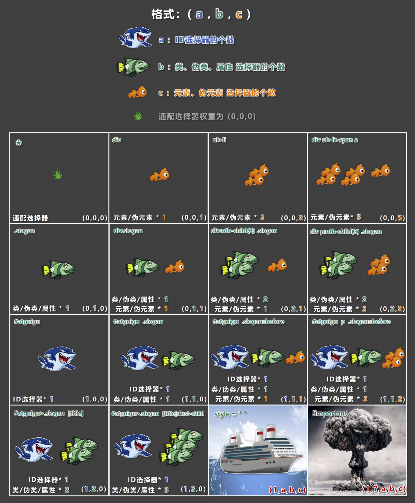
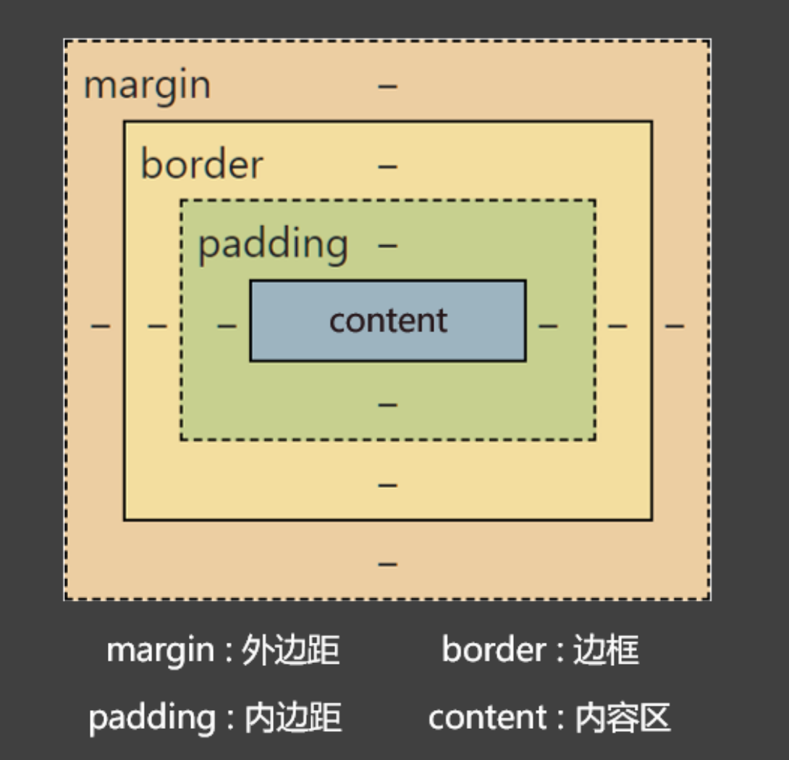

# CSS选择器

## 基础选择器

基础选择器一共分为4类，分别是：

1. 通配选择器

2. 元素选择器

3. 类选择器

4. ID选择器

**通配选择器**

通配选择器作用于所有的HTML元素，通配选择器整体来说没啥用，*主要用于清除样式*

- 语法

```css
* {
    属性名: 属性值;
}
/* 选择所有元素 */
* {
    color: orange;
    font-size: 30px;
}
```

**元素选择器**

元素选择器为页面中某种元素设置统一的样式

- 语法

```css
标签名 {
    属性名: 属性值;
}
/* 选中所有h2元素 */
h2 {
    color: cadetblue;
    font-size: 25px;
}
```

**类选择器**

类选择器根据元素的class值来选中元素

- 语法

```css
.类名 {
    属性名: 属性值;
}
/* 选中所有class值为anti的元素 */
.anti {
    color: chocolate;
}
```

- 规范
  
  - class值不使用纯数字、中文。尽量使用英文和数字的组合，多个单词用-连接
  
  - 一个元素可以有多个class，通过空格隔开

**ID选择器**

ID选择器根据元素的id值来选中元素

- 语法

```css
#ID值 {
    属性名: 属性值;
}
/* 选中ID为special的元素 */
#special {
    color: green;
    font-size: xx-large;
}
```

- 规范
  
  - ID值尽量由字母、数字、下划线( _ )、短杠( - )组成，最好以字母开头、不要包含空
    
    格、区分大小写
  
  - 一个元素只能拥有一个 id 属性，多个元素的 id 属性值不能相同
  
  - 一个元素可以同时拥有 id 和 class 属性

## 复合选择器

复合选择器是建立在基础选择器基础上的多种组合，主要用于在复杂架构中快速而准确选中元素，复合选择器分为：

1. 交集选择器

2. 并集选择器

3. 后代选择器

4. 子代选择器

5. ...

**交集选择器**

交集选择器用来选中同时满足多个条件的元素

- 语法

```css
选择器1选择器2... {
    属性名: 属性值
}
/* 这是交集选择器，即是p元素又是blue类 */
p.blue {
    color: blue;
}
```

- 规范
  
  - 有标签名，标签名必须写在前面，不然标签名会被认为和其他元素是一体
  
  - 交集选择器中不可能出现两个元素选择器，因为一个元素，不可能即是p元素又是span元素。
  
  - 最频繁使用的是：元素选择器配合类名选择器

**并集选择器**

并集选择器用来选中多个元素，是或的关系，任一满足都行

- 语法

```css
选择器1,选择器2,... {
    属性名: 属性值;
}
/* 选中class值为p1或p2或id值为id1的元素 */
.p1,
.p2,
#id1 {
    color: coral;
    background-color: aqua;
}
```

- 规范
  
  - 多个选择器一般隔行写

**后代选择器**

后代选择器用来选中一个元素的所有符合要求的后代（后代包括儿子、儿子的儿子....）

- 语法

```css
选择器1 选择器2 ... {
    属性名: 属性值;
}

/* 选中ul的所有li后代 */
ul li {
    color: chocolate;
}
/* 选中ul的所有li的所有a后代 */
ul li a {
    color: red;
}
/* 选中class值为subject的所有li后代 */
.subject li {
    color: blue;
}
/* 选中class值为subject的所有li且类名为step2的所有后代 */
.subject li.step2 {
    color: hotpink;
}
```

- 注意
  
  - 后代选择器选择的是后台，祖先不会被选择

**子代选择器**

子代选择器用来选中一个元素的所有符合要求的子代（只包括儿子）

- 语法

```css
选择器1>选择器2>... {
    属性名: 属性值;
}

/* 选中ul的所有li子代 */
ul>li {
    color: chocolate;
}
/* 选中class值为subject的所有li子代 */
.subject>li {
    color: aqua;
}
```

**兄弟选择器**

兄弟选择器是用来选择一个元素的所有符合要求的兄弟，包括相邻兄弟选择器和通用兄弟选择器。

1. 相邻兄弟选择器是选择紧紧相邻的第一个兄弟元素

2. 通用兄弟选择器是选择符合条件的所有兄弟元素
- 语法

```css
/* 选中li的紧紧相邻兄弟的li元素，不相邻不会被选中 */
li+li {
    color: aqua;
}
/* 选中li同级兄弟所有li元素，不相邻也会选中 */
li~li{
    color: brown;
}
```

- 注意
  
  - 这里的兄弟都是下面的兄弟，不往上数

**属性选择器**

属性选择器是选中属性符合一定要求的元素

- 语法

```css
/* 有此属性的都会被选择 */
[属性名] {
    ...
}
/* 有此属性且属性值完全等于的会被选择 */
[属性名="值"] {
    ...
}
/* 有此属性且属性值以什么开头会被选择 */
[属性名^="值"] {
    ...
}
/* 有此属性且属性值以什么结尾会被选择 */
[属性名$="值"] {
    ...
}
/* 有此属性且属性值包含什么会被选择 */
[属性名*="值"] {
    ...
}

/* 选中有title属性的所有元素 */
[title] {
    color: orange;
}
/* 选中title属性且值为a的所有元素 */
[title="a"] {
    font-size: 30px;
}
/* 选中title属性且以a开头的所有元素 */
[title^="a"] {
    color: red;
}
/* 选中title属性且值以b结尾的所有元素 */
[title$="b"] {
    color: green;
}
/* 选中title属性且值包含aa的所有元素 */
[title*="aa"] {
    color: aquamarine;
}
```

**伪类选择器**

伪类选择器又细分为：

1. 动态伪类

2. 结构伪类

3. 否定伪类

4. UI伪类

5. 目标伪类

6. 语言伪类

*动态伪类*

可以理解为有动态效果的选择器

- 语法
  
  - `:link`超链接未被访问的状态
  
  - `:visited`超链接访问过的状态
  
  - `:hover`鼠标悬停在元素上的状态
  
  - `:active`元素激活的状态，比如说鼠标按下
  
  - `:focus`获取焦点的元素

```css
/* 通常记忆是lvha */
a:link {
    color: orange;
}
a:visited {
    color: gray;
}
a:hover {
    color: aqua;
}
a:active{
    color: red;
}
span:hover {
    color: brown;
}
span:active {
    color: cadetblue;
}
input:focus,select:focus {
    color: yellow;
    background-color: green;
}
```

*结构伪类*

结构伪类选择器可以理解为结构中的多少个元素等

- 语法
  
  - `:first-child`所有兄弟元素中的第一个（都是针对某一个元素的子元素）
  
  - `:last-child`所有兄弟元素中的最后一个
  
  - `:nth-child(n)`所有兄弟元素中的第 n 个
  
  - `:first-of-type`所有同类型兄弟元素中的第一个
  
  - `:last-of-type`所有同类型兄弟元素中的最后一个
  
  - `:nth-of-type(n)`所有同类型兄弟元素中的 第n个
  
  - 以下了解即可
  
  - `:nth-last-child(n)`所有兄弟元素中的倒数第 n 个
  
  - `:nth-last-of-type(n)`所有同类型兄弟元素中的 倒数第n个
  
  - `:only-child`选择没有兄弟的元素（独生子女）
  
  - `:only-of-type`选择没有同类型兄弟的元素
  
  - `:root`根元素
  
  - `:empty`内容为空元素（空格也算内容）

```css
/* 选中div的第一个子元素且是p（按照所有兄弟计算），结构1 */
div>p:first-child {
    color: red;
}

/* 选中div的最后1个子元素且是p（按照所有兄弟计算），结构1 */
div>p:last-child {
    color: red;
}

/* 选中div的第几个子元素且是p（按照所有兄弟计算），结构1 */
div>p:nth-child(3) {
    color: red;
}

/* 选中的是div的偶数个儿子p元素（按照所有兄弟计算的）—— 结构2 */
/* 关于n的值 —— 结构2：
        1. 0或不写：什么都选不中 —— 几乎不用。
        2. n ：选中所有子元素  —— 几乎不用。
        3. 1 ~ 正无穷的整数，选中对应序号的子元素。
        4. 2n 或 even  ：选中序号为偶数的子元素。
        5. 2n+1 或 odd ：选中序号为奇数的子元素。
        6. -n+3 : 选中前三个。
 */
div>p:nth-child(2n) {
    color: red;
}

/* 选中的是div的第一个儿子p元素（按照所有同类型兄弟计算的）—— 结构3 */
div>p:first-of-type {
    color: red;
}

/* 选中的是div的最后一个儿子p元素（按照所有同类型兄弟计算的）—— 结构3 */
div>p:last-of-type {
    color: red;
}

/* 选中的是div的第n个儿子p元素（按照所有同类型兄弟计算的）—— 结构3 */
div>p:nth-of-type(3) {
    color: red;
}
```

*否定伪类*

否定伪类是用来选中元素但要排除一些条件

- 语法
  
  - `:not(选择器)`排除满足括号中条件的元素

```css
/* 选中的是div的儿子p元素，但是排除类名为fail的元素 */
div>p:not(.fail) {
    color: red;
}

/* 选中div的儿子元素，但是排除属性是title且属性值以“你要加油啊”开头 */
div>p:not([title^="你要加油啊"]) {
    color: green;
}

/* 选中的是div的儿子p元素，但排除第一个儿子p元素 */
div>p:not(:first-child) {
    color: red;
}
```

*UI伪类*

- 语法
  
  - `:checked`被选中的复选框或单选按钮
  
  - `:enable`可用的表单元素（没有disabled属性）
  
  - `:disabled`不可用的表单元素（有disabled属性）

```css
input:checked {
    width: 100px;
    height: 100px;
}
input:disabled {
    background-color: gray;
}
input:enabled {
    background-color: green;
    color: yellow;
}
```

*目标伪类*

- 语法
  
  - `:target`选中锚点指向的元素

```css
div {
    color: yellow;
    background-color: yellowgreen;
}
div:target {
    background-color: brown;
}
```

*语言伪类*

- 语法
  
  - `:lang()`根据指定的语言选择元素（本质是看 lang 属性的值）

```css
div:lang(en) {
    color: red;
}
:lang(zh-CN) {
    color: green;
}
```

**伪元素选择器**

伪元素并不是元素，而是元素中的一些特殊位置

- 语法
  
  - `::first-letter`选中元素中的第一个文字
  
  - `::first-line`选中元素中的第一行文字
  
  - `::selection`选中被鼠标选中的内容
  
  - `::placeholder`选中输入框的提示文字
  
  - `::before`在元素最开始的位置，创建一个子元素
  
  - `::after`在元素最后的位置，创建一个子元素

```css
/* 选中元素中的第一个文字 */
div::first-letter {
    color: red;
    font-size: 30px;
}
/* 选中元素中的第一行 */
div::first-line {
    background-color: yellowgreen;
}
/* 选中元素中被选择的内容 */
p::selection {
    background-color: yellow;
}
/* 选中输入框中的提示文字 */
input::placeholder {
    color: aqua;
}
/* 选中的是p元素最开始的位置，随后创建一个子元素 */
p::before {
    content: "￥";
}
/* 选中的是p元素最后的位置，随后创建一个子元素 */
p::after {
    content: ".00";
}
```

# 选择器优先级

通过不同的选择器，选中相同的元素，并且为相同的样式名设置不同值时，会存在样式冲突，此时就需要优先级来决胜出采用谁的样式

**简单规则**

行内 > ID选择器 > 类选择器 > 元素选择器 > 通配选择器

**具体规则**

根据权重比较，每个选择器都可以计算出一组权重，格式为(a, b, c)，其中：

- a表示ID选择器的个数

- b表示类、伪类、属性选择器的个数

- c表示元素、伪元素选择器的个数

比较规则是从左往右比较，最大则胜出不用继续比较，如果最终一样则按照”后来居上“规则覆盖。但有两个特例，行内样式大于所有选择器，`!important`大于行内。



# CSS三大特性

**层叠性**

如果发生了样式冲突，那就会根据一定的规则（选择器优先级），进行样式的层叠（覆盖）。

**继承性**

元素会自动拥有其父元素、或其祖先元素上所设置的某些样式，优先继承离得近的。

- 常见的可继承属性
  
  - `text??`
  
  - `font??`
  
  - `line??`
  
  - `color`
  
  - ...

**优先级**

也就是出现了样式冲突如何选择的问题

# CSS常用属性

**像素是什么**

显示器中的一个个小点，就是像素点，像素点越小越清晰。

**能使用的长度单位**

`cm`、`mm`、`px`等等

```css
.at1 {
    width: 10cm;
    height: 10cm;
    background-color: green;
}
.at2 {
    width: 10mm;
    height: 10mm;
    background-color: gray;
}
.at3 {
    width: 10px;
    height: 10px;
    background-color: red;
}
```

**颜色的集中表达方式**

- 颜色名，通过颜色名表达，比如`red`、`yellow`、`green`。
  
  - 具体多少参考[官网颜色名表](https://developer.mozilla.org/en-US/docs/Web/CSS/named-color)

```css
div {
    background-color: green;
}
```

- rgb/rgba
  
  - 使用红、绿、蓝三原色组合，其中r对应红色、g对应绿、b对应蓝，a表示透明度。
  
  - 规律
    
    - 若三种颜色值相同，呈现的是灰色，值越大，灰色越浅
    
    - 对于 rbga 来说，前三位的 rgb 形式要保持一致，要么都是 0~255 的数字，要么都是百分比

```css
div {
    background-color: rgb(255, 0, 0);
}

/* 常用的颜色 */
/*  红 */
rgb(255, 0, 0)
/*  绿 */
rgb(0, 255, 0);
/*  蓝 */
rgb(0, 0, 255);
/* 黑 */
rgb(0, 0, 0);
/* 白 */
rgb(255, 255, 255);
/* 紫罗兰 */
rgb(138, 43, 226)
/* 灰色，数值一样表示灰色，值越大灰色越浅 */
rgb(100, 100, 100)
```

- HEX/HEXA
  
  - 和rgb类似，通过红、绿、蓝的16进制表达

```css
div {
    background-color: #00ff00;
}

/* 常用的颜色 */
/* 红色 */
#ff0000;
/* 绿色 */ 
#00ff00;
/* 蓝色 */
#0000ff;
/* 黑色 */
#000000; 
/* 白色 */
#ffffff; 
/* 如果每种颜色的两位都是相同的，就可以简写*/
#ff9988;/* 可简为：#f98 */
/* 但要注意前三位简写了，那么透明度就也要简写 */
#ff998866;/* 可简为：#f986 */
```

- HSL/HSLA
  
  - HSL 是通过：色相、饱和度、亮度，来表示一个颜色的，格式为： hsl(色相,饱和度,亮度)

**CSS字体属性**

- 字体大小
  
  - `font-size`
  
  - 注意
    
    - Chrome默认最小字体大小为12px，默认字体大小为16px，0px会自动消失。
    
    - 不同浏览器的默认字体大小不一样，故使用明确的字体大小。
    
    - 通常给body设置字体大小，方便继承。

- 字体族
  
  - `font-family`
  
  - 注意
    
    - 使用字体的英文名字兼容性会更好，具体的英文名可以自行查询，或在电脑的设置里去寻找。
    
    - 如果字体名包含空格，必须使用引号包裹起来。
    
    - 可以设置多个字体，按照从左到右的顺序逐个查找，找到就用，没有找到就使用后面的，且通常在最后写上 serif （衬线字体）或 sans-serif （非衬线字体）。

- 字体风格
  
  - `font-style`
  
  - 选项
    
    - `normal`默认值正常
    
    - `italic`斜体（默认使用字体的斜体，如果字体没有斜体，则将字体直接倾斜）
    
    - `oblique`斜体（直接将字体倾斜）

- 字体粗细
  
  - `font-weight`
  
  - 选项
    
    - `normal`正常默认
    
    - `lighter`细
    
    - `bold`粗
    
    - `bolder`更粗（如果字体有设计会有，如果未设计则是bold的样式）
    
    - 数字，范围100-1000

- 复合写法
  
  - `font`
  
  - 规则
    
    - 字体大小、字体族必须都写上且字体大小在倒数第二位，字体族在倒数第一位，并用空格隔开

```css
* {
    font-size: 16px;
}
p {
    font-size: 20px;
    font-family: "Microsoft YaHei",sans-serif;
    font-style: oblique;
    font-weight: normal;
}
/* 复合写法 */
p {
    font: lighter normal 20px "Microsoft YaHei",sans-serif;
}
```

**CSS文本属性**

- 文本颜色
  
  - `color`

- 文本间距
  
  - `letter-spacing`字母间距
  
  - `word-spacing`单词间距

- 文本修饰
  
  - `text-decoration`
  
  - 选项
    
    - `none`默认无装饰
    
    - `underline`下划线
    
    - `overline`上划线
    
    - `line-through`删除线
  
  - 搭配使用
    
    - `dotted`虚线
    
    - `wavy`波浪线
    
    - 颜色

- 文本缩进
  
  - `text-indent`
  
  - 单位
    
    - px按像素
    
    - em按

- 文本水平对齐
  
  - `text-align`
  
  - 选项
    
    - `left`默认左对齐
    
    - `right`右对齐
    
    - `center`居中对齐

- 行高
  
  - `line-height`
  
  - 选项
    
    - `normal`由浏览器根据文字大小决定
    
    - px，用户自行设置一个像素
    
    - 倍数，`font-size`的倍数，比如2，font-size为16px，那么行高则未32px
    
    - 百分比，`font-size`的百分比
  
  - 注意
    
    - `line-height`设置过小字体会压缩重叠，且最小值是0，不能小于0
    
    - `line-height`可以被继承，常用倍数方式比较方便
    
    - `line-height`和`height`的关系
      
      - 设置了`height`，那么高度就是`height`
      
      - 只设置了`line-height`，会根据`line-height`计算，高=行高×行数
  
  - 运用场景
    
    - 控制行与行之间的距离
    
    - `height`和`line-height`相等时，文本会垂直居中

- 文本垂直对齐
  
  - 文本垂直对齐没有专门的属性名
  
  - 顶部
    
    - 默认顶部对齐
  
  - 居中
    
    - `height`等于`line-height`
  
  - 底部
    
    - `line-height` = (`height` × 2 ) - `font-size` - `x`，x根据具体字体做调整。

- vertical-align
  
  - 用于指定同一行元素之间，或 表格单元格 内文字的 垂直对齐方式。
  
  - 选项
    
    - `baseline`使元素的基线与父元素的基线对齐（默认）
    
    - `top`使元素的顶部与其所在行的顶部对齐
    
    - `middle`使元素的中部与父元素的基线加上父元素字母 x 的一半对齐
    
    - `bottom`使元素的底部与其所在行的底部对齐

```css
/* 文本颜色，上线的例子有示例 */
/* 文本间距 */
.at2 {
    letter-spacing: 20px;
}
.at3 {
    word-spacing: 20px;
}
/* 文本修饰 */
.at1 {
    /* 上划的红色虚线 */
    text-decoration: overline dotted red;
}
.at2 {
    /* 下划的绿色波浪线 */
    text-decoration: underline wavy green;
}
.at3 {
    /* 删除线 */
    text-decoration: line-through;
}
.at4 {
    /* 没有各种线 */
    text-decoration: none;
}
/* 文本缩进 */
div {
    font-size: 20px;
    text-indent: 2em;
}
/* 文本水平对齐 */
div {
    font-size: 30px;
    background-color: green;
    /* 文本水平对齐 */
    text-align: center;
}
/* 行高 */
#d1 {
    font-size: 30px;
    background-color: skyblue;
    /* 第一种写法：像素 */
    line-height: 30px;
    /* 第二种写法：值为normal */
    line-height: normal;
    /* 第三种写法：倍数，fontsize的倍数 */
    line-height: 1.5;
    /* 第四种写法：百分比 */
    line-height: 200%;
}
/* 文本垂直对齐 */
div {
      font-size: 40px;
      height: 400px;
      background-color: skyblue;
      /* 垂直居中 */
      /* line-height: 400px; */
      /* 底部 height*2 - fontsize - x */
      line-height: 745px;
}
/* 同一行元素之间对齐 */
span {
    font-size: 40px;
    background-color: orange;
    vertical-align: middle;
}
img {
    height: 30px;
    vertical-align: top;
}
.san {
    vertical-align: bottom;
}
```

**CSS列表属性**

只作用于`ul`、`ol`、`li`的属性。

- 设置列表符号样式
  
  - `list-style-type`
  
  - 选项值
    
    - `none`不显示前面的标识（很常用！）
    
    - `square`实心方块
    
    - `disc`圆形
    
    - `decimal`数字
    
    - `lower-roman`小写罗马字
    
    - `upper-roman`大写罗马字
    
    - `lower-alpha`小写字母
    
    - `upper-alpha`大写罗马字

- 设置列表符号的位置
  
  - `list-style-position`
  
  - 选项值
    
    - `inside`在`li`里面
    
    - `outside`在`li`外边

- 自定义列表符号
  
  - `list-style-image`
    
    - `url(图片地址)`

- 复合属性
  
  - `list-style`
  
  - 没有顺序要求

```css
ul {
    /* list-style-type: none; */
    /* list-style-position: inside; */
    /* list-style-image: url(../images/video.gif); */
    list-style: none inside url(../images/video.gif);
}
```

**CSS表格属性**

- 边框宽度
  
  - `border-width`
  
  - 非表格独有

- 边框颜色
  
  - `border-color`
  
  - 非表格独有

- 边框风格
  
  - `border-style`
  
  - 非表格独有
  
  - 选项值
    
    - `none`默认值
    
    - `solid`实线
    
    - `dashed`虚线
    
    - `dotted`点线
    
    - `double`双实线

- 复合
  
  - `border`

- 设置列宽度
  
  - `table-layout`
  
  - table标签独有
  
  - 选项值
    
    - `auto`自动适应
    
    - `fixed`固定列宽，平分

- 单元格间距
  
  - `border-spacing`
  
  - table标签独有

- 合并单元格边框
  
  - `border-collapse`
  
  - table标签独有
  
  - 选项值
    
    - `collapse`合并
    
    - `separate`不合并

- 隐藏没有内容的单元格
  
  - `empty-cells`
  
  - table标签独有
  
  - 选项值
    
    - `show`显示（默认值）
    
    - `hide`隐藏

- 设置表格标题位置
  
  - `caption-side`
  
  - 选项值
    
    - `top`上面（默认值）
    
    - `bottom`下面

```css
table {
    /* 设置表宽为500px */
    width: 500px;
    /* 表格外边框为2px */
    border-width: 2px;
    /* 表格外边框颜色为green */
    border-color: green;
    /* 表格外边框为实线 */
    border-style: solid;
    /* 控制表格的列宽 */
    table-layout: fixed;
    /* 控制单元格间距 */
    border-spacing: 0px;
    /* 合并相邻的单元格的边框 */
    border-collapse: collapse;
    /* 隐藏没有内容的单元格 */
    empty-cells: hide;
    /* 设置表格标题的位置 */
    caption-side: top;
}
td,th {
    /* 设置每个单元格的边框为2px，天蓝色、实线 */
    border: 2px skyblue solid;
}
/* 不止table其他标签也可以设置 */
h2 {
    border:3px red solid;
}
span {
    border:3px purple dashed;
}
```

**CSS背景属性**

- 设置背景颜色
  
  - `background-color`
  
  - 默认值是`transparent`，透明

- 设置背景图片
  
  - `background-image`
  
  - `url(图片的地址)`

- 设置背景重复方式
  
  - `background-repeat`
  
  - 选项值
    
    - `repeat`重复，默认值
    
    - `repeat-x`水平重复
    
    - `repeat-y`垂直重复
    
    - `no-repeat`不重复

- 设置背景图位置
  
  - `background-position`
  
  - 选项值
    
    - 关键字设置
      
      - 水平：`left`、`center`、`right`
      
      - 垂直：`top`、`center`、`bottom`
      
      - 如果只写一个值，另一个方向的值取`center`
    
    - 通过长度设置坐标位置（针对的是左上的点）
      
      - 两个值，分别是 x 坐标和 y 坐标
      
      - 只写一个值，会被当做 x 坐标， y 坐标取`center`

- 复合属性
  
  - `background`

```css
div {
      width: 300px;
      height: 300px;
      border: 2px green solid;
      background-color: skyblue;
      background-image: url(../images/悟空.jpg);
      background-repeat: no-repeat;
      /* background-position: center center; */
      background-position: 100px 100px;
      /* 复合属性 */
      background: skyblue url(../images/悟空.jpg) no-repeat 100px 100px;
}
```

**CSS鼠标属性**

- 设置鼠标光标的样式
  
  - `cursor`
  
  - 选项值
    
    - `pointer`小手
    
    - `move`移动图标
    
    - `text`文字选择器
    
    - `crosshair`十字架
    
    - `wait`等待
    
    - `help`帮助
    
    - `url("./arrow.png"),pointer`自定义小图标

```css
div {
    width: 300px;
    height: 300px;
    border-style: solid;
    background-color: skyblue;
    cursor: url("../images/arrow.png"),pointer;
}
button {
    cursor: pointer;
}
input {
    cursor: move;
}
```

# CSS盒子模型

**长度单位**

- `px`，像素

- `em`，相对元素`font-size`的倍数

- `rem`，相对于根字体大小的倍数，`html`就是根标签，如果没有设置就是浏览器默认的字体大小

- `%`，相对于父元素的百分比

- `cm`，厘米

- `mm`，毫米

**元素的显示模式**

- 块元素
  
  - 特点
    
    - 在页面中独占一行，不会和任何元素共享一行，是从上 到下排列
    
    - 默认宽度，撑满整个父元素
    
    - 默认高度，由内容撑开
    
    - 可以设置宽高

- 行内元素
  
  - 特点
    
    - 在页面中不独占一行，一行中不能容纳下所有的行内元素，会在下一行从左往右排列
    
    - 默认宽度，由内容撑开
    
    - 默认高度，由内容撑开
    
    - 不可以设置宽高

- 行内块元素
  
  - 特点
    
    - 在页面中不独占一行，一行中不能容纳下所有的行内元素，会在下一行从左往右排列
    
    - 默认宽度，由内容撑开
    
    - 默认高度，由内容撑开
    
    - 可以设置宽高

**显示模式分类**

- 块元素
  
  - 主体结构标签： `<html>` 、`<body>`
  
  - 排版标签：` <h1>` ~ `<h6>` 、 `<hr>` 、 `<p>` 、 `<pre>` 、 `<div>`
  
  - 列表标签： `<ul>` 、 `<ol>` 、 `<li>` 、 `<dl>` 、 `<dt>` 、 `<dd>`
  
  - 表格相关标签：`<table>` 、 `<tbody>` 、 `<thead>` 、 `<tfoot>` 、 `<tr>` 、`<caption>`
  
  - `<form>`、`<option>`

- 行内元素
  
  - 文本标签： `<br>` 、 `<em>` 、 `<strong>` 、 `<sup>` 、 `<sub>` 、 `<del>` 、 `<ins>`
  
  - `<a>`、`<label>`

- 行内块元素
  
  - 图片：``
  
  - 单元格： `<td>`、 `<th>`
  
  - 表单控件： `<input>` 、 `<textarea>` 、 `<select>` 、 `<button>`
  
  - 框架标签： `<iframe>`

**修改元素的显示模式**

- `display`
  
  - 选项值
    
    - `none`，元素会被隐藏，消失
    
    - `block`，元素将作为块级元素显示
    
    - `inline`，元素将作为行内元素显示
    
    - `inline-block`，元素将作为行内块元素显示

```css
div {
    width: 200px;
    height: 200px;
    font-size: 20px;
    /* 将原本的块级元素变成行内块元素 */
    display: inline-block;
}
#d1 {
    background-color: skyblue;
}
#d2 {
    background-color: orange;
}
#d3 {
    background-color: green;
}
a {
    width: 200px;
    height: 200px;
    font-size: 20px;
    /* 将原本的行内元素变成块元素 */
    display: block;
}
#s1 {
    background-color: skyblue;
}
#s2 {
    background-color: orange;
}
#s3 {
    background-color: green;
}
```

**盒子模型的定义**

CSS会把所有的HTML元素看成一个盒子，所有样式都是基于盒子

- `margin`外边距，盒子与外界的间距

- `border`边框，盒子的边框

- `padding`内边距，紧贴内容的补白区域

- `content`内容，元素中的文本或后代元素都是它的内容



*盒子大小 = content + 左右padding + 左右border*

**盒子内容区**

- 设置内容区域宽度
  
  - `width`

- 设置内容区域的最大宽度
  
  - `max-width`

- 设置内容区域的最小宽度
  
  - `min-width`

- 设置内容区域的高度
  
  - `height`

- 设置内容区域的最大高度
  
  - `max-height`

- 设置内容区域的最小高度
  
  - `min-height`

```css
div {
    width: 800px;
    /* min-width: 600px; */
    /* max-width: 1000px; */

    height: 200px;
    /* min-height: 50px; */
    /* max-height: 400px; */
    background-color: skyblue;
}
```

**默认宽度**

默认宽度是元素在没有设置width属性时，元素呈现出来的宽度

总默认宽度 = 父的 content — 自身的左右 margin 。

内容区的默认宽度 = 父的 content — 自身的左右 margin — 自身的左右 border — 自身的左右padding 。

**盒子内边距**

- 左内边距
  
  - `padding-left`

- 上内边距
  
  - `padding-top`

- 右内边距
  
  - `padding-right`

- 下内边距
  
  - `padding-bottom`

- 复合属性
  
  - `padding`

- 注意点
  
  - padding的数值不能为负数
  
  - 行内元素设置左右内边距没问题，但设置上下内边距有问题会将上下元素遮挡
  
  - 块元素和行内块元素设置内边距没有问题

```css
/* 块元素设置padding */
#d1 {
    width: 300px;
    height: 300px;
    background-color: skyblue;
    /* 左内边距 */
    padding-left: 20px;
    /* 上内边距 */
    padding-top: 30px;
    /* 右内边距 */
    padding-right: 40px;
    /* 下内边距 */
    padding-bottom: 50px;
    /* 复合属性一个值：所有 */
    padding: 20px;
    /* 复合属性两个值：上下 左右 */
    padding: 20px 40px;
    /* 复合属性三个值：上 左右 下 */
    padding: 20px 30px 40px;
    /* 复合属性四个值：上 右 下 左 */
    padding: 20px 30px 40px 50px;
}

/* 行内元素设置padding */
span {
    background-color: yellowgreen;
    font-size: 20px;
    /* 左内间距生效 */
    padding-left: 20px;
    /* 右内间距生效 */
    padding-right: 20px;
    /* 上内间距生效，但会遮挡上面的元素，不完美 */
    padding-top: 30px;
    /* 下内间距生效，但会遮挡下面的元素，不完美 */
    padding-bottom: 30px;
}
```

**盒子边框**

- 边框线风格
  
  - `border-style`
  
  - 选项值
    
    - `none`默认值，无
    
    - `solid`实线
    
    - `dashed`虚线
    
    - `dotted`点线
    
    - `double`双实线
    
    - ....

- 边框线宽度
  
  - `border-width`

- 边框线颜色
  
  - `border-color`

- 复合属性
  
  - `border`

- 组合一共有20个

```css
div {
      width: 300px;
      height: 300px;
      background-color: aqua;

      border-left-width: 20px;
      border-top-width: 30px;
      border-right-width: 40px;
      border-bottom-width: 50px;

      border-left-color: red;
      border-top-color: green;
      border-right-color: yellow;
      border-bottom-color: blue;

      border-left-style: solid;
      border-top-style: dashed;
      border-right-style: double;
      border-bottom-style: dotted;

      /* border-color: red; */
      /* border-width: 80px; */
      /* border-style: dashed; */

      border-left: 50px solid purple;
      border-right: 60px dashed orange;
      border-top: 70px double green;
      border-bottom: 80px dotted gray;

      /* border: 10px solid red; */
}
```

**盒子外边距**

- `margin`

```css
div {
      width: 300px;
      height: 300px;
      background-color: skyblue;

      /* 左外边距 */
      margin-left: 30px;
      /* 上外边距 */
      margin-top: 40px;
      /* 右外边距 */
      margin-right: 50px;
      /* 下外边距 */
      margin-bottom: 40px;

      /* 所有 */
      margin: 50px;
      /* 上下 左右 */
      margin: 10px 20px;
      /* 上 左右 下 */
      margin: 10px 20px 30px;
      /* 上 右 下 左 */
      margin: 10px 20px 30px 40px;
}
```

- 外边距的注意事项
  
  - 子元素的margin是参考父元素的content计算的。
  
  - 上margin/左margin会让自己动，下margin/右margin会让后面的兄弟元素动。
  
  - 块元素、行内块元素设置margin上下左右都没问题，但行内元素设置左右margin没问题，但上下margin会失效。
  
  - margin值可以设置auto，对一个块级元素设置左右margin为auto会让其居中，但行内元素和行内块元素都不行。
  
  - margin值可以为负值，如果是负值时会被隐藏。

- margin的几个问题
  
  - margin坍塌问题
    
    - 描述：第一个元素的上margin会作用于父元素上，最后一个元素的下margin会作用于父元素上。
    
    - 如何解决
      
      - 给父元素设置 css 样式 overflow:hidden
      
      - 给父元素设置一个不为0的边框
      
      - 给父元素设置不为0的padding
  
  ```html
  <!DOCTYPE html>
  <html lang="zh-CN">
  <head>
      <meta charset="UTF-8">
      <title>margin坍塌问题</title>
      <style>
          .outer {
              width: 500px;
              /* height: 500px; */
              background-color: skyblue;
              overflow: hidden;
          }
          .inner1 {
              width: 100px;
              height: 100px;
              background-color: chocolate;
              margin-top: 50px;
          }
          .inner2 {
              width: 100px;
              height: 100px;
              background-color: green;
              margin-bottom: 50px;
          }
      </style>
  </head>
  <body>
      <div class="outer">
          <div class="inner1">inner1</div>
          <div class="inner2">inner2</div>
      </div>
      <div>我是一段测试的文字</div>
  </body>
  </html>
  ```
  
  - margin合并问题
    
    - 描述：上面兄弟元素的下外边距和下面兄弟元素的上外边距会合并，取一个最大的值，而不是相加。
    
    - 如何解决
      
      - 不用解决，如果要设置你要的距离，那么只需要设置最大的值为你的距离。
  
  ```html
  <!DOCTYPE html>
  <html lang="zh-CN">
  <head>
      <meta charset="UTF-8">
      <title>margin合并问题</title>
      <style>
          #d1 {
              width: 100px;
              height: 100px;
              background-color: blue;
              /* margin-bottom: 100px; */
              /* 要设置间距为200px，那么只需要将其中一个的外边距设置为200px */
              margin-bottom: 200px;
          }
          #d2 {
              width: 100px;
              height: 100px;
              background-color: black;
              margin-top: 100px;
          }
      </style>
  </head>
  <body>
      <div id="d1"></div>
      <div id="d2"></div>
  </body>
  </html>
  ```

**内容溢出**

- 溢出内容的处理方式
  
  - `overflow`
  
  - 选项值
    
    - `visible`显示，默认值
    
    - `hidden`隐藏
    
    - `scroll`显示滚动条，如果内容是否溢出
    
    - `auto`自动显示滚动条，溢出了就会显示滚动条

- 水平方向溢出内容的处理方式
  
  - `overflow-x`

- 垂直方向溢出内容的处理方式
  
  - `overflow-y`

```css
div {
      width: 300px;
      height: 300px;
      background-color: skyblue;
      /* 溢出隐藏 */
      overflow: hidden;
      /* 自动溢出滚动条 */
      /* overflow: auto; */
      /* 直接滚动条 */
      /* overflow: scroll; */
}
```

**元素隐藏方式**

- 方式一
  
  - `visibility`属性
    
    - `show`显示
    
    - `hidden`隐藏，通过这样设置隐藏，元素看不见但还占有原来的位置

- 方式二
  
  - `display`属性
    
    - `none`隐藏，通过这样设置隐藏，不但看不见，也不占用任何位置，没有大小宽高。

```css
.box {
    width: 100px;
    height: 100px;
    background-color: skyblue;
}

.box2 {
    /* 隐藏了还会占位 */
    visibility: hidden;
}
.box1 {
    /* 隐藏了但不会占位 */
    display: none;
}
```

**样式继承**

有些样式会继承，元素如果本身设置了某个样式，就使用本身设置的样式；但如果本身没有设置某个样式，会从父元素开始一级一级继承（优先继承离得近的祖先元素）。

- 会被继承的样式
  
  - 字体属性
  
  - 文本属性（除了vertical-align）
  
  - 颜色
  
  - ...不会影响布局的样式

- 不会被继承的样式
  
  - 边框
  
  - 背景
  
  - 内边距
  
  - 外边距
  
  - 宽高
  
  - 溢出方式
  
  - ...会影响布局的样式，和盒子模型相关的属性

**默认样式**

元素一般都些默认的样式，比如说`<a>`标签的默认样式是下划线、字体颜色、鼠标小手，这些默认样式是浏览器给标签添加的CSS样式，所以默认样式优先级大于继承的样式。

**布局小技巧**

- 让子元素水平居中
  
  - 子元素是块元素
    
    - `margin: 0 auto;`
  
  - 子元素是行内或行内块元素
    
    - `text-align: center;`

- 让子元素垂直居中
  
  - 子元素是块元素
    
    - 子元素的margin-top = 父元素的height ÷ 2 - 子元素的height ÷ 2
  
  - 子元素是行内或行内块元素
    
    - 子元素的line-height = 父元素的height，且每个元素的vertical-align: middle
    
    - 如果想绝对的垂直居中，设置父元素的font-size:0，子元素的font-size单独设置

- 行内元素、行内块元素都可以被当做文本处理
  
  - `text-align`、`line-height`、`text-indent`等这些属性都生效

```html
<!DOCTYPE html>
<html lang="zh-CN">
<head>
    <meta charset="UTF-8">
    <title>布局技巧1</title>
    <style>
        /* 子元素是块元素的居中 */
        .outer {
            width: 400px;
            height: 400px;
            background-color: gray;
            overflow: hidden;
        }
        .inner {
            width: 200px;
            height: 100px;
            background-color: orange;
            /* 让子块元素在父元素中水平居中 */
            margin: 0 auto;
            /* 子块元素垂直居中 上外边距 = (父元素的height - 子元素的height) / 2 */
            margin-top: 150px;
            /* 子元素中的文字水平居中 */
            text-align: center;
            /* 子元素中的文字垂直居中 */
            line-height: 100px;
        }
    </style>
</head>
<body>
    <div class="outer">
        <div class="inner">inner</div>
    </div>
</body>
</html>
```

```html
<!DOCTYPE html>
<html lang="zh-CN">
<head>
    <meta charset="UTF-8">
    <title>布局技巧2</title>
    <style>
        /* 子元素是行内元素或行内块元素的居中 */
        .outer {
            width: 400px;
            height: 400px;
            background-color: gray;
            /* 针对行内元素、行内块元素可以使用文本相关属性让其对齐 */
            text-align: center;
            line-height: 400px;
        }

        .inner {
            background-color: orange;
            font-size: 20px;
        }
    </style>
</head>
<body>
    <div class="outer">
        <span class="inner">布局技巧2？</span>
    </div>
</body>
</html>
```

```html
<!DOCTYPE html>
<html lang="zh-CN">
<head>
    <meta charset="UTF-8">
    <title>布局技巧3</title>
    <style>
        /* 多个子元素是行内或行内块的居中 */
        .outer {
            width: 400px;
            height: 400px;
            background-color: gray;
            /* 通过文本居中的方式让行内和行内块居中 */
            text-align: center;
            line-height: 400px;
            /* 将父元素的font-size设置为0是为了让span和图片之间空隙变成0 */
            font-size: 0;
        }
        .outer span {
            background-color: orange;
            font-size: 20px;
            /* 绝对居中要使用该属性 */
            vertical-align: middle;
        }
        .outer img {
            /* 绝对居中要使用该属性 */
            vertical-align: middle;
        }
    </style>
</head>
<body>
    <div class="outer">
        <span>出来玩啊？x</span>
        
    </div>
</body>
</html>
```

**元素之间的空白问题**

行内元素、行内块元素，彼此之间的换行会被浏览器解析为一个空白字符。

- 解决方案
  
  - 去掉换行，不推荐。
  
  - 设置父元素的`font-size:0`，子元素的字体大小单独控制，推荐。

**行内块的幽灵空白问题**

因为行内块也是基线对齐，所以图片不会和行最底部对齐，而是和基线对齐（x的最下）。

解决方案

- 设置行内块元素的`vertical-align`不为默认的`baseline`，设置为 `middel` 、 `bottom` 、`top` 均可。

- 设置父元素的`font-size:0`，对于其他子元素`font-size`重新设置。

```html
<!DOCTYPE html>
<html lang="zh-CN">
<head>
    <meta charset="UTF-8">
    <title>行内块幽灵空白问题</title>
    <style>
        div {
            width: 600px;
            background-color: skyblue;
            /* 方法一：设置父元素的font-size=0 */
            /* font-size: 0; */
        }
        img {
            /* 方法二：设置行内块的对齐方式不是基线对齐 */
            vertical-align: bottom;
        }
    </style>
</head>
<body>
    <div>
        </div>
</body>
</html>
```

# 浮动

**浮动简介**

最初浮动设计出来是为了解决文字环绕问题，现在浮动是主流布局的方式之一。

**浮动后的特点**

- 脱离了文档流，飘起来。

- 不管浮动前是什么元素，浮动后，默认宽与高都是被内容撑开（尽可能小），可以设置宽高。

- 不会独占一行，和其他元素公用一行，因为是飘起来了。

- 不会存在margin合并和margin坍塌，能够完美设置四个方向的margin和padding。

- 不会像行内块一样被当做文本处理（没有行内块空白问题）。

**浮动之后的影响**

- 对兄弟元素的影响
  
  - 后面的兄弟元素，会占据浮动元素之前的位置，在浮动元素的下面；对前面的兄弟无影响。

- 对父元素的影响
  
  - 不能撑起父元素的高度，导致父元素高度塌陷；但父元素的宽度依然束缚浮动的元素。

解决方案：

- 给父元素指定高度

- 给父元素也设置浮动，都飘起来

- 给父元素添加`overflow:hidden`

- 在所有浮动元素的最后面，添加一个块元素，并给块元素添加一个`clear:both`，用来清楚浮动带来的影响

- 给浮动的父元素设置伪元素，设置伪元素，通过伪元素清除浮动带来的影响，推荐。

```html
<!DOCTYPE html>
<html lang="zh-CN">
<head>
    <meta charset="UTF-8">
    <title>浮动后的影响</title>
    <style>
        .outer {
            width: 400px;
            background-color: skyblue;
            border: 1px solid black;
            /* 第一种：给父元素给一个固定的高，消除父元素塌陷，但无法解决兄弟元素问题 */
            /* height: 120px; */
            /* 第二种：让父元素也浮动，消除父元素塌陷，但解决不了兄弟元素问题 */
            /* float: left; */
            /* 第三种：给父元素设置overflow:hidden，能消除父元素塌陷，但无法解决兄弟元素问题，还导致兄弟元素的内容被隐藏 */
            /* overflow: hidden; */
        }
        .box {
            width: 100px;
            height: 100px;
            background-color: rebeccapurple;
            margin: 10px;
        }
        .box1,.box2,.box3 {
            float: left;
        }
        /* 第四种：给最后一个元素清空浮动影响，但必须要求最后一个是块元素，但有一个弊端是必须要有一个块元素 */
        /* .box4 {
            clear: both;
        } */
        /* 第五种：给父元素添加伪元素，且伪元素内容为空，且设置为块，且清除浮动影响 */
        .outer::after {
            content: "";
            display: block;
            clear: both;
        }
        /* 第五种方法所有的子元素都要浮动 */
        .box4 {
            float: left;
        }
    </style>
</head>
<body>
    <div class="outer">
        <div class="box box1">1</div>
        <div class="box box2">2</div>
        <div class="box box3">3</div>
        <div class="box box4">4</div>
    </div>
</body>
</html>
```

原则：

- 在布局中要么所有元素全都浮动、要么全都不浮动。

# 定位

定位分为相对定位、绝对定位、固定定位、粘性定位。

**相对定位**

- 如何设置
  
  - `position:relative`
  
  - 使用`top`、`bottom`、`left`、`right`来定位

- 参考点
  
  - 相对定位参考元素原来的位置

- 特点
  
  - 不会脱离文档流，元素位置的变化只是视觉上的变化，不会对其他元素产生影响
  
  - 定位元素的层级会比普通元素高
    
    - 定位元素会遮盖普通元素
    
    - 都发生定位的两个元素，后写的元素会盖在先写的元素之上
  
  - `top`不能和`bottom`一起设置，`left`和`right`不能一起设置
  
  - 相对定位的元素能继续浮动，但不推荐
  
  - 相对定位的元素能设置margin调整位置，但不推荐

```html
<!DOCTYPE html>
<html lang="zh-CN">
<head>
    <meta charset="UTF-8">
    <title>相对定位</title>
    <style>
        .outer {
            width: 400px;
            border: 1px solid black;
            padding: 20px;
            background-color: skyblue;
        }
        .box {
            width: 100px;
            height: 100px;
            font-size: 20px;
        }
        .box1 {
            background-color: #888;
        }
        .box2 {
            background-color: green;
            position: relative;
            left: 50px;
            top: 50px;
        }
        .box3 {
            background-color: orange;
        }

</style>
</head>
<body>
    <div class="outer">
        <div class="box box1">1</div>
        <div class="box box2">2</div>
        <div class="box box3">3</div>
    </div>
</body>
</html>
```

**绝对定位**

- 如何设置
  
  - `position:absolute`
  
  - 使用`top`、`bottom`、`left`、`right`来定位

- 参考点
  
  - 绝对定位参考包含块
  
  - 包含块
    
    - 对于没有脱离文档流的元素，它的包含块就是父元素
    
    - 对于脱离文档流的元素，它的包含块是离它最近的第一个拥有定位属性的祖先元素（如果所有祖先都没有定位属性，那么html元素就是包含块）。
  
  - 特点
    
    - 脱离了文档流，会对后面的兄弟元素、父元素有影响
    
    - `top`不能和`bottom`一起设置，`left`和`right`不能一起设置
    
    - 绝对定位、浮动不能同时设置，如果同时设置，浮动失效，以定位为主
    
    - 绝对定位的元素，也能通过 margin 调整位置，但不推荐这样做。
    
    - 无论是什么元素（行内、行内块、块级）设置为绝对定位之后，都变成了定位元素（定位元素默认被内容撑开，可以设置宽高）

```html
<!DOCTYPE html>
<html lang="zh-CN">
<head>
    <meta charset="UTF-8">
    <title>绝对定位</title>
    <style>
        body {
            height: 2000px;
        }
        .outer {
            width: 400px;
            border: 1px solid black;
            padding: 20px;
            background-color: skyblue;
            /* 和绝对定位配置使box2参考变成.outer */
            position: relative;
        }
        .box {
            width: 100px;
            height: 100px;
            font-size: 20px;
        }
        .box1 {
            background-color: #888;
        }
        .box2 {
            background-color: green;
            position: absolute;
            top: 0;
            left: 0;
        }
        .box3 {
            background-color: orange;
        }
    </style>
</head>
<body>
    <div class="outer">
        <div class="box box1">1</div>
        <div class="box box2">2</div>
        <div class="box box3">3</div>
    </div>
</body>
</html>
```

**固定定位**

- 如何设置
  
  - `position:fixed`
  
  - 使用`top`、`bottom`、`left`、`right`来定位

- 参考点
  
  - 固定定位参考视口
  
  - 视口
    
    - 就是浏览器的窗口

- 特点
  
  - 脱离文档流，会对后面的兄弟元素、父元素有影响
  
  - `top`不能和`bottom`一起设置，`left`和`right`不能一起设置
  
  - 固定定位和浮动不能同时设置，如果同时设置，浮动失效，以固定定位为主
  
  - 固定定位的元素，也能通过 margin 调整位置，但不推荐这样做。
  
  - 无论是什么元素（行内、行内块、块级）设置为固定定位之后，都变成了定位元素（定位元素默认被内容撑开，可以设置宽高）

```html
<!DOCTYPE html>
<html lang="zh-CN">
<head>
    <meta charset="UTF-8">
    <title>固定定位</title>
    <style>
        body {
            height: 2000px;
        }
        .outer {
            width: 400px;
            border: 1px solid black;
            padding: 20px;
            background-color: skyblue;    
        }
        .box {
            width: 100px;
            height: 100px;
            font-size: 20px;
        }
        .box1 {
            background-color: #888;
        }
        .box2 {
            background-color: green;
            position:fixed;
            left: 0;
            top: 0;
        }
        .box3 {
            background-color: orange;
        }
    </style>
</head>
<body>
    <div class="outer">
        <div class="box box1">1</div>
        <div class="box box2">2</div>
        <div class="box box3">3</div>
    </div>
</body>
</html>
```

**粘性定位**

- 如何设置
  
  - `position:sticky`
  
  - 使用`top`、`bottom`、`left`、`right`来定位，`top`常用

- 参考点
  
  - 粘性定位参考离他最近的一个拥有”滚动机制“的祖先元素，即便这个祖先不是最近真实可滚动
  
  - 最常用的值是top值
  
  - 粘性定位和浮动可以同时设置，但不推荐这样做
  
  - 粘性定位的元素，也能通过margin调整位置，但不推荐这样做

```html
<!DOCTYPE html>
<html lang="zh-CN">
<head>
    <meta charset="UTF-8">
    <title>粘性定位</title>
    <style>
        * {
            padding: 0;
            margin: 0;
        }
        body {
            height: 2000px;
        }
        .header {
            height: 100px;
            background-color: orange;
            font-size: 20px;
            text-align: center;
            line-height: 100px;
        }
        .item {
            background-color: gray;
        }
        .first {
            height: 50px;
            font-size: 20px;
            line-height: 50px;
            background-color: skyblue;
            position:sticky;
            top: 0;
        }
    </style>
</head>
<body>
    <div class="header">头部</div>
    <div class="item">
        <div class="first">A</div>
        <h2>A1</h2>
        <h2>A2</h2>
        <h2>A3</h2>
        <h2>A4</h2>
        <h2>A5</h2>
        <h2>A6</h2>
        <h2>A7</h2>
        <h2>A8</h2>
    </div>
    <div class="item">
        <div class="first">B</div>
        <h2>B1</h2>
        <h2>B2</h2>
        <h2>B3</h2>
        <h2>B4</h2>
        <h2>B5</h2>
        <h2>B6</h2>
        <h2>B7</h2>
        <h2>B8</h2>
    </div>
    <div class="item">
        <div class="first">C</div>
        <h2>C1</h2>
        <h2>C2</h2>
        <h2>C3</h2>
        <h2>C4</h2>
        <h2>C5</h2>
        <h2>C6</h2>
        <h2>C7</h2>
        <h2>C8</h2>
    </div>
</body>
</html>
```

**定位层级**

- 定位元素的显示层级比普通层级高，无论什么定位，显示层级是一样的

- 如果位置发生层叠，默认情况：后面的元素会显示在前面元素之上（后写的元素会在上面）

- 通过`z-index`调整元素的显示层级，且只有定位的元素设置才会生效

- 如果`z-index`值大的元素没有覆盖值小的元素，要检查值小的包含块的层级

```html
<!DOCTYPE html>
<html lang="zh-CN">
<head>
    <meta charset="UTF-8">
    <title>层级定位</title>
    <style>
        .outer {
            width: 500px;
            background-color: skyblue;
            border: 1px solid black;
            padding: 20px;
            position: relative;
            z-index: 10;
        }
        .box {
            width: 100px;
            height: 100px;
        }
        .box1 {
            background-color: gray;
        }
        .box2 {
            background-color: green;
            position: relative;
            left: 50px;
            top: -50px;
        }
        .box3 {
            background-color: yellow;
            position: absolute;
            left: 120px;
            top: 120px;
            z-index: 20;
        }
        .box4 {
            background-color: red;
            position:fixed;
            left: 178px;
            top: 178px;
            z-index: 300;
        }
        .box5 {
            background-color: blue;
            position: fixed;
            left: 228px;
            top: 228px;
            z-index: 20;
        }
    </style>
</head>
<body>
    <div class="outer">
        <div class="box box1">1</div>
        <div class="box box2">2</div>
        <div class="box box3">3</div>
        <div class="box box4">4</div>
    </div>
    <div class="box box5">5</div>
</body>
</html>
```

**特殊的定位场景**

注意：定位可以越过父元素的padding，但不会越过border，换句话就是以从padding开始计算（left:0和top:0不会覆盖border，如果有border的话）。

- 让定位元素充满整个包含块
  
  - 宽度充满设置`left:0`和`right:0`
  
  - 高度充满设置`top:0`和`bottom:0`

```html
<!DOCTYPE html>
<html lang="zh-CN">
<head>
    <meta charset="UTF-8">
    <title>定位的特殊应用</title>
    <style>
        /* 让定位元素充满整个父元素 */
        .outer {
            height: 400px;
            background-color: grey;
            position: relative;
        }
        .inner {
            background-color: orange;
            position: absolute;
            left: 0;
            right: 0;
            top: 0;
            bottom: 0;
        }
    </style>
</head>
<body>
    <div class="outer">
        <div class="inner">1</div>
    </div>
</body>
</html>
```

- 让定位元素在包含块中居中
  
  - 方法一：`letf:0`、`right:0`、`top:0`、`bottom:0`、`margin:auto`
  
  - 方法二：`left:50%`、`top:50%`、`margin-left:负的宽度的一半`、`margin-top:负的高度的一半`，不推荐。

```html
<!DOCTYPE html>
<html lang="zh-CN">
<head>
    <meta charset="UTF-8">
    <title>定位的特殊应用2</title>
    <style>
        /* 让定位元素在父元素内居中 */
        .outer {
            height: 400px;
            background-color: grey;
            position: relative;
        }
        .inner {
            width: 300px;
            height: 100px;
            background-color: orange;
            position: absolute;
            left: 0;
            right: 0;
            top: 0;
            bottom: 0;
            margin: auto;
        }
    </style>
</head>
<body>
    <div class="outer">
        <div class="inner">1</div>
    </div>
</body>
</html>
```

# 布局

**版心**

- 在PC端网页中，一般都会有一个固定宽度且水平居中的盒子，来显示网页的主要内容，这是网页的版心

- 版心的宽度一般设置为960-1200px之间

- 版心可以一个，也可以多个

---- 

# CSS3新增的东西

## 1. 新增的长度单位

- rem：根元素字体大小的倍数，只与根元素字体大小有关

- vw：视口宽度的百分之多少，比如`10vw`就是10%。

- vh：视口高度的百分之多少

- vmax：视口高宽中最大的值的百分之多少

- vmin：视口高度中最小的值的百分之多少

## 2. 新增的颜色设置方式

- rgba

- hsl

- hsla

## 3. 新增的选择器

动态伪类、目标伪类、语言伪类、 UI 伪类、结构伪类、否定伪类、伪元素。

## 4. 新增盒模型属性

- box-sizing
  
  - 作用：用来控制盒子大小的范围
  
  - 属性值选项
    
    - content-box：width和height设置的盒子内容区的大小（默认）
    
    - border-box：width和height设置的是盒子总大小（内容区+padding+border）

- resize
  
  - 作用：允许调整盒子大小
  
  - 属性值选项
    
    - none：不允许调整（默认）
    
    - both：用户可以调节元素的宽度和高度
    
    - horizontal：用户可以调节元素的宽度
    
    - vertical：用户可以调节元素的高度

```css
.box1 {
    width: 100px;
    height: 100px;
    background-color: blue;
    resize: both;
    overflow: hidden; /* 需要配合overflow */
}
```

- box-shadow
  
  - 作用：控制盒子阴影
  
  - 属性值选项
    
    - h-shadow：水平阴影的位置，必填可为负值。
    
    - v-shadow：垂直阴影的位置，必填可为负值。
    
    - blur：模糊距离，可选
    
    - spread：阴影的外延值，可选
    
    - color：阴影颜色，可选
    
    - inset：内部阴影，可选
  
  - 语法
  
  ```css
  box-shadow: h-shadow v-shadow blur spread color inset;
  ```

```css
.box1 {
      width: 200px;
      height: 200px;
      background-color: cadetblue;
      /* 两个值：含义：水平位置 垂直位置 */
      /* box-shadow: 10px 10px; */

      /* 三个值：含义：水平位置 垂直位置 阴影颜色 */
      /* box-shadow: 10px 10px rebeccapurple; */

      /* 三个值：含义：水平位置 垂直位置 模糊程度 */
      /* box-shadow: 10px 10px 20px; */

      /* 四个值：含义：水平位置 垂直位置 模糊程度 阴影颜色 */
      /* box-shadow: 10px 10px 20px rebeccapurple; */

      /* 五个值：含义：水平位置 垂直位置 模糊程度 外延值 阴影颜色 */
      /* box-shadow: 10px 10px 20px 10px rebeccapurple; */

      /* 六个值：含义：水平位置 垂直位置 模糊程度 外延值 阴影颜色 内阴影 */
      box-shadow: 10px 10px 20px 10px rebeccapurple inset;
}
```

- opacity
  
  - 控制盒子的不透明度，从0-1越来越不透明。

## 5. 新增背景属性

- background-origin
  
  - 作用：设置背景图的原点
  
  - 属性值选项
    
    - padding-box：从padding区域开始显示背景图像，默认。
    
    - border-box：从border区域开始显示背景图像
    
    - content-box：从content区域开始显示背景图像

```css
.box1 {
      width: 400px;
      height: 400px;
      padding: 20px;
      border: 20px dotted black;
      background-color: #eee;

      background-image: url("../images/bg01.jpg");
      background-repeat: no-repeat;
      /* 从内容区开始 */
      /* background-origin: content-box; */
      /* 从边框开始 */
      /* background-origin: border-box; */
      /* 从padding开始 */
      background-origin: padding-box;
}
```

- background-clip
  
  - 作用：设置背景图的向外裁剪的区域
  
  - 属性值选项
    
    - border-box：从border区域开始向外的裁剪背景，默认
    
    - padding-box：从padding区域开始向外的裁剪背景
    
    - content-box：从content区域开始向外的裁剪背景
    
    - text：背景只呈现在文字上

```css
.box1 {
      width: 400px;
      height: 400px;
      padding: 20px;
      border: 20px dotted black;
      background-color: skyblue;
      font-size: 40px;
      font-weight: bold;
      background-image: url("../images/bg02.jpg");
      background-repeat: no-repeat;
      /* 从border区域外裁剪 */
      /* background-clip: border-box; */
      /* 从padding区域外裁剪背景 */
      /* background-clip: padding-box; */
      /* 从content区域外裁剪背景 */
      background-clip: content-box;
}
```

- background-size
  
  - 作用：设置图片背景的大小
  
  - 属性值选项
    
    - 用长度指定背景大小
    
    - 用百分比指定背景图片大小
    
    - auto：背景图片的真实大小，默认
    
    - contain：将背景图片等比缩放，使背景图片的宽或高，与容器的宽或高相等，再将完整背景图片包含在容器内，但要注意：可能会造成容器里部分区域没有背景图片
    
    - cover：将背景图片等比缩放，直到完全覆盖容器，图片会尽可能全的显示在元素上，但要注意：背景图片有可能显示不完整。—— 相对比较好的选择

```css
div {
      width: 400px;
      height: 400px;
      padding: 50px;
      border: 50px dashed rgba(255, 0, 0, 0.7);

      background-image: url('../images/bg03.jpg');
      background-repeat: no-repeat;
      /* 根据具体长度设置具体背景大小 */
      /* background-size: 400px 400px; */
      /* 根据百分比设置背景大小，这个百分比是盒子的总宽和高的百分比 */
      /* background-size: 100% 100%; */
      /* 按照图片真实大小，默认 */
      /* background-size: auto; */
      /* 将背景图片等比缩放，使背景图片的宽或高，与容器的宽或高相等，再将完整背景图片包含在容器内 */
      /* background-size: contain; */
      /* 将背景图片等比缩放，直到完全覆盖容器，图片会尽可能全的显示在元素上，但要注意：背景图片有可能显示不完整 */
      background-size: cover;
}
```

**实现多背景图**

CSS3允许设置多个背景图，语法如下：

```css
/* 添加多个背景图 */
background: url(../images/bg-lt.png) no-repeat left top,
            url(../images/bg-rt.png) no-repeat right top,
            url(../images/bg-lb.png) no-repeat left bottom,
            url(../images/bg-rb.png) no-repeat right bottom;
```

## 6. 新增边框属性

- border-radius
  
  - 作用：设置盒子的圆角
  
  - 同时设置4个圆角
  
  ```css
  border-radius:10px;
  ```
  
  - 分开设置4个圆角
    
    - border-top-left-radius：设置左上角圆角，一个值是正圆半径，两个值是椭圆的x和y半径。
    
    - border-top-right-radius：设置右上角圆角
    
    - border-bottom-left-radius：设置左下角圆角
    
    - border-bottom-right-radius：设置右下角圆角
  
  - 分开设置每个角的圆角，综合写法
  
  ```css
  border-raidus: 左上角x 右上角x 右下角x 左下角x / 左上y 右上y 右下y 左下y
  ```

```css
.box1 {
      width: 400px;
      height: 400px;
      background-color: skyblue;

      /* 常用 */
      border-radius: 10px;
      /* 设置成圆形 */
      /* border-radius: 50%; */
      /* border-radius: 200px; */

      /* 分别设置四个角为不同的圆角 */
      /* border-top-left-radius: 100px;
      border-top-right-radius: 50px;
      border-bottom-right-radius: 20px;
      border-bottom-left-radius: 10px; */

      /* 分别设置四个角为不同的椭圆角 */
      /* border-top-left-radius: 100px 50px;
      border-top-right-radius: 50px 20px;
      border-bottom-right-radius: 20px 10px;
      border-bottom-left-radius: 10px 5px; */

      /* 综合设置 */
      /* border-radius:100px 50px 20px 10px / 50px 20px 10px 5px; */
}
```

- outline
  
  - 作用：设置边框外轮廓，理解成盒子外面的光，不占位
  
  - 只记综合属性
  
  ```css
  outline:20px solid orange;
  ```

## 7. 新增的文本属性

- text-shadow
  
  - 作用：给文本增加阴影
  
  - 语法
  
  ```css
  /* h-shadow:水平阴影的位置；v-shadow:垂直阴影的位置; blur: 模糊距离；color：阴影颜色 */
  text-shadow: h-shadow v-shadow blur color;
  
  body {
      background-color: black;
  }
  h1 {
      font-size: 80px;
      color: white;
      /* text-shadow: 3px 3px; */
      /* text-shadow: 3px 3px red; */
      /* text-shadow: 3px 3px 10px red; */
      /* text-shadow: 0px 0px 15px black; */
      text-shadow: 0px 0px 40px red;
      font-family: '翩翩体-简';
  }
  ```

- white-space
  
  - 作用：设置文本换行方式
  
  - 属性值选项
    
    - normal：文本超出边界自动换行，文本中的换行被浏览器识别为一个空格。（默认值）
    
    - pre：原样输出，与 pre 标签的效果相同
    
    - pre-wrap：在 pre 效果的基础上，超出元素边界自动换行
    
    - pre-line：在 pre 效果的基础上，超出元素边界自动换行，且只识别文本中的换行，空格会忽略
    
    - nowrap：强制不换行

- text-overflow
  
  - 作用：设置文本溢出时的呈现方式
  
  - 属性值选项
    
    - clip：当内联内容溢出时，将溢出部分裁切掉。 （默认值）
    
    - ellipsis：当内联内容溢出块容器时，将溢出部分替换为 ... 。
  
  - 注意：
    
    - 设置elipsis时，需要配合`overflow:hidden`或其他非visible使用

```css
ul {
    width: 400px;
    height: 400px;
    border: 1px solid black;
    font-size: 20px;
    list-style: none;
    padding-left: 0;
    padding: 10px;
}
li {
    margin-bottom: 10px;
    overflow: hidden;
    white-space: nowrap;
    text-overflow: ellipsis;
}
```

- text-decoration
  
  - 作用：文字修饰，CSS3升级了该属性将该属性变成了复合属性
  
  ```css
  text-decoration: text-decoration-line || text-decoration-style || text-decoration- color
  ```

## 8. 新增渐变

**线性渐变**

- 默认情况，从上到下渐变

- 使用关键词设置渐变色的方向

- 使用角度设置渐变色的方向

- 调整渐变色起始的位置

```html
<!DOCTYPE html>
<html lang="zh-CN">
<head>
    <meta charset="UTF-8">
    <title>线性渐变</title>
    <style>
        div {
            width: 300px;
            height: 200px;
            border: 1px solid black;
            float: left;
            margin-left: 50px;
            font-size: 20px;
        }
        .box1 {
            /* 默认情况从上到下 */
            background-image: linear-gradient(red, yellow, green);
        }
        .box2 {
            /* 从下到上 */
            /* background-image: linear-gradient(to top, red, yellow, green); */
            /* 从左下到右上 */
            background-image: linear-gradient(to top right, red, yellow, green);
        }
        .box3 {
            /* 使用角度设置渐变 */
            background-image: linear-gradient(30deg, red, yellow, green);
        }
        .box4 {
            /* 调整渐变色起始的位置 */
            background-image: linear-gradient(red 50px, yellow 100px, green 150px);
        }
    </style>
</head>
<body>
    <div class="box1">默认情况从上到下</div>
    <div class="box2">使用关键词设置线性渐变的方向</div>
    <div class="box3">使用角度设置线性渐变的方向</div>
    <div class="box4">调整开始渐变的位置</div>
</body>
</html>
```

**径向渐变**

- 默认情况，从圆心四散（圆可能是正圆，也可能是椭圆，根据具体的形状）

- 使用关键词调整渐变圆的圆心位置

- 使用像素值调整渐变圆的圆心位置

- 调整渐变形状为正圆

- 调整形状的半径

- 调整颜色开始渐变的位置

```html
<!DOCTYPE html>
<html lang="zh-CN">
<head>
    <meta charset="UTF-8">
    <title>径向渐变</title>
</head>
<style>
    div {
        width: 300px;
        height: 200px;
        border: 1px solid black;
        float: left;
        margin-left: 50px;
        font-size: 20px;
    }
    .box1 {
        background-image: radial-gradient(red, yellow, green);
    }
    .box2 {
        /* 设置圆心位置在右上角 */
        background-image: radial-gradient(at right top, red, yellow, green);
    }
    .box3 {
        /* 设置圆心位置在x轴100px，y轴50px的 */
        background-image: radial-gradient(at 100px 50px, red, yellow, green);
    }
    .box4 {
        /* 设置渐变形状为正圆 */
        background-image: radial-gradient(circle, red, yellow, green);
    }
    .box5 {
        /* 调整渐变形状为一个半径100px的圆 */
        /* background-image: radial-gradient(100px, red, yellow, green); */
        /* 调整渐变形状为一个x半径为100px，y半径为50px的椭圆 */
        background-image: radial-gradient(100px 50px, red, yellow, green);
    }
    .box6 {
        /* 调整渐变颜色开始的位置 */
        background-image: radial-gradient(red 50px, yellow 100px, green 150px);
    }
</style>
<body>
    <div class="box1">默认情况，从圆心四散</div>
    <div class="box2">根据关键词设置圆心的位置</div>
    <div class="box3">使用像素值调整渐变圆的圆心位置</div>
    <div class="box4">调整渐变形状为正圆</div>
    <div class="box5">调整渐变形状的半径</div>
    <div class="box6">调整渐变颜色开始的位置</div>
</body>
</html>
```

**重复渐变**

无论线性渐变，还是径向渐变，在没有发生渐变的位置，继续进行渐变，就为重复渐变。

```html
<!DOCTYPE html>
<html lang="zh-CN">
<head>
    <meta charset="UTF-8">
    <title>重复渐变</title>
    <style>
        div {
            width: 300px;
            height: 200px;
            border: 1px solid black;
            float: left;
            margin-left: 50px;
            font-size: 20px;
        }
        .box1 {
            background-image: repeating-linear-gradient(red 50px, yellow 100px, green 150px);
        }
        .box2 {
            background-image: repeating-radial-gradient(red 50px,yellow 100px,green 150px);
        }
    </style>
</head>
<body>
    <div class="box1">线性渐变的重复渐变</div>
    <div class="box2">径向渐变渐变的重复渐变</div>
</body>
</html>
```

## 9. 新增web字体

**使用在线的web字体**

通过引入在线的字体，用户就不需要手动安装字体，而是访问时下载提供的字体，就可以浏览网站了。

```html
<!DOCTYPE html>
<html lang="zh-CN">
<head>
    <meta charset="UTF-8">
    <title>web字体</title>
    <style>
        /* 简单使用 */
        /* 先定义字体，这个字体是放到服务器中 */
        @font-face {
            font-family: "情书字体";
            src: url('./font1/方正手迹.ttf');
        }
        /* 使用自定义的字体 */
        .t1 {
            font-family: "情书字体";
        }
        /* 高兼容写法 */
        @font-face {
            font-family: "情书字体2";
            font-display: swap;
            src: url('./font2/webfont.eot'); /* IE9 */
            src: url('./font2/webfont.eot?#iefix') format('embedded-opentype'), /* IE6-IE8 */
                url('./font2/webfont.woff2') format('woff2'),
                url('./font2/webfont.woff') format('woff'), /* chrome、firefox */
                url('./font2/webfont.ttf') format('truetype'), /* chrome、firefox、opera、Safari, Android, iOS 4.2+*/
                url('./font2/webfont.svg#webfont') format('svg'); /* iOS 4.1- */
        }
        .t2 {
            font-family: "情书字体2";
        }
    </style>
</head>
<body>
    <h1 class="t1">春风得意马蹄疾，不信人间有别离</h1>
    <h1 class="t2">春风得意马蹄疾，不信人间有别离</h1>
</body>
</html>
```

缺点：

1. 字体文件太大，会导致每个用户都会下载，对网络条件不好的用户不够友好

2. 字体文件太大，会导致服务器压力增大。

**定制字体**

因为字体文件太大，针对单独几个字进行定制，一般使用[阿里Web定制工具]([iconfont-webfont平台](https://www.iconfont.cn/webfont#!/webfont/index))或其他平台工具。

**字体图标**

将图标制作成文字，这样就不会有图标不清晰的问题

优势：

1. 相比图片更加清晰

2. 灵活性高，更方便改变大小、颜色、风格等

3. 兼容性好， IE 也能支持

常用的平台：[阿里iconfont](https://www.iconfont.cn/)

## 10. 新增2D变换

### 10.1 2D位移

2D位移可以改变元素的位置，在X轴和Y轴上移动。

- transform
  
  - 属性值选项
    
    - translateX：设置在X轴的偏移量，如果指定百分比，这是自身宽度的百分比
    
    - translateY：设置在Y轴的偏移量，如果指定百分比，这是自身高度的百分比
    
    - translate：一个值代表水平方向，两个值代表：水平和垂直方向

注意点：

1. 位移与相对定位很相似，都不脱离文档流，不会影响到其它元素

2. 与相对定位的区别：相对定位的百分比值，参考的是其父元素；定位的百分比值，参考的是其自身

3. 浏览器针对位移有优化，与定位相比，浏览器处理位移的效率更高

4. transform 可以链式编写

5. 位移对行内元素无效

6. 位移配合定位，可实现元素水平垂直居中

```html
<!DOCTYPE html>
<html lang="zh-CN">
<head>
    <meta charset="UTF-8">
    <title>2D位移</title>
    <style>
        .outer {
            width: 200px;
            height: 200px;
            border: 2px solid black;
            margin: 0 auto;
            margin-top: 100px;
            position: relative;
        }
        .inner {
            width: 200px;
            height: 200px;
            background-color: deepskyblue;
            /* 水平位移 */
            /* transform: translateX(10px); */
            /* 垂直位移 */
            /* transform: translateY(50px); */
            /* 水平+垂直位移 */
            transform: translate(50%, 50%);
        }
        /* 结合绝对定位完成元素垂直居中 */
        .inner2 {
            width: 60px;
            height: 60px;
            background-color: deepskyblue;
            position: absolute;
            top: 50%;
            left: 50%;
            transform: translate(-50%, -50%);
        }
    </style>
</head>
<body>
    <div class="outer">
        <div class="inner">你好</div>
    </div>

    <div class="outer">
        <div class="inner2">你好</div>
    </div>
</body>
</html>
```

### 10.2 2D缩放

2D缩放可以放大缩小元素

- transform
  
  - 属性值选项
    
    - scaleX：设置水平方向的缩放比例，值为一个数字，1表示不缩放，大于1放大，小于1缩小
    
    - scaleY：设置垂直方向的缩放比例，值为一个数字，1表示不缩放，大于1放大，小于1缩小。
    
    - scale：同时设置水平方向、垂直方向的缩放比例，一个值代表同时设置水平和垂直缩放；两个值分别代表：水平缩放、垂直缩放

```html
<!DOCTYPE html>
<html lang="zh-CN">
<head>
    <meta charset="UTF-8">
    <title>2D缩放</title>
    <style>
        .outer {
            width: 200px;
            height: 200px;
            border: 2px solid black;
            margin: 0 auto;
            margin-top: 100px;
            position: relative;
        }
        .inner {
            width: 200px;
            height: 200px;
            background-color: deepskyblue;
            /* 水平方向放大2倍 */
            transform: scaleX(2);
            /* 垂直方向上缩小1倍 */
            transform: scaleY(0.5);
        }
        /* 将字体缩得很小 */
        span {
            display: inline-block;
            font-size: 20px;
            transform: scale(0.5);
        }
    </style>
</head>
<body>
    <div class="outer">
        <div class="inner">你好</div>
    </div>
    <span>好</span>
</body>
</html>
```

### 10.3 2D旋转

2D旋转可以让元素在顺时针很逆时针上旋转

- transform
  
  - 属性值选项
    
    - rotate：设置旋转角度，需指定一个角度值( deg )，正值顺时针，负值逆时针

```html
<!DOCTYPE html>
<html lang="zh-CN">
<head>
    <meta charset="UTF-8">
    <title>2D旋转</title>
    <style>
        .outer {
            width: 200px;
            height: 200px;
            border: 2px solid black;
            margin: 0 auto;
            margin-top: 100px;
        }
        .inner {
            width: 200px;
            height: 200px;
            background-color: deepskyblue;
            transform: rotate(30deg);
        }
    </style>
</head>
<body>
    <div class="outer">
        <div class="inner">你好</div>
    </div>
</body>
</html>
```

### 10.4 多重变换

也就是2D位移、2D缩放、2D旋转一起使用。

注意：

1. 建议旋转写在最后，因为旋转之后会改变坐标系。

### 10.5 变换原点

- transform-origin
  
  - 属性值选项
    
    - `transform-origin: 50% 50%`：变换原点在元素的中心位置，百分比是相对于自身。
    
    - `transform-origin: left top`：变换原点在元素的左上角
    
    - `transform-origin: 50px 50px`：变换原点距离元素左上角 50px 50px 的位置
    
    - `transform-origin: 0`：只写一个值的时候，第二个值默认为 50%。

注意：

1. 元素变换时，默认的原点是元素的中心，使用 transform-origin 可以设置变换的原点

2. 修改变换原点对位移没有影响， 对旋转和缩放会产生影响

3. 如果提供两个值，第一个用于横坐标，第二个用于纵坐标

4. 如果只提供一个，若是像素值，表示横坐标，纵坐标取 50% ；若是关键词，则另一个坐标取 50%

```html
<!DOCTYPE html>
<html lang="zh-CN">
<head>
    <meta charset="UTF-8">
    <title>05_多重变换</title>
    <style>
        .outer {
            width: 200px;
            height: 200px;
            border: 2px solid black;
            margin: 0 auto;
            margin-top: 100px;
        }
        .inner {
            width: 200px;
            height: 200px;
            background-color: deepskyblue;
            /* 通过关键词调整变换原点 */
            /* transform-origin: right bottom; */

            /* 通过具体像素值调整变换原点 */
            /* transform-origin: 50px 50px; */

            /* 通过百分比调整变换原点 */
            /* transform-origin: 25% 25%; */

            /* 只给一个值 */
            /* transform-origin:top; */

            /* transform-origin: right top; */

            /* 变换原点位置的改变对 旋转 有影响 */
            /* transform: rotate(0deg); */

            /* 变换原点位置的改变对 缩放 有影响 */
            /* transform: scale(1.3); */

            /* 变换原点位置的改变对 位移 没有影响 */
            /* transform: translate(100px,100px) */
        }
        .test {
            width: 50px;
            height: 100px;
            background-color: orange;
        }
    </style>
</head>
<body>
    <div class="outer">
        <div class="inner">
            <div class="test">你好啊</div>
        </div>
    </div>
</body>
</html>
```
