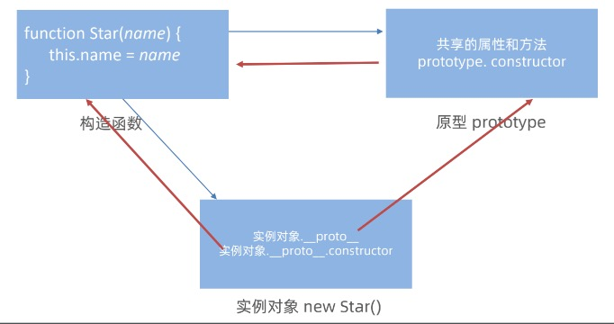
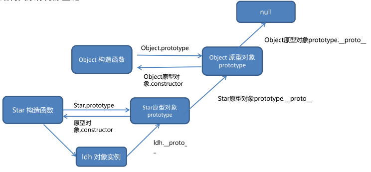

# 基础

### 1. JavaScript是什么

JavaScript是运行在客户端（浏览器）的变成语言。

### 2. JavaScript组成

JavaScript由ECMAscript、DOM、BOM组成，其中ECMAscript是基础语法

# DOM获取和属性操作

### 1. Dom是什么

Dom(Document Object Model)，即文档对象模型。

### 2. 获取Dom对象

```js
// 获取第一个元素
const ul = document.querySelector(".nav")
// 获取元素集合，返回的是伪数组，有长度和索引但没有push等方法
const lis = document.querySelectorAll(".nav li")

// 不常用，最早获取Dom对象的方法，已经被抛弃使用
// 根据id获取
const id1 = document.getElementById("id1")
// 通过标签获取
const divs = document.getElementsByTagName("div")
// 通过类名获取
const cls = document.getElementsByClassName("w")
```

### 3. 操作Dom对象内容

```js
const box = document.querySelector(".box")
box.innerText = "我还好"
box.innerHTML = "<strong>我真还好</strong>"
```

### 4. 操作Dom对象属性

**操作常用属性**

```js
// 常用属性有src、href、title等
const random = Math.floor(Math.random() * 7)
const img = document.querySelector("img")
img.src = `./images/${random}.webp`
```

**操作样式属性**

- 通过style方式修改（生成的是行内，权重较高）

```js
document.body.style.backgroundImage = `url("./images/desktop_${random}.jpg")`
```

- 通过className修改

```js
const div = document.querySelector("div")
div.className = "box"
```

- 通过classList修改

```js
// 添加类
div.classList.add("border")
// 移除类
div.classList.remove("border")
// 替换类
div.classList.toggle("border")
```

### 5. 操作表单元素属性

```html
<body>
    <input type="text" value="电脑">
    <input class="checkbox" type="checkbox" name="" id="">
    <button>点击</button>
    <script>
        const input = document.querySelector("input")
        // 获取值
        console.log(input.value)
        // 设置表单的值
        input.value = 'js设置的值'
        // 还可以设置type的值
        input.type = 'password'

        const checkbox = document.querySelector(".checkbox")
        // 设置选中状态
        checkbox.checked = true

        const button = document.querySelector("button")
        // 设置disabled
        button.disabled = true
    </script>
</body>
```

### 6. 自定义属性

自定义属性是H5推出的的，格式为`data-自定义属性`，在标签上一律以`data-`开头，并通过`dataset`方式获取。

```html
<body>
    <input type="checkbox" data-value="1" name="robby" id="">抽烟
    <input type="checkbox" data-value="2" name="robby" id="">喝酒
    <input type="checkbox" data-value="3" name="robby" id="">烫头
    <script>
        const first = document.querySelector("input")
        console.log(first.dataset.value)
    </script>
</body>
```

# Dom事件

### 1. 事件监听

**什么是事件监听**

就是让程序监听是否有事件发生，一旦有事件发生则调用一个函数响应。比如鼠标经过显示下拉菜单，鼠标经过轮播图的点显示不同的图。

**事件级别**

- L0级别，老版本的on事件

```js
btn.onclick = function() {
    alert("点击效果")
}
```

- L2级别，新版的querySelector等

```js
btn.addEventListener('click', fn)
```

**事件级别的区别**

- L0同一对象的注册事件后面的会覆盖前面的，L2不会。

- 

**事件监听三要素**

- 事件源

- 事件类型

- 事件调用的函数

```javascript
// 事件源.addEventListener('事件类型', 事件调用的函数)
// 选择元素
const btn = document.querySelector("button")
btn.addEventListener('click', function() {
    alert("您点击了这个按钮")
})
```

**点击事件**

```javascript
<body>
    <div class="banner">
        广告位
        <button>X</button>
    </div>
    <script>
        const btn = document.querySelector(".banner button")
        btn.addEventListener('click', function() {
            const banner = document.querySelector(".banner")
            banner.classList.add("hidden")
        })
    </script>
</body>
```

**解绑事件**

```js
// L0事件解绑
btn.onclick = function() {
    alert("点击效果")
    // 执行一次后阻止事件
    btn.onclick = null
}

// L2事件解绑，匿名函数无法被解绑，需要定义函数
const fn = function(){
    alert("点击效果")
    btn.removeEventListener('click', fn)
}
btn.addEventListener('click', fn)
```

### 2. 事件类型

**鼠标事件**

- click：鼠标点击

- mouseenter：鼠标经过，无冒泡

- mouseleave：鼠标离开

- mouseover：鼠标经过，会有冒泡

- mousemove：鼠标移动

**焦点事件**

- focus：获取焦点

- blur：失去焦点

```js
const search = document.querySelector(".search")
const resultList = document.querySelector(".result-list")
search.addEventListener('focus', function() {
    resultList.classList.remove("hidden")
})
search.addEventListener('blur', function() {
    resultList.classList.add("hidden")
})
```

css也有对应的伪类选择器

```css
input {
    width: 200px;
    transition: all .3s;
}
/* 伪类选择器可以替换focus事件 */
input:focus {
    width: 300px;
}
```

**键盘事件**

- keydown：键盘按下

- keyup：键盘抬起

```js
input.addEventListener('keydown', function () {
  console.log('键盘按下了')
})
input.addEventListener('keyup', function () {
  console.log('键盘谈起了')
})
```

**文本事件**

- input：用户输入事件
- change：内容发生变化

```html
<body>
    <div class="comment">
        <input type="text" placeholder="请您友善发言">
        <button>发布</button>
    </div>
    <div class="stat"><span>0</span>/50字</div>
    <script>
        const input = document.querySelector(".comment input")
        const span = document.querySelector(".stat span")
        input.addEventListener('input', function(){
            span.innerHTML = input.value.length
        })
    </script>
</body>
```

```html
<body>
    <!-- <input type="text"> -->
    <input type="checkbox">
    <script>
        const input = document.querySelector('input')
        input.addEventListener('change', function(){
            console.log('111')
        })
    </script>
</body>
```

**页面加载事件**

页面加载事件主要是为了让页面加载完之后再调用，有些老代码讲js写到页面上方。

- load：等待所有元素加载完成后执行

- DOMContentLoaded：等待Dom节点加载完后执行

```html
<head>
    <meta charset="UTF-8">
    <meta name="viewport" content="width=device-width, initial-scale=1.0">
    <title>Document</title>
    <script>
        // window是外层的，等待所有资源加载完成
        window.addEventListener('load', function(){
            const btn = document.querySelector('button')
            btn.addEventListener('click', function(){
                alert("clicked")
            })
        })
        // 也可以等待具体的某个资源加载完成
        //const img = document.querySelector('img')
        //img.addEventListener('load', function(){
        //
        //})
    </script>
</head>
<body>
    <button>点击</button>
</body>
```

```html
<head>
    <meta charset="UTF-8">
    <meta name="viewport" content="width=device-width, initial-scale=1.0">
    <title>等待页面节点加载完成</title>
    <script>
        document.addEventListener('DOMContentLoaded', function(){
            const btn = document.querySelector('button')
            btn.addEventListener('click', function(){
                alert("clicked")
            })
        })
    </script>
</head>
<body>
    <button>点击</button>
</body>
```

**元素滚动事件**

- scroll：元素或window滚动

```js
// 整个窗口滚动
// window.addEventListener('scroll', function(){
//     console.log("我滚了");
// })
// 某个元素滚动
// const div = document.querySelector('div')
// div.addEventListener('scroll', function(){
//     console.log('div 滚了')
// })
// scrollTop和scrollLeft是元素的滚动卷的距离
// 某个元素的scrollTop
// const div = document.querySelector('div')
// div.addEventListener('scroll', function(){
//     console.log(div.scrollTop);
// })
// 整个窗口的scrollTop
window.addEventListener('scroll', function(){
    console.log(document.documentElement.scrollTop)
})
```

**页面尺寸事件**

- resize：当屏幕尺寸发生变化的时候

```js
window.addEventListener('resize', function(){
    console.log("屏幕尺寸发生了变化");
})
```

**M端事件**

- touchstart：手指触摸到DOM时触发

- touchmove：手指在DOM上滑动时触发

- touchend：手指在DOM上离开时触发

```js

```

### 3. 事件对象

事件对象是存事件的相关信息的对象，比如说鼠标点击事件，事件对象存了鼠标点击的位置等等。

**如何获取事件对象**

在事件绑定的回调函数的第一个参数就是事件对象

```js
// 对象.addEventListener('input', function(e) {...})
```

**示例**

```js
// 按下回车键提交
tx.addEventListener('keyup', function(e) {
    if (e.key === 'Enter') {
        list.classList.remove('hidden')
        text.innerHTML = tx.value
        tx.value = ''
    }
})
```

### 4. 环境对象

每个函数里面都有this 环境对象  普通函数里面this指向的是window

```js
function fn() {
    console.log(this)
}
window.fn()

const btn = document.querySelector("button")
btn.addEventListener('click', function(){
    this.style.color = 'red'
})
```

### 5. 回调函数

把函数当做另外一个函数的参数传递，这个函数就叫回调函数

```js
// 按下回车提交
tx.addEventListener('keyup', function(e) {
    if (e.key === 'Enter') {
        // 判断是否输入内容
        let val = tx.value
        if (val.trim()) {
            list.classList.remove('hidden')
            text.innerHTML = val
        }
        tx.value = ''
        total.innerHTML = '0/200字'
    }
})
```

### 6. 事件流

事件流是事件完成执行过程的流动过程（路径），事件流包括事件捕获和事件冒泡两个过程，其中事件捕获是从外到里，事件冒泡是从里到外，是事件捕获的逆过程。

**事件捕获（少用）**

```html
<body>
    <div class="father">
        <div class="son"></div>
    </div>
    <script>
        const fa = document.querySelector(".father")
        const son = document.querySelector(".son")
        document.addEventListener('click', function(){
            alert("我是爷爷")
        }, true)
        fa.addEventListener('click', function(){
            alert("我是father")
        }, true)
        son.addEventListener('click', function(){
            alert("我是son")
        }, true)
    </script>
</body>
<!-- 通过加上true参数就是事件冒泡 -->
<!-- 依次弹框：我是爷爷、我是father、我是son -->
```

注意：

- 若是用 L0 事件（`btn.onclick`等）监听，则只有冒泡阶段，没有捕获。

**事件冒泡（常见）**

当一个元素事件被触发时，同样的事件会在元素的所有祖先元素一次被触发（祖先元素得有这个同名事件），被称为事件冒泡，冒泡是默认存在的。

```html
<body>
    <div class="father">
        <div class="son"></div>
    </div>
    <script>
        const fa = document.querySelector(".father")
        const son = document.querySelector(".son")
        document.addEventListener('click', function(){
            alert("我是爷爷")
        })
        fa.addEventListener('click', function(){
            alert("我是father")
        })
        son.addEventListener('click', function(){
            alert("我是son")
        })
    </script>
</body>
<!-- 依次弹框：我是son、我是father、我是爷爷 -->
```

**阻止冒泡**

开发中，有不要事件冒泡，可以进行阻止冒泡。

```js
son.addEventListener('click', function(e){
    alert("我是son")
    // 阻止事件流动，不光可以阻止冒泡，也可以用来阻止捕获
    e.stopPropagation()
})
```

**阻止默认行为**

开发中，一些标签的默认行为需要阻止，比如说input的submit默认提交需要阻止

```html
<body>
    <a href="https://www.baidu.com">百度</a>
    <script>
        const a = document.querySelector("a")
        a.addEventListener('click', function(e) {
            // 阻止默认的跳转行为
            e.preventDefault()
        })
    </script>
</body>
```

### 7. 事件委托

事件委托是一种开发技巧，利用了事件流的一些特性。

**解决了什么问题**

给父元素下所有子元素注册事件，可采用事件冒泡原理给父元素注册事件，统一给子元素注册事件，减少注册事件次数。

```html
<body>
    <ul>
        <li>第1个小丽</li>
        <li>第2个小丽</li>
        <li>第3个小丽</li>
        <li>第4个小丽</li>
        <li>第5个小丽</li>
        <p>PP</p>
    </ul>
    <script>
        const ul = document.querySelector('ul')
        ul.addEventListener('click', function(e){
            // console.dir(e.target)
            if (e.target.tagName === 'LI') {
                e.target.style.color = 'red'
            }
        })
    </script>
</body>
```

### 8. 元素尺寸

- clientWidth：获取元素宽（width+padding）

- clientHeight：获取元素高（height+padding）

- offsetWidth：获取元素自身宽（width+padding+border）

- offsetHeight：获取元素自身高（height+padding+border）

- offsetTop：获取元素到定位父元素的垂直距离（从border开始算，不包括border）

- offsetLeft：获取元素到定位父元素的水平距离（从border开始算，不包括border）

- scrollTop：被卷去的头部

- scrollLeft：被卷去的左部

```js
const div = document.querySelector("div")
console.log(div.clientHeight)
console.log(div.offsetHeight)
console.log(div.offsetTop)
```

# 节点操作

### 1. 节点-查

- 查父级：parentNode

- 查子集：children

- 查兄弟：nextElementSibling、previousElementSibling

```js
// 查父级
const bady = document.querySelector('.baby')
console.log(bady.parentNode)
console.log(bady.parentNode.parentNode)
// 查子集，是一个伪数组
console.log(baby.children)
// 查兄弟
const li3 = document.querySelector('li:nth-child(2)')
console.log(li3.nextElementSibling);
console.log(li3.previousElementSibling)
```

### 2. 节点-增

- 创建新节点：document.createElement(标签名称)

- 追加节点
  
  - 追加到最后：parent.appendChild(child)
  
  - 追加到前面：parent.insert(child, refChild)，如果refChild不存在则默认使用appendChild的方式追加
  
  - 追加已存在的节点则是移动节点

```js
// 追加新创建的节点
const ul = document.querySelector('ul')
const newLi = document.createElement('li')
newLi.innerHTML = '哦豁'
ul.insertBefore(newLi, ul.children[0])
```

### 3. 节点-删

- 删除子节点：parent.removeChild(child)

```js
const ul = document.querySelector('ul')
ul.removeChild(ul.children[0])
```

# BOM操作

### 1. window对象

- window对象是全局对象，也可以说是JavaScript中的顶级对象

- 通过var定义的全局作用域中的变量、函数都会变成window对象的属性和方法

- window对象下的属性和方法调用时都可以省略window

```js
console.log(document === window.document);
// 全局定义的函数会变成window的方法
function fn() {
    console.log(123)
}
window.fn()
// var定义的全局变量会变成window的变量
var num = 10
console.log(window.num)
```

### 2. location对象

location对象主要负责网页的地址栏

- location.href：跳转网页

- location.reload()：刷新页面

- location.search()：搜索?后面的内容

- location.hash：搜索#后面的内容

### 3. navigator对象

navigator对象主要是负责获取浏览器的信息

- navigator.userAgent：获取浏览器的userAgent

### 4. history对象

history对象用来管理历史对象

- history.forward()：向前

- history.back()：向后

- history.go()：向前或向后几步

```html
<body>
    <button>后退</button>
    <button>前进</button>
    <script>
        const back = document.querySelector('button:first-child')
        const forward = back.nextElementSibling
        back.addEventListener('click', function(){
            // history.back()
            history.go(-1)
        })
        forward.addEventListener('click', function(){
            // history.forward()
            history.go(1)
        })

    </script>
</body>
```

# 本地存储

### 1. localStorage

**作用**

可以将数据永久存储在本地(用户的电脑), 除非手动删除，否则关闭页面也会存在

**特性**

- 可以多窗口（页面）共享（同一浏览器可以共享）

- 以键值对的形式存储使用

- 只能存储字符串

**用法**

- localStorage.setItem('键', ’值‘)：设置

- localStorage.getItem('键')：获取

- localStorage.removeItem('键')：移除

```js
// 存
localStorage.setItem('uname', '山辣')
// 取
const uname = localStorage.getItem('uname')
console.log(uname)
// 删
localStorage.removeItem('uname')

// json
const obj = {
    uname: '山辣',
    age: 19
}
localStorage.setItem('info', JSON.stringify(obj))

const info = localStorage.getItem('info')
console.log(JSON.parse(info))
```

### 2. sessionStorage

**特性**

- 生命周期为关闭浏览器窗口

- 在同一个窗口(页面)下数据可以共享

- 以键值对的形式存储使用

- 用法和localStorage类似

# 正则表达式

### 1. 正则表达式的语法

- 书写在//之间的字符叫做正则表达式

- 正则表达式是一个对象类型数据

- test方法用于判断是否符合规则的字符串，返回true或false

- exec方法用于检索负责规则的字符串，返回数组或null

```js
const str = '我学习前端主要是我要做全栈工程师'
// 定义正则表达式
const reg = /前端/
// test返回true or false
console.log(reg.test(str))
// exec返回数组 or null，数组中包含了匹配的结果信息
console.log(reg.exec(str))
```

### 2. 元字符

**量词**

| 量词    | 说明       |
| ----- | -------- |
| *     | 重复0次或多次  |
| +     | 重复1次或多次  |
| ?     | 重复0次或1次  |
| {n}   | 重复n次     |
| {n,}  | 重复n次或更多次 |
| {n,m} | 重复n次到m次  |

```js
// 量词
// * 表示 0次或多次
// /^哈*$/ 表示精确匹配“哈”，可以出现多次或0次
console.log(/^哈*$/.test('哈哈哈')) // true
console.log(/^哈*$/.test('')) // true
console.log(/^哈*$/.test('二哈哈')) // false，因为出现了“二”，不满足

console.log('---------------------------')
// + 表示 1次或多次
console.log(/^哈+$/.test('哈哈哈')) // true
console.log(/^哈+$/.test('')) // false
console.log(/^哈+$/.test('二哈哈')) // false，因为出现了“二”，不满足

console.log('---------------------------')
// ? 表示 0次或1次
console.log(/^哈?$/.test('哈')) // true 出现了1次
console.log(/^哈?$/.test('哈哈')) // false 出现了2次
console.log(/^哈?$/.test('')) // true // 出现0次
console.log(/^哈?$/.test('二哈哈')) // 不是全部是哈

console.log('---------------------------')
// {n} 表示出现n次
console.log(/^哈{4}$/.test('哈')) // false
console.log(/^哈{4}$/.test('哈哈哈哈')) // true

console.log('---------------------------')
// {n,} 表示n次或>n次
console.log(/^哈{4,}$/.test('哈哈哈')) // false
console.log(/^哈{4,}$/.test('哈哈哈哈')) // true
console.log(/^哈{4,}$/.test('哈哈哈哈哈')) // true

console.log('---------------------------')
// {n,m} 表示>=n&&<=m次
console.log(/^哈{4,5}$/.test('哈哈哈')) // false
console.log(/^哈{4,5}$/.test('哈哈哈哈')) // true
console.log(/^哈{4,5}$/.test('哈哈哈哈哈')) // true
```

**字符**

| 字符      | 说明                      |
| ------- | ----------------------- |
| []      | 匹配字符集合，只要包含[]内任意一个字符则成功 |
| [..-..] | []和-结合表示范围匹配            |
| [^...]  | []和^结合表示取反匹配            |
| .       | 匹配除换行符之外的任意单个字符         |

```js
// 字符类
// [abc] 只选一个
console.log(/^[abc]$/.test('a')) // true
console.log(/^[abc]$/.test('ab'))  // false，因为只取一个，且是精准匹配
console.log(/^[abc]{2}$/.test('ab'))  // true，匹配2个

console.log('---------------------------')
// [a-z] 只选1个
console.log(/^[A-Z]$/.test('p'))  // false
console.log(/^[A-Z]$/.test('P'))  // true
console.log(/^[0-9]$/.test('22')) // false
console.log(/^[0-9]{2}$/.test('22'))  // true
```

**边界符**

| 边界符 | 说明                                |
| --- | --------------------------------- |
| ^   | 匹配行首的文本（以谁开头）                     |
| $   | 匹配行尾的文本（以谁结尾）                     |
| \d  | [0-9]                             |
| \D  | [^0-9]                            |
| \w  | [a-zA-Z0-9_]                      |
| \W  | [^a-zA-Z0-9_]                     |
| \s  | 匹配空格（包括换行符、制表符、空格符等），[\t\r\n\v\f] |
| \S  | 匹配非空格，[^\t\r\n\v\f]               |

*如果^和$一起使用表示精准匹配*

```js
// 边界符
console.log(/^哈/.test('哈')) // true
console.log(/^哈/.test('二哈')) // false
console.log(/哈$/.test('二哈')) // true
console.log(/^哈$/.test('哈')) // true，如果^和$同时存在表示精准匹配
console.log(/^哈$/.test('哈哈')) // false
console.log(/^哈$/.test('二哈')) // false
```

**修饰符**

| 修饰符 | 说明             |
| --- | -------------- |
| i   | 正则匹配时字母不区分大小写  |
| g   | 匹配所有满足正则表达式的结果 |

```js
console.log(/^java$/.test('java')) // true
console.log(/^java$/i.test('JAVA')) // true
console.log(/^java$/i.test('Java')) // true

const str = 'java是一门编程语言， 学完JAVA工资很高'
// const re = str.replace(/java|JAVA/g, '前端')
const re = str.replace(/java/ig, '前端')
console.log(re)  // 前端是一门编程语言， 学完前端工资很高
```

# 作用域

作用域规定了变量能够被访问的范围，离开了这个”范围“变量则不能被访问。

### 1. 局部作用域

局部作用域分为函数作用域和块作用域

**函数作用域**

在函数内部声明的变量只能在函数内部被访问，外部无法直接访问

- 函数内部声明的变量在函数外部无法被访问

- 函数的参数也是函数内部的局部变量，修改其值外部不会被修改

- 不同函数内部的声明的变量无法互相访问

- 函数执行完毕后，函数内部的变量实际被清空了

```js
let i = 0
function fn(i) {
    i++
    console.log('----' + i)
}
fn(i)
console.log(i)

// 输出内容
// ----1
// 0
```

**块作用域**

使用{}包裹的代码块，代码块内部声明的变量外部有可能无法被访问

- let声明的变量会产生块作用域，var不会产生

- const生命的常量也会产生块作用域

- 不同代码块之间的变量无法相互访问

- 推荐使用let或const

```js
// 块作用域
if (true) {
    let j = 0
    j++
    console.log('----' + j)
}
console.log(j)

// 输出内容
// ----1
// 报错：Uncaught ReferenceError: j is not defined
```

### 2. 全局作用域

script和js文件的最外层就是全局作用域，在此声明的变量在函数内部也可以被访问，全局作用域中声明的变量，任何其他作用域都可以被访问。

- 为window对象动态添加的属性默认也是全局的，不推荐！

- 函数中未使用任何关键字声明的变量也是全局的，不推荐！

- 尽可能少的声明全局变量，防止全局变量污染。

```js
let i = 1
let j = 2
function f() {
    let a = 1
    function g() {
        a = 2
        console.log(a)
    }
    g()
}

f()

// 输入内容
// 2
```

### 3. 作用域链

作用域链本事上是底层的变量查找机制

- 当函数执行时，会有限查找当前函数作用域中查找变量

- 如果当前作用域查找不到会依次查找父级作用域知道全局作用域

- 子作用域能够访问父作用域，父级作用域无法访问子集作用域

### 4. 垃圾回收机制

**什么是垃圾回收机制**

js中内存的分配和回收都是自动完成的，内存在不使用的时候会被垃圾回收器自动回收。但依然会存在内存泄露的情况。

**内存的声明周期**

- 分配内存：声明变量、函数、对象时，系统会自动分配内存

- 内存使用：使用变量、函数时

- 内存回收：使用完毕后，自动回收不再使用的内存

**回收注意点**

- 全部变量一般不会回收（关闭页面回收）

- 一般情况局部变量的值，不用了会被自动回收

**垃圾回收算法**

- 引用计数法：被引用一次++，检查引用--，引用次数0回收，IE采用引用计数。会存在嵌套引用导致内存泄露。

- 标记清除法：从根部扫描对象，能查找到就是在使用的，查找不到就回收，大多数浏览器使用。

### 5. 闭包

**闭包的理解**

内层函数+外层函数的变量（缺一不可），主要用来外层函数使用内部函数的变量

```js
// 基础格式
function outer() {
    // 外部函数的变量
    const a = 1
    // 内部函数
    function f() {
        // 且使用了外部函数的变量
        console.log(a)
    }
    f()
}
outer()

// 通用格式
function outer() {
    let i = 1
    return function() {
        console.log(i)
    }
}
const fun = outer()
fun()
```

**闭包的应用**

- 实现数据的私有

```js
// 实现计数，但count是全局变量，容易被修改
// let count = 1
// function fn() {
//     count++
//     console.log(`函数被调用${count}次`)
// }
// fn()
// fn()

// 实现计数，但count属于局部变量，不用担心被修改
function fn() {
    let count = 1
    function add() {
        count++
        console.log(`函数被调用${count}次`)
    }
    return add
}

const func = fn()
func()
func()
```

### 6. 变量提升

变量提升是 JavaScript 中比较“奇怪”的现象，它允许在变量声明之前即被访问（仅存在于var声明变量）

```js
// 先访问str
console.log(str + ' world！')
// 再声明str（var）
// let str = 'hello' // 代码会报错
var str = 'hello' // 代码不会报错，但输出是：undefined world！
```

# 函数

### 1. 函数提升

和变量提升类似，在函数声明之前使用的情况

```js
// 正确
foo()
function foo() {
    console.log('函数在定义之前使用')
}
// 错误：Uncaught TypeError: foo1 is not a function
foo1()
var foo1 = function() {
    console.log('函数在定义之前使用')
}
```

### 2. 函数参数

**动态参数**

当不确定参数个数时，通过动态参数来实现。

```js
function sum() {
    let s = 0
    for (let i=0;i<arguments.length; i++) {
        s += arguments[i]
    }
    return s
}

console.log(sum(1, 2, 3, 4, 5, 6))
```

**剩余参数**

... 是语法符号，置于最末函数形参之前，用于获取多余的实参

```js
function config(baseURL, ...other) {
    console.log(baseURL)
    // other 是一个真数组
    console.log(other)
}
config('http://baidu.com', 'get', 'json')
```

### 3. 展开运算符

用来将数组进行展开

```js
const arr = [1, 2, 3, 4, 5, 6]
console.log(Math.max(...arr))
console.log(Math.min(...arr))
```

### 4. 箭头函数

**箭头函数用来干啥的**

引入箭头函数的目的是更简短的函数写法并且不绑定this，箭头函数的语法比函数表达式更简洁，用于那些本来需要匿名函数的地方，用来替代函数表达式。

```js
// 普通的匿名函数
// const fn = function() {
//     console.log(123)
// }

// 1. 改造成箭头函数
// const fn = () => {
//     console.log(123)
// }
// fn()

// 2. 如果只有一个形参可以省略小括号
// const fn = function(x) {
//     console.log(x)
// }
// const fn = x => {
//     console.log(x)
// }
// fn(2)

// 3. 如果只有一行代码可以省略大括号
// const fn = x => console.log(x)
// fn(2)

// 4. 只有一行代码且有return也可以省略return
// const fn = x => x + x
// console.log(fn(2))

// 5. 箭头函数可以直接返回一个对象
const fn = x => ({name: x})
console.log(fn(2)) // 返回：{name: 2}
```

**箭头函数的参数**

- 普通函数有arguments动态参数

- 箭头函数没有arguments动态参数，但有剩余参数...args

```js
const getSum = (...args) => {
    let sum = 0
    for (let i=0; i<args.length; i++) {
        sum += args[i]
    }
    return sum
}

console.log(getSum(1, 2, 3, 4, 5, 6))
```

**箭头函数的this**

箭头函数本身没有this，是上一层作用域的this指向

```js
// 普通的this指向：谁调用this就指向谁
console.log(this) // window

function fn() {
    console.log(this) // window
}
window.fn()

const obj = {
    name: 'andy',
    sayHi: function() {
        console.log(this) // obj
    }
}
obj.sayHi()

// 箭头函数的this指向：上一层作用域的this执行
const fn1 = () => {
    console.log(this) // window，fn1上一层的就是script=》window
}
fn1()

const obj1 = {
    name: 'timi',
    sayHi: () => {
        console.log(this) // window，sayHi的上一层是script=》window
    }
}
obj1.sayHi()

const obj2 = {
    name: 'happy',
    sayHi: function() {
        console.log(this) // obj2，普通的
        const count = () => {
            console.log(this) // obj2，count上一层作用域是sayHi，而sayHi属于obj2
        }
    }
}
obj2.sayHi()
```

### 5. 数组解构

数组解构是将数组的元素快速批量复制给一系列变量的简洁语法。

```js
// 基础语法
const [max, min, avg] = [100, 60, 80]
console.log(max)
console.log(avg)

// 交换
let a = 1
let b = 2; // 这里的分号必须写，因为[a, b]会被编译器认为和上一行内容连接
[a, b] = [b, a]
console.log(a)
console.log(b)
```

**特殊情况**

```js
// 特殊情况
// 1. 变量多，单元值少 undefined
const [a, b, c, d] = [1, 2, 3]
console.log('a=' + a + '，b=' + b + '，c=' + c + '，d=' + d) // 输出：a=1，b=2，c=3，d=undefined
// 2. 变量少，单元值多
const [e, f] = [1, 2, 3]
console.log('e=' + e + '，f=' + f)
// 3. 剩余参数 变量少，单元值多
const [g, h, ...i] = [1, 2, 3, 4]
console.log('g=' + g + '，h=' + h + '，' + 'i=' + i) // 输出：g=1，h=2，i=3,4
// 4. 默认值
const [j = 0, k = 0] = [1]
console.log('j=' + j + '，k=' + k) // 输出：j=1，k=0
// 5. 忽略单元值
const [l, m, ,n] = [1, 2, 3, 4]
console.log('l=' + l + '，m=' + m + '，n=' + n) // l=1，m=2，n=4
// 6. 多维数组解构
const [o, p, [q, r]] = [1, 2, [3, 4]]
console.log('o=' + o + '，p=' + p + '，q=' + q + '，r=' + r) // o=1，p=2，q=3，r=4
```

### 6. 对象解构

对象解构时即将对象属性和方法快速批量复制给一系列变量的简洁语法。

```js
// 对象解构
// const obj = {
//     name: 'hello world',
//     age: 19
// }
// const {name, age} = obj
// console.log(name) // hello world
// console.log(age) // 19

// 对象解析的变量名可以重新改名
// const {uname: username, age} = {uname: 'hel', age: 19}
// console.log(uname) // uname is not defined
// console.log(username) // hel
// console.log(age) // 19

// 解构数组对象
// const pig = [
//     {
//         uname: '佩奇',
//         age: 6
//     },
//     {
//         uname: '保罗',
//         age: 3
//     }
// ]
// const [{uname, age}] = pig
// console.log(uname) // 佩奇
// console.log(age) // 6

// const pig = {
// name: '佩奇',
// family: {
//     mother: '猪妈妈',
//     father: '猪爸爸',
//     sister: '乔治'
// },
// age: 6
// }
// // 多级对象解构
// const { name, family: { mother, father, sister } } = pig
// console.log(name)
// console.log(mother)
// console.log(father)
// console.log(sister)

const person = [
    {
        name: '佩奇',
        family: {
            mother: '猪妈妈',
            father: '猪爸爸',
            sister: '乔治'
        },
        age: 6
    }
]
const [{ name, family: { mother, father, sister } }] = person
console.log(name)
console.log(mother)
console.log(father)
console.log(sister)
```

### 7. 遍历数组-forEach

```js
const arr = ['red', 'green', 'pink']
const result = arr.forEach(function(item, index) {
    console.log(item)
    console.log(index)
})
```

### 8. 筛选数组-filter

```js
// const arr = [10, 20, 30]
// const newArr = arr.filter(function(item, index) {
//     console.log(item)
//     console.log(index)
//     return item >= 20
// })
// console.log(newArr) // 会过滤掉小于20的数字

const arr = [10, 20, 30]
// 箭头函数替代
const newArr = arr.filter(item => item >= 20)
console.log(newArr);
```

# 对象

**创建对象方法**

- 通过字面量方式创建

- 通过`new Object`创建

- 通过构造函数创建

```js
// 1. 字面量创建对象
// const obj = {
//     name: 'hello'
// }
// console.log(obj)

// 2. 通过Object创建对象
// const obj = new Object()
// obj.uname = 'hello'
// console.log(obj);

// const obj = new Object({uname:'hello'})
// console.log(obj);

// 3. 通过构造函数创建对象
function Pig(uname, age) {
    this.uname = uname
    this.age = age
}

const p = new Pig('佩奇', 6)
console.log(p);

function Goods(name, price, count) {
    this.name = name
    this.price = price
    this.count = count
    this.desc = function () {
        console.log(name + '欢迎您')
    }
}

const mi = new Goods('小米', 1999, 20)
console.log(mi)
mi.desc()
// 实例成员：实例对象的属性和方法即为实例成员
mi.name = 'MI'
console.log(mi)

// 静态成员：构造函数的属性和方法被称为静态成员
Goods.num = 10
console.log(Goods.num)
Goods.sayhi = function () { }
```

# 内置构造函数

### 1. Object

Object是创建普通对象的构造函数，但我们推荐使用字面量方式声明对象，而不是Object构造函数。

**静态方法**

- Object.keys：获取对象中所有属性（键）

- Object.Values：获取对象中所有属性值

- Object.assign：进行对象拷贝

```js
const o = {uname: 'pink', age: 10}
// 获取key的集合
console.log(Object.keys(o))
// 获取value的集合
console.log(Object.values(o))
const oo = {}
// 对象的拷贝
Object.assign(oo, o)
console.log(oo)
Object.assign(o, { gender: '女' })
console.log(o)
```

### 2. Array

Array是用于创建数组的构造函数

**方法**

- forEach：遍历数组

- filter：过滤数组

- map：迭代数组，返回新数组

- reduce：累计器，返回函数累计处理的结果，经常用于求和等。

- join：数组元素拼接成字符串，并返回字符串。

- find：查找元素，返回符合测试条件的第一个数组元素值

- every：检查数组所有元素是否符合指定条件，如果所有元素都通过返回true

- some：检测数组中的元素是否满足指定条件，如果任一元素满足返回true

- concat：合并两个数组，返回生成的新数组

- sort：对原数组单元值进行排序

- splice：删除或替换原数组单元值

- reverse：反转数组

- findIndex：查找元素的索引值

```js
const arr = [1, 2, 3]
// const re = arr.reduce(function(prev, item){
//     return prev + item
// }, 0)
// console.log(re);

// const re = arr.reduce(function(prev, item) {
//     return prev + item
// })
// console.log(re);

const re = arr.reduce((prev, item) => prev + item)
console.log(re);

// find一维数组
const arr = ['red', 'blue', 'green']
const re = arr.find(function(item){
    return item === 'blue'
})
console.log(re) // blue
// find二维数组
const arrs = [
    {
        name: '小米',
        price: 1999
    },
    {
        name: '华为',
        price: 2999
    }
]
const mi = arrs.find(item => item.name === '小米')
console.log(mi) // {name: '小米', price: 1999}

//findIndex一维数组
const reIdx = arr.findIndex(function(item) {
    return item === 'blue'
})
console.log(reIdx) // 1
// findIndex二维数组
const miIdx = arrs.findIndex(function(item) {
    return item.name === '小米'
})
console.log(reIdx) // 1

// every：否符合返回true
const flag = arr.every(item => item >= 20)
console.log(flag)
```

**伪数组转换成真数组**

- Array.from：将伪数组转换成真数组

```js
const lis = document.querySelectorAll('ul li')
// lis.pop() // 报错
// 转换成真数组
const liArr = Array.from(lis)
liArr.pop()
console.log(liArr)
```

### 3. String

**常见实例方法**

- length：获取字符串长度

- split：字符串拆分成数组

- substring：字符串截取

- startsWith：检测是否以某字符开头

- includes：判断一个字符串是否包含在另一个字符串中，包含返回true

- toUpperCase：将字母转换成大写

- toLowerCase：将字母转换成小写

- indexOf：检查是否包含某字符

- endsWith：检测是否以某字符结尾

- replace：用于替换字符串，支持正则匹配

- match：用于查找字符串，支持正则匹配

```js
const str = 'red,yellow,green'
const arr = str.split(',')
console.log(arr) // (3) ['red', 'yellow', 'green']

const str1 = '今天要出门玩'
console.log(str1.substring(5, 7)) // 玩

const str2 = 'hello world'
console.log(str2.startsWith('hell')) // true

const gift = '50g的茶叶,清洗球'
const html = gift.split(',').map(function(item) {
    return `<span>【赠品】${item}</span><br>`
}).join('')
document.querySelector('div').innerHTML = html
```

### 4. Number

**常用方法**

- toFixed：设置保留小数位的长度

```js
const price = 12.345
console.log(price.toFixed(2)) // 12.34
```

# 面向对象

### 1. 原型对象

将方法定义到构造函数内，实例化出来的对象会浪费内存（相同的方法被被多次生成导致内存浪费），原型对象可以实现属性和方法的共享，避免这样的内存浪费。

**特点**

- 构造函数通过原型分配的函数是所有对象共享的

- 每一个构造函数都有一个prototype属性，指向另一个对象，也被称为原型对象

- 这个对象可以挂载函数，对象实例化多次不会多次创建原型上的函数，节约内存

- 可以把那些不变的方法指定一定到prototype对象上，通过这样所有对象的实例化就可以共享这些方法

- 构造函数、原型对象中的this都指向实例化的对象

```js
// function Star(uname, age) {
//     this.uname = uname
//     this.age = age
//     this.sing = function() {
//         console.log('唱歌')
//     }
// }
// const ldh = new Star('刘德华', 55)
// const zxy = new Star('张学友', 58)
// // 一样的方法会导致内存浪费问题
// console.log(ldh.sing === zxy.sing) // false


function Star(uname, age) {
    this.uname = uname
    this.age = age
}
// 通过原型
Star.prototype.sing = function() {
    console.log('唱歌')
}
const ldh = new Star('刘德华', 55)
const zxy = new Star('张学友', 58)
console.log(ldh.sing === zxy.sing) // true
```

### 2. 数组拓展方法

```js
const arr = [1, 2, 3]

// 1. 最大值
Array.prototype.max = function() {
    return Math.max(...this)
}

// 2. 最小值
Array.prototype.min = function() {
    return Math.min(...this)
}

// 3. 求和方法
Array.prototype.sum = function() {
    return this.reduce((prev, item) => prev + item, 0)
}

console.log(arr.max())
console.log(arr.min())
console.log(arr.sum())
```

### 3. constructor属性

constructor是prototype的属性，用来指向该原型对象的构造函数，原型对象用来指回构造函数（用来说明原型对象属于谁的）。

**使用场景**

如果有多个对象的方法，我们可以给原型对象采取对象形式赋值.但是这样就会覆盖构造函数原型对象原来的内容，这样修改后的原型对象 constructor 就不再指向当前构造函数了，此时，我们可以在修改后的原型对象中，添加一个 constructor 指向原来的构造函数。

```js
function Star() {

}

// Star.prototype.sing = function() {
//     console.log('唱歌')
// }
// Star.prototype.dance = function() {
//     console.log('跳舞')
// }
// console.log(Star.prototype.constructor) // Star()

Star.prototype = {
    constructor: Star, // 如果原型对象通过对象形式定义方法时，不添加constructor属性就没办法知道原型对象属于哪个构造函数了
    sing: function() {
        console.log('唱歌')
    },
    dance: function() {
        console.log('跳舞')
    }
}
console.log(Star.prototype.constructor) // Star()
console.log(Star.prototype.constructor === Star) // true
```

### 4. 对象原型

实例对象都会有一个属性_proto_，指向构造函数的prototype原型对象。之所以对象可以使用构造函数prototype原型对象的属性和方法，就是因为对象有__proto__原型的存在。

**注意**

- __proto__是JS非标准属性

- [[prototype]]和__proto__意义相同

- 用来表明当前实例对象指向哪个原型对象prototype

- __proto__对象原型里有一个contructor属性，指向创建该实例对象的构造函数。

```js
function Star() {

}
const ldh = new Star()
console.log(ldh.__proto__) // 指向构造函数的原型对象 {constructor: ƒ}
console.log(ldh.__proto__ === Star.prototype) // true，指向了原型对象
console.log(ldh.__proto__.constructor === Star) // 对象原型里面有constructor 指向 构造函数 Star
```

**关系图**



### 5. 继承

```js
// 构造函数 Person
function Person() {
    this.eyes = 2
    this.head = 1
}

// 构造函数 Woman
function Woman() {

}

// 构造函数 Man
function Man() {

}

// 去继承父类，new Person()新创建一个对象，结构一样，对象不一样，不然其他继承的函数添加或修改了会影响
Woman.prototype = new Person()
// 并指回原来的构造函数Woman
Woman.prototype.constructor = Woman

Man.prototype = new Person()
Man.prototype.constructor = Man

// 给Woman再添加一个方法
Woman.prototype.baby = function() {
    console.log('baby')
}

const red = new Woman()
console.log(red)
const ming = new Man()
console.log(ming)
```

### 6. 原型链

基于原型对象的继承使得不同构造函数的原型对象关联在一起，并且这种关联的关系是一种链状的结构，我们将原型对象的链状结构关系称为原型链。



**原型链-查找规则**

1. 当访问一个对象的属性（包括方法）时，首先查找这个对象自身有没有该属性。

2. 如果没有就查找它的原型（也就是 __proto__指向的 prototype 原型对象）

3. 如果还没有就查找原型对象的原型（Object的原型对象）

4. 依此类推一直找到 Object 为止（null）

5. __proto__对象原型的意义就在于为对象成员查找机制提供一个方向，或者说一条路线

6. 可以使用 instanceof 运算符用于检测构造函数的 prototype 属性是否出现在某个实例对象的原型链上

# 内置函数

### 1. 间歇函数-定时器

```javascript
function fn() {
    console.log('一秒执行一次')
}
// 开启定时器，setInterval(函数, 间隔时间)，时间是毫秒
let n = setInterval(fn, 1000)
console.log(n)
// 关闭定时器
clearInterval(n)
```

**用户注册协议案例**

```html
<body>
    <textarea name="" id="" cols="30" rows="10">
        用户注册协议
        欢迎注册成为京东用户！在您注册过程中，您需要完成我们的注册流程并通过点击同意的形式在线签署以下协议，请您务必仔细阅读、充分理解协议中的条款内容后再点击同意（尤其是以粗体或下划线标识的条款，因为这些条款可能会明确您应履行的义务或对您的权利有所限制）。
        【请您注意】如果您不同意以下协议全部或任何条款约定，请您停止注册。您停止注册后将仅可以浏览我们的商品信息但无法享受我们的产品或服务。如您按照注册流程提示填写信息，阅读并点击同意上述协议且完成全部注册流程后，即表示您已充分阅读、理解并接受协议的全部内容，并表明您同意我们可以依据协议内容来处理您的个人信息，并同意我们将您的订单信息共享给为完成此订单所必须的第三方合作方（详情查看
    </textarea>
    <br>
    <button disabled>我已经阅读用户协议(5)</button>
    <script>
        // 获取button元素
        const button = document.querySelector("button")
        // 定时器
        let i = 5
        let n = setInterval(function() {
            i--
            button.innerHTML = `我已经阅读用户协议(${i})`
            if (i === 0) {
                // 关闭定时器
                clearInterval(n)
                // 设置
                button.disabled = false
                button.innerHTML = "同意"
            }
        }, 1000)
    </script>
</body>
```

### 2. 时间对象

**获取时间对象**

```js
// 当前时间
const date = new Date()
// 指定时间
const date1 = new Date('2022-5-1 08:30:00')
```

**时间对象方法**

```js
const date = new Date()
// 获取年份
const year = date.getFullYear()
// 获取月份，需要加1
const month = date.getMonth() + 1
// 获取天
const day = date.getDate()
// 获取星期几
const week = date.getDay()
// 获取时
const hour = date.getHours()
// 获取分
const minu = date.getMiuntes()
// 获取秒
const seco = date.getSeconds()
// 获取时间戳
let ts = date.getTime() // 第一种方法
let ts = +new Date() // 第二种方法
let ts = Date.now() // 第三种方法
let ts = +new Date('2023-08-08 11:12:13') // 获取具体时间的时间戳
// 获取当前时间格式 2023/08/08 11:12:13
const str = date.toLocaleString()
```

### 3. 延时函数-延时器

- 延时器需要等待，所以后面的代码会先执行

- 没调用延时器都会产生一个新的延时器

```js
// 设置延时器
// let timerId = setTimeout(回调函数, 延迟时间)

// 清除延时
// clearTimeout(timerId)
// 自动关闭广告位
setTimeout(function(){
    const banner = document.querySelector('.banner')
    banner.style.display = 'none'
}, 5000)
```

```js
console.log(1)
console.log(2)
setTimeout(function(){
    console.log(3)
}, 0)
console.log(4)
// 输出 1 2 4 3
```
