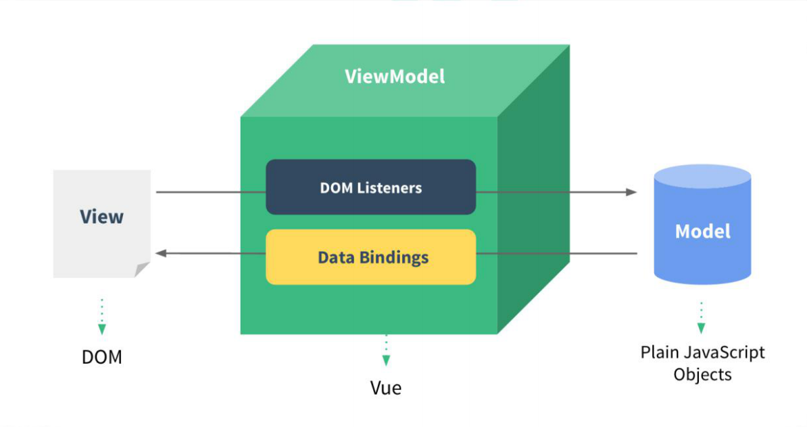

# MVVM模型

MVVM模型类似MVC模型，但不尽相同。M代表Model模型，V代表View视图，VM代表ViewModel也就是VUE实例，通过VM连同DOM页面和数据之间的互通。



# 数据代理

### JS中的数据代理

js中的数据代理是通过一个对象来操作另一个对象的属性，包括读和写，通过`Object.defineProperty`函数来实现。

```js
let obj = {
    x: 100
}
let obj2 = {
    y: 200
}

// 通过obj2代理obj
Object.defineProperty(obj2, 'x', {
    get() {
        return obj.x
    },
    set(value) {
        obj.x = value
    }
})
```

上面代码通过`obj2`代理`obj`，给obj2定义一个属性`x`，当读取`obj2`的`x`属性时调用`get()`函数直接返回`obj`的`x`。当设置`obj2`的`x`属性时，调用`set`来设置`obj`的`x`，这就是简单的数据代理。

### VUE中的数据代理

VUE的数据代理是通过VUE实例来代理data对象中的属性，包括读和写。

其原理底层依然还是通过`Object.defineProperty`来实现的，通过`Object.defineProperty()`把data对象中所有属性添加到vm上，为每一个添加到vm上的属性，都指定一个`getter`/`setter`，再`getter`/`setter`内部去操作（读/写）data中对应的属性。

```html
<body>
    <div id="root">
        <h2>姓名：{{name}}</h2>
        <h2>班级：{{class1}}</h2>
    </div>
    <script>
        const vm = new Vue({
            el: '#root',
            data: {
                name: '周杰伦',
                class1: '三年二班'
            }
        })
    </script>
</body>
```


