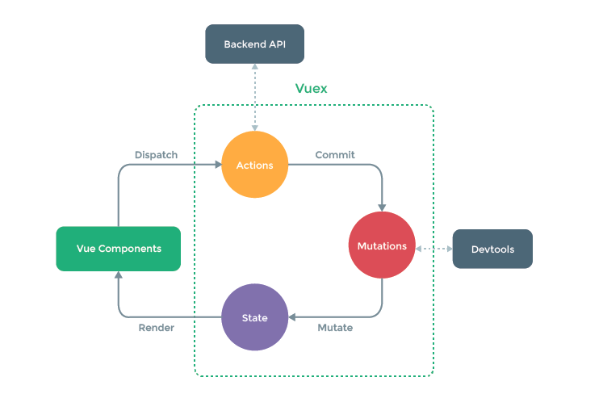

# Vuex概念

在Vue中实现集中式状态（数据）管理的插件，对Vue应用中多个组件的共享状态（数据）进行集中式的管理（读/写），也是一种组件间通信的方式，且适用于任意组件间通信。

# 使用场景

对于简单的应用且没有过多的共享数据管理，这样是没有必要使用vuex，反倒复杂了。但如果牵涉到很多的共享数据，此时就需要使用vuex来进行管理，从而达到事半功倍的效果。

# Vuex原理



- Vue Components：Vue组件

- Actions：用于Mutations之前对数据进行逻辑判断，如果不需要进行逻辑判断，可以组件中直接调用commit。

- Mutations：对State进行操作

- State：状态/数据

- Backend API：在Actions中处理逻辑判断时，数据不会单一从组件中传入，有可能会依赖别的地方的数据，可以在Actions中去获取其他Backend API的数据。

- Devtools：Vuex/Vuex工具，通过Mutations操作State会同步开发工具，如果直接操作State，则开发工具不会捕获到State变化。

# 搭建Vuex环境

1. 创建store文件`src/store/index.js`

```js
// 引入Vue
import Vue from 'vue'
// 引入Vuex
import Vuex from 'vuex'
// 使用Vuex插件
Vue.use(Vuex)
```

2. 在`main.js`中创建vm时传入store

```js
...
import store from './store'
...
new Vue({
    el: '#app',
    store:store,
    render(h) {
        return h(App)
    },
    beforeCreate() {
        Vue.prototype = this
    },
})
```

# 使用Vuex

1. 初始化数据，配置`actions`、`mutations`、`state`

```js
...
// state用于存储数据
const state = {
    sum: 0,
}

// actions用于响应组件中的动作
const actions = {
    addOdd(context, value) {
        if (value % 2) {
            context.commit('ADD', value)
        }
    },
    addWait(context, value) {
        setTimeout(() => {
            context.commit('ADD', value)
        }, 500);
    }
}

// mutations用于操作state
const mutations = {
    ADD(state, value) {
        state.sum += value
    },
    REDUCE(state, value) {
        state.sum -= value
    }
}

export default new Vuex.Store({
    state,
    actions,
    mutations,
})
```

2. 在组件中读写vuex中的数据

```html
<template>
  <div>
    <h1>当前求和为：{{$store.state.sum}}</h1>
    <h1>当前求和放大10倍为：{{$store.getters.bigNum}}</h1>
    <select v-model.number="n">
        <option value="1">1</option>
        <option value="2">2</option>
        <option value="3">3</option>
    </select>
    <button @click="increment">+</button>
    <button @click="decrement">-</button>
    <button @click="incrementOdd">奇数+</button>
    <button @click="incrementWait">延迟+</button>
  </div>
</template>
<script>
    export default {
      name: 'CountManage',
      data() {
        return {
          n: 1,
        }
      },
      methods: {
        increment(){
          this.$store.commit('ADD', this.n)
        },
        decrement(){
          this.$store.commit('REDUCE', this.n)
        },
        incrementOdd(){
          this.$store.dispatch('addOdd', this.n)
        },
        incrementWait(){
          this.$store.dispatch('addWait', this.n)
        },
      }
    }
</script>
```

# getters

当state中的数据需要经过加工后再使用，可以使用getters加工

1. 在`store.js`中配置好getters

```js
// getters用于将state中的数据进行加工
const getters = {
    bigNum(state) {
        return state.sum*10
    }
}

export default new Vuex.Store({
    state,
    actions,
    mutations,
    getters
})
```

2. 在组件中使用`$store.getters.bigSum`。

# 4个map方法

Vuex提供了`mapState`、`mapGetters`、`mapActions`、`mapMutations`分别来映射`state`、`getters`、`actions`、`mutations`，使代码更加简洁。

```html
<script>
    import {mapGetters, mapState, mapActions, mapMutations} from 'vuex'
    export default {
      name: 'CountManage',
      data() {
        return {
          n: 1,
        }
      },
      computed: {
        // 借助mapState生成计算属性（对象写法）
        // ...mapState({sum:'sum'}),
        // ...mapState({sum}),
        // 借助mapState生成计算属性（数组写法），如果属性值和state的值一样可以使用
        ...mapState(['sum']),
        // 借助mapGetters生成计算属性（对象写法）
        // ...mapGetters({'bigNum':'bigNum'}),
        // ...mapGetters({'bigNum'}),
        // 借助mapGetters生成计算属性（数组写法），如果属性值和getters的值一样可以使用
        ...mapGetters(['bigNum']),
      },
      methods: {
        // increment(){
        //   this.$store.commit('ADD', this.n)
        // },
        // decrement(){
        //   this.$store.commit('REDUCE', this.n)
        // },
        // 借助mapMutations生成increment、decrement，要使用数组写法也要相同
        ...mapMutations({increment:'ADD',decrement: 'REDUCE'}),
        // incrementOdd(){
        //   this.$store.dispatch('addOdd', this.n)
        // },
        // incrementWait(){
        //   this.$store.dispatch('addWait', this.n)
        // },
        // 借助mapActions生成incrementOdd、incrementWait，要使用数组写法也要相同
        ...mapActions({incrementOdd: 'addOdd', incrementWait: 'addWait'})
      },
    }
</script>
```

# 模块化

为了让代码更好维护，让多种数据分类更加明确，采用了modules进行模块化管理。

### 拆分步骤

1. 修改```store.js```
   
   ```javascript
   const countAbout = {
     namespaced:true,//开启命名空间
     state:{x:1},
     mutations: { ... },
     actions: { ... },
     getters: {
       bigSum(state){
          return state.sum * 10
       }
     }
   }
   
   const personAbout = {
     namespaced:true,//开启命名空间
     state:{ ... },
     mutations: { ... },
     actions: { ... }
   }
   
   const store = new Vuex.Store({
     modules: {
       countAbout,
       personAbout
     }
   })
   ```

2. 开启命名空间后，组件中读取state数据：
   
   ```js
   //方式一：自己直接读取
   this.$store.state.personAbout.list
   //方式二：借助mapState读取：
   ...mapState('countAbout',['sum','school','subject']),
   ```

3. 开启命名空间后，组件中读取getters数据：
   
   ```js
   //方式一：自己直接读取
   this.$store.getters['personAbout/firstPersonName']
   //方式二：借助mapGetters读取：
   ...mapGetters('countAbout',['bigSum'])
   ```

4. 开启命名空间后，组件中调用dispatch
   
   ```js
   //方式一：自己直接dispatch
   this.$store.dispatch('personAbout/addPersonWang',person)
   //方式二：借助mapActions：
   ...mapActions('countAbout',{incrementOdd:'jiaOdd',incrementWait:'jiaWait'})
   ```

5. 开启命名空间后，组件中调用commit
   
   ```js
   //方式一：自己直接commit
   this.$store.commit('personAbout/ADD_PERSON',person)
   //方式二：借助mapMutations：
   ...mapMutations('countAbout',{increment:'JIA',decrement:'JIAN'}),
   ```
