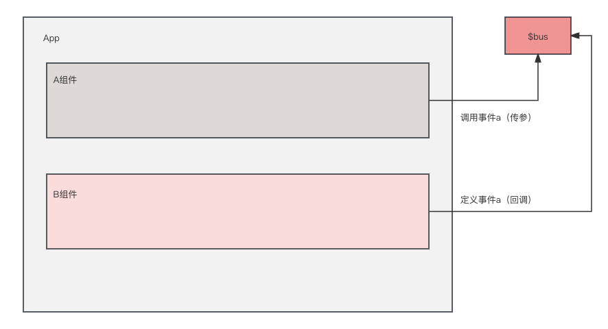

# 组件基础

在网页中，有内容相似的部分，且可以复用的板块可以单独抽出来，形成一个组件。

### 使用组件的步骤

vue要使用组件，首先定义组件、然后注册组件、最后使用组件。

### 使用一个简单的组件

```html
<body>
    <div id="root">
        <!-- 第三步：使用组件 -->
        <hello></hello>
    </div>
    <script>
        // 第一步：定义组件
        const hello = Vue.extend({
            // 模板
            template:`
                <div>
                    <h2>你好啊！{{name}}</h2>
                </div>
            `,
            // data必须写成函数，避免组件被复用时，数据存在引用关系。
            // 如果写成json格式，被不同vm使用时，会导致一个地方修改了数据会影响另一个地方
            data() {
                return {
                    name: 'shanla'
                }
            },
        })
        // 第二步：注册全局组件
        // Vue.component('hello', hello)

        new Vue({
            el: '#root',
            // 第二步：局部注册组件
            components: {
                hello
            }
        })
    </script>
</body>
```

### 使用组件嵌套

一个组件可以使用另一个组件，这就是组件嵌套，使用组件必须要注册被调用的组件（components）。

```html
<body>
    <div id="root">

    </div>
    <script>
        // 定义组件
        const student = Vue.extend({
            name: 'student',
            template:`
                <div>
                    <h2>学生姓名：{{name}}</h2>    
                    <h2>学生年龄：{{age}}</h2>    
                </div>
            `,
            data() {
                return {
                    name: '张三',
                    age: 21
                }
            },
        })

        const school = Vue.extend({
            name: 'school',
            template:`
                <div>
                    <h2>学校名称：{{name}}</h2>    
                    <h2>学校地址：{{address}}</h2>    
                    <student></student>
                </div>
            `,
            data() {
                return {
                    name: '北京大学',
                    address: '北京'
                }
            },
            // 局部注册：组件嵌套组件需要将组件注册进组件
            components: {
                student
            }
        })

        const hello = Vue.extend({
            template: `<h1>{{msg}}</h1>`,
            data() {
                return {
                    msg: 'hello world'
                }
            }
        })

        const app = Vue.extend({
            template:`
                <div>    
                    <hello></hello>
                    <school></school>
                </div>
            `,
            components: {
                school,
                hello,
            }
        })

        new Vue({
            template: '<app></app>',
            el: '#root',
            components:{
                app
            }
        })
    </script>
</body>
```

# VueComponent和Vue的内置关系

组件实际上VueComponent创建出来的对象，Vm是Vue创建的对象，VueComponent和Vue基本上相同，但是Vue有的VueComponent是没有的，比如说el。


VueComponent的原型对象的隐式原型属性`__proto__`并没有直接指向Object，而是指向Vue的原型对象，所以组件上找不到的属性会去Vue上找。

所以得出结论：`VueComponent.prototype.__proto__ === Vue.prototype`，这个结论也就是为了VueComponent找不到的属性可以去Vue上去找。

# 组件分离写法

在上面的代码中，template都定义在组件内部，这样会导致html代码都挤到一个字符串中，非常不方便，可以使用分离写法。

```html
<body>
    <div id="root">
        <t1></t1>
        <t2></t2>
    </div>
    <!-- 定义模板方法一 -->
    <script type="text/x-template" id="t1">
        <div>
            <h2>组件模板的分离写法1</h2>
            <p>type必须是text/x-template</p>
        </div>
    </script>
    <!-- 定义模板方法二 -->
    <template id="t2">
        <div>
            <h2>组件模板的分离写法2</h2>
        </div>
    </template>
    <script>
        new Vue({
            el: '#root',
            // 注册组件
            components: {
                t1: {
                    template: '#t1'
                },
                t2: {
                    template: '#t2'
                }
            }
        })
    </script>
</body>
```


# 传递数据

组件中的一些数据是不固定的，需要从上一层组件传入数据，vue中通过`props`进行传递。

### 父组件向子组件传递数据

通过`props`进行传递

```html
<body>
    <div id="root">
        <!-- 将数据传递给子组件 -->
        <cpn :cmessage="message" :ccars="cars"></cpn>
    </div>
    <template id="cpn">
        <div>
            <h2>{{cmessage}}</h2>
            <ul>
                <li v-for="(val, index) of ccars" :key="index">
                    {{val}}
                </li>
            </ul>
        </div>
    </template>
    <script>
        // 创建组件
        const cpn = Vue.extend({
            template: '#cpn',
            // props是定义传递的数据字段以及其类型等
            props: {
                cmessage: {
                    type: String, // 限制类型
                    required: true, // 在组件中使用必须传递true
                    default: 'this is a message' // 默认值
                },
                ccars: {
                    type: Array, // 限制类型是数组
                    required: true,
                    default() { // 如果是数组或对象，默认值必须是一个函数
                        return []
                    }
                }
            },
            // data() {
            //     return {}
            // },
            // methods: {

            // },
        })
        new Vue({
            el: '#root',
            data: {
                message: 'that are cars!',
                cars: ['比亚迪', '吉利', '长城']
            },
            // 注册组件
            components: {
                cpn
            }
        })
    </script>
</body>
```

### 子组件向父组件传递值

通过内置的`$emit`，调用一个父组件给子组件定义的事件来实现子组件向父组件传递的效果。

**有两种方法**

1. 父组件调用子组件时使用`@`或`v-on`直接绑定自定义组件

```html
<body>
    <div id="root">
        <!-- 通过:将数据传递给子组件，通过@将方法传递给子组件，注意不要写驼峰，比如@num1change -->
        <cpn :number1="num1" :number2="num2" @num1change="num1Change" @num2change="num2Change"></cpn>
        <h2>父组件{{num1}}</h2>
        <input type="text" v-model="num1" >
        <h2>父组件{{num2}}</h2>
        <input type="text" v-model="num2">
    </div>
    <template id="cpn">
        <div>
            <h2>子组件number1{{number1}}</h2>
            <h2>子组件dnumber1{{dnumber1}}</h2>
            <input type="text" :value="dnumber1" @input="num1input">
            <h2>子组件number2{{number2}}</h2>
            <h2>子组件dnumber2{{dnumber2}}</h2>
            <input type="text" :value="dnumber2" @input="num2input">
        </div>
    </template>
    <script>
        const cpn = {
            template: '#cpn',
            data() {
                return {
                    dnumber1: this.number1,
                    dnumber2: this.number2,
                }
            },
            // 传递两个数据
            props: {
                number1: [Number, String],
                number2: [Number, String]
            },
            methods: {
                num1input(event) {
                    this.dnumber1 = event.target.value
                    // 通过内置的$emit函数调用父组件注册进来的函数修改父组件的值
                    this.$emit('num1change', this.dnumber1)
                },
                num2input(event) {
                    this.dnumber2 = event.target.value
                    this.$emit('num2change', this.dnumber2)
                }
            },
        }

        const vm = new Vue({
            el: '#root',
            data: {
                num1: 1,
                num2: 2,
            },
            methods: {
                num1Change(value) {
                    this.num1 = value
                },
                num2Change(value) {
                    this.num2 = value
                }
            },
            components: {
                cpn
            }
        })
    </script>
</body>
```

2. 第二种是使用ref，然后通过ref给子组件定义自定义事件。

```html
<Demo ref="demo"/>
......
<script>
mounted(){
   this.$refs.xxx.$on('atguigu',this.test)
}
</script>
```

**调用自定义事件**

```js
// this.$emit('xxx', 数据)
this.$emit('num1change', this.dnumber1)
```

**解绑自定义事件**

```js
// 在子组件中调用$off
this.$off('showData')
```

**组件中绑定原生事件**

```html
<!-- 组件默认使用的是自定义组件，绑定原生组件必须使用native修饰 -->
<StudentInfo ref="student" @click.native="clickMsg"/>
```

**注意事项**

1. 通过`this.$refs.xxx.$on('atguigu',回调)`绑定自定义事件时，回调要么配置在methods中，要么用箭头函数，否则this指向会出问题！

# 全局事件总线（GlobalEventBus）

全局事件总线是组件之间通信的解决方案。

### 1. 全局事件总线的思路

全局事件总线应该是一个中转站的作用，所有组件都可以和它相连，A组件要访问B组件，需要在B组件中定义一个可调用的事件并有一个回调方法，A组件中需要调用B组件中定义的事件并传值。



**所以满足两个条件**

1. 所有组件都能够访问。

2. 且要有`$on`、`$emit`、`$off`这些能定义事件的方法。

### 2. 全局事件总线具体实现

**安装全局事件总线**

```js
//创建vm
new Vue({
    el:'#app',
    render: h => h(App),
    beforeCreate() {
        Vue.prototype.$bus = this //安装全局事件总线
    },
})
```

**使用全局事件总线**

```js
// 组件B中定义，也就是数据接收方
methods(){
  demo(data){......}
}
......
// 定义事件
mounted() {
  this.$bus.$on('xxxx',this.demo)
},
// 解绑事件
beforeDestroy() {
    // 解绑方法
    this.$bus.$off('hello')
},

// 组件A中调用
this.$bus.$emit('hello', this.name)
```

# 发布订阅

### 1. pubsub

**安装pubsub**

```shell
npm i pubsub-js
```

**使用pubsub**

```js
// 订阅消息
...
mounted() {
    this.pubId = pubsub.subscribe('hello', (msgName, data) => {
        console.log('有人发布了hello消息，hello消息的回调执行了',msgName,data)
    })
},
beforeDestroy() {
    pubsub.unsubscribe(this.pubId) // 取消订阅
}
...

// 发布消息
...
methods: {
    sendStudentName() {
        pubsub.publish('hello', 666)
    }
}
...
```

# 组件插槽

对于一些组件内部有一些结构不同的，需要在组件内部自定义内容，就需要使用插槽。插槽一般有默认的内容，需要定制内容，将定制的内容写到组件内部便可以替换默认插槽内容。

```html
<body>
    <div id="root">
        <!-- 组件中没有任何结构则展示组件本身内容，显示插槽默认 -->
        <cpn></cpn>
        <cpn>
            <!-- cpn内部可以替换默认插槽内容 -->
            <span style="color: red;">这是插槽内容111</span>
        </cpn>
        <cpn>
            <h2 style="color: aqua;">这是插槽内容222</h2>
        </cpn>
    </div>
    <template id="cpn">
        <div>
            {{message}}
            <!-- 定义插槽默认内容，使用slot标签定义 -->
            <slot><button>默认插槽按钮</button></slot>
            <br>
        </div>
    </template>
    <script>
        // 定义组件
        const cpn = {
            template: "#cpn",
            data() {
                return {
                    message: '我是子组件'
                }
            },
        }

        const vm = new Vue({
            el: '#root',
            // 注册局部组件
            components: {
                cpn
            }
        })
    </script>
</body>
```


### 使用具名插槽

可以让插槽按指定的顺序填充，而没有具名的插槽将按照填充的顺序排列，具名插槽可以按照开发人员自定义排列

```html
<body>
    <div id="root">
        <cpn>
            <!-- 虽然没具名的插槽在前面，但按照有具名的排序，这个插槽会显示到最后 -->
            <span>没具名</span>
            <!-- 正常的写法 -->
            <slot slot="left">左边的内容</slot>
            <!-- 新写法 -->
            <slot v-slot:center>中间的内容</slot>
            <!-- 新写法的缩写 -->
            <slot #right>右边的内容</slot>
        </cpn>
    </div>
    <template id="cpn">
        <div>
            <slot name="left">左边的插槽</slot>
            <slot name="center">中间的插槽</slot>
            <slot name="right">右边的插槽</slot>
            <slot>未具名插槽</slot>
        </div>
    </template>
    <script>
        const cpn = {
            template: '#cpn',
        }

        const vm = new Vue({
            el: '#root',
            data() {
                return {
                    message: '我是父组件消息'
                }
            },
            components: {
                cpn
            }
        })
    </script>
</body>
```


